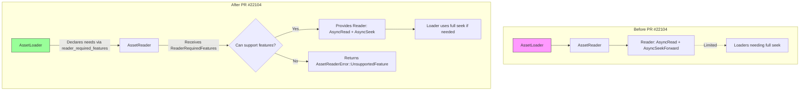

+++
title = "#22104 Allow `Reader` to implement `AsyncSeek` and provide a way for loaders to \"ask\" for a compatible reader."
date = "2025-12-16T00:00:00"
draft = false
template = "pull_request_page.html"
in_search_index = false

[extra]
current_language = "zh-cn"
available_languages = {"en" = { name = "English", url = "/pull_request/bevy/2025-12/pr-22104-en-20251216" }, "zh-cn" = { name = "中文", url = "/pull_request/bevy/2025-12/pr-22104-zh-cn-20251216" }}
labels = ["C-Feature", "A-Assets", "M-Migration-Guide", "M-Release-Note", "D-Straightforward"]
+++

# Title

## Basic Information
- **Title**: Allow `Reader` to implement `AsyncSeek` and provide a way for loaders to "ask" for a compatible reader.
- **PR Link**: https://github.com/bevyengine/bevy/pull/22104
- **Author**: andriyDev
- **Status**: MERGED
- **Labels**: C-Feature, A-Assets, S-Ready-For-Final-Review, M-Migration-Guide, M-Release-Note, D-Straightforward
- **Created**: 2025-12-13T08:20:13Z
- **Merged**: 2025-12-16T04:08:21Z
- **Merged By**: cart

## Description Translation

# 目标

- 在 #14194 中，我们用 `AsyncSeekForward` 替换了 `AsyncSeek`。这使得我们能够支持更多种类的源，但代价是加载器在使用读取器时受到更多限制。
- 归档类的东西通常使用相对于文件开头的偏移量。`AsyncSeekForward` 使得处理这种情况变得困难（在某些情况下甚至不可能）。
- 这是朝着 #21641 迈进的一步。
- 修复 #12880。

## 解决方案

- 允许 `AssetLoader` 声明它需要读取器的哪些“功能”。
- 将该功能列表传递给 `AssetReader`，以便它可以决定如何处理。
- 添加一个新的 `AssetReaderError::UnsupportedFeature`。

这种设计有点“弱”——不能保证请求 `AnySeek` 的加载器会获得一个实际实现了 `AsyncSeek` 的读取器。或者从另一方面来说，也不能保证加载器实际请求了它使用的功能。然而，在实践中这很可能就足够了：错误很可能会引导用户到正确的情况。未来，我们或许可以有一个“筛子读取器”，它阻止加载器未明确请求的任何功能。也许这是一个仅调试功能，或者可以切换的功能。

## 测试

- 运行了修改后的示例。它们似乎仍然能工作！

## The Story of This Pull Request

### 问题与背景

在 Bevy 0.15 中，一个重要的改变是 asset 系统的 `Reader` trait 不再要求实现 `AsyncSeek`，而是改为要求实现 `AsyncSeekForward`。这个改变背后的动机是为了支持更多类型的底层存储，比如网络流（HTTP 请求），这些存储可能只允许向前查找（forward-only seek），而不支持任意的、包括向后查找（backward seek）或从起始/结束位置查找（seek from start/end）的操作。

然而，这个改变带来了新的限制。一些 asset 加载器（AssetLoader）在处理特定格式（尤其是归档格式如 zip、压缩包等）时需要能够进行任意的查找操作。这些格式通常使用基于文件起始位置的绝对偏移量。如果读取器只支持向前查找，加载器就无法高效地处理这些资产，在某些情况下甚至完全无法处理。这个问题在 issue #12880 中被明确提出。

因此，需要一种机制，既能支持只向前查找的读取器（以保持对广泛存储后端的兼容性），又能让需要任意查找功能的加载器在可能的情况下获得支持该功能的读取器。

### 解决方案思路

核心思路是引入一个协商机制。AssetLoader 可以声明它对读取器功能的需求，AssetReader 在提供读取器时可以根据这些需求做出决定。具体来说：

1.  引入一个 `ReaderRequiredFeatures` 结构体，用于描述加载器需要的功能。目前只有一个字段 `seek`，其类型为 `SeekKind`，可以是 `OnlyForward` 或 `AnySeek`。
2.  修改 `AssetReader::read` 方法签名，增加一个 `required_features: ReaderRequiredFeatures` 参数。
3.  AssetLoader 可以通过实现一个新的方法 `reader_required_features` 来声明其需求。
4.  AssetReader 的实现可以检查传入的 `required_features`。如果某个请求的功能不被支持，它可以返回一个清晰的错误 `AssetReaderError::UnsupportedFeature`。如果支持，它可以返回一个合适的 `Reader`。

这个设计被作者称为“弱”保证，因为它依赖于加载器正确声明其需求，以及读取器实现者正确处理这些需求。如果声明和实际使用不匹配，可能会导致运行时错误。但作者认为，在实践中，错误信息可以引导用户（开发者）发现并修复问题。作为一种潜在的增强，未来可以添加一个“筛子读取器”（sieve reader）在调试时强制执行功能限制。

这个改变也为解决 issue #21641（支持存档/压缩包作为资产源）铺平了道路。

### 实现细节

这个 PR 的修改范围很广，涉及 18 个 crate 文件、3 个发布内容文件和 1 个示例文件。主要修改集中在 `bevy_asset` crate 中。

**1. 核心 Trait 和类型的修改**

首先，在 `crates/bevy_asset/src/io/mod.rs` 中，定义了新的类型：
```rust
/// The required features for a `Reader` that an `AssetLoader` may use.
#[derive(Clone, Copy, Default)]
pub struct ReaderRequiredFeatures {
    /// The kind of seek that the reader needs to support.
    pub seek: SeekKind,
}

/// The kind of seeking that the reader supports.
#[derive(Clone, Copy, Default)]
pub enum SeekKind {
    /// The reader can only seek forward.
    #[default]
    OnlyForward,
    /// The reader can seek forward, backward, seek from the start, and seek from the end.
    AnySeek,
}
```
同时，在 `AssetReaderError` 枚举中新增了一个变体：
```rust
#[error("A reader feature was required, but this AssetReader does not support that feature: {0}")]
UnsupportedFeature(#[from] UnsupportedReaderFeature),
```

`Reader` trait 的约束也发生了变化：
```rust
// 之前：
pub trait Reader: AsyncRead + AsyncSeekForward + Unpin + Send + Sync { ... }

// 之后：
pub trait Reader: AsyncRead + AsyncSeek + Unpin + Send + Sync { ... }
```
这意味着 `Reader` 现在再次要求实现 `AsyncSeek`（而不是 `AsyncSeekForward`）。但是，文档明确说明：实现者不一定需要支持 `AsyncSeek` 的所有功能。如果调用者从不使用某个功能，那么一个返回错误的“虚设”实现就足够了。调用者可以通过 `ReaderRequiredFeatures` 来请求一个兼容的读取器。

**2. 修改 AssetReader 和 AssetLoader**

`AssetReader` trait 的 `read` 方法签名被更新，增加了 `required_features` 参数：
```rust
fn read<'a>(
    &'a self,
    path: &'a Path,
    required_features: ReaderRequiredFeatures,
) -> impl AssetReaderFuture<Value: Reader + 'a>;
```
其对应的 trait object 版本 `ErasedAssetReader` 也做了同步修改。

在 `AssetLoader` trait 中，新增了一个可选的方法 `reader_required_features`，加载器可以重写此方法来声明其需求：
```rust
fn reader_required_features(_settings: &Self::Settings) -> ReaderRequiredFeatures {
    ReaderRequiredFeatures::default() // 默认是 SeekKind::OnlyForward
}
```
为了支持动态分发，`ErasedAssetLoader` trait 也增加了对应的方法。

**3. 更新所有 AssetReader 实现**

PR 更新了 Bevy 中所有的 `AssetReader` 实现，使它们接受新的 `required_features` 参数。大多数实现（如 `FileAssetReader`、`MemoryAssetReader`、`AndroidAssetReader` 等）目前只是忽略这个参数，因为它们提供的 `Reader`（通常是文件或内存缓冲）本来就支持任意查找。但这是一个重要的接口一致性更新。

例如，`FileAssetReader` 的修改：
```rust
// 之前：
async fn read<'a>(&'a self, path: &'a Path) -> Result<impl Reader + 'a, AssetReaderError> { ... }

// 之后：
async fn read<'a>(
    &'a self,
    path: &'a Path,
    _required_features: ReaderRequiredFeatures, // 新增参数
) -> Result<impl Reader + 'a, AssetReaderError> { ... }
```

**4. 更新 Reader 实现以支持 AsyncSeek**

由于 `Reader` 现在要求实现 `AsyncSeek`，所有具体的 `Reader` 实现（如 `VecReader`、`SliceReader`、`DataReader` 等）都需要将其 `AsyncSeekForward` 实现改为 `AsyncSeek` 实现。

PR 通过提取公共逻辑到辅助函数（`slice_seek`, `slice_read`, `read_to_end`）来优雅地处理这个问题，避免了代码重复。例如，这是 `VecReader` 的新 `AsyncSeek` 实现：
```rust
impl AsyncSeek for VecReader {
    fn poll_seek(
        self: Pin<&mut Self>,
        _cx: &mut Context<'_>,
        pos: SeekFrom,
    ) -> Poll<std::io::Result<u64>> {
        // Get the mut borrow to avoid trying to borrow the pin itself multiple times.
        let this = self.get_mut();
        Poll::Ready(slice_seek(&this.bytes, &mut this.bytes_read, pos))
    }
}
```
辅助函数 `slice_seek` 能正确处理所有类型的 `SeekFrom`（Current, Start, End）。

**5. 整合到资产加载流程中**

资产服务器（`AssetServer`）在加载资产时，现在需要：
1.  获取 asset 的元数据（如果存在）以确定使用哪个加载器。
2.  调用加载器的 `reader_required_features` 方法获取功能需求。
3.  将需求传递给 `AssetReader::read` 来获取读取器。
4.  使用读取器加载资产。

相关逻辑在 `crates/bevy_asset/src/server/mod.rs` 的 `load_with_meta` 等方法中更新。

**6. 处理器（Processor）的更新**

资产处理器（`AssetProcessor`）在预处理资产时，也可能需要根据处理器的需求来获取特定功能的读取器。因此，`Process` trait 也新增了一个 `reader_required_features` 方法，并在处理流程中被调用。

### 技术洞察与影响

1.  **向后兼容与迁移**：这个改动是一个重大的 API 变更。所有实现了 `AssetReader` 的用户代码都需要更新 `read` 方法的签名。PR 提供了迁移指南（`readers_impl_async_seek.md` 和 `reader_required_features.md`）来指导用户。对于 `Reader` 的实现者，他们需要将 `AsyncSeekForward` 实现改为 `AsyncSeek` 实现，并妥善处理可能不支持的查找模式（例如，对于只支持向前查找的流，在收到 `SeekFrom::Start` 或负偏移的 `SeekFrom::Current` 时返回错误）。

2.  **设计模式的取舍**：这个方案采用了“协商”而非“强制”的设计。它信任加载器声明其需求，也信任读取器实现者检查这些需求。这种弱保证降低了实现的复杂性，避免了为所有可能的组合提供垫片（shim）或包装器。错误处理被推到了运行时，但通过清晰的错误类型 (`UnsupportedReaderFeature`) 来帮助调试。

3.  **性能考量**：理论上，一个 `AssetReader` 实现可以根据请求的功能返回不同的 `Reader` 实现以进行优化。例如，如果只要求向前查找，它可以返回一个轻量的包装器；如果要求任意查找，它可能需要将数据预读到内存中再返回一个内存读取器。当前 PR 中的标准实现尚未进行此类优化，但框架已经为此铺平了道路。

4.  **对生态的影响**：这个改动解决了特定类型资产加载器（如未来的归档文件加载器）的硬性阻碍。它恢复了 `Reader` 对完整 `AsyncSeek` 的能力要求，但通过功能协商机制，使得那些无法提供完整查找功能的存储后端（如 HTTP）仍然可以通过返回错误来优雅降级，而不是被完全排除在体系之外。

总的来说，这个 PR 通过引入一个灵活的功能协商机制，巧妙地在“支持广泛存储后端”和“提供强大查找能力”这两个有时冲突的目标之间取得了平衡。它为未来更复杂的资产类型支持奠定了基础，同时保持了 API 的简洁性和可扩展性。

## Visual Representation



## Key Files Changed

以下是本次 PR 中修改的关键文件：

1.  **`crates/bevy_asset/src/io/mod.rs` (+184/-157)**
    - **修改内容与原因**：这是本次修改的核心文件。它引入了新的类型 (`ReaderRequiredFeatures`, `SeekKind`, `UnsupportedReaderFeature`)，修改了 `AssetReaderError`，将 `Reader` trait 的父 trait 从 `AsyncSeekForward` 改回 `AsyncSeek`，并更新了 `AssetReader` trait 的 `read` 方法签名。此外，还删除了 `AsyncSeekForward` trait 及其相关类型，并添加了用于 `AsyncSeek` 实现的辅助函数（如 `slice_seek`）。
    - **关键代码片段**：
      ```rust
      // 新增类型
      #[derive(Clone, Copy, Default)]
      pub struct ReaderRequiredFeatures {
          pub seek: SeekKind,
      }

      // AssetReader trait 的新签名
      fn read<'a>(
          &'a self,
          path: &'a Path,
          required_features: ReaderRequiredFeatures, // 新增参数
      ) -> impl AssetReaderFuture<Value: Reader + 'a>;
      ```
    - **与 PR 目的的关系**：这些变更是实现功能协商机制的基础。

2.  **`crates/bevy_asset/src/loader.rs` (+45/-21)**
    - **修改内容与原因**：更新了 `AssetLoader` 和 `ErasedAssetLoader` trait，增加了 `reader_required_features` 方法。修改了加载上下文 (`LoadContext`) 中调用 `AssetReader::read` 的代码，以传递所需的功能。
    - **关键代码片段**：
      ```rust
      // 在 AssetLoader trait 中新增
      fn reader_required_features(_settings: &Self::Settings) -> ReaderRequiredFeatures {
          ReaderRequiredFeatures::default()
      }

      // 在 LoadContext 中调用 reader
      let mut reader = asset_reader
          .read(path.path(), ReaderRequiredFeatures::default())
          .await?;
      ```
    - **与 PR 目的的关系**：使加载器能够声明其需求，并确保加载流程使用新的 API。

3.  **`crates/bevy_asset/src/server/mod.rs` (+41/-20)**
    - **修改内容与原因**：更新了资产服务器的内部加载逻辑。在获取读取器之前，先确定加载器及其所需功能，然后将这些功能传递给 `AssetReader`。
    - **关键代码片段**：
      ```rust
      let required_features =
          loader.reader_required_features(meta.loader_settings().expect("meta specifies load"));
      let reader = asset_reader
          .read(asset_path.path(), required_features)
          .await?;
      ```
    - **与 PR 目的的关系**：整合功能协商机制到主加载流程中。

4.  **`crates/bevy_asset/src/io/memory.rs` (+33/-43)**
    - **修改内容与原因**：更新了 `MemoryAssetReader` 和内部的 `DataReader`。将 `DataReader` 的 `AsyncSeekForward` 实现改为 `AsyncSeek` 实现，并使用了新的辅助函数。
    - **关键代码片段**：
      ```rust
      // 之前
      impl AsyncSeekForward for DataReader { ... }
      // 之后
      impl AsyncSeek for DataReader {
          fn poll_seek(...) -> Poll<std::io::Result<u64>> {
              Poll::Ready(crate::io::slice_seek(...))
          }
      }
      ```
    - **与 PR 目的的关系**：使内存中的读取器符合新的 `Reader` trait 要求。

5.  **`release-content/migration-guides/readers_impl_async_seek.md` (+53/-0)**
    - **修改内容与原因**：这是一份全新的迁移指南，指导用户如何将他们的 `Reader` 和 `AssetReader` 实现迁移到新的 API。
    - **关键内容**：提供了如何将 `AsyncSeekForward` 实现转换为 `AsyncSeek` 实现的示例，以及如何在 `AssetReader::read` 中处理 `ReaderRequiredFeatures` 参数。
    - **与 PR 目的的关系**：帮助用户社区适应这次重大的 API 变更。

## Further Reading

- [PR #14194](https://github.com/bevyengine/bevy/pull/14194): 原始的 PR，将 `AsyncSeek` 替换为 `AsyncSeekForward`，了解问题的起源。
- [Issue #12880](https://github.com/bevyengine/bevy/issues/12880): 本 PR 解决的具体问题，包含了对只支持向前查找的限制的讨论。
- [Issue #21641](https://github.com/bevyengine/bevy/issues/21641): 关于支持存档/压缩包作为资产源的长期目标，本 PR 是朝着该目标迈进的一步。
- [Rust `std::io::SeekFrom` documentation](https://doc.rust-lang.org/std/io/enum.SeekFrom.html): 了解 `SeekFrom` 枚举的详细信息，它定义了查找的几种模式。
- [Futures crate `AsyncSeek` trait](https://docs.rs/futures/latest/futures/io/trait.AsyncSeek.html): 了解 `AsyncSeek` trait 的完整定义和要求。