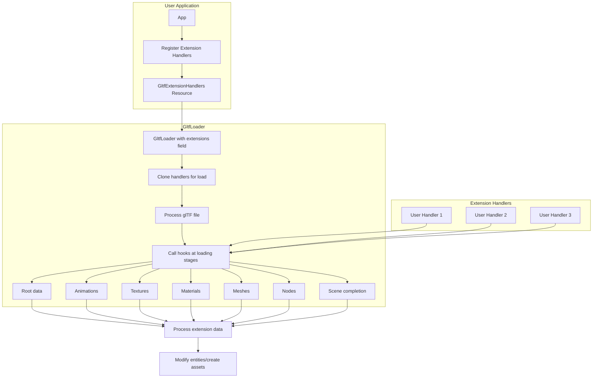

+++
title = "#22106 Add support for arbitrary/third party glTF Extension processing via GltfExtensionHandler"
date = "2025-12-14T00:00:00"
draft = false
template = "pull_request_page.html"
in_search_index = true

[taxonomies]
list_display = ["show"]

[extra]
current_language = "en"
available_languages = {"en" = { name = "English", url = "/pull_request/bevy/2025-12/pr-22106-en-20251214" }, "zh-cn" = { name = "中文", url = "/pull_request/bevy/2025-12/pr-22106-zh-cn-20251214" }}
labels = ["A-Assets", "D-Modest"]
+++

# Title

## Basic Information
- **Title**: Add support for arbitrary/third party glTF Extension processing via GltfExtensionHandler
- **PR Link**: https://github.com/bevyengine/bevy/pull/22106
- **Author**: ChristopherBiscardi
- **Status**: MERGED
- **Labels**: A-Assets, S-Ready-For-Final-Review, D-Modest
- **Created**: 2025-12-13T13:48:36Z
- **Merged**: 2025-12-14T21:49:27Z
- **Merged By**: alice-i-cecile

## Description Translation

# Objective

Currently Bevy doesn't support arbitrary glTF extensions. The ones it does support are hardcoded.

We should support glTF extensions, as this is a primary mechanism for sharing behavior via data exported from applications like Blender.

I personally have found usecases in exporting component data, lightmap textures/information, and processing other kinds of data (AnimationGraph, 3d meshes into 2d, etc).

## Solution

This PR introduces a new `GltfExtensionHandler` trait that users can implement and add to the glTF loader processing via inserting into a Resource.

There are two example processors currently added, with a third that I'd like to add after this PR.

- `examples/gltf/gltf_extension_animation_graph.rs` duplicates the functionality of `animation_mesh`, constructing AnimationGraphs via extension processing and applying them to be played on the relevant nodes.
- `examples/gltf/gltf_extension_mesh_2d.rs` duplicates the functionality of the `custom_gltf_vertex_attribute` example, showing how the extension processing could be used to convert 3d meshes to 2d meshes alongside custom materials.

Both of these examples re-use existing assets and thus don't *actually use* extension data, but show how one could access the relevant data to say, only convert specifically labelled Mesh3ds to 2d, or process many animations into multiple graphs based on extension-data based labelling introduced in Blender.

A third example I want to introduce after this PR is the same core functionality Skein requires: an example that uses reflected component data stored in glTF extensions and inserts that data onto the relevant entities, resulting in scenes that are "ready to go".

## Comparison to Extras

In comparison to extensions: data placed in glTF extras is well supported through the `GltfExtras` category of components.

Extras only support adding an additional `extras` field to any object.

Data stored in extras is application-specific. It should be usable by Bevy developers to implement their own, application-specific, data transfer. This is supported by applications like Blender through the application of Custom Properties.

Once data is used by more than one application, it belongs in a glTF extension.

## What is a glTF Extension?

Extensions are named with a prefix like `KHR` or `EXT`. Bevy has already reserved the `BEVY` namespace for this, which is listed in the official [prefix list](https://github.com/KhronosGroup/glTF/blob/7bbd90978cad06389eee3a36882c5ef2f2039faf/extensions/Prefixes.md).

For a glTF file, an extension must be listed in `extensionsUsed` and optionally `extensionsRequired`.

```
{
    "extensionsRequired": [
        "KHR_texture_transform"
    ],
    "extensionsUsed": [
        "KHR_texture_transform"
    ]
}
```

Extension data is allowed in any place extras are also allowed, but also allow much more flexibility.

Extensions are also allowed to define global data, add additional binary chunks, and more.

For meshes, extensions can add additional attribute names, accessor types, and/or component types

`KHR_lights_punctual` is a contained and understandable example of an extension: https://github.com/KhronosGroup/glTF/blob/7bbd90978cad06389eee3a36882c5ef2f2039faf/extensions/2.0/Khronos/KHR_lights_punctual/README.md . This one happens to be already hardcoded into Bevy's handling, so it doesn't benefit from arbitrary extension processing, but there are additional [ratified](https://github.com/KhronosGroup/glTF/tree/7bbd90978cad06389eee3a36882c5ef2f2039faf/extensions#ratified-khronos-extensions) and [in-progress](https://github.com/KhronosGroup/glTF/tree/7bbd90978cad06389eee3a36882c5ef2f2039faf/extensions#in-progress-khronos-and-multi-vendor-extensions-and-projects) extensions, as well as [vendor](https://github.com/KhronosGroup/glTF/tree/7bbd90978cad06389eee3a36882c5ef2f2039faf/extensions#vendor-extensions) and other arbitrary extensions that would benefit from userland support.

## Implementation

This initial implementation is reasonably minimal: enabling extension processing for objects/etc as they're loaded which may also define extension data, including the scene world. This may leave out useful functionality; as detailed in the next section: "What's not implemented".

Extension handlers are defined by implementing a trait which can optionally define hooks and data.
Extension handler data is cloned to start with a fresh slate for each glTF load, which limits scope to "one glTF load".
So while state can be maintained across hooks during a single load, users who want to combine or handle multiple glTF assets should do so in the main app, not in an extension handler.
Following this, because the extensions are stored as `dyn GltfExtension` *and* we want to clone them to isolate state to a single load, `dyn_clone` must be included as a workaround to enable this cloning.

An extension handler has to be added to the list of handler by accessing a `Resource` and pushing an instantiated handler into it.
This Resource keeps the list of extension handlers so that a new glTF loader can bootstrap them.

The design of the hooks is such that:

- If no extensions handlers are registered, none are called for processing
- If an extension handler is defined, it receives all "events"
  - handlers are defined by a trait, and default implementations are called if an override is not specified.
    - default implementations are no-ops

It is important that extensions receive all events because certain information is not embedded in extension data.
For example, processing animation data into an animation graph could require both processing animations with extension data, tracking the animation roots through hooks like `on_node`, *and* applying those graphs in the `on_scene_completed` hook.

- Extension data is passed to hooks as `Option<&serde_json::Value>` which is only passing references around as the data has already been converted to `Value` by the `gltf` crate.
- `LoadContext` is required for creating any new additional assets, like `AnimationGraph`s.
    - *scene* World access is provided in hooks like `on_scene_completed`, which allows calculating data over the course of a glTF load and applying it to a Scene.

### What's not implemented

This PR chooses to *not* implement some features that it could. Instead the approach in this PR is to offer up the data that Bevy has already processed to extensions to do more with that data.

- Overriding `load_image`/`process_loaded_texture`
  - This could allow projects like bevy_web_codecs, [which currently forks the entire gltf loader](https://github.com/jf908/bevy_web_codecs/tree/373bbf29be6555c7603fd6867a01159ab0f20fed/bevy_web_codecs_gltf). Associated [issue](https://github.com/bevyengine/bevy/issues/21185). However I believe this needs some design work dedicated to what exactly happens here to support that use case.
- This PR doesn't include any refactoring of the glTF loader, which I feel is important for a first merge.
- ~~There is some benefit to passing in the relevant `gltf::*` object to every hook. For example, I believe this is the only way to access extension data for `KHR_lights_punctual`, and [`KHR_materials_variants`](https://docs.rs/gltf/1.4.1/gltf/struct.Document.html#method.variants) or other extensions with "built-in" support. I haven't done this in all places.~~ (edit: after external implementation I decided this was a good idea and added it to more places)

## Testing

```
cargo run --example gltf_extension_animation_graph
cargo run --example gltf_extension_mesh_2d
```

---

## Showcase

Both examples running:

https://github.com/user-attachments/assets/f9e7c3c9-cdad-4d33-ace7-7c2ca5469d5e


https://github.com/user-attachments/assets/baa9bc92-ca3b-46ad-a3f0-2f74bbc29b68


<details>
  <summary>An example that showcases converting Mesh3d to Mesh2d</summary>

```rust
#[derive(Default, Clone)]
struct GltfExtensionProcessorToMesh2d;

impl GltfExtensionProcessor for GltfExtensionProcessorToMesh2d {
    fn extension_ids(&self) -> &'static [&'static str] {
        &[""]
    }

    fn dyn_clone(&self) -> Box<dyn GltfExtensionHandler> {
        Box::new((*self).clone())
    }

    fn on_spawn_mesh_and_material(
        &mut self,
        load_context: &mut LoadContext<'_>,
        _gltf_node: &gltf::Node,
        entity: &mut EntityWorldMut,
    ) {
        if let Some(mesh3d) = entity.get::<Mesh3d>()
            && let Some(_) = entity.get::<MeshMaterial3d<StandardMaterial>>()
        {
            let material_handle =
                load_context.add_loaded_labeled_asset("AColorMaterial", (CustomMaterial {}).into());
            let mesh_handle = mesh3d.0.clone();
            entity
                .remove::<(Mesh3d, MeshMaterial3d<StandardMaterial>)>()
                .insert((Mesh2d(mesh_handle), MeshMaterial2d(material_handle.clone())));
        }
    }
}
```

</details>


## The Story of This Pull Request

### The Problem and Context
Bevy's glTF loader had a significant limitation: it only supported a fixed set of glTF extensions that were hardcoded into the engine. This created problems for users who needed to work with custom glTF extensions or vendor-specific extensions that weren't part of Bevy's built-in support. Since glTF extensions are a primary mechanism for sharing behavior via data exported from applications like Blender, this limitation prevented Bevy from being fully compatible with the broader glTF ecosystem.

The author had encountered practical use cases where this limitation was problematic, including exporting component data, lightmap textures/information, and processing other kinds of data like AnimationGraphs or converting 3D meshes to 2D. Existing workarounds, like forking the entire glTF loader for projects like bevy_web_codecs, highlighted the need for a more extensible solution.

### The Solution Approach
The solution introduces a plugin system for glTF extension processing through a new `GltfExtensionHandler` trait. This approach avoids hardcoding specific extensions and instead provides a framework where users can implement their own extension processors. The design decisions included:

1. **Trait-based extensibility**: Instead of modifying the glTF loader directly for each new extension, users implement a trait with optional hook methods.
2. **State isolation**: Extension handlers are cloned for each glTF load to maintain isolation between different asset loads.
3. **Comprehensive hook coverage**: The trait provides hooks at all major points in the glTF loading process, from root data processing to scene completion.
4. **Resource-based registration**: Extension handlers are registered via a `GltfExtensionHandlers` resource that can be modified at runtime.

The implementation intentionally avoids more invasive changes to the glTF loader, opting for a minimal first implementation that can be extended later. For example, the PR doesn't implement hooks for overriding image loading or texture processing, which would require more design consideration.

### The Implementation
The core of the implementation is the `GltfExtensionHandler` trait defined in `crates/bevy_gltf/src/loader/extensions/mod.rs`. This trait provides default no-op implementations for all hooks, allowing users to override only the methods they need:

```rust
pub trait GltfExtensionHandler: Send + Sync {
    fn dyn_clone(&self) -> Box<dyn GltfExtensionHandler>;
    
    fn extension_ids(&self) -> &'static [&'static str] {
        &[""]
    }
    
    fn on_root_data(&mut self, extension_id: &str, value: Option<&serde_json::Value>) {}
    
    #[cfg(feature = "bevy_animation")]
    fn on_animation(
        &mut self,
        extension_id: &str,
        extension_data: Option<&serde_json::Value>,
        gltf_animation: &gltf::Animation,
        name: Option<&str>,
        handle: Handle<AnimationClip>,
    ) {
    }
    
    // ... additional hook methods
}
```

The trait design is thoughtful: it includes `extension_ids()` to specify which extensions a handler processes, and it passes the original `gltf::*` objects to hooks when needed for accessing extension data that might not be exposed through Bevy's processed representation.

The `GltfLoader` is modified to maintain a list of extension handlers and call them at appropriate points during loading. For example, when processing animations:

```rust
// In GltfLoader::load() method
for extension in extensions.iter_mut() {
    for id in extension.extension_ids() {
        extension.on_animation(
            id,
            animation.extension_value(id),
            &animation,
            animation.name(),
            handle.clone(),
        );
    }
}
```

The implementation also adds proper handling for cloning trait objects via `dyn_clone`, which is necessary because the handlers are stored as `Box<dyn GltfExtensionHandler>` but need to be cloned for each glTF load to maintain state isolation.

### Technical Insights
Several technical aspects of this implementation are noteworthy:

1. **Trait object cloning**: The use of `dyn_clone` is a workaround for Rust's limitation that `Clone` cannot be made into a trait object. This pattern is common in Rust when dynamic dispatch with cloning is needed.

2. **State management**: By cloning handlers for each load, the implementation ensures that extension processing state doesn't leak between different glTF files. This is important for correctness but does mean that users who need to coordinate across multiple glTF loads must handle that at the application level.

3. **Performance considerations**: The implementation adds overhead by iterating through all registered extension handlers at each hook point. However, the impact is minimal since the number of handlers is typically small, and default implementations are no-ops that compile away.

4. **Async compatibility**: The handlers need to be `Send + Sync` because the glTF loader runs in an async context and may process assets across thread boundaries.

5. **JSON data handling**: Extension data is passed as `serde_json::Value`, which provides flexibility but requires users to handle JSON parsing. This is appropriate since glTF extensions are defined as JSON objects.

### The Impact
This PR significantly enhances Bevy's glTF capabilities by:

1. **Enabling third-party extensions**: Users can now work with any glTF extension, not just the ones hardcoded into Bevy.
2. **Supporting vendor-specific extensions**: Game studios and tool developers can create their own extensions with the `BEVY` prefix or other vendor prefixes.
3. **Improving Blender workflow integration**: Since Blender supports custom properties that can be exported as glTF extensions, this enables richer data exchange between content creation tools and Bevy.
4. **Reducing forking needs**: Projects like bevy_web_codecs that previously forked the glTF loader can potentially use this extension system instead.

The examples provided demonstrate practical use cases: building animation graphs from glTF data and converting 3D meshes to 2D. These examples show how the system can be used for both data transformation (mesh conversion) and data augmentation (adding animation graphs).

## Visual Representation



## Key Files Changed

### `crates/bevy_gltf/src/loader/extensions/mod.rs` (+263/-0)
This is the core of the implementation, defining the `GltfExtensionHandler` trait and the `GltfExtensionHandlers` resource.

**Key code:**
```rust
pub trait GltfExtensionHandler: Send + Sync {
    fn dyn_clone(&self) -> Box<dyn GltfExtensionHandler>;
    
    fn extension_ids(&self) -> &'static [&'static str] {
        &[""]
    }
    
    fn on_root_data(&mut self, extension_id: &str, value: Option<&serde_json::Value>) {}
    
    // ... additional hooks for animations, textures, materials, etc.
}
```

The trait provides a comprehensive set of hooks that cover all major aspects of glTF loading, allowing extension handlers to intervene at the right points in the process.

### `crates/bevy_gltf/src/loader/mod.rs` (+180/-8)
This file modifies the `GltfLoader` to integrate with the extension system. The loader now:
1. Accepts extension handlers as a constructor parameter
2. Clones them for each load
3. Calls the appropriate hooks throughout the loading process

**Key code:**
```rust
pub struct GltfLoader {
    // ... existing fields
    pub extensions: Arc<RwLock<Vec<Box<dyn extensions::GltfExtensionHandler>>>>,
}

impl GltfLoader {
    async fn load(&self, ...) -> Result<Gltf, GltfError> {
        // clone extensions to start with a fresh processing state
        let mut extensions = loader.extensions.read().await.clone();
        
        // Process root extension data
        for extension in extensions.iter_mut() {
            for id in extension.extension_ids() {
                extension.on_root_data(id, gltf.extension_value(id));
            }
        }
        
        // ... throughout the loading process, call other hooks
    }
}
```

The changes are integrated throughout the loading pipeline, with hooks called at appropriate points like after animations are collected, when materials are processed, and when nodes are loaded.

### `examples/gltf/gltf_extension_animation_graph.rs` (+202/-0)
This example demonstrates building an animation graph from glTF data using the extension system. It shows how to track animation roots across multiple hooks and apply an animation graph to entities when the scene is complete.

**Key code:**
```rust
impl GltfExtensionHandler for GltfExtensionHandlerAnimation {
    fn on_animation(&mut self, ...) {
        if name.is_some_and(|v| v == "Walk") {
            self.clip = Some(handle.clone());
        }
    }
    
    fn on_gltf_node(&mut self, ...) {
        if self.animation_root_indices.contains(&gltf_node.index()) {
            self.animation_root_entities.insert(entity.id());
        }
    }
    
    fn on_scene_completed(&mut self, ...) {
        // Create an AnimationGraph from the desired clip
        let (graph, index) = AnimationGraph::from_clip(self.clip.clone().unwrap());
        let graph_handle = load_context.add_labeled_asset("MyAnimationGraphLabel".to_string(), graph);
        
        // Insert the `AnimationToPlay` component on the first animation root
        let mut entity = world.entity_mut(*self.animation_root_entities.iter().next().unwrap());
        entity.insert(AnimationToPlay { graph_handle, index });
    }
}
```

This example demonstrates stateful processing across multiple hooks, which is a key capability of the system.

### `examples/gltf/gltf_extension_mesh_2d.rs` (+129/-0)
This example shows how to convert 3D meshes to 2D meshes using a custom material. It demonstrates the `on_spawn_mesh_and_material` hook, which is called when a mesh and material are spawned together on an entity.

**Key code:**
```rust
impl GltfExtensionHandler for GltfExtensionHandlerToMesh2d {
    fn on_spawn_mesh_and_material(&mut self, ...) {
        if let Some(mesh3d) = entity.get::<Mesh3d>()
            && let Some(_) = entity.get::<MeshMaterial3d<StandardMaterial>>()
        {
            let material_handle =
                load_context.add_labeled_asset("AColorMaterial".to_string(), CustomMaterial {});
            let mesh_handle = mesh3d.0.clone();
            entity
                .remove::<(Mesh3d, MeshMaterial3d<StandardMaterial>)>()
                .insert((Mesh2d(mesh_handle), MeshMaterial2d(material_handle.clone())));
        }
    }
}
```

This example shows how extension handlers can modify entities during loading, in this case replacing 3D mesh components with 2D mesh components.

### `Cargo.toml` (+23/-0)
The PR adds dependencies on `gltf` and `async-lock` crates, and adds the two new examples to the examples list.

## Further Reading

1. **glTF Extension Specification**: https://github.com/KhronosGroup/glTF/tree/main/specification/2.0#extensions
2. **Khronos glTF Extensions Repository**: https://github.com/KhronosGroup/glTF/tree/main/extensions
3. **Bevy glTF Documentation**: https://docs.rs/bevy_gltf/latest/bevy_gltf/
4. **serde_json Documentation**: https://docs.rs/serde_json/latest/serde_json/ - For handling the JSON extension data passed to hooks
5. **dyn-clone crate**: https://docs.rs/dyn-clone/latest/dyn_clone/ - For understanding the trait object cloning pattern used in this implementation