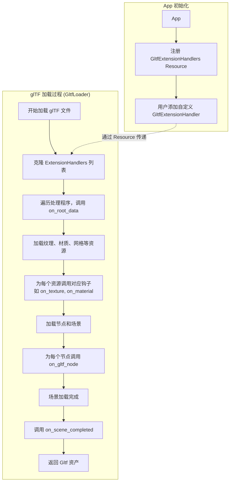

+++
title = "#22106 Add support for arbitrary/third party glTF Extension processing via GltfExtensionHandler"
date = "2025-12-14T00:00:00"
draft = false
template = "pull_request_page.html"
in_search_index = false

[extra]
current_language = "zh-cn"
available_languages = {"en" = { name = "English", url = "/pull_request/bevy/2025-12/pr-22106-en-20251214" }, "zh-cn" = { name = "中文", url = "/pull_request/bevy/2025-12/pr-22106-zh-cn-20251214" }}
labels = ["A-Assets", "D-Modest"]
+++

# Title

## Basic Information
- **Title**: Add support for arbitrary/third party glTF Extension processing via GltfExtensionHandler
- **PR Link**: https://github.com/bevyengine/bevy/pull/22106
- **Author**: ChristopherBiscardi
- **Status**: MERGED
- **Labels**: A-Assets, S-Ready-For-Final-Review, D-Modest
- **Created**: 2025-12-13T13:48:36Z
- **Merged**: 2025-12-14T21:49:27Z
- **Merged By**: alice-i-cecile

## Description Translation
**目标**

目前 Bevy 不支持任意的 glTF 扩展。它所支持的扩展都是硬编码的。

我们应该支持 glTF 扩展，因为这是通过从 Blender 等应用程序导出的数据来共享行为的主要机制。

我个人在导出组件数据、光照贴图纹理/信息以及处理其他类型数据（AnimationGraph、将 3D 网格转换为 2D 等）方面遇到过实际用例。

**解决方案**

这个 PR 引入了一个新的 `GltfExtensionHandler` trait，用户可以实现该 trait，并通过插入到 Resource 中来添加到 glTF 加载器的处理流程中。

目前添加了两个示例处理器，我打算在这个 PR 之后添加第三个。

- `examples/gltf/gltf_extension_animation_graph.rs` 复制了 `animation_mesh` 的功能，通过扩展处理构建 AnimationGraphs 并将其应用于相关节点进行播放。
- `examples/gltf/gltf_extension_mesh_2d.rs` 复制了 `custom_gltf_vertex_attribute` 示例的功能，展示如何使用扩展处理将 3D 网格转换为 2D 网格以及自定义材质。

这两个示例都重用了现有资源，因此并未*实际使用*扩展数据，但展示了如何访问相关数据，例如，只将特定标记的 Mesh3d 转换为 2D，或者根据 Blender 中引入的基于扩展数据的标记将多个动画处理为多个图。

我打算在这个 PR 之后引入的第三个示例是 Skein 所需的核心功能：一个使用存储在 glTF 扩展中的反射组件数据，并将这些数据插入到相关实体上，从而得到“开箱即用”的场景。

**与 Extras 的比较**

与扩展相比：放在 glTF extras 中的数据通过 `GltfExtras` 类别的组件得到了很好的支持。

Extras 只支持向任何对象添加一个额外的 `extras` 字段。

存储在 extras 中的数据是应用程序特定的。它应该可供 Bevy 开发人员用于实现他们自己的、应用程序特定的数据传输。这通过像 Blender 这样的应用程序应用自定义属性（Custom Properties）来支持。

一旦数据被多个应用程序使用，它就应该属于 glTF 扩展。

**什么是 glTF 扩展？**

扩展使用诸如 `KHR` 或 `EXT` 这样的前缀命名。Bevy 已经为此保留了 `BEVY` 命名空间，该命名空间列在官方的 [前缀列表](https://github.com/KhronosGroup/glTF/blob/7bbd90978cad06389eee3a36882c5ef2f2039faf/extensions/Prefixes.md) 中。

对于 glTF 文件，扩展必须列在 `extensionsUsed` 中，并且可选地列在 `extensionsRequired` 中。

```json
{
    "extensionsRequired": [
        "KHR_texture_transform"
    ],
    "extensionsUsed": [
        "KHR_texture_transform"
    ]
}
```

扩展数据允许出现在任何 extras 也允许出现的地方，但也允许更大的灵活性。

扩展还可以定义全局数据、添加额外的二进制块等。

对于网格，扩展可以添加额外的属性名称、访问器类型和/或组件类型

`KHR_lights_punctual` 是一个包含在内且易于理解的扩展示例：https://github.com/KhronosGroup/glTF/blob/7bbd90978cad06389eee3a36882c5ef2f2039faf/extensions/2.0/Khronos/KHR_lights_punctual/README.md。这个扩展恰好已经硬编码到 Bevy 的处理中，因此它不能从任意的扩展处理中受益，但还有额外的 [已批准的](https://github.com/KhronosGroup/glTF/tree/7bbd90978cad06389eee3a36882c5ef2f2039faf/extensions#ratified-khronos-extensions) 和 [进行中的](https://github.com/KhronosGroup/glTF/tree/7bbd90978cad06389eee3a36882c5ef2f2039faf/extensions#in-progress-khronos-and-multi-vendor-extensions-and-projects) 扩展，以及 [供应商](https://github.com/KhronosGroup/glTF/tree/7bbd90978cad06389eee3a36882c5ef2f2039faf/extensions#vendor-extensions) 和其他任意的扩展，这些扩展将从用户态支持中受益。

**实现**

这个初始实现相当精简：在加载可能包含扩展数据的对象等（包括场景世界）时启用扩展处理。这可能会遗漏一些有用的功能；正如下一节“未实现的功能”中详述的那样。

扩展处理程序通过实现一个 trait 来定义，该 trait 可以选择性地定义钩子和数据。
扩展处理程序数据在每次 glTF 加载时被克隆，以从一个干净的状态开始，这限制了范围为“一次 glTF 加载”。
因此，虽然可以在单个加载过程中跨钩子维护状态，但希望组合或处理多个 glTF 资源的用户应该在主应用程序中执行此操作，而不是在扩展处理程序中。
由于扩展存储为 `dyn GltfExtension` *并且*我们希望在克隆它们以将状态隔离到单个加载，因此必须包含 `dyn_clone` 作为启用此克隆的解决方法。

扩展处理程序必须通过访问 `Resource` 并将实例化的处理程序推入其中来添加到处理程序列表中。
此 Resource 保留扩展处理程序列表，以便新的 glTF 加载器可以引导它们。

钩子的设计使得：

- 如果未注册扩展处理程序，则不会为任何事件调用处理程序
- 如果定义了扩展处理程序，它会接收所有“事件”
  - 处理程序通过 trait 定义，如果未指定覆盖，则调用默认实现。
    - 默认实现是空操作（no-ops）

重要的是，扩展接收所有事件，因为某些信息并未嵌入在扩展数据中。
例如，将动画数据处理为动画图可能需要处理带有扩展数据的动画，通过像 `on_node` 这样的钩子跟踪动画根节点，*并且*在 `on_scene_completed` 钩子中应用这些图。

- 扩展数据作为 `Option<&serde_json::Value>` 传递给钩子，这只是传递引用，因为数据已经被 `gltf` crate 转换为 `Value`。
- 创建任何新的附加资源（如 `AnimationGraph`s）需要 `LoadContext`。
    - 在像 `on_scene_completed` 这样的钩子中提供对*场景* World 的访问，允许在一次 glTF 加载过程中计算数据并将其应用于场景。

**未实现的功能**

这个 PR 选择*不*实现一些它可以实现的功能。相反，这个 PR 中的方法是向扩展提供 Bevy 已经处理过的数据，以便对这些数据做更多处理。

- 覆盖 `load_image`/`process_loaded_texture`
  - 这可以允许像 bevy_web_codecs 这样的项目，[目前它 fork 了整个 gltf 加载器](https://github.com/jf908/bevy_web_codecs/tree/373bbf29be6555c7603fd6867a01159ab0f20fed/bevy_web_codecs_gltf)。相关的 [issue](https://github.com/bevyengine/bevy/issues/21185)。然而，我认为这需要一些专门的设计工作来确定具体需要做什么来支持该用例。
- 这个 PR 不包括对 glTF 加载器的任何重构，我认为这对于第一次合并很重要。
- ~~将相关的 `gltf::*` 对象传递给每个钩子有一些好处。例如，我相信这是访问 `KHR_lights_punctual` 扩展数据的唯一方法，并且对于 [`KHR_materials_variants`](https://docs.rs/gltf/1.4.1/gltf/struct.Document.html#method.variants) 或其他具有“内置”支持的扩展也是如此。我并没有在所有地方都这样做。~~（编辑：在外部实现之后，我认为这是个好主意，并将其添加到了更多地方）

**测试**

```bash
cargo run --example gltf_extension_animation_graph
cargo run --example gltf_extension_mesh_2d
```

**展示**

两个示例都在运行：

https://github.com/user-attachments/assets/f9e7c3c9-cdad-4d33-ace7-7c2ca5469d5e

https://github.com/user-attachments/assets/baa9bc92-ca3b-46ad-a3f0-2f74bbc29b68

<details>
  <summary>一个展示将 Mesh3d 转换为 Mesh2d 的示例</summary>

```rust
#[derive(Default, Clone)]
struct GltfExtensionProcessorToMesh2d;

impl GltfExtensionProcessor for GltfExtensionProcessorToMesh2d {
    fn extension_ids(&self) -> &'static [&'static str] {
        &[""]
    }

    fn dyn_clone(&self) -> Box<dyn GltfExtensionHandler> {
        Box::new((*self).clone())
    }

    fn on_spawn_mesh_and_material(
        &mut self,
        load_context: &mut LoadContext<'_>,
        _gltf_node: &gltf::Node,
        entity: &mut EntityWorldMut,
    ) {
        if let Some(mesh3d) = entity.get::<Mesh3d>()
            && let Some(_) = entity.get::<MeshMaterial3d<StandardMaterial>>()
        {
            let material_handle =
                load_context.add_loaded_labeled_asset("AColorMaterial", (CustomMaterial {}).into());
            let mesh_handle = mesh3d.0.clone();
            entity
                .remove::<(Mesh3d, MeshMaterial3d<StandardMaterial>)>()
                .insert((Mesh2d(mesh_handle), MeshMaterial2d(material_handle.clone())));
        }
    }
}
```

</details>

## The Story of This Pull Request

### 问题背景

Bevy 引擎内置的 glTF 加载器只能处理硬编码（hardcoded）的 glTF 扩展。这意味着任何第三方扩展，甚至是 Bevy 社区自己定义的扩展，都无法通过现有的加载器进行处理。这种限制在以下场景中尤为突出：

1.  **数据驱动的行为**：像 Blender 这样的建模工具可以通过扩展将自定义数据导出到 glTF 文件中，而 Bevy 应用无法直接利用这些数据。
2.  **特定领域数据**：例如，光照贴图信息、复杂的动画图（AnimationGraph）结构，或是将 3D 网格在特定场景下作为 2D 精灵渲染的逻辑。
3.  **组件数据序列化**：工具链（如 Skein）希望将整个场景的组件配置（通过反射）存储在 glTF 扩展中，实现“一次导出，直接运行”的体验。

虽然 Bevy 通过 `GltfExtras` 组件支持 `extras` 字段，但它仅限于一个通用的 JSON 字段，不具备扩展的命名空间和结构化管理能力。根据 glTF 规范，一旦数据需要在多个应用间共享，就应使用扩展而非 `extras`。

### 解决方案

PR 作者提出并实现了一个扩展处理框架，其核心是一个新的 trait：`GltfExtensionHandler`。这个 trait 定义了一系列生命周期钩子（hooks），允许用户在 glTF 加载过程的不同阶段介入，访问扩展数据并执行自定义操作。

关键的设计决策包括：

1.  **基于 Trait 的动态分发**：处理程序通过 trait 对象（`Box<dyn GltfExtensionHandler>`）存储，支持运行时添加和移除。
2.  **状态隔离**：每个 glTF 文件加载时，处理程序都会被克隆一份，确保处理状态不会在多次加载间意外共享。
3.  **全事件广播**：每个注册的处理程序都会收到所有钩子事件。这是因为某些处理逻辑需要综合多个阶段的信息（例如，构建动画图需要知道动画数据、节点关系，并在场景完成后最终应用）。
4.  **最小化侵入**：框架将已解析的扩展数据（`serde_json::Value`）和关键的 Bevy 上下文（`LoadContext`, `EntityWorldMut`）暴露给钩子，而不是尝试重写整个加载管道。

### 实现细节

框架的实现主要涉及两个部分：`GltfExtensionHandler` trait 的定义，以及在现有 `GltfLoader` 中调用这些钩子的集成点。

**Trait 设计**：
`GltfExtensionHandler` trait 包含一个必需的 `dyn_clone` 方法（用于支持克隆 trait 对象），以及一个可选的 `extension_ids` 方法用于声明此处理器关心的扩展 ID。随后是一系列具有默认实现（空操作）的钩子方法，例如：
- `on_animation`: 当单个动画被处理时调用。
- `on_material`: 当材质被处理时调用。
- `on_gltf_node`: 当节点被处理时调用。
- `on_scene_completed`: 当整个场景处理完毕时调用，此时可以访问场景的 `World` 并进行最终操作。

**加载器集成**：
在 `GltfLoader` 加载过程的各个关键节点，代码遍历所有已注册的处理程序，并调用相应的钩子。例如，在加载动画后，会调用 `on_animation`；在场景中生成每个节点后，会调用 `on_gltf_node`。

为了传递处理程序列表，PR 引入了 `GltfExtensionHandlers` Resource，它是一个 `Arc<RwLock<Vec<...>>>`。`GltfPlugin` 初始化这个 Resource，并在创建 `GltfLoader` 实例时，将其内部的处理程序列表克隆给加载器。这种设计允许在 App 构建阶段动态添加处理程序。

### 技术见解与取舍

1.  **克隆状态 vs. 全局状态**：选择为每次加载克隆处理程序，简化了状态管理，避免了跨文件加载的副作用，但意味着处理程序本身不适合协调多个文件的加载。这个责任被留给了 App 逻辑。
2.  **JSON 值传递**：扩展数据作为 `serde_json::Value` 传递，这直接来自底层 `gltf` crate 的解析结果。这保持了实现的简洁性，将具体的反序列化工作留给了用户，提供了最大的灵活性。
3.  **钩子的粒度**：钩子覆盖了从根数据、资源（纹理、材质、网格）到场景实体（节点、灯光）的各个层面。但 PR 也有意省略了一些潜在的钩子，如 `load_image` 的重写，认为这些需要更专门的设计。
4.  **向后兼容性**：所有钩子都有默认的空实现，并且只有在用户主动注册处理程序时才会执行相关逻辑。这意味着对于不关心扩展的现有项目，性能没有任何影响。

### 影响与价值

此 PR 为 Bevy 的 glTF 生态系统带来了关键的灵活性：

1.  **社区扩展支持**：第三方或用户项目现在可以定义自己的 `BEVY_*` 扩展，并在 Bevy 中直接处理，无需修改引擎核心代码。
2.  **工具链整合**：像 Skein 这样的场景编辑器可以将完整的组件配置序列化到扩展中，实现无缝的“所见即所得”工作流。
3.  **渐进增强**：现有的硬编码扩展（如 `KHR_lights_punctual`）可以继续工作。未来，这些硬编码逻辑甚至可以逐步迁移到使用相同的扩展处理框架，统一代码路径。
4.  **清晰的示例**：提供的两个示例（动画图和 2D 网格转换）不仅演示了 API 用法，还展示了如何复用现有资产和功能来构建新的行为，为开发者提供了很好的范本。

这个实现是务实的“第一步”。它没有试图重构整个加载器或覆盖所有可能的定制点，而是提供了一个强大且足够通用的基础，可以立即解决许多实际用例，并为未来的迭代奠定了基础。

## Visual Representation



## Key Files Changed

### `crates/bevy_gltf/src/loader/extensions/mod.rs` (+263/-0)
这是本次 PR 的核心，定义了扩展处理框架。
**关键新增：**
1.  `GltfExtensionHandlers` Resource：存储已注册的处理程序列表。
2.  `GltfExtensionHandler` trait：定义了所有可能的钩子方法及其默认实现。
3.  为 `Box<dyn GltfExtensionHandler>` 实现了 `Clone` trait，通过调用 `dyn_clone` 方法。

**代码片段：**
```rust
pub trait GltfExtensionHandler: Send + Sync {
    fn dyn_clone(&self) -> Box<dyn GltfExtensionHandler>;
    fn extension_ids(&self) -> &'static [&'static str] { &[""] }
    fn on_root_data(&mut self, extension_id: &str, value: Option<&serde_json::Value>) {}
    // ... 更多钩子定义
}
#[derive(Resource, Default)]
pub struct GltfExtensionHandlers(pub Arc<RwLock<Vec<Box<dyn GltfExtensionHandler>>>>);
```

### `crates/bevy_gltf/src/loader/mod.rs` (+180/-8)
修改了现有的 `GltfLoader`，在其加载管道的各个阶段集成对扩展处理器的调用。
**主要修改：**
1.  `GltfLoader` 结构体新增 `extensions` 字段，用于持有处理程序列表的克隆。
2.  在 `load` 方法的开始，克隆处理程序并调用 `on_root_data`。
3.  在加载动画、纹理、材质、网格、节点、灯光和场景完成等步骤后，调用相应的钩子（如 `on_animation`, `on_texture`, `on_gltf_node`, `on_scene_completed` 等）。
4.  修改 `load_node` 函数签名，传入 `extensions` 参数，以便在节点处理中调用钩子。

**代码片段 (以动画处理为例)：**
```rust
// 在 load 方法中，加载动画后
for extension in extensions.iter_mut() {
    for id in extension.extension_ids() {
        extension.on_animation(
            id,
            animation.extension_value(id),
            &animation,
            animation.name(),
            handle.clone(),
        );
    }
}
```

### `examples/gltf/gltf_extension_animation_graph.rs` (+202/-0)
这是一个完整的示例，展示如何使用扩展处理框架来构建和应用 `AnimationGraph`。
**实现要点：**
1.  定义了一个 `GltfExtensionHandlerAnimation` 结构体，在其中跟踪动画根节点索引和实体，并存储特定的动画剪辑（Clip）。
2.  在 `on_animation` 钩子中，根据名称筛选出“Walk”动画并保存其句柄。
3.  在 `on_animations_collected` 钩子中，保存动画根节点索引集合。
4.  在 `on_gltf_node` 钩子中，如果当前节点是动画根节点，则记录其实体。
5.  在 `on_scene_completed` 钩子中，利用之前收集的信息，创建 `AnimationGraph`，将其作为资产加载，并将包含该图句柄的组件 `AnimationToPlay` 插入到第一个动画根节点实体中。
6.  在主 App 中，通过 `SceneInstanceReady` 事件观察器，在场景准备就绪时为实体插入 `AnimationGraphHandle` 并启动动画播放。

这个示例巧妙地复用了 Bevy 现有的动画系统，展示了如何通过扩展处理框架将 glTF 数据“桥接”到更高级的 Bevy 功能。

### `examples/gltf/gltf_extension_mesh_2d.rs` (+129/-0)
此示例展示如何将导入的 3D 网格实时转换为 2D 精灵。
**实现要点：**
1.  定义了一个 `GltfExtensionHandlerToMesh2d` 处理器。
2.  在其 `on_spawn_mesh_and_material` 钩子中，检查实体是否包含 `Mesh3d` 和 `MeshMaterial3d<StandardMaterial>` 组件。
3.  如果满足条件，则创建一个自定义的 2D 材质，移除原有的 3D 网格和材质组件，并插入 `Mesh2d` 和 `MeshMaterial2d` 组件。
4.  示例还包含了自定义 2D 材质的定义，该材质使用了一个特殊的着色器，演示了如何处理自定义顶点属性（如 barycentric 坐标）。

这个示例展示了扩展处理器如何修改 Bevy 在加载过程中创建的实体，实现了资产加载时的动态转换。

### `Cargo.toml` (+23/-0)
添加了必要的依赖和示例配置。
1.  在 `[dependencies]` 部分添加了 `gltf = "1.4"`（虽然 `bevy_gltf` 已经依赖它，但这里可能是为了顶层的编译特性或其他用途）。
2.  在 `[[example]]` 部分新增了两个示例 `gltf_extension_animation_graph` 和 `gltf_extension_mesh_2d` 的配置。

## Further Reading
1.  **glTF 2.0 扩展规范**: https://github.com/KhronosGroup/glTF/tree/main/specification/2.0#specifying-extensions
2.  **官方 glTF 扩展列表**: https://github.com/KhronosGroup/glTF/tree/main/extensions
3.  **Bevy 动画系统文档**: 了解 `AnimationGraph`, `AnimationPlayer`, `AnimationClip` 的使用。
4.  **Bevy 资产系统**: 理解 `LoadContext` 在异步加载过程中的作用。
5.  **Rust 的 Trait 对象和动态分发**: 了解 `dyn Trait` 和 `Box<dyn Trait>` 的工作原理，以及 `dyn_clone` crate 解决克隆 trait 对象的常见模式。