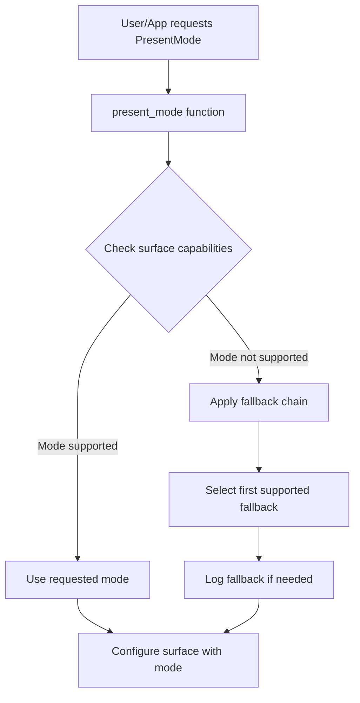

+++
title = "#22108 Add PresentMode fallbacks"
date = "2025-12-14T00:00:00"
draft = false
template = "pull_request_page.html"
in_search_index = true

[taxonomies]
list_display = ["show"]

[extra]
current_language = "en"
available_languages = {"en" = { name = "English", url = "/pull_request/bevy/2025-12/pr-22108-en-20251214" }, "zh-cn" = { name = "中文", url = "/pull_request/bevy/2025-12/pr-22108-zh-cn-20251214" }}
labels = ["A-Rendering", "P-Crash", "D-Straightforward"]
+++

# Add PresentMode fallbacks

## Basic Information
- **Title**: Add PresentMode fallbacks
- **PR Link**: https://github.com/bevyengine/bevy/pull/22108
- **Author**: atlv24
- **Status**: MERGED
- **Labels**: A-Rendering, P-Crash, S-Ready-For-Review, D-Straightforward
- **Created**: 2025-12-13T17:26:52Z
- **Merged**: 2025-12-14T21:43:28Z
- **Merged By**: alice-i-cecile

## Description Translation
The original PR description is in English:

# Objective

- Selecting an unsupported PresentMode crashes. Lets not do that.

## Solution

- Filter by capabilities and assume reasonable fallbacks.

## Testing

-

## The Story of This Pull Request

The problem was straightforward: when a user or application requested a specific `PresentMode` (like `Mailbox`, `Immediate`, `Fifo`, etc.) for a window, Bevy would crash if the GPU hardware or driver didn't support that particular presentation mode. This happened because Bevy was blindly using the requested mode without checking if it was actually available in the surface's capabilities.

In graphics programming, different GPUs and drivers support different sets of presentation modes. For example, some mobile GPUs might not support `Mailbox` mode (also known as "triple buffering"), and some older hardware might only support `Fifo` mode (standard V-Sync). When Bevy tried to configure a surface with an unsupported mode, the underlying graphics API (wgpu/Vulkan/Metal/DirectX) would fail, causing a crash.

The solution implemented in this PR is a fallback system. Instead of crashing when a requested `PresentMode` isn't supported, Bevy now checks the surface capabilities and selects the best available alternative. The implementation follows a logical priority chain for each presentation mode type:

For `AutoVsync`, the fallback chain is `FifoRelaxed` → `Fifo`. For `AutoNoVsync`, it's `Immediate` → `Mailbox` → `Fifo`. For `Mailbox`, it's `Mailbox` → `Immediate` → `Fifo`. For all other modes, the fallback is just the requested mode itself, followed by `Fifo` as a guaranteed fallback.

The key insight here is that `Fifo` mode is required to be supported by the Vulkan specification, making it a safe last-resort fallback across all platforms and hardware. This ensures the system never reaches a state where no valid presentation mode is available.

The implementation extracts the logic into a separate `present_mode()` function that takes the window and surface capabilities as input and returns a supported `wgpu::PresentMode`. This function is called in two places: when initially creating the surface configuration and when updating an existing surface configuration (such as when window properties change).

The code uses a sensible approach: for each requested mode, it defines a priority-ordered list of fallbacks. It then iterates through these fallbacks, selecting the first one that's present in the surface's supported modes list. This approach is more maintainable than a complex set of nested conditionals and makes the fallback chains explicit and easy to understand.

An important detail is the logging: when a fallback is used, the system logs an informational message indicating that the requested mode wasn't available and which mode was chosen instead. This helps developers debug performance issues if their requested high-performance mode (like `Mailbox`) falls back to a less optimal mode (like `Fifo`).

The changes are minimal but impactful. By adding just 51 lines (while removing 17), this PR eliminates a whole class of platform-specific crashes. The implementation is defensive programming at its best: it anticipates that hardware capabilities vary and provides a graceful degradation path rather than failing catastrophically.

## Visual Representation



## Key Files Changed

### `crates/bevy_render/src/view/window/mod.rs` (+51/-17)

This file contains the main rendering logic for window surfaces in Bevy. The changes add a fallback mechanism for presentation modes to prevent crashes when unsupported modes are requested.

**Key modifications:**

1. **Added import for `info` log level**:
```rust
use tracing::{debug, info, warn};
```
This enables informational logging when fallbacks are used.

2. **Refactored present mode selection into a dedicated function**:
The code that previously directly mapped `PresentMode` enum variants to `wgpu::PresentMode` values was extracted into a `present_mode()` function that includes fallback logic.

3. **Before (simplified excerpt)**:
```rust
present_mode: match window.present_mode {
    PresentMode::Fifo => wgpu::PresentMode::Fifo,
    PresentMode::FifoRelaxed => wgpu::PresentMode::FifoRelaxed,
    // ... other modes
},
```

4. **After - Using the new function**:
```rust
let caps = surface.get_capabilities(&render_adapter);
let present_mode = present_mode(window, &caps);
// ...
present_mode,
```

5. **The new `present_mode()` function**:
```rust
fn present_mode(
    window: &mut ExtractedWindow,
    caps: &wgpu::SurfaceCapabilities,
) -> wgpu::PresentMode {
    let present_mode = match window.present_mode {
        PresentMode::Fifo => wgpu::PresentMode::Fifo,
        PresentMode::FifoRelaxed => wgpu::PresentMode::FifoRelaxed,
        PresentMode::Mailbox => wgpu::PresentMode::Mailbox,
        PresentMode::Immediate => wgpu::PresentMode::Immediate,
        PresentMode::AutoVsync => wgpu::PresentMode::AutoVsync,
        PresentMode::AutoNoVsync => wgpu::PresentMode::AutoNoVsync,
    };
    let fallbacks = match present_mode {
        wgpu::PresentMode::AutoVsync => {
            &[wgpu::PresentMode::FifoRelaxed, wgpu::PresentMode::Fifo][..]
        }
        wgpu::PresentMode::AutoNoVsync => &[
            wgpu::PresentMode::Immediate,
            wgpu::PresentMode::Mailbox,
            wgpu::PresentMode::Fifo,
        ][..],
        wgpu::PresentMode::Mailbox => &[
            wgpu::PresentMode::Mailbox,
            wgpu::PresentMode::Immediate,
            wgpu::PresentMode::Fifo,
        ][..],
        // Always end in FIFO to make sure it's always supported
        x => &[x, wgpu::PresentMode::Fifo][..],
    };
    let new_present_mode = fallbacks
        .iter()
        .copied()
        .find(|fallback| caps.present_modes.contains(fallback))
        .unwrap_or_else(|| {
            unreachable!(
                "Fallback system failed to choose present mode. \
                This is a bug. Mode: {:?}, Options: {:?}",
                window.present_mode, &caps.present_modes
            );
        });
    if new_present_mode != present_mode && fallbacks.contains(&present_mode) {
        info!("PresentMode {present_mode:?} requested but not available. Falling back to {new_present_mode:?}");
    }
    new_present_mode
}
```

The function defines fallback chains for each mode type and selects the first supported mode from the chain. It logs when a fallback occurs and includes a safety `unreachable!()` assertion as a defensive measure, though in practice this should never trigger since `Fifo` is guaranteed to be supported.

## Further Reading

1. **Vulkan Presentation Modes**: The Vulkan specification defines several presentation modes. Understanding these helps explain why certain fallbacks make sense: https://vulkan-tutorial.com/Drawing_a_triangle/Presentation/Swap_chain#page_Present-modes
2. **wgpu PresentMode documentation**: The wgpu crate's API documentation for `PresentMode` enum: https://docs.rs/wgpu/latest/wgpu/enum.PresentMode.html
3. **Bevy's PresentMode enum**: The Bevy engine's own `PresentMode` enum documentation: https://docs.rs/bevy/latest/bevy/window/enum.PresentMode.html
4. **Graphics pipeline synchronization**: For understanding why different presentation modes exist and their performance characteristics: https://github.com/gpuweb/gpuweb/wiki/Synchronization

# Full Code Diff
```
diff --git a/crates/bevy_render/src/view/window/mod.rs b/crates/bevy_render/src/view/window/mod.rs
index ae5389e906820..48686af01db01 100644
--- a/crates/bevy_render/src/view/window/mod.rs
+++ b/crates/bevy_render/src/view/window/mod.rs
@@ -15,7 +15,7 @@ use core::{
     num::NonZero,
     ops::{Deref, DerefMut},
 };
-use tracing::{debug, warn};
+use tracing::{debug, info, warn};
 use wgpu::{
     SurfaceConfiguration, SurfaceTargetUnsafe, TextureFormat, TextureUsages, TextureViewDescriptor,
 };
@@ -348,6 +348,7 @@ pub fn create_surfaces(
                         .expect("Failed to create wgpu surface")
                 };
                 let caps = surface.get_capabilities(&render_adapter);
+                let present_mode = present_mode(window, &caps);
                 let formats = caps.formats;
                 // For future HDR output support, we'll need to request a format that supports HDR,
                 // but as of wgpu 0.15 that is not yet supported.
@@ -368,14 +369,7 @@ pub fn create_surfaces(
                     width: window.physical_width,
                     height: window.physical_height,
                     usage: TextureUsages::RENDER_ATTACHMENT,
-                    present_mode: match window.present_mode {
-                        PresentMode::Fifo => wgpu::PresentMode::Fifo,
-                        PresentMode::FifoRelaxed => wgpu::PresentMode::FifoRelaxed,
-                        PresentMode::Mailbox => wgpu::PresentMode::Mailbox,
-                        PresentMode::Immediate => wgpu::PresentMode::Immediate,
-                        PresentMode::AutoVsync => wgpu::PresentMode::AutoVsync,
-                        PresentMode::AutoNoVsync => wgpu::PresentMode::AutoNoVsync,
-                    },
+                    present_mode,
                     desired_maximum_frame_latency: window
                         .desired_maximum_frame_latency
                         .map(NonZero::<u32>::get)
@@ -413,17 +407,57 @@ pub fn create_surfaces(
 
             data.configuration.width = window.physical_width;
             data.configuration.height = window.physical_height;
-            data.configuration.present_mode = match window.present_mode {
-                PresentMode::Fifo => wgpu::PresentMode::Fifo,
-                PresentMode::FifoRelaxed => wgpu::PresentMode::FifoRelaxed,
-                PresentMode::Mailbox => wgpu::PresentMode::Mailbox,
-                PresentMode::Immediate => wgpu::PresentMode::Immediate,
-                PresentMode::AutoVsync => wgpu::PresentMode::AutoVsync,
-                PresentMode::AutoNoVsync => wgpu::PresentMode::AutoNoVsync,
-            };
+            let caps = data.surface.get_capabilities(&render_adapter);
+            data.configuration.present_mode = present_mode(window, &caps);
             render_device.configure_surface(&data.surface, &data.configuration);
         }
 
         window_surfaces.configured_windows.insert(window.entity);
     }
 }
+
+fn present_mode(
+    window: &mut ExtractedWindow,
+    caps: &wgpu::SurfaceCapabilities,
+) -> wgpu::PresentMode {
+    let present_mode = match window.present_mode {
+        PresentMode::Fifo => wgpu::PresentMode::Fifo,
+        PresentMode::FifoRelaxed => wgpu::PresentMode::FifoRelaxed,
+        PresentMode::Mailbox => wgpu::PresentMode::Mailbox,
+        PresentMode::Immediate => wgpu::PresentMode::Immediate,
+        PresentMode::AutoVsync => wgpu::PresentMode::AutoVsync,
+        PresentMode::AutoNoVsync => wgpu::PresentMode::AutoNoVsync,
+    };
+    let fallbacks = match present_mode {
+        wgpu::PresentMode::AutoVsync => {
+            &[wgpu::PresentMode::FifoRelaxed, wgpu::PresentMode::Fifo][..]
+        }
+        wgpu::PresentMode::AutoNoVsync => &[
+            wgpu::PresentMode::Immediate,
+            wgpu::PresentMode::Mailbox,
+            wgpu::PresentMode::Fifo,
+        ][..],
+        wgpu::PresentMode::Mailbox => &[
+            wgpu::PresentMode::Mailbox,
+            wgpu::PresentMode::Immediate,
+            wgpu::PresentMode::Fifo,
+        ][..],
+        // Always end in FIFO to make sure it's always supported
+        x => &[x, wgpu::PresentMode::Fifo][..],
+    };
+    let new_present_mode = fallbacks
+        .iter()
+        .copied()
+        .find(|fallback| caps.present_modes.contains(fallback))
+        .unwrap_or_else(|| {
+            unreachable!(
+                "Fallback system failed to choose present mode. \
+                            This is a bug. Mode: {:?}, Options: {:?}",
+                window.present_mode, &caps.present_modes
+            );
+        });
+    if new_present_mode != present_mode && fallbacks.contains(&present_mode) {
+        info!("PresentMode {present_mode:?} requested but not available. Falling back to {new_present_mode:?}");
+    }
+    new_present_mode
+}
```