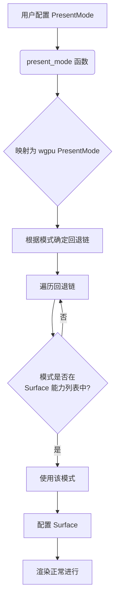

+++
title = "#22108 Add PresentMode fallbacks"
date = "2025-12-14T00:00:00"
draft = false
template = "pull_request_page.html"
in_search_index = false

[extra]
current_language = "zh-cn"
available_languages = {"en" = { name = "English", url = "/pull_request/bevy/2025-12/pr-22108-en-20251214" }, "zh-cn" = { name = "中文", url = "/pull_request/bevy/2025-12/pr-22108-zh-cn-20251214" }}
+++

# Title

## 基本信息
- **标题**: Add PresentMode fallbacks
- **PR链接**: https://github.com/bevyengine/bevy/pull/22108
- **作者**: atlv24
- **状态**: 已合并
- **标签**: A-Rendering, P-Crash, S-Ready-For-Final-Review, D-Straightforward
- **创建时间**: 2025-12-13T17:26:52Z
- **合并时间**: 2025-12-14T21:43:28Z
- **合并者**: alice-i-cecile

## 描述翻译
# Objective

- 选择一个不被支持的 PresentMode 会导致崩溃。我们不应该让这种情况发生。

## Solution

- 根据能力进行筛选，并假设合理的回退方案。

## Testing

-

## 该PR的故事

### 问题与背景
在 Bevy 引擎中，当用户为窗口配置一个图形 API（例如 Vulkan、Metal、DirectX）不支持的 PresentMode 时，应用会直接崩溃。PresentMode 决定了渲染帧如何被提交到显示设备，常见的模式包括垂直同步的 `Fifo`、无垂直同步的 `Immediate` 等。不同的硬件和驱动支持的模式集合不同，因此应用需要处理模式不被支持的情况。这是一个用户体验问题，也是一个稳定性问题。

### 解决方案思路
开发者采取了一个直接且务实的解决方案：在配置 Surface 时，不再直接将用户配置的 PresentMode 映射并传递给 wgpu，而是先检查该模式是否在 Surface 的能力列表（`SurfaceCapabilities`）中。如果支持，则使用它；否则，根据一个预定义的、合理的回退链选择一个支持的 PresentMode。这个方案的关键在于定义了一个智能的回退顺序，既能尽可能满足用户的意图（如想要垂直同步或不要垂直同步），又能保证最终选择的模式是硬件支持的。

### 实现细节
实现集中在 `crates/bevy_render/src/view/window/mod.rs` 文件中。主要修改是引入了一个新的私有函数 `present_mode`，并在两个地方调用它来替换原有的硬编码映射逻辑。

1. **提取回退逻辑**：创建 `present_mode` 函数，接收 `ExtractedWindow` 和 `SurfaceCapabilities` 作为参数，返回一个确定的 `wgpu::PresentMode`。
2. **映射与回退链**：首先将 Bevy 的 `PresentMode` 枚举映射到 wgpu 对应的枚举值。然后，根据映射后的模式，定义一个回退链（fallback chain）：
   - 对于 `AutoVsync`：回退链是 `[FifoRelaxed, Fifo]`。这优先尝试放松的垂直同步，然后是标准的垂直同步。
   - 对于 `AutoNoVsync`：回退链是 `[Immediate, Mailbox, Fifo]`。这优先尝试无垂直同步的立即模式，然后是邮箱模式，最后是垂直同步。
   - 对于 `Mailbox`：回退链是 `[Mailbox, Immediate, Fifo]`。优先自身，然后是无垂直同步的立即模式，最后是垂直同步。
   - 对于其他模式（如 `Fifo`, `FifoRelaxed`, `Immediate`）：回退链是 `[自身, Fifo]`。这是一个保守策略，如果请求的模式不被支持，则回退到最广泛支持的 `Fifo` 模式。
3. **选择模式**：遍历回退链，选择第一个在 `caps.present_modes` 中存在的模式。理论上，由于所有链都以 `Fifo` 结尾，而 `Fifo` 是 Vulkan 等 API 强制要求的支持模式，所以最终一定能找到一个可用的模式。代码中也用 `unreachable!` 宏来处理理论上不应发生的情况。
4. **日志记录**：如果最终选择的模式与用户最初请求的模式不同，并且用户请求的模式本身就在回退链中（意味着它被支持但我们因为优先级没选它？此处逻辑是：只有当请求的模式在回退链中但未被选中时，才打印日志。实际上，如果请求的模式被支持，它应该是回退链的第一个元素，并且会被选中。所以这个日志只有在请求的模式不被支持，但我们回退链中还有其他模式时才会触发），则记录一条 `info` 级别的日志，告知用户发生了回退。这有助于调试和了解运行时行为。
5. **集成到现有流程**：在 `create_surfaces` 函数中，初始化 Surface 配置时和更新窗口尺寸时，都用 `present_mode` 函数的调用来替代原来的 `match` 映射。这确保了无论初次创建还是后续更新，PresentMode 的选择都遵循回退逻辑。

这种实现方式优雅地解决了崩溃问题，没有改变公共 API，对现有代码的侵入性最小。

### 技术洞见
- **健壮性设计**：通过定义以 `Fifo` 为最终保障的回退链，确保了函数永远返回一个有效的模式，这是防御性编程的一个好例子。
- **用户意图保留**：回退链的顺序设计考虑了用户选择不同 PresentMode 时的潜在意图（如性能 vs 图像稳定性），尽可能在硬件限制内满足这些意图。
- **可观察性**：添加的 `info!` 日志使得回退行为在开发过程中可见，但不会在生产中造成噪音（因为通常是 `info` 级别）。
- **架构一致性**：将逻辑封装在一个独立的函数中，避免了代码重复，也使得 PresentMode 的选择策略集中在一个地方，易于未来调整。

### 影响
这个修改直接提高了 Bevy 应用在不同硬件配置上的稳定性。用户现在可以安全地配置任何 `PresentMode`，而无需担心因硬件不支持而崩溃。这对于想要跨平台部署的游戏或应用尤其重要。此外，由于回退行为是自动且合理的，大多数用户甚至不会察觉到变化，除非他们故意配置了一个不被支持的模式并查看了日志。

## 视觉表示



## 关键文件更改

- `crates/bevy_render/src/view/window/mod.rs` (+51/-17)

### 主要修改概述
1. 引入了 `present_mode` 函数，它封装了从用户配置的 PresentMode 到实际可用的 wgpu PresentMode 的映射和回退逻辑。
2. 在 `create_surfaces` 函数中，初始化 surface 配置和更新配置时，使用 `present_mode` 函数的结果，取代了之前硬编码的 `match` 映射。

### 关键代码片段

**新增函数 `present_mode`：**

```rust
fn present_mode(
    window: &mut ExtractedWindow,
    caps: &wgpu::SurfaceCapabilities,
) -> wgpu::PresentMode {
    let present_mode = match window.present_mode {
        PresentMode::Fifo => wgpu::PresentMode::Fifo,
        PresentMode::FifoRelaxed => wgpu::PresentMode::FifoRelaxed,
        PresentMode::Mailbox => wgpu::PresentMode::Mailbox,
        PresentMode::Immediate => wgpu::PresentMode::Immediate,
        PresentMode::AutoVsync => wgpu::PresentMode::AutoVsync,
        PresentMode::AutoNoVsync => wgpu::PresentMode::AutoNoVsync,
    };
    let fallbacks = match present_mode {
        wgpu::PresentMode::AutoVsync => {
            &[wgpu::PresentMode::FifoRelaxed, wgpu::PresentMode::Fifo][..]
        }
        wgpu::PresentMode::AutoNoVsync => &[
            wgpu::PresentMode::Immediate,
            wgpu::PresentMode::Mailbox,
            wgpu::PresentMode::Fifo,
        ][..],
        wgpu::PresentMode::Mailbox => &[
            wgpu::PresentMode::Mailbox,
            wgpu::PresentMode::Immediate,
            wgpu::PresentMode::Fifo,
        ][..],
        // Always end in FIFO to make sure it's always supported
        x => &[x, wgpu::PresentMode::Fifo][..],
    };
    let new_present_mode = fallbacks
        .iter()
        .copied()
        .find(|fallback| caps.present_modes.contains(fallback))
        .unwrap_or_else(|| {
            unreachable!(
                "Fallback system failed to choose present mode. \
                            This is a bug. Mode: {:?}, Options: {:?}",
                window.present_mode, &caps.present_modes
            );
        });
    if new_present_mode != present_mode && fallbacks.contains(&present_mode) {
        info!("PresentMode {present_mode:?} requested but not available. Falling back to {new_present_mode:?}");
    }
    new_present_mode
}
```

**在 `create_surfaces` 函数中的调用（替换前）：**

```rust
// 之前创建配置的代码片段（已被替换）：
present_mode: match window.present_mode {
    PresentMode::Fifo => wgpu::PresentMode::Fifo,
    PresentMode::FifoRelaxed => wgpu::PresentMode::FifoRelaxed,
    PresentMode::Mailbox => wgpu::PresentMode::Mailbox,
    PresentMode::Immediate => wgpu::PresentMode::Immediate,
    PresentMode::AutoVsync => wgpu::PresentMode::AutoVsync,
    PresentMode::AutoNoVsync => wgpu::PresentMode::AutoNoVsync,
},
```

**在 `create_surfaces` 函数中的调用（替换后）：**

```rust
// 新的调用方式：
let caps = surface.get_capabilities(&render_adapter);
let present_mode = present_mode(window, &caps);
// ... 然后在配置中使用 `present_mode` 变量
```

以及更新配置时：

```rust
// 之前更新配置的代码片段（已被替换）：
data.configuration.present_mode = match window.present_mode {
    PresentMode::Fifo => wgpu::PresentMode::Fifo,
    PresentMode::FifoRelaxed => wgpu::PresentMode::FifoRelaxed,
    PresentMode::Mailbox => wgpu::PresentMode::Mailbox,
    PresentMode::Immediate => wgpu::PresentMode::Immediate,
    PresentMode::AutoVsync => wgpu::PresentMode::AutoVsync,
    PresentMode::AutoNoVsync => wgpu::PresentMode::AutoNoVsync,
};
```

**替换为：**

```rust
let caps = data.surface.get_capabilities(&render_adapter);
data.configuration.present_mode = present_mode(window, &caps);
```

### 这些修改如何服务于PR的目的
这些修改确保了在配置 Surface 的 PresentMode 时，总是使用一个硬件支持的模式。通过引入回退逻辑，彻底消除了因请求不支持的模式而导致的崩溃风险。代码结构更清晰，将选择逻辑集中在一个地方，易于维护和测试。

## 进一步阅读

- **wgpu PresentMode 文档**: [https://docs.rs/wgpu/latest/wgpu/enum.PresentMode.html](https://docs.rs/wgpu/latest/wgpu/enum.PresentMode.html) - 了解不同呈现模式的含义和特性。
- **Vulkan 呈现模式**: [https://vulkan-tutorial.com/Drawing_a_triangle/Presentation/Presentation](https://vulkan-tutorial.com/Drawing_a_triangle/Presentation/Presentation) - 理解 PresentMode 在底层图形API（Vulkan）中的概念。
- **Bevy 窗口设置**: [https://bevyengine.org/learn/quick-start/getting-started/window/](https://bevyengine.org/learn/quick-start/getting-started/window/) - Bevy 官方关于窗口配置的文档。

## 完整代码差异

```diff
diff --git a/crates/bevy_render/src/view/window/mod.rs b/crates/bevy_render/src/view/window/mod.rs
index ae5389e906820..48686af01db01 100644
--- a/crates/bevy_render/src/view/window/mod.rs
+++ b/crates/bevy_render/src/view/window/mod.rs
@@ -15,7 +15,7 @@ use core::{
     num::NonZero,
     ops::{Deref, DerefMut},
 };
-use tracing::{debug, warn};
+use tracing::{debug, info, warn};
 use wgpu::{
     SurfaceConfiguration, SurfaceTargetUnsafe, TextureFormat, TextureUsages, TextureViewDescriptor,
 };
@@ -348,6 +348,7 @@ pub fn create_surfaces(
                         .expect("Failed to create wgpu surface")
                 };
                 let caps = surface.get_capabilities(&render_adapter);
+                let present_mode = present_mode(window, &caps);
                 let formats = caps.formats;
                 // For future HDR output support, we'll need to request a format that supports HDR,
                 // but as of wgpu 0.15 that is not yet supported.
@@ -368,14 +369,7 @@ pub fn create_surfaces(
                     width: window.physical_width,
                     height: window.physical_height,
                     usage: TextureUsages::RENDER_ATTACHMENT,
-                    present_mode: match window.present_mode {
-                        PresentMode::Fifo => wgpu::PresentMode::Fifo,
-                        PresentMode::FifoRelaxed => wgpu::PresentMode::FifoRelaxed,
-                        PresentMode::Mailbox => wgpu::PresentMode::Mailbox,
-                        PresentMode::Immediate => wgpu::PresentMode::Immediate,
-                        PresentMode::AutoVsync => wgpu::PresentMode::AutoVsync,
-                        PresentMode::AutoNoVsync => wgpu::PresentMode::AutoNoVsync,
-                    },
+                    present_mode,
                     desired_maximum_frame_latency: window
                         .desired_maximum_frame_latency
                         .map(NonZero::<u32>::get)
@@ -413,17 +407,57 @@ pub fn create_surfaces(
 
             data.configuration.width = window.physical_width;
             data.configuration.height = window.physical_height;
-            data.configuration.present_mode = match window.present_mode {
-                PresentMode::Fifo => wgpu::PresentMode::Fifo,
-                PresentMode::FifoRelaxed => wgpu::PresentMode::FifoRelaxed,
-                PresentMode::Mailbox => wgpu::PresentMode::Mailbox,
-                PresentMode::Immediate => wgpu::PresentMode::Immediate,
-                PresentMode::AutoVsync => wgpu::PresentMode::AutoVsync,
-                PresentMode::AutoNoVsync => wgpu::PresentMode::AutoNoVsync,
-            };
+            let caps = data.surface.get_capabilities(&render_adapter);
+            data.configuration.present_mode = present_mode(window, &caps);
             render_device.configure_surface(&data.surface, &data.configuration);
         }
 
         window_surfaces.configured_windows.insert(window.entity);
     }
 }
+
+fn present_mode(
+    window: &mut ExtractedWindow,
+    caps: &wgpu::SurfaceCapabilities,
+) -> wgpu::PresentMode {
+    let present_mode = match window.present_mode {
+        PresentMode::Fifo => wgpu::PresentMode::Fifo,
+        PresentMode::FifoRelaxed => wgpu::PresentMode::FifoRelaxed,
+        PresentMode::Mailbox => wgpu::PresentMode::Mailbox,
+        PresentMode::Immediate => wgpu::PresentMode::Immediate,
+        PresentMode::AutoVsync => wgpu::PresentMode::AutoVsync,
+        PresentMode::AutoNoVsync => wgpu::PresentMode::AutoNoVsync,
+    };
+    let fallbacks = match present_mode {
+        wgpu::PresentMode::AutoVsync => {
+            &[wgpu::PresentMode::FifoRelaxed, wgpu::PresentMode::Fifo][..]
+        }
+        wgpu::PresentMode::AutoNoVsync => &[
+            wgpu::PresentMode::Immediate,
+            wgpu::PresentMode::Mailbox,
+            wgpu::PresentMode::Fifo,
+        ][..],
+        wgpu::PresentMode::Mailbox => &[
+            wgpu::PresentMode::Mailbox,
+            wgpu::PresentMode::Immediate,
+            wgpu::PresentMode::Fifo,
+        ][..],
+        // Always end in FIFO to make sure it's always supported
+        x => &[x, wgpu::PresentMode::Fifo][..],
+    };
+    let new_present_mode = fallbacks
+        .iter()
+        .copied()
+        .find(|fallback| caps.present_modes.contains(fallback))
+        .unwrap_or_else(|| {
+            unreachable!(
+                "Fallback system failed to choose present mode. \
+                            This is a bug. Mode: {:?}, Options: {:?}",
+                window.present_mode, &caps.present_modes
+            );
+        });
+    if new_present_mode != present_mode && fallbacks.contains(&present_mode) {
+        info!("PresentMode {present_mode:?} requested but not available. Falling back to {new_present_mode:?}");
+    }
+    new_present_mode
+}
```