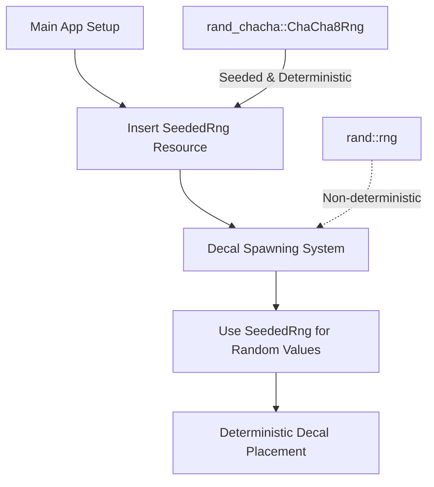

+++
title = "#22109 make example clustered_decal_maps deterministic"
date = "2025-12-14T00:00:00"
draft = false
template = "pull_request_page.html"
in_search_index = true

[taxonomies]
list_display = ["show"]

[extra]
current_language = "en"
available_languages = {"en" = { name = "English", url = "/pull_request/bevy/2025-12/pr-22109-en-20251214" }, "zh-cn" = { name = "中文", url = "/pull_request/bevy/2025-12/pr-22109-zh-cn-20251214" }}
labels = ["C-Examples", "D-Straightforward"]
+++

# Title

## Basic Information
- **Title**: make example clustered_decal_maps deterministic
- **PR Link**: https://github.com/bevyengine/bevy/pull/22109
- **Author**: mockersf
- **Status**: MERGED
- **Labels**: C-Examples, S-Ready-For-Final-Review, D-Straightforward
- **Created**: 2025-12-13T18:04:06Z
- **Merged**: 2025-12-14T00:39:19Z
- **Merged By**: alice-i-cecile

## Description Translation

# Objective

- don't use random random

## Solution

- use seeded random

## The Story of This Pull Request

This PR addresses a straightforward but important issue in Bevy's example code. The `clustered_decal_maps` example was using non-deterministic random number generation, which made the example behave differently each time it ran. While this might seem minor for a demonstration example, determinism is actually valuable for several practical reasons: debugging, testing, and ensuring consistent behavior across runs.

The problem was that the example was using `rand::rng()` without a seed, which creates a thread-local random number generator initialized with system entropy. Every time the example ran, it would generate different random positions, sizes, and rotations for the decals placed on the plane.

The solution approach was to replace the non-deterministic random number generator with a seeded, deterministic one. This involved:

1. Adding a seeded random number generator as a resource
2. Modifying the decal spawning system to use this seeded generator instead of the default one

The implementation uses `rand_chacha::ChaCha8Rng`, a cryptographically secure pseudo-random number generator that's fast and suitable for this use case. The specific seed value `19878367467712` was chosen arbitrarily but consistently - any fixed value would work.

From a technical perspective, the change required importing additional dependencies (`rand::SeedableRng` and `rand_chacha::ChaCha8Rng`), defining a new resource type to hold the seeded RNG, and modifying the decal spawning logic to use this resource. The existing `spawn_decal` function was already structured to accept a random number generator via the system parameters, so the changes were minimal and focused.

The impact of this change is that the example now produces identical results every time it runs. This makes it easier to:
- Debug issues because developers can reproduce the exact same state
- Write tests that depend on the example's behavior
- Demonstrate features consistently in documentation or presentations
- Compare performance across different runs without random variation

The engineering decision to use `ChaCha8Rng` over other seeded RNG options is reasonable given its balance of speed and statistical quality. The seed value is arbitrary but that's acceptable for an example - in a real application, you might want to make the seed configurable or derive it from some external source.

The change is minimal and focused, touching only the necessary parts of the code. It maintains the same API for the `spawn_decal` function while swapping out the random number source. This is a good example of how to make a codebase more deterministic without significant refactoring.

## Visual Representation



## Key Files Changed

### `examples/3d/clustered_decal_maps.rs` (+11/-6)

This file contains the 3D clustered decal maps example. The changes make the random decal placement deterministic by using a seeded random number generator instead of system entropy.

**Key changes:**

1. **Added imports for seeded random number generation:**
```rust
// Before:
use rand::Rng;

// After:
use rand::{Rng, SeedableRng};
use rand_chacha::ChaCha8Rng;
```

2. **Added seeded random number generator as a resource:**
```rust
// New resource definition:
#[derive(Resource)]
struct SeededRng(ChaCha8Rng);

// Resource insertion in main():
.insert_resource(SeededRng(ChaCha8Rng::seed_from_u64(19878367467712)))
```

3. **Modified decal spawning to use the seeded RNG:**
```rust
// Before in spawn_decal() function:
let mut rng = rand::rng();
let decal_position = vec3(
    rng.random_range(-PLANE_HALF_SIZE..PLANE_HALF_SIZE),
    rng.random_range(-PLANE_HALF_SIZE..PLANE_HALF_SIZE),
    0.0,
);
let decal_size = rng.random_range(DECAL_MIN_SIZE..DECAL_MAX_SIZE);
let theta = rng.random_range(0.0f32..PI);

// After in spawn_decal() function:
let decal_position = vec3(
    seeded_rng.0.random_range(-PLANE_HALF_SIZE..PLANE_HALF_SIZE),
    seeded_rng.0.random_range(-PLANE_HALF_SIZE..PLANE_HALF_SIZE),
    0.0,
);
let decal_size = seeded_rng.0.random_range(DECAL_MIN_SIZE..DECAL_MAX_SIZE);
let theta = seeded_rng.0.random_range(0.0f32..PI);
```

4. **Added the seeded RNG as a system parameter:**
```rust
// Added to spawn_decal() function signature:
mut seeded_rng: ResMut<SeededRng>,
```

These changes ensure that every run of the example produces identical decal placements, making the example behavior predictable and reproducible.

## Further Reading

1. **Rust Rand Crate Documentation**: https://docs.rs/rand/latest/rand/
2. **ChaCha RNG Algorithm**: https://cr.yp.to/chacha.html
3. **Bevy ECS Resources**: https://bevyengine.org/learn/quick-start/resource/
4. **Deterministic Simulation in Game Development**: https://gafferongames.com/post/deterministic_lockstep/
5. **Random Number Generation Best Practices**: https://rust-random.github.io/book/guide-rngs.html