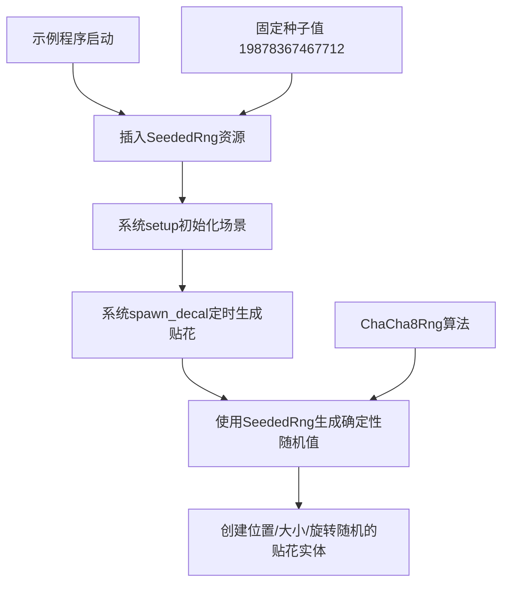

+++
title = "#22109 make example clustered_decal_maps deterministic"
date = "2025-12-14T00:00:00"
draft = false
template = "pull_request_page.html"
in_search_index = false

[extra]
current_language = "zh-cn"
available_languages = {"en" = { name = "English", url = "/pull_request/bevy/2025-12/pr-22109-en-20251214" }, "zh-cn" = { name = "中文", url = "/pull_request/bevy/2025-12/pr-22109-zh-cn-20251214" }}
+++

# Title
## 基础信息
- **标题**: make example clustered_decal_maps deterministic
- **PR链接**: https://github.com/bevyengine/bevy/pull/22109
- **作者**: mockersf
- **状态**: 已合并
- **标签**: C-Examples, S-Ready-For-Final-Review, D-Straightforward
- **创建时间**: 2025-12-13T18:04:06Z
- **合并时间**: 2025-12-14T00:39:19Z
- **合并者**: alice-i-cecile

## 描述翻译
### 目标
- 不使用随机随机数

### 解决方案
- 使用有种子（seeded）的随机数生成器

## 本次Pull Request的故事

这个PR解决了一个示例程序中的可重复性问题。在`clustered_decal_maps`这个3D示例中，贴花（decal）的生成位置、大小和旋转角度原本使用了完全随机的值，这导致每次运行示例时场景的视觉表现都不一致。

问题在于原代码使用`rand::rng()`获取默认的随机数生成器，这通常基于系统时间或其他不可预测的熵源。对于演示用途的示例来说，这种不确定性不是优点而是缺点，因为它使得：
1. 调试变得困难，因为每次运行的行为都不同
2. 无法可靠地比较代码变更前后的视觉效果
3. 无法创建可预测的屏幕截图或测试用例

开发者采用了直接有效的解决方案：引入一个带固定种子的确定性随机数生成器。具体实现是将原来的全局随机数生成器替换为基于`ChaCha8Rng`算法的可预测随机数源。

在实现层面，这个变更涉及几个关键修改：

首先，在示例的主函数中，新增了一个资源`SeededRng`：
```rust
.insert_resource(SeededRng(ChaCha8Rng::seed_from_u64(19878367467712)))
```
这里使用了一个固定的u64值`19878367467712`作为种子，确保了每次运行都生成相同的随机数序列。

然后，定义了对应的资源结构体：
```rust
#[derive(Resource)]
struct SeededRng(ChaCha8Rng);
```

最后，修改了`spawn_decal`系统，将原有的随机数生成调用：
```rust
let mut rng = rand::rng();
let decal_position = vec3(
    rng.random_range(-PLANE_HALF_SIZE..PLANE_HALF_SIZE),
    rng.random_range(-PLANE_HALF_SIZE..PLANE_HALF_SIZE),
    0.0,
);
let decal_size = rng.random_range(DECAL_MIN_SIZE..DECAL_MAX_SIZE);
let theta = rng.random_range(0.0f32..PI);
```
改为使用新引入的确定性随机数源：
```rust
let decal_position = vec3(
    seeded_rng.0.random_range(-PLANE_HALF_SIZE..PLANE_HALF_SIZE),
    seeded_rng.0.random_range(-PLANE_HALF_SIZE..PLANE_HALF_SIZE),
    0.0,
);
let decal_size = seeded_rng.0.random_range(DECAL_MIN_SIZE..DECAL_MAX_SIZE);
let theta = seeded_rng.0.random_range(0.0f32..PI);
```

技术细节方面，这个实现选择了`ChaCha8Rng`算法，这是现代密码学安全的伪随机数生成器，即使在低熵环境下也能提供良好的随机性分布。虽然示例不需要密码学安全特性，但使用这个生成器确保了伪随机序列的质量。固定种子值的选择（`19878367467712`）看起来是任意的，但重要的是它固定不变。

这个修改的影响很直接：现在每次运行`clustered_decal_maps`示例都会生成完全相同布局的贴花，使得开发者可以：
- 可靠地比较渲染效果的变化
- 创建一致的测试基准
- 更轻松地调试和复现问题

从工程角度看，这种确定性在示例代码中是很有价值的，因为它消除了随机性带来的不确定性因素。不过需要注意的是，这只是示例级别的修改，不影响引擎核心的随机数系统。

## 可视化表示



## 关键文件变更

### `examples/3d/clustered_decal_maps.rs` (+11/-6)

这个文件包含了所有必要的修改，使示例程序从使用非确定性随机数生成器转变为使用确定性随机数生成器。

**主要变更：**

1. **导入变更** - 添加了必要的导入：
```rust
// 之前:
use rand::Rng;

// 之后:
use rand::{Rng, SeedableRng};
use rand_chacha::ChaCha8Rng;
```

2. **新增资源定义** - 定义了确定性随机数生成器资源：
```rust
#[derive(Resource)]
struct SeededRng(ChaCha8Rng);
```

3. **资源插入** - 在主函数中插入带有固定种子的资源：
```rust
// 新增的行:
.insert_resource(SeededRng(ChaCha8Rng::seed_from_u64(19878367467712)))
```

4. **系统参数变更** - 修改`spawn_decal`函数签名以接受新的随机数资源：
```rust
// 之前:
fn spawn_decal(
    // ... 其他参数
) {
    let mut rng = rand::rng();
    // 使用 rng 生成随机值
}

// 之后:
fn spawn_decal(
    // ... 其他参数
    mut seeded_rng: ResMut<SeededRng>,
) {
    // 使用 seeded_rng.0 生成随机值
}
```

5. **随机数生成调用变更** - 将所有的随机数生成调用从`rng`改为`seeded_rng.0`：
```rust
// 之前的位置生成:
let decal_position = vec3(
    rng.random_range(-PLANE_HALF_SIZE..PLANE_HALF_SIZE),
    rng.random_range(-PLANE_HALF_SIZE..PLANE_HALF_SIZE),
    0.0,
);

// 之后的位置生成:
let decal_position = vec3(
    seeded_rng.0.random_range(-PLANE_HALF_SIZE..PLANE_HALF_SIZE),
    seeded_rng.0.random_range(-PLANE_HALF_SIZE..PLANE_HALF_SIZE),
    0.0,
);
```

这些变更共同实现了PR的目标：通过使用有种子（seeded）的随机数生成器，使示例程序的行为变得完全可预测和可重复。

## 延伸阅读

1. **Rust随机数生成器文档**:
   - [rand crate文档](https://docs.rs/rand/latest/rand/)
   - [SeedableRng trait文档](https://docs.rs/rand/latest/rand/trait.SeedableRng.html)

2. **确定性随机数在软件开发中的应用**:
   - 游戏开发中的确定性随机数用于回放系统和网络同步
   - 测试中的确定性行为确保测试结果的可靠性

3. **Bevy引擎中的资源系统**:
   - [Bevy Resources文档](https://docs.rs/bevy/latest/bevy/ecs/system/trait.Resource.html)
   - 如何在系统中访问和修改资源

4. **ChaCha算法**:
   - [ChaCha密码学算法](https://cr.yp.to/chacha.html)
   - 伪随机数生成器在游戏引擎中的应用

5. **示例代码的最佳实践**:
   - 示例代码应该是可重复和可预测的
   - 如何平衡示例的演示效果和代码的可靠性