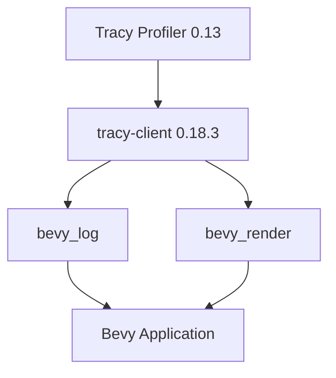

+++
title = "#22110 Bump tracy-client version"
date = "2025-12-14T00:00:00"
draft = false
template = "pull_request_page.html"
in_search_index = true

[taxonomies]
list_display = ["show"]

[extra]
current_language = "en"
available_languages = {"en" = { name = "English", url = "/pull_request/bevy/2025-12/pr-22110-en-20251214" }, "zh-cn" = { name = "中文", url = "/pull_request/bevy/2025-12/pr-22110-zh-cn-20251214" }}
labels = ["C-Dependencies", "A-Diagnostics"]
+++

# Title

## Basic Information
- **Title**: Bump tracy-client version
- **PR Link**: https://github.com/bevyengine/bevy/pull/22110
- **Author**: Lampan-git
- **Status**: MERGED
- **Labels**: C-Dependencies, S-Ready-For-Final-Review, A-Diagnostics
- **Created**: 2025-12-14T12:21:28Z
- **Merged**: 2025-12-14T21:40:22Z
- **Merged By**: alice-i-cecile

## Description Translation
# Objective

- Latest tracy version 0.13 doesn't work with tracy-client 0.18.0

## Solution

- Bump tracy-client to 0.18.3 per https://github.com/nagisa/rust_tracy_client?tab=readme-ov-file#version-support-table

## Testing

- Tested with tracy version 13.1
- I have not tested with tracy version 12

---

<details>
  <summary>Click to view showcase</summary>

```rust
println!("My super cool code.");
```

</details>

## The Story of This Pull Request

This PR addresses a dependency version mismatch between the Tracy profiler and its Rust client library within the Bevy game engine. Tracy is a real-time, frame-level performance profiler widely used in game development to identify performance bottlenecks. Bevy integrates Tracy for detailed performance analysis, but this integration broke when users upgraded to the latest Tracy version.

The problem was straightforward: Tracy version 0.13 introduced changes that made it incompatible with the `tracy-client` Rust crate at version 0.18.0. This is a common issue in software dependency management where upstream libraries evolve and client libraries must follow to maintain compatibility. The `rust_tracy_client` project maintains a version support table that clearly documents which versions of the client work with which versions of the Tracy profiler. According to this table, Tracy 0.13 requires `tracy-client` 0.18.3 or later.

The solution implemented in this PR is minimal and surgical: update the `tracy-client` dependency version in two Cargo.toml files from 0.18.0 to 0.18.3. This change aligns Bevy with the officially supported version pairing. The approach follows standard dependency management practices: when a dependency update is required for compatibility, update to the minimum compatible version that resolves the issue. In this case, 0.18.3 is specified because it's the version confirmed to work with Tracy 0.13 according to the compatibility table.

The implementation touches only dependency declarations, leaving all actual profiling code unchanged. This is a safe change because it doesn't modify any functional code—it simply allows the existing code to work with newer versions of the underlying profiling system. The changes are isolated to two crates: `bevy_log` and `bevy_render`. Both crates use Tracy for different aspects of profiling—`bevy_log` for logging integration and `bevy_render` for GPU and rendering performance analysis.

From a technical perspective, this PR demonstrates the importance of maintaining dependency version compatibility in large projects. When external tools like profilers are involved, breaking changes can directly impact developers' ability to analyze and optimize their games. The fix ensures that Bevy users can leverage the latest Tracy features and fixes without sacrificing profiling capabilities.

The impact is immediate: developers using Tracy 0.13 can now profile their Bevy applications without encountering compatibility errors. The change is backward compatible for users who haven't updated Tracy, as the new client version maintains compatibility with older Tracy versions according to the support table. This makes the update low-risk while providing necessary forward compatibility.

## Visual Representation



## Key Files Changed

1. **File:** `crates/bevy_log/Cargo.toml`
   
   **Change:** Updated `tracy-client` dependency from version 0.18.0 to 0.18.3.
   
   **Code Snippet:**
   ```toml
   # Before:
   tracy-client = { version = "0.18.0", optional = true }
   
   # After:
   tracy-client = { version = "0.18.3", optional = true }
   ```
   
   **Why:** The `bevy_log` crate uses Tracy for logging and diagnostic profiling. This update ensures compatibility when the `trace` feature is enabled with Tracy 0.13.

2. **File:** `crates/bevy_render/Cargo.toml`
   
   **Change:** Updated `tracy-client` dependency from version 0.18.0 to 0.18.3.
   
   **Code Snippet:**
   ```toml
   # Before:
   tracy-client = { version = "0.18.0", optional = true }
   
   # After:
   tracy-client = { version = "0.18.3", optional = true }
   ```
   
   **Why:** The `bevy_render` crate uses Tracy for GPU and rendering performance profiling. This update ensures render profiling works correctly with Tracy 0.13.

## Further Reading

1. **Tracy Profiler Documentation:** https://github.com/wolfpld/tracy
2. **rust_tracy_client Compatibility Table:** https://github.com/nagisa/rust_tracy_client?tab=readme-ov-file#version-support-table
3. **Bevy Diagnostics Documentation:** https://bevyengine.org/learn/quick-start/performance/diagnostics/
4. **Cargo Dependency Management:** https://doc.rust-lang.org/cargo/reference/specifying-dependencies.html

# Full Code Diff
diff --git a/crates/bevy_log/Cargo.toml b/crates/bevy_log/Cargo.toml
index f8dbdf683c3f5..eccc424242ec4 100644
--- a/crates/bevy_log/Cargo.toml
+++ b/crates/bevy_log/Cargo.toml
@@ -32,7 +32,7 @@ tracing = { version = "0.1", default-features = false, features = ["std"] }
 # Tracy dependency compatibility table:
 # https://github.com/nagisa/rust_tracy_client
 tracing-tracy = { version = "0.11.4", optional = true }
-tracy-client = { version = "0.18.0", optional = true }
+tracy-client = { version = "0.18.3", optional = true }
 
 [target.'cfg(target_os = "android")'.dependencies]
 android_log-sys = "0.3.0"
diff --git a/crates/bevy_render/Cargo.toml b/crates/bevy_render/Cargo.toml
index 69cdc5cd93c81..278ae95b8fef7 100644
--- a/crates/bevy_render/Cargo.toml
+++ b/crates/bevy_render/Cargo.toml
@@ -113,7 +113,7 @@ smallvec = { version = "1", default-features = false, features = ["const_new"] }
 offset-allocator = "0.2"
 variadics_please = "1.1"
 tracing = { version = "0.1", default-features = false, features = ["std"] }
-tracy-client = { version = "0.18.0", optional = true }
+tracy-client = { version = "0.18.3", optional = true }
 indexmap = { version = "2" }
 fixedbitset = { version = "0.5" }
 bitflags = "2"