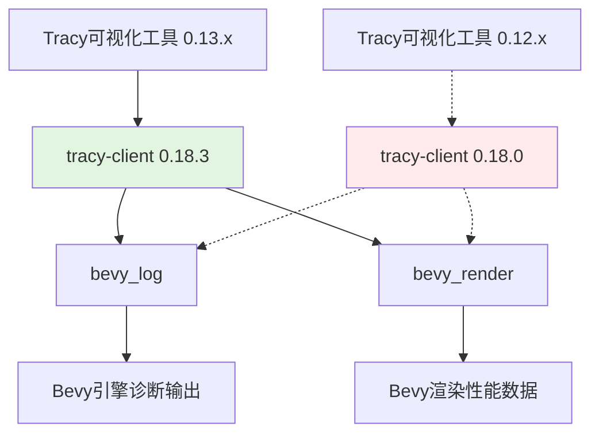

+++
title = "#22110 Bump tracy-client version"
date = "2025-12-14T00:00:00"
draft = false
template = "pull_request_page.html"
in_search_index = false

[extra]
current_language = "zh-cn"
available_languages = {"en" = { name = "English", url = "/pull_request/bevy/2025-12/pr-22110-en-20251214" }, "zh-cn" = { name = "中文", url = "/pull_request/bevy/2025-12/pr-22110-zh-cn-20251214" }}
+++

# Bump tracy-client version

## Basic Information
- **标题**: Bump tracy-client version
- **PR链接**: https://github.com/bevyengine/bevy/pull/22110
- **作者**: Lampan-git
- **状态**: 已合并
- **标签**: C-Dependencies, S-Ready-For-Final-Review, A-Diagnostics
- **创建时间**: 2025-12-14T12:21:28Z
- **合并时间**: 2025-12-14T21:40:22Z
- **合并者**: alice-i-cecile

## 描述翻译

### 目标
- 最新的 Tracy 版本 (0.13) 与 tracy-client 0.18.0 不兼容。

### 解决方案
- 根据 [版本支持表](https://github.com/nagisa/rust_tracy_client?tab=readme-ov-file#version-support-table)，将 tracy-client 版本提升至 0.18.3。

### 测试
- 已使用 Tracy 版本 13.1 进行测试。
- 未使用 Tracy 版本 12 进行测试。

---
<details>
  <summary>点击查看展示</summary>

```rust
println!("My super cool code.");
```

</details>

## 本次PR的技术分析

本次PR主要解决了一个依赖项版本不匹配的问题。Bevy引擎使用[Tracy](https://github.com/wolfpld/tracy)进行性能分析和诊断。Tracy是一个实时、纳秒级精度的性能分析工具。Rust项目通过`tracy-client`和`tracing-tracy`这两个crate来与Tracy可视化客户端进行通信。

问题的核心是依赖项之间的兼容性。开发者`Lampan-git`发现，当用户安装了最新版本的Tracy可视化工具（版本0.13）时，与Bevy项目中使用的`tracy-client` 0.18.0版本存在兼容性问题，导致工具无法正常工作。

这种不匹配通常表现为协议版本不一致或API变化。`tracy-client`的GitHub仓库提供了一个[版本支持表](https://github.com/nagisa/rust_tracy_client?tab=readme-ov-file#version-support-table)，明确列出了每个`tracy-client`版本所支持的Tracy可视化工具版本。根据这个表格，`tracy-client` 0.18.0版本仅支持到Tracy 0.12.x，而`tracy-client` 0.18.3版本则明确支持Tracy 0.13.x。

解决方案非常直接：将`tracy-client`的依赖版本从0.18.0升级到0.18.3。这个微版本升级（patch version bump）通常只包含错误修复和兼容性更新，不会引入破坏性变更。开发者确认这个变更在Tracy 13.1版本下工作正常。

从工程角度看，这种依赖版本管理是维护大型项目时的常规操作。Bevy的依赖管理策略在这里体现得很好——在`Cargo.toml`中为`tracy-client`依赖项添加了版本兼容性说明的注释，指向官方支持表，这有助于未来的维护者理解版本约束的原因。

实现层面，这次变更仅涉及两个文件中的版本号字符串修改。在`crates/bevy_log/Cargo.toml`中，`bevy_log` crate负责日志和诊断功能，自然需要Tracy集成。在`crates/bevy_render/Cargo.toml`中，`bevy_render`是渲染引擎，性能分析对图形渲染优化至关重要。

这个PR展示了依赖管理的几个重要方面：
1. **明确兼容性要求**：依赖外部工具时，需要明确支持的版本范围
2. **及时更新**：当依赖工具发布新版本时，需要评估并更新相关库
3. **最小化变更**：仅修改必要的版本号，避免引入不必要的变化
4. **测试验证**：虽然只测试了最新版本，但基于版本语义，这通常是足够的

技术细节上，`tracy-client`作为一个可选的依赖项（通过`optional = true`标记），意味着用户只有在启用相应特性（如`trace`特性）时才会链接这个库。这种设计遵循了Rust的"按需付费"原则，避免给不需要性能分析的用户增加构建负担。

## 组件关系图



图中实线箭头表示更新后的兼容关系，虚线箭头表示更新前的不兼容关系。可以看到，升级`tracy-client`到0.18.3后，Bevy引擎可以与最新的Tracy 0.13.x工具正常通信。

## 关键文件变更

### 1. `crates/bevy_log/Cargo.toml`
- **变更描述**: 更新`tracy-client`依赖版本，使其兼容最新的Tracy可视化工具。
- **代码片段**:
```toml
# 变更前:
tracy-client = { version = "0.18.0", optional = true }

# 变更后:
tracy-client = { version = "0.18.3", optional = true }
```
- **相关说明**: `bevy_log` crate负责Bevy的日志和诊断系统，通过`tracing-tracy`集成将性能数据发送到Tracy客户端。

### 2. `crates/bevy_render/Cargo.toml`
- **变更描述**: 同样更新`tracy-client`依赖版本，确保渲染性能数据能被正确收集。
- **代码片段**:
```toml
# 变更前:
tracy-client = { version = "0.18.0", optional = true }

# 变更后:
tracy-client = { version = "0.18.3", optional = true }
```
- **相关说明**: `bevy_render`是Bevy的渲染引擎，性能分析对图形渲染优化至关重要。保持`tracy-client`版本一致确保整个项目的依赖统一。

## 延伸阅读

1. **[Tracy官方文档](https://github.com/wolfpld/tracy)** - 了解Tracy性能分析工具的功能和使用方法
2. **[rust_tracy_client仓库](https://github.com/nagisa/rust_tracy_client)** - 查看Rust Tracy客户端的源码和版本兼容性表格
3. **[Cargo语义化版本控制](https://doc.rust-lang.org/cargo/reference/semver.html)** - 理解Rust依赖版本管理的规则
4. **[Bevy诊断系统](https://bevyengine.org/learn/quick-start/getting-started/diagnostics/)** - 学习Bevy如何集成性能诊断工具

# 完整代码差异
```diff
diff --git a/crates/bevy_log/Cargo.toml b/crates/bevy_log/Cargo.toml
index f8dbdf683c3f5..eccc424242ec4 100644
--- a/crates/bevy_log/Cargo.toml
+++ b/crates/bevy_log/Cargo.toml
@@ -32,7 +32,7 @@ tracing = { version = "0.1", default-features = false, features = ["std"] }
 # Tracy dependency compatibility table:
 # https://github.com/nagisa/rust_tracy_client
 tracing-tracy = { version = "0.11.4", optional = true }
-tracy-client = { version = "0.18.0", optional = true }
+tracy-client = { version = "0.18.3", optional = true }
 
 [target.'cfg(target_os = "android")'.dependencies]
 android_log-sys = "0.3.0"
diff --git a/crates/bevy_render/Cargo.toml b/crates/bevy_render/Cargo.toml
index 69cdc5cd93c81..278ae95b8fef7 100644
--- a/crates/bevy_render/Cargo.toml
+++ b/crates/bevy_render/Cargo.toml
@@ -113,7 +113,7 @@ smallvec = { version = "1", default-features = false, features = ["const_new"] }
 offset-allocator = "0.2"
 variadics_please = "1.1"
 tracing = { version = "0.1", default-features = false, features = ["std"] }
-tracy-client = { version = "0.18.0", optional = true }
+tracy-client = { version = "0.18.3", optional = true }
 indexmap = { version = "2" }
 fixedbitset = { version = "0.5" }
 bitflags = "2"
```