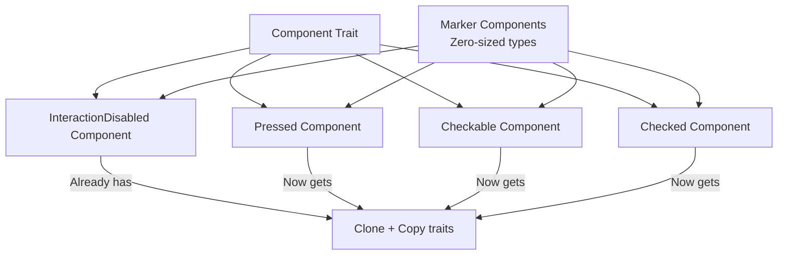

+++
title = "#22115 derive `Clone` and `Copy` for newer `interaction_states` unit structs"
date = "2025-12-15T00:00:00"
draft = false
template = "pull_request_page.html"
in_search_index = true

[taxonomies]
list_display = ["show"]

[extra]
current_language = "en"
available_languages = {"en" = { name = "English", url = "/pull_request/bevy/2025-12/pr-22115-en-20251215" }, "zh-cn" = { name = "中文", url = "/pull_request/bevy/2025-12/pr-22115-zh-cn-20251215" }}
+++

# Title
## derive `Clone` and `Copy` for newer `interaction_states` unit structs

## Basic Information
- **Title**: derive `Clone` and `Copy` for newer `interaction_states` unit structs
- **PR Link**: https://github.com/bevyengine/bevy/pull/22115
- **Author**: databasedav
- **Status**: MERGED
- **Labels**: None
- **Created**: 2025-12-15T04:22:28Z
- **Merged**: 2025-12-15T07:00:48Z
- **Merged By**: alice-i-cecile

## Description Translation
# Objective

- derive `Clone` and `Copy` for the newer unit structs in `interaction_states`, this is useful for frameworks that are generic over `Component + Clone/Copy` and is also the status quo for the existing `InteractionDisabled` component defined a few lines above

## Solution

- derive `Clone` and `Copy` for `Pressed`, `Checkable`, and `Checked`

## The Story of This Pull Request

This pull request addresses a straightforward consistency issue in Bevy's UI system. The problem centers around three unit struct components in the `interaction_states` module: `Pressed`, `Checkable`, and `Checked`. These components lacked the `Clone` and `Copy` trait implementations, which created an inconsistency with the existing `InteractionDisabled` component that already had these traits derived.

The issue becomes apparent when considering frameworks or systems designed to work with components generically. Many Rust patterns and Bevy's own ECS systems benefit from components that implement `Clone` and `Copy` traits, particularly for marker components (unit structs with no data). Without these traits, developers working with generic constraints like `T: Component + Clone` or `T: Component + Copy` would be unable to use these newer interaction state components, even though they logically should support these traits.

The solution implemented in this PR is minimal and focused. The developer simply added `Clone` and `Copy` to the derive macros for the three affected structs. Additionally, they reordered the trait derivations to maintain consistency with existing code patterns in the codebase, placing `Debug` before `Clone` and `Copy`, and `Default` at the end.

From a technical perspective, this change is safe because these are unit structs (structs with no fields). Unit structs are trivially copyable and clonable since they contain no data to copy or clone - they're essentially zero-sized types that serve as markers. The Rust compiler can generate optimal implementations for these traits in such cases.

The implementation required only three lines of changes, each following the same pattern. The developer updated the derive attribute for each struct from `#[derive(Component, Default, Debug)]` to `#[derive(Component, Debug, Clone, Copy, Default)]`. This maintains backward compatibility while enabling the new functionality.

The impact of this change is primarily in improved API consistency and expanded usability. Developers can now use these interaction state components in any context requiring copyable or clonable components without workarounds. The change aligns with Rust's philosophy of making zero-cost abstractions available where appropriate.

## Visual Representation



## Key Files Changed

### `crates/bevy_ui/src/interaction_states.rs`
**What changed**: Added `Clone` and `Copy` trait derivations to three UI component structs and reordered trait derivations for consistency.

**Before:**
```rust
/// Component that indicates whether a button or widget is currently in a pressed or "held down"
/// state.
#[derive(Component, Default, Debug)]
pub struct Pressed;

/// Component that indicates that a widget can be checked.
#[derive(Component, Default, Debug)]
pub struct Checkable;

/// Component that indicates whether a checkbox or radio button is in a checked state.
#[derive(Component, Default, Debug)]
pub struct Checked;
```

**After:**
```rust
/// Component that indicates whether a button or widget is currently in a pressed or "held down"
/// state.
#[derive(Component, Debug, Clone, Copy, Default)]
pub struct Pressed;

/// Component that indicates that a widget can be checked.
#[derive(Component, Debug, Clone, Copy, Default)]
pub struct Checkable;

/// Component that indicates whether a checkbox or radio button is in a checked state.
#[derive(Component, Debug, Clone, Copy, Default)]
pub struct Checked;
```

**Why it matters**: These changes bring consistency with the existing `InteractionDisabled` component and enable these marker components to be used in generic contexts that require `Clone` or `Copy` traits. The reordering of traits follows the established pattern in the codebase, improving code readability and maintainability.

## Further Reading

1. **Rust Traits Documentation**: 
   - [`Clone` trait](https://doc.rust-lang.org/std/clone/trait.Clone.html)
   - [`Copy` trait](https://doc.rust-lang.org/std/marker/trait.Copy.html)
   
2. **Bevy ECS Components**:
   - [Bevy Component Documentation](https://bevyengine.org/learn/book/development/ecs/components/)
   - [Marker Components Pattern](https://bevy-cheatbook.github.io/programming/ecs-intro.html#marker-components)

3. **Zero-sized Types in Rust**:
   - [The Rust Reference: Zero-sized Types](https://doc.rust-lang.org/reference/type-layout.html#zero-sized-types)
   - [Rustonomicon: Exotic Sizes](https://doc.rust-lang.org/nomicon/exotic-sizes.html)

4. **Derive Macros**:
   - [Rust by Example: Derive](https://doc.rust-lang.org/rust-by-example/trait/derive.html)
   - [The Rust Programming Language: Appendix C: Derivable Traits](https://doc.rust-lang.org/book/appendix-03-derivable-traits.html)

# Full Code Diff
diff --git a/crates/bevy_ui/src/interaction_states.rs b/crates/bevy_ui/src/interaction_states.rs
index a5793ca778a57..41e80114062a9 100644
--- a/crates/bevy_ui/src/interaction_states.rs
+++ b/crates/bevy_ui/src/interaction_states.rs
@@ -37,15 +37,15 @@ pub(crate) fn on_remove_disabled(
 
 /// Component that indicates whether a button or widget is currently in a pressed or "held down"
 /// state.
-#[derive(Component, Default, Debug)]
+#[derive(Component, Debug, Clone, Copy, Default)]
 pub struct Pressed;
 
 /// Component that indicates that a widget can be checked.
-#[derive(Component, Default, Debug)]
+#[derive(Component, Debug, Clone, Copy, Default)]
 pub struct Checkable;
 
 /// Component that indicates whether a checkbox or radio button is in a checked state.
-#[derive(Component, Default, Debug)]
+#[derive(Component, Debug, Clone, Copy, Default)]
 pub struct Checked;
 
 pub(crate) fn on_add_checkable(add: On<Add, Checked>, mut world: DeferredWorld) {