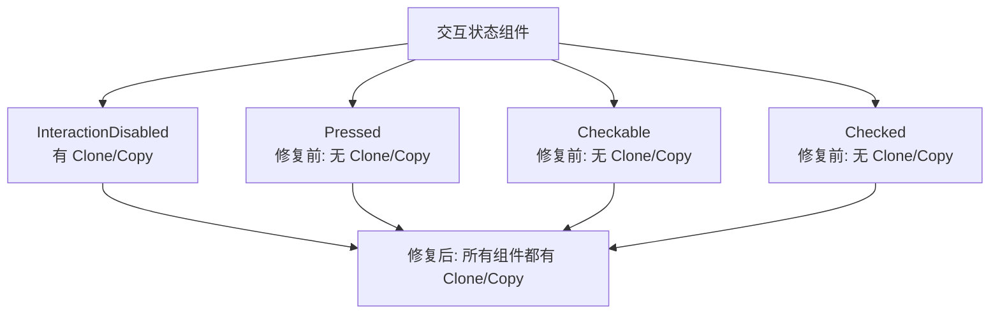

+++
title = "#22115 为较新的 `interaction_states` 单元结构体派生 `Clone` 和 `Copy` 特征"
date = "2025-12-15T00:00:00"
draft = false
template = "pull_request_page.html"
in_search_index = false

[extra]
current_language = "zh-cn"
available_languages = {"en" = { name = "English", url = "/pull_request/bevy/2025-12/pr-22115-en-20251215" }, "zh-cn" = { name = "中文", url = "/pull_request/bevy/2025-12/pr-22115-zh-cn-20251215" }}
+++

# Title
## derive `Clone` and `Copy` for newer `interaction_states` unit structs

## Basic Information
- **标题**: 为较新的 `interaction_states` 单元结构体派生 `Clone` 和 `Copy` 特征
- **PR 链接**: https://github.com/bevyengine/bevy/pull/22115
- **作者**: databasedav
- **状态**: 已合并
- **标签**: 无
- **创建时间**: 2025-12-15T04:22:28Z
- **合并时间**: 2025-12-15T07:00:48Z
- **合并者**: alice-i-cecile

## 描述翻译

# 目标

- 为 `interaction_states` 中较新的单元结构体派生 `Clone` 和 `Copy` 特征。这对于那些需要泛型约束为 `Component + Clone/Copy` 的框架很有用，同时也与上方几行定义的现有 `InteractionDisabled` 组件的现状保持一致。

## 解决方案

- 为 `Pressed`、`Checkable` 和 `Checked` 派生 `Clone` 和 `Copy` 特征。

## 本 Pull Request 的技术解析

这个 PR 解决了一个代码库中的一致性问题和泛型兼容性问题。在 Bevy 的 UI 系统中，`interaction_states` 模块定义了几个用于表示交互状态的单元结构体（unit structs），它们作为组件（Component）被附加到实体上。

问题起源于代码库的演进过程中出现了不一致的派生特征实现。在同一个文件中，较早定义的 `InteractionDisabled` 组件已经包含了 `Clone` 和 `Copy` 的派生，而后来添加的 `Pressed`、`Checkable` 和 `Checked` 组件却没有。这种不一致性导致了两个具体问题：

首先，当开发者编写需要对组件类型进行泛型约束的代码时，例如需要要求组件实现 `Clone` 或 `Copy` 特征，这些较新的组件类型无法满足约束，尽管它们作为零大小类型（ZST）天然支持这些特征。这在构建 UI 框架或工具时会造成不必要的限制。

其次，这种不一致性违反了代码库的内部一致性原则，增加了维护成本。其他开发者可能会疑惑为什么某些组件可以复制而另一些不行，尤其是当这些组件在概念和实现上如此相似时。

从技术实现角度看，这个 PR 的解决方案极其简单但有效。单元结构体是零大小类型，它们不包含任何数据字段，因此：
1. `Copy` 特征允许按位复制，对于零大小类型这没有实际开销
2. `Clone` 特征对于 `Copy` 类型来说通常只需委托给 `Copy` 实现

为这些结构体添加 `Clone` 和 `Copy` 派生是完全安全的，因为：
- 没有破坏性变更：这些组件原本就是不可变的状态标记
- 没有运行时开销：零大小类型的复制没有内存分配或计算成本
- 没有破坏现有API：只是增加了额外的特征实现

这种模式在 Rust 生态系统中很常见。对于标记类型（marker types）或状态类型，通常会同时实现 `Clone`、`Copy`、`Debug` 等特征，以最大化它们的实用性和互操作性。

从架构角度看，这个变更使 UI 系统的交互状态组件更加统一和可预测。现在所有的交互状态组件都具有相同的特征集，这简化了：
1. 泛型编程：可以统一约束为 `Component + Clone + Copy`
2. 序列化/反序列化：如果未来需要，这些特征为序列化提供了基础
3. 组件操作：可以在系统中自由复制这些状态而无需额外考虑

这个 PR 也体现了良好的工程实践：即使是很小的不一致性修复，也能提升整个代码库的质量。通过保持相似组件的一致性，减少了认知负担和潜在的错误源。

## 视觉表示



## 关键文件变更

**crates/bevy_ui/src/interaction_states.rs** (+3/-3)

这个文件包含了所有与 UI 交互状态相关的组件定义。变更非常简单但重要：为三个较新的组件添加了缺失的 `Clone` 和 `Copy` 特征派生。

变更前：
```rust
/// Component that indicates whether a button or widget is currently in a pressed or "held down"
/// state.
#[derive(Component, Default, Debug)]
pub struct Pressed;

/// Component that indicates that a widget can be checked.
#[derive(Component, Default, Debug)]
pub struct Checkable;

/// Component that indicates whether a checkbox or radio button is in a checked state.
#[derive(Component, Default, Debug)]
pub struct Checkable;
```

变更后：
```rust
/// Component that indicates whether a button or widget is currently in a pressed or "held down"
/// state.
#[derive(Component, Debug, Clone, Copy, Default)]
pub struct Pressed;

/// Component that indicates that a widget can be checked.
#[derive(Component, Debug, Clone, Copy, Default)]
pub struct Checkable;

/// Component that indicates whether a checkbox or radio button is in a checked state.
#[derive(Component, Debug, Clone, Copy, Default)]
pub struct Checked;
```

关键点：
1. 特征派生顺序调整：`Debug` 被移到了 `Component` 后面，但这只是代码风格调整，不影响功能
2. 添加了 `Clone` 和 `Copy` 特征派生
3. 保持了与现有 `InteractionDisabled` 组件的一致性，后者已经具有相同的特征集

## 进一步阅读

1. **Rust 特征文档**:
   - [Clone trait](https://doc.rust-lang.org/std/clone/trait.Clone.html)
   - [Copy trait](https://doc.rust-lang.org/std/marker/trait.Copy.html)
   - 理解这两个特征的区别对于编写泛型 Rust 代码很重要

2. **Bevy 组件系统**:
   - [Bevy Component Documentation](https://docs.rs/bevy/latest/bevy/ecs/component/trait.Component.html)
   - 了解如何在 Bevy ECS 中定义和使用组件

3. **零大小类型（ZST）**:
   - [Rustonomicon: Zero-Sized Types](https://doc.rust-lang.org/nomicon/exotic-sizes.html#zero-sized-types-zsts)
   - 单元结构体是零大小类型的常见形式，理解它们的特性和优化潜力

4. **派生宏（Derive Macros）**:
   - [Rust 参考：派生](https://doc.rust-lang.org/reference/attributes/derive.html)
   - 了解 `#[derive(...)]` 属性如何自动生成特征实现

5. **代码一致性模式**:
   - 在大型代码库中保持类似组件的一致性模式
   - 标记类型（Marker Types）的最佳实践和常见模式

# Full Code Diff
diff --git a/crates/bevy_ui/src/interaction_states.rs b/crates/bevy_ui/src/interaction_states.rs
index a5793ca778a57..41e80114062a9 100644
--- a/crates/bevy_ui/src/interaction_states.rs
+++ b/crates/bevy_ui/src/interaction_states.rs
@@ -37,15 +37,15 @@ pub(crate) fn on_remove_disabled(
 
 /// Component that indicates whether a button or widget is currently in a pressed or "held down"
 /// state.
-#[derive(Component, Default, Debug)]
+#[derive(Component, Debug, Clone, Copy, Default)]
 pub struct Pressed;
 
 /// Component that indicates that a widget can be checked.
-#[derive(Component, Default, Debug)]
+#[derive(Component, Debug, Clone, Copy, Default)]
 pub struct Checkable;
 
 /// Component that indicates whether a checkbox or radio button is in a checked state.
-#[derive(Component, Default, Debug)]
+#[derive(Component, Debug, Clone, Copy, Default)]
 pub struct Checked;
 
 pub(crate) fn on_add_checkable(add: On<Add, Checked>, mut world: DeferredWorld) {