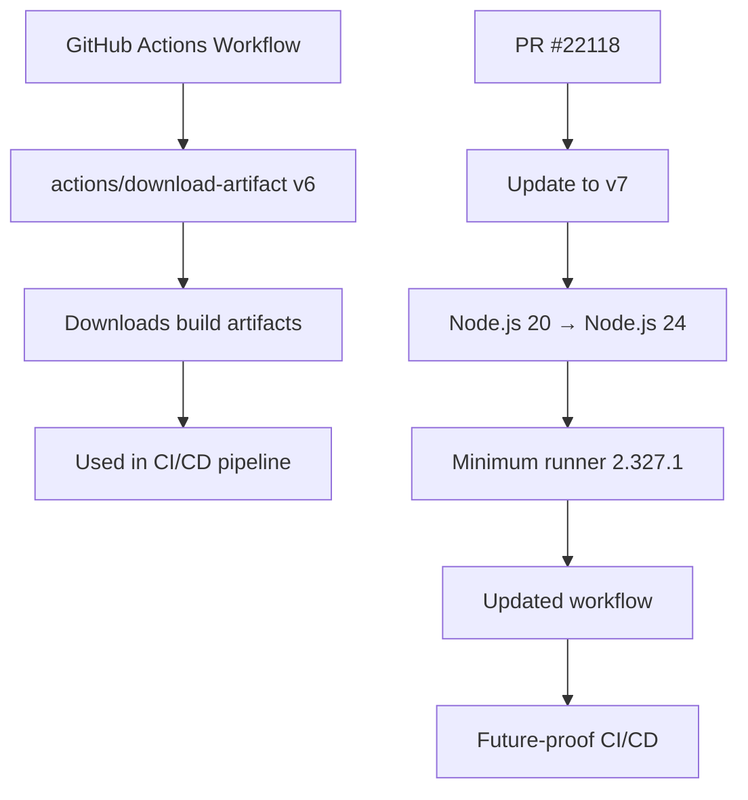

+++
title = "#22118 Bump actions/download-artifact from 6 to 7"
date = "2025-12-18T00:00:00"
draft = false
template = "pull_request_page.html"
in_search_index = true

[taxonomies]
list_display = ["show"]

[extra]
current_language = "en"
available_languages = {"en" = { name = "English", url = "/pull_request/bevy/2025-12/pr-22118-en-20251218" }, "zh-cn" = { name = "中文", url = "/pull_request/bevy/2025-12/pr-22118-zh-cn-20251218" }}
labels = ["A-Build-System", "C-Dependencies"]
+++

# Title
Bump actions/download-artifact from 6 to 7

## Basic Information
- **Title**: Bump actions/download-artifact from 6 to 7
- **PR Link**: https://github.com/bevyengine/bevy/pull/22118
- **Author**: app/dependabot
- **Status**: MERGED
- **Labels**: A-Build-System, C-Dependencies, S-Ready-For-Final-Review
- **Created**: 2025-12-15T06:00:54Z
- **Merged**: 2025-12-18T19:12:44Z
- **Merged By**: alice-i-cecile

## Description Translation
Bumps [actions/download-artifact](https://github.com/actions/download-artifact) from 6 to 7.
<details>
<summary>Release notes</summary>
<p><em>Sourced from <a href="https://github.com/actions/download-artifact/releases">actions/download-artifact's releases</a>.</em></p>
<blockquote>
<h2>v7.0.0</h2>
<h2>v7 - What's new</h2>
<blockquote>
<p>[!IMPORTANT]
actions/download-artifact@v7 now runs on Node.js 24 (<code>runs.using: node24</code>) and requires a minimum Actions Runner version of 2.327.1. If you are using self-hosted runners, ensure they are updated before upgrading.</p>
</blockquote>
<h3>Node.js 24</h3>
<p>This release updates the runtime to Node.js 24. v6 had preliminary support for Node 24, however this action was by default still running on Node.js 20. Now this action by default will run on Node.js 24.</p>
<h2>What's Changed</h2>
<ul>
<li>Update GHES guidance to include reference to Node 20 version by <a href="https://github.com/patrikpolyak"><code>@​patrikpolyak</code></a> in <a href="https://redirect.github.com/actions/download-artifact/pull/440">actions/download-artifact#440</a></li>
<li>Download Artifact Node24 support by <a href="https://github.com/salmanmkc"><code>@​salmanmkc</code></a> in <a href="https://redirect.github.com/actions/download-artifact/pull/415">actions/download-artifact#415</a></li>
<li>fix: update <code>@​actions/artifact</code> to fix Node.js 24 punycode deprecation by <a href="https://github.com/salmanmkc"><code>@​salmanmkc</code></a> in <a href="https://redirect.github.com/actions/download-artifact/pull/451">actions/download-artifact#451</a></li>
<li>prepare release v7.0.0 for Node.js 24 support by <a href="https://github.com/salmanmkc"><code>@​salmanmkc</code></a> in <a href="https://redirect.github.com/actions/download-artifact/pull/452">actions/download-artifact#452</a></li>
</ul>
<h2>New Contributors</h2>
<ul>
<li><a href="https://github.com/patrikpolyak"><code>@​patrikpolyak</code></a> made their first contribution in <a href="https://redirect.github.com/actions/download-artifact/pull/440">actions/download-artifact#440</a></li>
<li><a href="https://github.com/salmanmkc"><code>@​salmanmkc</code></a> made their first contribution in <a href="https://redirect.github.com/actions/download-artifact/pull/415">actions/download-artifact#415</a></li>
</ul>
<p><strong>Full Changelog</strong>: <a href="https://github.com/actions/download-artifact/compare/v6.0.0...v7.0.0">https://github.com/actions/download-artifact/compare/v6.0.0...v7.0.0</a></p>
</blockquote>
</details>
<details>
<summary>Commits</summary>
<ul>
<li><a href="https://github.com/actions/download-artifact/commit/37930b1c2abaa49bbe596cd826c3c89aef350131"><code>37930b1</code></a> Merge pull request <a href="https://redirect.github.com/actions/download-artifact/issues/452">#452</a> from actions/download-artifact-v7-release</li>
<li><a href="https://github.com/actions/download-artifact/commit/72582b9e0acd370909e83fa4a1fd0fca3ad452d8"><code>72582b9</code></a> doc: update readme</li>
<li><a href="https://github.com/actions/download-artifact/commit/0d2ec9d4cbcefe257d822f108de2a1f15f8da9f6"><code>0d2ec9d</code></a> chore: release v7.0.0 for Node.js 24 support</li>
<li><a href="https://github.com/actions/download-artifact/commit/fd7ae8fda6dc16277a9ffbc91cdb0eedf156e912"><code>fd7ae8f</code></a> Merge pull request <a href="https://redirect.github.com/actions/download-artifact/issues/451">#451</a> from actions/fix-storage-blob</li>
<li><a href="https://github.com/actions/download-artifact/commit/d484700543354b15886d6a52910cf61b7f1d2b27"><code>d484700</code></a> chore: restore minimatch.dep.yml license file</li>
<li><a href="https://github.com/actions/download-artifact/commit/03a808050efe42bb6ad85281890afd4e4546672c"><code>03a8080</code></a> chore: remove obsolete dependency license files</li>
<li><a href="https://github.com/actions/download-artifact/commit/56fe6d904b0968950f8b68ea17774c54973ed5e2"><code>56fe6d9</code></a> chore: update <code>@​actions/artifact</code> license file to 5.0.1</li>
<li><a href="https://github.com/actions/download-artifact/commit/8e3ebc4ab4d2e095e5eb44ba1a4a53b6b03976ad"><code>8e3ebc4</code></a> chore: update package-lock.json with <code>@​actions/artifact</code><a href="https://github.com/5"><code>@​5</code></a>.0.1</li>
<li><a href="https://github.com/actions/download-artifact/commit/1e3c4b4d4906c98ab57453c24efefdf16c078044"><code>1e3c4b4</code></a> fix: update <code>@​actions/artifact</code> to ^5.0.0 for Node.js 24 punycode fix</li>
<li><a href="https://github.com/actions/download-artifact/commit/458627d354794c71bc386c8d5839d20b5885fe2a"><code>458627d</code></a> chore: use local <code>@​actions/artifact</code> package for Node.js 24 testing</li>
<li>Additional commits viewable in <a href="https://github.com/actions/download-artifact/compare/v6...v7">compare view</a></li>
</ul>
</details>
<br />


[](https://docs.github.com/en/github/managing-security-vulnerabilities/about-dependabot-security-updates#about-compatibility-scores)

Dependabot will resolve any conflicts with this PR as long as you don't alter it yourself. You can also trigger a rebase manually by commenting `@dependabot rebase`.

[//]: # (dependabot-automerge-start)
[//]: # (dependabot-automerge-end)

---

<details>
<summary>Dependabot commands and options</summary>
<br />

You can trigger Dependabot actions by commenting on this PR:
- `@dependabot rebase` will rebase this PR
- `@dependabot recreate` will recreate this PR, overwriting any edits that have been made to it
- `@dependabot merge` will merge this PR after your CI passes on it
- `@dependabot squash and merge` will squash and merge this PR after your CI passes on it
- `@dependabot cancel merge` will cancel a previously requested merge and block automerging
- `@dependabot reopen` will reopen this PR if it is closed
- `@dependabot close` will close this PR and stop Dependabot recreating it. You can achieve the same result by closing it manually
- `@dependabot show <dependency name> ignore conditions` will show all of the ignore conditions of the specified dependency
- `@dependabot ignore this major version` will close this PR and stop Dependabot creating any more for this major version (unless you reopen the PR or upgrade to it yourself)
- `@dependabot ignore this minor version` will close this PR and stop Dependabot creating any more for this minor version (unless you reopen the PR or upgrade to it yourself)
- `@dependabot ignore this dependency` will close this PR and stop Dependabot creating any more for this dependency (unless you reopen the PR or upgrade to it yourself)


</details>

## The Story of This Pull Request

This is a straightforward dependency update PR generated automatically by GitHub's Dependabot service. The action `actions/download-artifact` is a critical component in GitHub Actions workflows, responsible for downloading artifacts that were previously uploaded by other jobs in the workflow.

The GitHub Actions ecosystem follows semantic versioning, and version 7 of `actions/download-artifact` represents a major version bump from version 6. The primary change in this release is the migration from Node.js 20 to Node.js 24 as the default runtime environment. This update is part of GitHub's ongoing effort to keep their actions running on supported Node.js versions, ensuring compatibility with newer JavaScript features and receiving security updates.

For projects like Bevy that use GitHub Actions for CI/CD, maintaining up-to-date action dependencies is important for several reasons. First, it ensures the workflow runs on a supported Node.js version, which is important for security. Second, it can provide performance improvements and bug fixes that come with newer versions of the underlying dependencies. Third, staying current helps avoid technical debt where outdated dependencies might eventually break as GitHub's infrastructure evolves.

The update from v6 to v7 requires a minimum Actions Runner version of 2.327.1. This is a critical consideration for teams using self-hosted runners, as they need to ensure their runner software is updated before upgrading to v7. For GitHub-hosted runners, this requirement is automatically satisfied since GitHub maintains the runner infrastructure.

One technical detail in the release notes is the mention of fixing Node.js 24 punycode deprecation. This refers to addressing deprecation warnings or compatibility issues with the punycode module in Node.js 24, which helps keep the action logs clean and prevents potential future breakages.

The PR was automatically created by Dependabot, which monitors dependency files in repositories and creates PRs when updates are available. Dependabot's compatibility score feature indicated that this update was compatible with the existing usage, giving confidence that the update could be applied without breaking changes to the workflow logic.

The Bevy maintainers reviewed this PR and merged it after confirming the CI passed. The merge was straightforward because the change only involved updating the version number in one location, and the compatibility was verified through automated testing. This kind of maintenance update is essential for keeping the CI/CD pipeline reliable and secure, though it doesn't introduce new features or change the game engine's functionality.

## Visual Representation



## Key Files Changed

Only one file was modified in this PR:

### `.github/workflows/send-screenshots-to-pixeleagle.yml` (+1/-1)

This is a GitHub Actions workflow file that handles sending screenshots to an external service (Pixeleagle) for visualization or testing purposes. The workflow downloads a build artifact containing screenshots before processing or uploading them.

The change is minimal - updating the `actions/download-artifact` action from version 6 to version 7:

```yaml
# File: .github/workflows/send-screenshots-to-pixeleagle.yml
# Before:
- name: Download artifact
  if: ${{ fromJSON(env.PIXELEAGLE_TOKEN_EXISTS) }}
  uses: actions/download-artifact@v6
  with:
    pattern: ${{ inputs.artifact }}

# After:
- name: Download artifact
  if: ${{ fromJSON(env.PIXELEAGLE_TOKEN_EXISTS) }}
  uses: actions/download-artifact@v7
  with:
    pattern: ${{ inputs.artifact }}
```

The update ensures this workflow step uses the latest version of the download-artifact action with Node.js 24 support. The workflow logic remains identical - it only downloads the artifact when the `PIXELEAGLE_TOKEN_EXISTS` environment variable indicates that the necessary token is available for uploading to Pixeleagle.

This change is part of routine maintenance to keep GitHub Actions workflows up-to-date with the latest action versions, ensuring compatibility and security.

## Further Reading

1. [GitHub Actions Documentation](https://docs.github.com/en/actions) - Official documentation for GitHub Actions
2. [actions/download-artifact Repository](https://github.com/actions/download-artifact) - Source code and issues for the action
3. [Dependabot Documentation](https://docs.github.com/en/code-security/dependabot) - How Dependabot manages dependency updates
4. [Node.js Release Schedule](https://nodejs.org/en/about/releases/) - Official Node.js release and support timeline
5. [GitHub Actions Versioning](https://docs.github.com/en/actions/creating-actions/about-custom-actions#using-tags-for-release-management) - Best practices for versioning GitHub Actions

# Full Code Diff

```diff
diff --git a/.github/workflows/send-screenshots-to-pixeleagle.yml b/.github/workflows/send-screenshots-to-pixeleagle.yml
index f872e624a0498..f3aa43afbf606 100644
--- a/.github/workflows/send-screenshots-to-pixeleagle.yml
+++ b/.github/workflows/send-screenshots-to-pixeleagle.yml
@@ -40,7 +40,7 @@ jobs:
 
       - name: Download artifact
         if: ${{ fromJSON(env.PIXELEAGLE_TOKEN_EXISTS) }}
-        uses: actions/download-artifact@v6
+        uses: actions/download-artifact@v7
         with:
           pattern: ${{ inputs.artifact }}
```