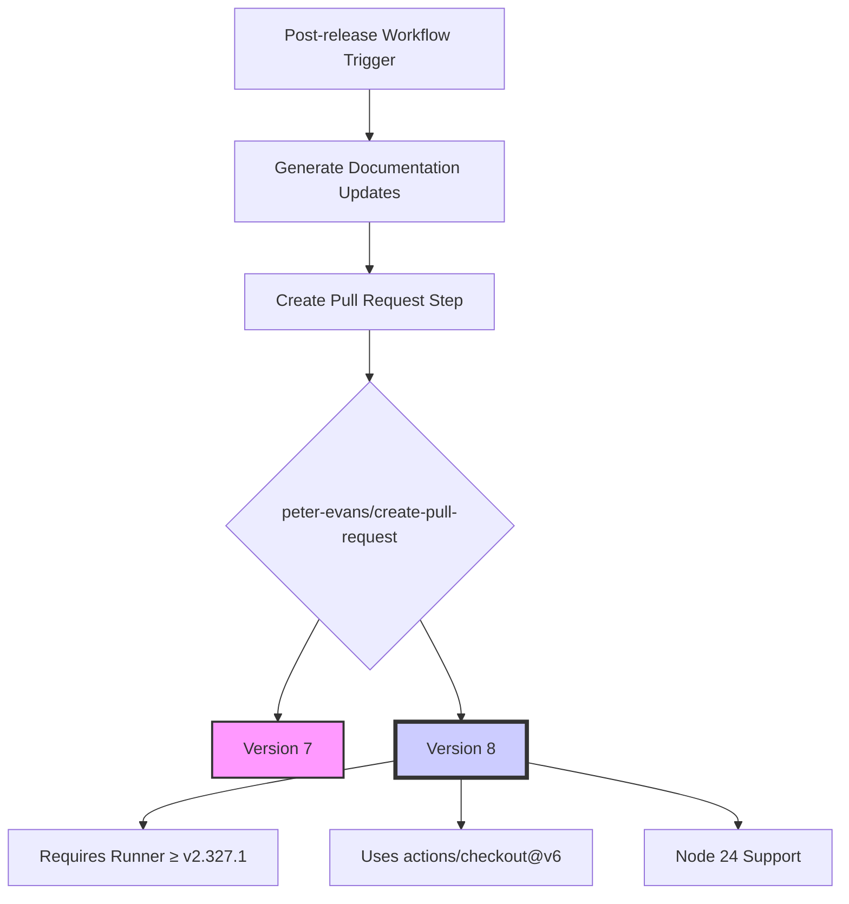

+++
title = "#22119 Bump peter-evans/create-pull-request from 7 to 8"
date = "2025-12-18T00:00:00"
draft = false
template = "pull_request_page.html"
in_search_index = true

[taxonomies]
list_display = ["show"]

[extra]
current_language = "en"
available_languages = {"en" = { name = "English", url = "/pull_request/bevy/2025-12/pr-22119-en-20251218" }, "zh-cn" = { name = "中文", url = "/pull_request/bevy/2025-12/pr-22119-zh-cn-20251218" }}
labels = ["A-Build-System", "C-Dependencies", "D-Straightforward"]
+++

# Title

## Basic Information
- **Title**: Bump peter-evans/create-pull-request from 7 to 8
- **PR Link**: https://github.com/bevyengine/bevy/pull/22119
- **Author**: app/dependabot
- **Status**: MERGED
- **Labels**: A-Build-System, C-Dependencies, S-Ready-For-Final-Review, X-Uncontroversial, D-Straightforward
- **Created**: 2025-12-15T06:01:01Z
- **Merged**: 2025-12-18T19:12:44Z
- **Merged By**: alice-i-cecile

## Description Translation
Bumps [peter-evans/create-pull-request](https://github.com/peter-evans/create-pull-request) from 7 to 8.
<details>
<summary>Release notes</summary>
<p><em>Sourced from <a href="https://github.com/peter-evans/create-pull-request/releases">peter-evans/create-pull-request's releases</a>.</em></p>
<blockquote>
<h2>Create Pull Request v8.0.0</h2>
<h2>What's new in v8</h2>
<ul>
<li>Requires <a href="https://github.com/actions/runner/releases/tag/v2.327.1">Actions Runner v2.327.1</a> or later if you are using a self-hosted runner for Node 24 support.</li>
</ul>
<h2>What's Changed</h2>
<ul>
<li>chore: Update checkout action version to v6 by <a href="https://github.com/yonas"><code>@​yonas</code></a> in <a href="https://redirect.github.com/peter-evans/create-pull-request/pull/4258">peter-evans/create-pull-request#4258</a></li>
<li>Update actions/checkout references to <a href="https://github.com/v6"><code>@​v6</code></a> in docs by <a href="https://github.com/Copilot"><code>@​Copilot</code></a> in <a href="https://redirect.github.com/peter-evans/create-pull-request/pull/4259">peter-evans/create-pull-request#4259</a></li>
<li>feat: v8 by <a href="https://github.com/peter-evans"><code>@​peter-evans</code></a> in <a href="https://redirect.github.com/peter-evans/create-pull-request/pull/4260">peter-evans/create-pull-request#4260</a></li>
</ul>
<h2>New Contributors</h2>
<ul>
<li><a href="https://github.com/yonas"><code>@​yonas</code></a> made their first contribution in <a href="https://redirect.github.com/peter-evans/create-pull-request/pull/4258">peter-evans/create-pull-request#4258</a></li>
<li><a href="https://github.com/Copilot"><code>@​Copilot</code></a> made their first contribution in <a href="https://redirect.github.com/peter-evans/create-pull-request/pull/4259">peter-evans/create-pull-request#4259</a></li>
</ul>
<p><strong>Full Changelog</strong>: <a href="https://github.com/peter-evans/create-pull-request/compare/v7.0.11...v8.0.0">https://github.com/peter-evans/create-pull-request/compare/v7.0.11...v8.0.0</a></p>
<h2>Create Pull Request v7.0.11</h2>
<h2>What's Changed</h2>
<ul>
<li>fix: restrict remote prune to self-hosted runners by <a href="https://github.com/peter-evans"><code>@​peter-evans</code></a> in <a href="https://redirect.github.com/peter-evans/create-pull-request/pull/4250">peter-evans/create-pull-request#4250</a></li>
</ul>
<p><strong>Full Changelog</strong>: <a href="https://github.com/peter-evans/create-pull-request/compare/v7.0.10...v7.0.11">https://github.com/peter-evans/create-pull-request/compare/v7.0.10...v7.0.11</a></p>
<h2>Create Pull Request v7.0.10</h2>
<p>⚙️ Fixes an issue where updating a pull request failed when targeting a forked repository with the same owner as its parent.</p>
<h2>What's Changed</h2>
<ul>
<li>build(deps): bump the github-actions group with 2 updates by <a href="https://github.com/dependabot"><code>@​dependabot</code></a>[bot] in <a href="https://redirect.github.com/peter-evans/create-pull-request/pull/4235">peter-evans/create-pull-request#4235</a></li>
<li>build(deps-dev): bump prettier from 3.6.2 to 3.7.3 in the npm group by <a href="https://github.com/dependabot"><code>@​dependabot</code></a>[bot] in <a href="https://redirect.github.com/peter-evans/create-pull-request/pull/4240">peter-evans/create-pull-request#4240</a></li>
<li>fix: provider list pulls fallback for multi fork same owner by <a href="https://github.com/peter-evans"><code>@​peter-evans</code></a> in <a href="https://redirect.github.com/peter-evans/create-pull-request/pull/4245">peter-evans/create-pull-request#4245</a></li>
</ul>
<h2>New Contributors</h2>
<ul>
<li><a href="https://github.com/obnyis"><code>@​obnyis</code></a> made their first contribution in <a href="https://redirect.github.com/peter-evans/create-pull-request/pull/4064">peter-evans/create-pull-request#4064</a></li>
</ul>
<p><strong>Full Changelog</strong>: <a href="https://github.com/peter-evans/create-pull-request/compare/v7.0.9...v7.0.10">https://github.com/peter-evans/create-pull-request/compare/v7.0.9...v7.0.10</a></p>
<h2>Create Pull Request v7.0.9</h2>
<p>⚙️ Fixes an <a href="https://redirect.github.com/peter-evans/create-pull-request/issues/4228">incompatibility</a> with the recently released <code>actions/checkout@v6</code>.</p>
<h2>What's Changed</h2>
<ul>
<li>~70 dependency updates by <a href="https://github.com/dependabot"><code>@​dependabot</code></a></li>
<li>docs: fix workaround description about <code>ready_for_review</code> by <a href="https://github.com/ybiquitous"><code>@​ybiquitous</code></a> in <a href="https://redirect.github.com/peter-evans/create-pull-request/pull/3939">peter-evans/create-pull-request#3939</a></li>
<li>Docs: <code>add-paths</code> default behavior by <a href="https://github.com/joeflack4"><code>@​joeflack4</code></a> in <a href="https://redirect.github.com/peter-evans/create-pull-request/pull/3928">peter-evans/create-pull-request#3928</a></li>
<li>docs: update to create-github-app-token v2 by <a href="https://github.com/Goooler"><code>@​Goooler</code></a> in <a href="https://redirect.github.com/peter-evans/create-pull-request/pull/4063">peter-evans/create-pull-request#4063</a></li>
<li>Fix compatibility with actions/checkout@v6 by <a href="https://github.com/ericsciple"><code>@​ericsciple</code></a> in <a href="https://redirect.github.com/peter-evans/create-pull-request/pull/4230">peter-evans/create-pull-request#4230</a></li>
</ul>
<h2>New Contributors</h2>
<ul>
<li><a href="https://github.com/joeflack4"><code>@​joeflack4</code></a> made their first contribution in <a href="https://redirect.github.com/peter-evans/create-pull-request/pull/3928">peter-evans/create-pull-request#3928</a></li>
<li><a href="https://github.com/Goooler"><code>@​Goooler</code></a> made their first contribution in <a href="https://redirect.github.com/peter-evans/create-pull-request/pull/4063">peter-evans/create-pull-request#4063</a></li>
<li><a href="https://github.com/ericsciple"><code>@​ericsciple</code></a> made their first contribution in <a href="https://redirect.github.com/peter-evans/create-pull-request/pull/4230">peter-evans/create-pull-request#4230</a></li>
</ul>
<!-- raw HTML omitted -->
</blockquote>
<p>... (truncated)</p>
</details>
<details>
<summary>Commits</summary>
<ul>
<li><a href="https://github.com/peter-evans/create-pull-request/commit/98357b18bf14b5342f975ff684046ec3b2a07725"><code>98357b1</code></a> feat: v8 (<a href="https://redirect.github.com/peter-evans/create-pull-request/issues/4260">#4260</a>)</li>
<li><a href="https://github.com/peter-evans/create-pull-request/commit/41c0e4b7899a4a0922bf899d64c5f25738cfe356"><code>41c0e4b</code></a> Update actions/checkout references to <a href="https://github.com/v6"><code>@​v6</code></a> in docs (<a href="https://redirect.github.com/peter-evans/create-pull-request/issues/4259">#4259</a>)</li>
<li><a href="https://github.com/peter-evans/create-pull-request/commit/994332de4c8124517167807167073cf397678768"><code>994332d</code></a> chore: Update checkout action version to v6 (<a href="https://redirect.github.com/peter-evans/create-pull-request/issues/4258">#4258</a>)</li>
<li>See full diff in <a href="https://github.com/peter-evans/create-pull-request/compare/v7...v8">compare view</a></li>
</ul>
</details>
<br />


[](https://docs.github.com/en/github/managing-security-vulnerabilities/about-dependabot-security-updates#about-compatibility-scores)

Dependabot will resolve any conflicts with this PR as long as you don't alter it yourself. You can also trigger a rebase manually by commenting `@dependabot rebase`.

[//]: # (dependabot-automerge-start)
[//]: # (dependabot-automerge-end)

---

<details>
<summary>Dependabot commands and options</summary>
<br />

You can trigger Dependabot actions by commenting on this PR:
- `@dependabot rebase` will rebase this PR
- `@dependabot recreate` will recreate this PR, overwriting any edits that have been made to it
- `@dependabot merge` will merge this PR after your CI passes on it
- `@dependabot squash and merge` will squash and merge this PR after your CI passes on it
- `@dependabot cancel merge` will cancel a previously requested merge and block automerging
- `@dependabot reopen` will reopen this PR if it is closed
- `@dependabot close` will close this PR and stop Dependabot recreating it. You can achieve the same result by closing it manually
- `@dependabot show <dependency name> ignore conditions` will show all of the ignore conditions of the specified dependency
- `@dependabot ignore this major version` will close this PR and stop Dependabot creating any more for this major version (unless you reopen the PR or upgrade to it yourself)
- `@dependabot ignore this minor version` will close this PR and stop Dependabot creating any more for this minor version (unless you reopen the PR or upgrade to it yourself)
- `@dependabot ignore this dependency` will close this PR and stop Dependabot creating any more for this dependency (unless you reopen the PR or upgrade to it yourself)


</details>

## The Story of This Pull Request

This is a straightforward dependency update PR generated by Dependabot. The change updates the `peter-evans/create-pull-request` GitHub Action from version 7 to version 8 in Bevy's post-release workflow.

The post-release workflow is triggered after new releases to automate the process of updating version references in documentation and examples. It uses the `create-pull-request` action to automatically generate a PR with these updates. This automation ensures that documentation stays current without requiring manual intervention from maintainers.

The update from v7 to v8 is a major version bump, which typically indicates breaking changes. According to the release notes, the primary change in v8 is the requirement for Actions Runner v2.327.1 or later when using self-hosted runners, due to Node 24 support. For GitHub-hosted runners, this requirement is automatically satisfied, so the impact on Bevy's workflow is minimal.

The version update also includes internal updates within the action itself, particularly updating its own dependency on `actions/checkout` to v6. This ensures compatibility with the latest versions of GitHub's core actions. The v7.0.9 release of `create-pull-request` specifically addressed an incompatibility with `actions/checkout@v6`, so moving to v8 maintains this compatibility.

This type of dependency update is routine maintenance. Dependabot automatically monitors dependencies and creates PRs when new versions are available. The Bevy maintainers have labeled this PR as "Uncontroversial" and "Straightforward," indicating it's a safe update that follows standard practices. The PR was merged after three days, which is typical for dependency updates that don't require extensive testing beyond the existing CI pipeline.

## Visual Representation



## Key Files Changed

### `.github/workflows/post-release.yml`

This workflow file runs after releases to update version references in documentation. The change updates the GitHub Action used to create the pull request.

**Change summary**: Updated the `peter-evans/create-pull-request` action from version 7 to version 8.

**Code diff**:
```yaml
# File: .github/workflows/post-release.yml
# Before:
      - name: Create PR
        uses: peter-evans/create-pull-request@v7
        with:
          delete-branch: true
          base: "main"

# After:
      - name: Create PR
        uses: peter-evans/create-pull-request@v8
        with:
          delete-branch: true
          base: "main"
```

**Impact**: This update ensures the workflow uses the latest version of the action with Node 24 support and compatibility with `actions/checkout@v6`. The change is minimal and doesn't affect the workflow's functionality or configuration.

## Further Reading

- [peter-evans/create-pull-request GitHub Action](https://github.com/peter-evans/create-pull-request) - Official repository and documentation for the action
- [GitHub Actions Versioning](https://docs.github.com/en/actions/using-workflows/workflow-syntax-for-github-actions#jobsjob_idstepsuses) - How to version actions in workflows
- [Dependabot Version Updates](https://docs.github.com/en/code-security/dependabot/dependabot-version-updates/about-dependabot-version-updates) - How Dependabot manages dependency updates
- [GitHub Actions Runners](https://docs.github.com/en/actions/hosting-your-own-runners/managing-self-hosted-runners/about-self-hosted-runners) - Information about self-hosted runners and version requirements

# Full Code Diff
```diff
diff --git a/.github/workflows/post-release.yml b/.github/workflows/post-release.yml
index def99f3466148..a70d79e39abe5 100644
--- a/.github/workflows/post-release.yml
+++ b/.github/workflows/post-release.yml
@@ -53,7 +53,7 @@ jobs:
             --exclude no_std_library
 
       - name: Create PR
-        uses: peter-evans/create-pull-request@v7
+        uses: peter-evans/create-pull-request@v8
         with:
           delete-branch: true
           base: "main"
```