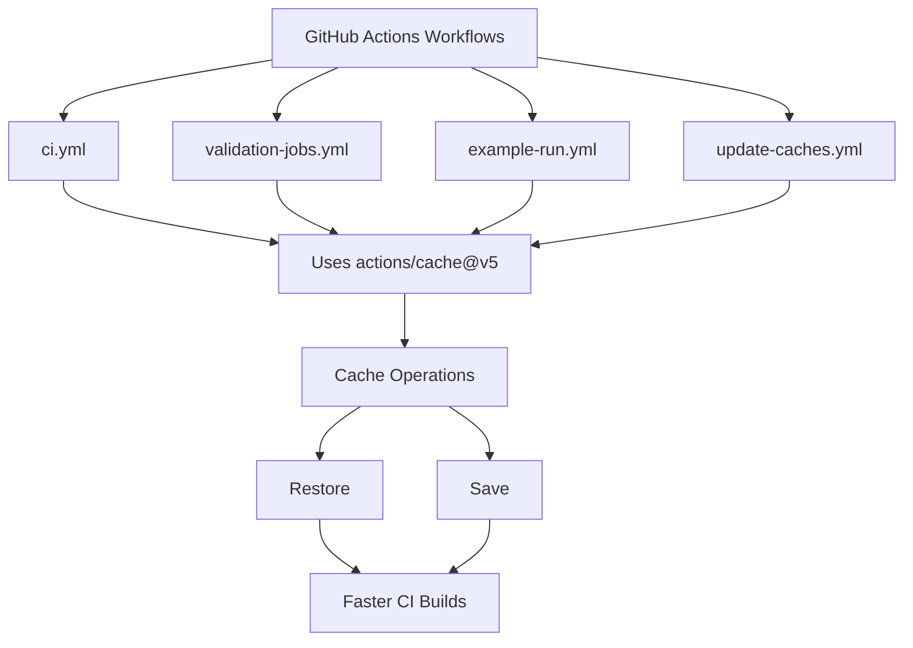

+++
title = "#22120 Bump actions/cache from 4 to 5"
date = "2025-12-17T00:00:00"
draft = false
template = "pull_request_page.html"
in_search_index = true

[taxonomies]
list_display = ["show"]

[extra]
current_language = "en"
available_languages = {"en" = { name = "English", url = "/pull_request/bevy/2025-12/pr-22120-en-20251217" }, "zh-cn" = { name = "中文", url = "/pull_request/bevy/2025-12/pr-22120-zh-cn-20251217" }}
labels = ["A-Build-System", "C-Dependencies"]
+++

# Title
## Basic Information
- **Title**: Bump actions/cache from 4 to 5
- **PR Link**: https://github.com/bevyengine/bevy/pull/22120
- **Author**: app/dependabot
- **Status**: MERGED
- **Labels**: A-Build-System, C-Dependencies, S-Ready-For-Final-Review
- **Created**: 2025-12-15T06:01:09Z
- **Merged**: 2025-12-17T19:40:07Z
- **Merged By**: alice-i-cecile

## Description Translation
The PR description is already in English.

## The Story of This Pull Request

This PR represents a routine but important infrastructure maintenance task. It updates GitHub Actions workflows to use version 5 of the `actions/cache` action instead of version 4. This is an automated dependency update performed by Dependabot, GitHub's automated dependency management tool.

The primary motivation for this update is to stay current with the latest version of a widely-used caching action. Version 5 introduces a significant runtime change: it requires Node.js 24 and a minimum Actions Runner version of 2.327.1. For teams using self-hosted runners, this would require updating their runners before upgrading. However, for Bevy's GitHub-hosted runners, this requirement is automatically satisfied by GitHub's infrastructure.

The changelog shows that version 5.0.0 primarily involves upgrading to Node.js 24 runtime. The previous version 4.3.0 had already introduced a rewritten cache backend service (v2) that improved performance and reliability. This backend rewrite was backward compatible but required upgrading before February 1, 2025, when the legacy service would be sunset. By upgrading to version 5, Bevy ensures it remains on a supported version of the cache action.

From a technical perspective, the changes are straightforward: update all references to `actions/cache/restore@v4` and `actions/cache/save@v4` to use `@v5` instead. The PR modifies four workflow files that collectively manage Bevy's CI/CD pipeline. These workflows handle continuous integration, example runs, cache updates, and various validation jobs.

The implementation approach is consistent across all files. Each instance follows the same pattern: changing the version specifier from `@v4` to `@v5`. No other parameters or configurations need adjustment because the cache action maintains backward compatibility in its API. The cache keys, paths, and restore logic remain unchanged.

One technical consideration is that `actions/cache@v5` runs on Node.js 24, which may have different behavior than previous Node.js versions. However, since this is a widely-used GitHub-maintained action, any breaking changes would be well-documented and likely minimal. The compatibility score shown in the PR description (via the Dependabot badge) indicates high compatibility between versions 4 and 5.

The impact of this change is primarily operational: Bevy's CI/CD pipeline will use the newer, more performant cache service with better reliability. For developers, this should translate to slightly faster CI runs due to improved cache performance. The change also future-proofs the workflow by ensuring compatibility with upcoming GitHub Actions features that may depend on newer runner versions.

This type of maintenance is essential for any project using GitHub Actions. Staying current with action versions ensures access to security updates, performance improvements, and bug fixes. Automated tools like Dependabot help reduce the manual maintenance burden while keeping dependencies up-to-date.

## Visual Representation



## Key Files Changed

### 1. `.github/workflows/ci.yml` (+11/-11)
This is Bevy's main CI workflow. The file contains multiple jobs that build and test the project. Each job that uses cache operations was updated from version 4 to version 5.

**Key changes:**
```yaml
# Multiple instances throughout the file
# Before:
- uses: actions/cache/restore@v4

# After:
- uses: actions/cache/restore@v5
```

### 2. `.github/workflows/validation-jobs.yml` (+5/-5)
This workflow handles specialized validation jobs for different platforms (iOS, Android, WebAssembly, etc.). Each job uses cache restoration to speed up builds.

**Example change:**
```yaml
# Before:
- uses: actions/cache/restore@v4
  with:
    # key won't match, will rely on restore-keys
    key: ${{ runner.os }}-stable-aarch64-apple-ios-sim-${{ hashFiles('**/Cargo.toml') }}-

# After:
- uses: actions/cache/restore@v5
  with:
    # key won't match, will rely on restore-keys
    key: ${{ runner.os }}-stable-aarch64-apple-ios-sim-${{ hashFiles('**/Cargo.toml') }}-
```

### 3. `.github/workflows/example-run.yml` (+3/-3)
This workflow runs Bevy examples to ensure they build and execute correctly. It uses cache operations to avoid rebuilding dependencies.

**Example change:**
```yaml
# Before:
- uses: actions/cache/restore@v4
  with:
    # key won't match, will rely on restore-keys
    key: ${{ runner.os }}-stable--${{ hashFiles('**/Cargo.toml') }}-

# After:
- uses: actions/cache/restore@v5
  with:
    # key won't match, will rely on restore-keys
    key: ${{ runner.os }}-stable--${{ hashFiles('**/Cargo.toml') }}-
```

### 4. `.github/workflows/update-caches.yml` (+2/-2)
This workflow updates the caches used by other workflows. It's unique in that it uses both `restore` and `save` operations.

**Key changes:**
```yaml
# Restore operation
# Before:
- uses: actions/cache/restore@v4

# After:
- uses: actions/cache/restore@v5

# Save operation
# Before:
- uses: actions/cache/save@v4

# After:
- uses: actions/cache/save@v5
```

## Further Reading
- [GitHub Actions Cache documentation](https://docs.github.com/en/actions/using-workflows/caching-dependencies-to-speed-up-workflows)
- [actions/cache GitHub repository](https://github.com/actions/cache)
- [Dependabot documentation for GitHub Actions](https://docs.github.com/en/code-security/dependabot/dependabot-version-updates/about-dependabot-version-updates)

# Full Code Diff
The full diff is provided in the original request.