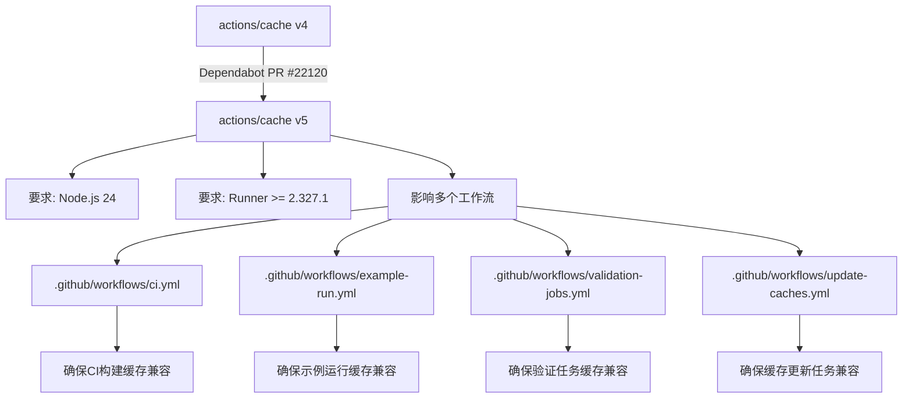

+++
title = "#22120 Bump actions/cache from 4 to 5"
date = "2025-12-17T00:00:00"
draft = false
template = "pull_request_page.html"
in_search_index = false

[extra]
current_language = "zh-cn"
available_languages = {"en" = { name = "English", url = "/pull_request/bevy/2025-12/pr-22120-en-20251217" }, "zh-cn" = { name = "中文", url = "/pull_request/bevy/2025-12/pr-22120-zh-cn-20251217" }}
+++

# Bump actions/cache from 4 to 5

## 基本信息
- **标题**: Bump actions/cache from 4 to 5
- **PR链接**: https://github.com/bevyengine/bevy/pull/22120
- **作者**: app/dependabot
- **状态**: 已合并
- **标签**: A-Build-System, C-Dependencies, S-Ready-For-Final-Review
- **创建时间**: 2025-12-15T06:01:09Z
- **合并时间**: 2025-12-17T19:40:07Z
- **合并者**: alice-i-cecile

## 描述翻译
将 [actions/cache](https://github.com/actions/cache) 从版本 4 升级到 5。
<details>
<summary>发行说明</summary>
<p><em>源自 <a href="https://github.com/actions/cache/releases">actions/cache 的发布页面</a>.</em></p>
<blockquote>
<h2>v5.0.0</h2>
<blockquote>
<p>[!重要]
<strong><code>actions/cache@v5</code> 运行在 Node.js 24 运行时上，并且要求 Actions Runner 的最低版本为 <code>2.327.1</code>。</strong></p>
<p>如果您使用的是自托管运行器（self-hosted runners），请在升级前确保它们已更新。</p>
</blockquote>
<hr />
<h2>更新内容</h2>
<ul>
<li>通过 <a href="https://github.com/salmanmkc"><code>@​salmanmkc</code></a> 在 <a href="https://redirect.github.com/actions/cache/pull/1630">actions/cache#1630</a> 中升级到使用 node24</li>
<li>通过 <a href="https://github.com/salmanmkc"><code>@​salmanmkc</code></a> 在 <a href="https://redirect.github.com/actions/cache/pull/1684">actions/cache#1684</a> 中准备 v5.0.0 发布</li>
</ul>
<p><strong>完整更新日志</strong>: <a href="https://github.com/actions/cache/compare/v4.3.0...v5.0.0">https://github.com/actions/cache/compare/v4.3.0...v5.0.0</a></p>
<h2>v4.3.0</h2>
<h2>更新内容</h2>
<ul>
<li>通过 <a href="https://github.com/GhadimiR"><code>@​GhadimiR</code></a> 在 <a href="https://redirect.github.com/actions/cache/pull/1642">actions/cache#1642</a> 中添加关于运行器版本的说明</li>
<li>通过 <a href="https://github.com/Link"><code>@​Link</code></a>- 在 <a href="https://redirect.github.com/actions/cache/pull/1655">actions/cache#1655</a> 中准备 <code>v4.3.0</code> 发布</li>
</ul>
<h2>新贡献者</h2>
<ul>
<li><a href="https://github.com/GhadimiR"><code>@​GhadimiR</code></a> 在 <a href="https://redirect.github.com/actions/cache/pull/1642">actions/cache#1642</a> 中做出了首次贡献</li>
</ul>
<p><strong>完整更新日志</strong>: <a href="https://github.com/actions/cache/compare/v4...v4.3.0">https://github.com/actions/cache/compare/v4...v4.3.0</a></p>
<h2>v4.2.4</h2>
<h2>更新内容</h2>
<ul>
<li>通过 <a href="https://github.com/nebuk89"><code>@​nebuk89</code></a> 在 <a href="https://redirect.github.com/actions/cache/pull/1620">actions/cache#1620</a> 中更新 README.md</li>
<li>通过 <a href="https://github.com/Link"><code>@​Link</code></a>- 在 <a href="https://redirect.github.com/actions/cache/pull/1634">actions/cache#1634</a> 中将 <code>@actions/cache</code> 升级到 <code>4.0.5</code> 并将 <code>@protobuf-ts/plugin</code> 移至开发依赖</li>
<li>通过 <a href="https://github.com/Link"><code>@​Link</code></a>- 在 <a href="https://redirect.github.com/actions/cache/pull/1636">actions/cache#1636</a> 中准备发布 <code>4.2.4</code></li>
</ul>
<h2>新贡献者</h2>
<ul>
<li><a href="https://github.com/nebuk89"><code>@​nebuk89</code></a> 在 <a href="https://redirect.github.com/actions/cache/pull/1620">actions/cache#1620</a> 中做出了首次贡献</li>
</ul>
<p><strong>完整更新日志</strong>: <a href="https://github.com/actions/cache/compare/v4...v4.2.4">https://github.com/actions/cache/compare/v4...v4.2.4</a></p>
<h2>v4.2.3</h2>
<h2>更新内容</h2>
<ul>
<li>通过 <a href="https://github.com/salmanmkc"><code>@​salmanmkc</code></a> 在 <a href="https://redirect.github.com/actions/cache/pull/1577">actions/cache#1577</a> 中更新为使用 <code>@​actions/cache</code> 4.0.3 包并准备新版本发布（现在调试日志中会屏蔽缓存条目的 SAS tokens）</li>
</ul>
<h2>新贡献者</h2>
<ul>
<li><a href="https://github.com/salmanmkc"><code>@​salmanmkc</code></a> 在 <a href="https://redirect.github.com/actions/cache/pull/1577">actions/cache#1577</a> 中做出了首次贡献</li>
</ul>
<p><strong>完整更新日志</strong>: <a href="https://github.com/actions/cache/compare/v4.2.2...v4.2.3">https://github.com/actions/cache/compare/v4.2.2...v4.2.3</a></p>
<!-- 原始 HTML 已省略 -->
</blockquote>
<p>... (内容已截断)</p>
</details>
<details>
<summary>更新日志</summary>
<p><em>源自 <a href="https://github.com/actions/cache/blob/main/RELEASES.md">actions/cache 的更新日志</a>。</em></p>
<blockquote>
<h1>版本发布</h1>
<h2>更新日志</h2>
<h3>5.0.1</h3>
<ul>
<li>通过 <code>@actions/cache@5.0.1</code> 更新 <code>@azure/storage-blob</code> 到 <code>^12.29.1</code> <a href="https://redirect.github.com/actions/cache/pull/1685">#1685</a></li>
</ul>
<h3>5.0.0</h3>
<blockquote>
<p>[!重要]
<code>actions/cache@v5</code> 运行在 Node.js 24 运行时上，并且要求 Actions Runner 的最低版本为 <code>2.327.1</code>。
如果您使用的是自托管运行器，请在升级前确保它们已更新。</p>
</blockquote>
<h3>4.3.0</h3>
<ul>
<li>将 <code>@actions/cache</code> 提升至 <a href="https://redirect.github.com/actions/toolkit/pull/2132">v4.1.0</a></li>
</ul>
<h3>4.2.4</h3>
<ul>
<li>将 <code>@actions/cache</code> 提升至 v4.0.5</li>
</ul>
<h3>4.2.3</h3>
<ul>
<li>将 <code>@actions/cache</code> 提升至 v4.0.3（在调试日志中模糊化缓存条目的 SAS token）</li>
</ul>
<h3>4.2.2</h3>
<ul>
<li>将 <code>@actions/cache</code> 提升至 v4.0.2</li>
</ul>
<h3>4.2.1</h3>
<ul>
<li>将 <code>@actions/cache</code> 提升至 v4.0.1</li>
</ul>
<h3>4.2.0</h3>
<p>简而言之：缓存后端服务已从头重写，以提高性能和可靠性。<a href="https://github.com/actions/cache">actions/cache</a> 现在集成了新的缓存服务（v2）API。</p>
<p>新服务将于 <strong>2025年2月1日</strong> 起逐步推出。旧版服务也将在同一天停止服务。此版本的更改是 <strong>完全向后兼容的</strong>。</p>
<p><strong>我们正在弃用此操作的某些版本</strong>。我们建议在 <strong>2025年2月1日</strong> 之前尽快升级到版本 <code>v4</code> 或 <code>v3</code>。（升级说明如下）。</p>
<p>如果您使用的是固定的 SHA，请使用 <code>v4.2.0</code> 或 <code>v3.4.0</code> 版本的 SHA</p>
<p>如果您不升级，所有使用任何已弃用 <a href="https://github.com/actions/cache">actions/cache</a> 的工作流程运行都将失败。</p>
<p>升级到推荐版本不会破坏您的工作流程。</p>
<h3>4.1.2</h3>
<!-- 原始 HTML 已省略 -->
</blockquote>
<p>... (内容已截断)</p>
</details>
<details>
<summary>提交记录</summary>
<ul>
<li><a href="https://github.com/actions/cache/commit/9255dc7a253b0ccc959486e2bca901246202afeb"><code>9255dc7</code></a> 合并拉取请求 <a href="https://redirect.github.com/actions/cache/issues/1686">#1686</a> 来自 actions/cache-v5.0.1-release</li>
<li><a href="https://github.com/actions/cache/commit/8ff5423e8b66eacab4e638ee52abbd2cb831366a"><code>8ff5423</code></a> chore: 发布 v5.0.1</li>
<li><a href="https://github.com/actions/cache/commit/9233019a152bc768059ac1768b8e4403b5da16c1"><code>9233019</code></a> 合并拉取请求 <a href="https://redirect.github.com/actions/cache/issues/1685">#1685</a> 来自 salmanmkc/node24-storage-blob-fix</li>
<li><a href="https://github.com/actions/cache/commit/b975f2bb844529e1063ad882c609b224bcd66eb6"><code>b975f2b</code></a> fix: 为依赖项向 package-lock.json 添加 peer 属性</li>
<li><a href="https://github.com/actions/cache/commit/d0a0e1813491d01d574c95f8d189f62622bbb2ae"><code>d0a0e18</code></a> fix: 更新 <code>@​actions/cache</code>、fast-xml-parser 和 strnum 的许可证文件</li>
<li><a href="https://github.com/actions/cache/commit/74de208dcfcbe85c0e7154e7b17e4105fe2554ff"><code>74de208</code></a> fix: 将 <code>@​actions/cache</code> 更新至 ^5.0.1 以修复 Node.js 24 punycode 问题</li>
<li><a href="https://github.com/actions/cache/commit/ac7f1152ead02e89c14b5456d14ab17591e74cfb"><code>ac7f115</code></a> peer</li>
<li><a href="https://github.com/actions/cache/commit/b0f846b50b6061d7a2ca6f1a2fea61d4a65d1a16"><code>b0f846b</code></a> fix: 更新 <code>@​actions/cache</code>，包含针对 Node.js 24 punycode 废弃问题的 storage-blob 修复...</li>
<li><a href="https://github.com/actions/cache/commit/a7833574556fa59680c1b7cb190c1735db73ebf0"><code>a783357</code></a> 合并拉取请求 <a href="https://redirect.github.com/actions/cache/issues/1684">#1684</a> 来自 actions/prepare-cache-v5-release</li>
<li><a href="https://github.com/actions/cache/commit/3bb0d78750a39cefce0c2b5a0a9801052b4359ad"><code>3bb0d78</code></a> docs: 在发布说明中强调 v5 对运行器的要求</li>
<li>其他提交记录可在 <a href="https://github.com/actions/cache/compare/v4...v5">比较视图</a> 中查看</li>
</ul>
</details>
<br />


[](https://docs.github.com/en/github/managing-security-vulnerabilities/about-dependabot-security-updates#about-compatibility-scores)

Dependabot 会在您不自行修改此 PR 的情况下解决任何冲突。您也可以通过评论 `@dependabot rebase` 手动触发变基。

[//]: # (dependabot-automerge-start)
[//]: # (dependabot-automerge-end)

---

<details>
<summary>Dependabot 命令和选项</summary>
<br />

您可以通过评论此 PR 来触发 Dependabot 操作：
- `@dependabot rebase` 将对此 PR 进行变基
- `@dependabot recreate` 将重新创建此 PR，覆盖已对其进行的任何编辑
- `@dependabot merge` 将在您的 CI 通过后合并此 PR
- `@dependabot squash and merge` 将在您的 CI 通过后压缩并合并此 PR
- `@dependabot cancel merge` 将取消先前请求的合并并阻止自动合并
- `@dependabot reopen` 将重新打开此 PR（如果已关闭）
- `@dependabot close` 将关闭此 PR 并阻止 Dependabot 重新创建它。您可以通过手动关闭它来达到相同的结果
- `@dependabot show <dependency name> ignore conditions` 将显示指定依赖项的所有忽略条件
- `@dependabot ignore this major version` 将关闭此 PR 并阻止 Dependabot 为此主要版本创建更多 PR（除非您重新打开 PR 或自行升级到该版本）
- `@dependabot ignore this minor version` 将关闭此 PR 并阻止 Dependabot 为此次要版本创建更多 PR（除非您重新打开 PR 或自行升级到该版本）
- `@dependabot ignore this dependency` 将关闭此 PR 并阻止 Dependabot 为此依赖项创建更多 PR（除非您重新打开 PR 或自行升级到该版本）

</details>

## 这个 Pull Request 的故事

这个由 Dependabot 自动生成的 PR，核心任务很明确：将 GitHub Actions 工作流中使用的 `actions/cache` 依赖从主版本 v4 升级到 v5。对于像 Bevy 这样依赖复杂 CI（持续集成）流程的大型 Rust 项目，构建缓存是提升开发效率、缩短反馈周期的关键基础设施。这次升级虽然看起来只是修改了几个版本号，但它连接着底层运行时环境的重要变迁，并需要确保整个构建生态的兼容性。

**问题与背景：保持 CI 基础设施的现代化与安全性**
`actions/cache` 是 GitHub Actions 生态中用于缓存构建产物（如 Rust 的 `target` 目录、依赖包等）的核心官方 Action。长期使用旧版本存在几个潜在风险：首先是错过性能与可靠性改进（如 v4.2.0 提到的后端服务重写）。其次，随着 Node.js 等底层技术的版本迭代，官方会逐步停止对旧运行时的支持。本次 v5 升级最主要的变化是要求运行在 **Node.js 24** 运行时上，并且 **GitHub Actions Runner 版本至少为 2.327.1**。对于使用 GitHub 托管的运行器（GitHub-hosted runners）的用户，这一般是自动满足的。但对于项目或组织内部使用的**自托管运行器（self-hosted runners）**，则需要管理员手动更新 Runner 版本，否则升级后工作流会因环境不兼容而失败。因此，这次升级不仅是一个简单的依赖更新，更是一次需要协调基础设施的兼容性维护操作。

**解决方案：直接升级版本并依赖自动化验证**
Bevy 项目维护者采取的解决方案非常直接：接受 Dependabot 的建议，将所有工作流文件中引用的 `actions/cache` 版本从 `@v4` 统一更新为 `@v5`。这是一个低风险的操作，因为 `actions/cache` v5 在设计上是完全向后兼容的，其公共 API（即工作流 YAML 文件中的 `with` 参数）没有破坏性变更。项目的 CI 流水线本身成为了这次升级的最佳测试场。当 PR 被创建并触发 CI 运行时，所有相关的工作流（如 `ci`, `example-run` 等）都会使用新版本的 `actions/cache` 执行。如果任何环节出现不兼容问题，CI 会失败，从而暴露出问题。在 PR 描述中，维护者 alice-i-cecile 的合并操作本身也意味着所有 CI 检查都已通过，验证了升级在 Bevy 现有环境下的有效性。

**实现细节：规模化的一致性变更**
实现本身是机械性的，但体现了规模化管理。PR 修改了四个 `.github/workflows/` 目录下的 YAML 文件，总共涉及 **21 处**完全相同的文本替换：将 `uses: actions/cache/restore@v4` 和 `uses: actions/cache/save@v4` 中的 `v4` 改为 `v5`。这种改动模式正是依赖管理自动化工具（如 Dependabot）的优势所在：快速、准确地在多个文件中进行相同模式的更改。重要的是，所有缓存项的**键（key）** 和**路径（path）** 配置都保持不变，这保证了缓存命中的连续性，升级后依然可以复用之前 v4 创建的缓存，避免了因升级导致的全局缓存失效和重建。

例如，在核心的 `ci.yml` 工作流中，多个作业（job）的第一步都从缓存恢复依赖：
```yaml
# 文件: .github/workflows/ci.yml
# 修改前:
      - uses: actions/cache/restore@v4

# 修改后:
      - uses: actions/cache/restore@v5
```
在 `update-caches.yml` 中，保存缓存的步骤也同步升级：
```yaml
# 文件: .github/workflows/update-caches.yml
# 修改前:
        uses: actions/cache/save@v4

# 修改后:
        uses: actions/cache/save@v5
```

**技术要点：理解语义化版本与 CI 依赖管理**
这次升级演示了如何管理基础设施即代码（IaC）中的依赖。`actions/cache` 遵循语义化版本控制（SemVer）。从 v4 到 v5 是一个主版本号升级，按照 SemVer 规范，它可以包含不兼容的 API 修改。实际上，v5 的不兼容性并非体现在工作流 YAML 的 API 层面，而是体现在**运行时环境要求**（Node.js 24）上。这提醒我们，在 CI/CD 上下文中，“依赖”的含义更广，不仅包括接口调用，还包括执行环境。另一个要点是，此类更新最好通过 Dependabot 等自动化工具在非关键时期提出，并立即通过完整的 CI 流程进行验证，将风险控制在单个 PR 内。

**影响与总结**
此次升级成功将 Bevy 项目的 CI 缓存基础设施更新到了最新版本，使其能够受益于新版本可能带来的性能提升和长期支持。合并后，所有后续的 Pull Request 和主干构建都将自动使用 `actions/cache@v5`。对于 Bevy 团队和社区贡献者来说，这一变更是透明的，不会影响他们的开发工作流。最大的实际影响是针对那些为 Bevy 项目提供自托管运行器的维护者，他们需要确保其 runner 版本不低于 2.327.1。这个 PR 是一个典型的、维护良好的开源项目依赖管理案例：通过自动化工具及时发现更新，通过严格的 CI 进行验证，最终以最小的改动成本完成基础设施的平稳升级。

## 可视化表示



## 关键文件变更

列出了本次 PR 中修改的最重要的文件：

- `.github/workflows/ci.yml` (+11/-11)
- `.github/workflows/validation-jobs.yml` (+5/-5)
- `.github/workflows/example-run.yml` (+3/-3)
- `.github/workflows/update-caches.yml` (+2/-2)

对每个重要文件的描述：

1.  **`.github/workflows/ci.yml`**
    *   **变更描述与原因**：这是 Bevy 项目最核心的持续集成工作流文件，定义了主要的构建、测试任务。将其中的 `actions/cache` 从 v4 升级到 v5 确保了核心 CI 流程使用最新的缓存工具，对项目所有贡献者的 PR 构建速度有直接影响。
    *   **关键代码片段**：
        ```yaml
        # 文件: .github/workflows/ci.yml
        # 这是其中一个典型的变更点。所有类似的 `uses: actions/cache/restore@v4` 都被改为 `@v5`。
        # 变更前:
        - uses: actions/cache/restore@v4

        # 变更后:
        - uses: actions/cache/restore@v5
        ```
    *   **与 PR 整体的关系**：这是本次升级影响最广的文件，共修改了11处。确保了项目主干和所有拉取请求的构建能利用新版本缓存的改进。

2.  **`.github/workflows/validation-jobs.yml`**
    *   **变更描述与原因**：此文件包含针对特定平台（如 iOS 模拟器、Android、WASM）的验证性构建任务。升级这些任务中的缓存操作保证了跨平台构建的缓存兼容性。
    *   **关键代码片段**：
        ```yaml
        # 文件: .github/workflows/validation-jobs.yml
        # 例如，在 Android 构建任务中：
        # 变更前:
        - uses: actions/cache/restore@v4

        # 变更后:
        - uses: actions/cache/restore@v5
        ```
    *   **与 PR 整体的关系**：确保了对边缘或特定目标平台（如 `aarch64-apple-ios-sim`, `wasm32-unknown-unknown`）的构建验证也能受益于缓存升级，维持了项目跨平台支持的质量。

3.  **`.github/workflows/example-run.yml`**
    *   **变更描述与原因**：此工作流负责运行 Bevy 的示例程序。升级缓存可以加速示例的编译过程，从而更快地获得示例运行的反馈结果。
    *   **关键代码片段**：
        ```yaml
        # 文件: .github/workflows/example-run.yml
        # 在运行不同平台示例的步骤中：
        # 变更前:
        - uses: actions/cache/restore@v4

        # 变更后:
        - uses: actions/cache/restore@v5
        ```
    *   **与 PR 整体的关系**：保证了示例展示和测试流程的构建效率，对于验证图形功能、示例代码正确性非常重要。

4.  **`.github/workflows/update-caches.yml`**
    *   **变更描述与原因**：这是一个专门用于预填充和更新全局缓存的工作流。它不仅使用 `cache/restore`，还使用了 `cache/save`。升级此文件确保了缓存保存和读取两端都使用一致的 v5 版本，避免潜在的不一致问题。
    *   **关键代码片段**：
        ```yaml
        # 文件: .github/workflows/update-caches.yml
        # 同时升级了恢复和保存两个步骤：
        # 变更前:
        - uses: actions/cache/restore@v4
        ...
        - uses: actions/cache/save@v4

        # 变更后:
        - uses: actions/cache/restore@v5
        ...
        - uses: actions/cache/save@v5
        ```
    *   **与 PR 整体的关系**：这是唯一一个同时修改了 `save` 操作的文件。它负责维护整个项目的“缓存种子”，其升级保证了新生成的缓存也是由 v5 版本创建的，实现了缓存生命周期内的版本统一。

## 扩展阅读

建议阅读以下资源以了解更多关于此 PR 中涉及的概念、技术或模式：
1.  **GitHub Actions `actions/cache` 官方文档**: https://github.com/actions/cache - 了解该 Action 的详细配置选项、工作原理和最佳实践。
2.  **GitHub Actions 使用入门**: https://docs.github.com/en/actions - GitHub 官方的 Actions 学习路径，帮助你理解工作流、作业、步骤等基本概念。
3.  **语义化版本控制 (SemVer) 规范**: https://semver.org/lang/zh-CN/ - 理解主版本号、次版本号、修订号更新的不同含义，这是管理任何依赖的基础。
4.  **GitHub Dependabot 文档**: https://docs.github.com/en/code-security/dependabot - 了解如何配置和使用 Dependabot 来自动化管理仓库依赖（包括 GitHub Actions）的更新和安全告警。
5.  **关于自托管运行器**: https://docs.github.com/en/actions/hosting-your-own-runners/managing-self-hosted-runners/about-self-hosted-runners - 如果你或你的团队使用自托管运行器，本文档介绍了其管理、更新和安全性考虑。