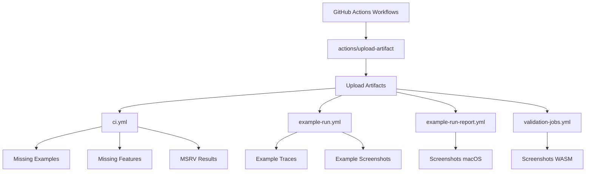

+++
title = "#22121 Bump actions/upload-artifact from 5 to 6"
date = "2025-12-18T00:00:00"
draft = false
template = "pull_request_page.html"
in_search_index = true

[taxonomies]
list_display = ["show"]

[extra]
current_language = "en"
available_languages = {"en" = { name = "English", url = "/pull_request/bevy/2025-12/pr-22121-en-20251218" }, "zh-cn" = { name = "中文", url = "/pull_request/bevy/2025-12/pr-22121-zh-cn-20251218" }}
labels = ["A-Build-System", "C-Dependencies", "D-Straightforward"]
+++

# Bump actions/upload-artifact from 5 to 6

## Basic Information
- **Title**: Bump actions/upload-artifact from 5 to 6
- **PR Link**: https://github.com/bevyengine/bevy/pull/22121
- **Author**: app/dependabot
- **Status**: MERGED
- **Labels**: A-Build-System, C-Dependencies, S-Ready-For-Final-Review, D-Straightforward
- **Created**: 2025-12-15T06:01:16Z
- **Merged**: 2025-12-18T19:12:44Z
- **Merged By**: alice-i-cecile

## Description Translation
Bumps [actions/upload-artifact](https://github.com/actions/upload-artifact) from 5 to 6.
<details>
<summary>Release notes</summary>
<p><em>Sourced from <a href="https://github.com/actions/upload-artifact/releases">actions/upload-artifact's releases</a>.</em></p>
<blockquote>
<h2>v6.0.0</h2>
<h2>v6 - What's new</h2>
<blockquote>
<p>[!IMPORTANT]
actions/upload-artifact@v6 now runs on Node.js 24 (<code>runs.using: node24</code>) and requires a minimum Actions Runner version of 2.327.1. If you are using self-hosted runners, ensure they are updated before upgrading.</p>
</blockquote>
<h3>Node.js 24</h3>
<p>This release updates the runtime to Node.js 24. v5 had preliminary support for Node.js 24, however this action was by default still running on Node.js 20. Now this action by default will run on Node.js 24.</p>
<h2>What's Changed</h2>
<ul>
<li>Upload Artifact Node 24 support by <a href="https://github.com/salmanmkc"><code>@​salmanmkc</code></a> in <a href="https://redirect.github.com/actions/upload-artifact/pull/719">actions/upload-artifact#719</a></li>
<li>fix: update <code>@​actions/artifact</code> for Node.js 24 punycode deprecation by <a href="https://github.com/salmanmkc"><code>@​salmanmkc</code></a> in <a href="https://redirect.github.com/actions/upload-artifact/pull/744">actions/upload-artifact#744</a></li>
<li>prepare release v6.0.0 for Node.js 24 support by <a href="https://github.com/salmanmkc"><code>@​salmanmkc</code></a> in <a href="https://redirect.github.com/actions/upload-artifact/pull/745">actions/upload-artifact#745</a></li>
</ul>
<p><strong>Full Changelog</strong>: <a href="https://github.com/actions/upload-artifact/compare/v5.0.0...v6.0.0">https://github.com/actions/upload-artifact/compare/v5.0.0...v6.0.0</a></p>
</blockquote>
</details>
<details>
<summary>Commits</summary>
<ul>
<li><a href="https://github.com/actions/upload-artifact/commit/b7c566a772e6b6bfb58ed0dc250532a479d7789f"><code>b7c566a</code></a> Merge pull request <a href="https://redirect.github.com/actions/upload-artifact/issues/745">#745</a> from actions/upload-artifact-v6-release</li>
<li><a href="https://github.com/actions/upload-artifact/commit/e516bc8500aaf3d07d591fcd4ae6ab5f9c391d5b"><code>e516bc8</code></a> docs: correct description of Node.js 24 support in README</li>
<li><a href="https://github.com/actions/upload-artifact/commit/ddc45ed9bca9b38dbd643978d88e3981cdc91415"><code>ddc45ed</code></a> docs: update README to correct action name for Node.js 24 support</li>
<li><a href="https://github.com/actions/upload-artifact/commit/615b319bd27bb32c3d64dca6b6ed6974d5fbe653"><code>615b319</code></a> chore: release v6.0.0 for Node.js 24 support</li>
<li><a href="https://github.com/actions/upload-artifact/commit/017748b48f8610ca8e6af1222f4a618e84a9c703"><code>017748b</code></a> Merge pull request <a href="https://redirect.github.com/actions/upload-artifact/issues/744">#744</a> from actions/fix-storage-blob</li>
<li><a href="https://github.com/actions/upload-artifact/commit/38d4c7997f5510fcc41fc4aae2a6b97becdbe7fc"><code>38d4c79</code></a> chore: rebuild dist</li>
<li><a href="https://github.com/actions/upload-artifact/commit/7d27270e0cfd253e666c44abac0711308d2d042f"><code>7d27270</code></a> chore: add missing license cache files for <code>@​actions/core</code>, <code>@​actions/io</code>, and mi...</li>
<li><a href="https://github.com/actions/upload-artifact/commit/5f643d3c9475505ccaf26d686ffbfb71a8387261"><code>5f643d3</code></a> chore: update license files for <code>@​actions/artifact</code><a href="https://github.com/5"><code>@​5</code></a>.0.1 dependencies</li>
<li><a href="https://github.com/actions/upload-artifact/commit/1df1684032c88614064493e1a0478fcb3583e1d0"><code>1df1684</code></a> chore: update package-lock.json with <code>@​actions/artifact</code><a href="https://github.com/5"><code>@​5</code></a>.0.1</li>
<li><a href="https://github.com/actions/upload-artifact/commit/b5b1a918401ee270935b6b1d857ae66c85f3be6f"><code>b5b1a91</code></a> fix: update <code>@​actions/artifact</code> to ^5.0.0 for Node.js 24 punycode fix</li>
<li>Additional commits viewable in <a href="https://github.com/actions/upload-artifact/compare/v5...v6">compare view</a></li>
</ul>
</details>
<br />


[](https://docs.github.com/en/github/managing-security-vulnerabilities/about-dependabot-security-updates#about-compatibility-scores)

Dependabot will resolve any conflicts with this PR as long as you don't alter it yourself. You can also trigger a rebase manually by commenting `@dependabot rebase`.

[//]: # (dependabot-automerge-start)
[//]: # (dependabot-automerge-end)

---

<details>
<summary>Dependabot commands and options</summary>
<br />

You can trigger Dependabot actions by commenting on this PR:
- `@dependabot rebase` will rebase this PR
- `@dependabot recreate` will recreate this PR, overwriting any edits that have been made to it
- `@dependabot merge` will merge this PR after your CI passes on it
- `@dependabot squash and merge` will squash and merge this PR after your CI passes on it
- `@dependabot cancel merge` will cancel a previously requested merge and block automerging
- `@dependabot reopen` will reopen this PR if it is closed
- `@dependabot close` will close this PR and stop Dependabot recreating it. You can achieve the same result by closing it manually
- `@dependabot show <dependency name> ignore conditions` will show all of the ignore conditions of the specified dependency
- `@dependabot ignore this major version` will close this PR and stop Dependabot creating any more for this major version (unless you reopen the PR or upgrade to it yourself)
- `@dependabot ignore this minor version` will close this PR and stop Dependabot creating any more for this minor version (unless you reopen the PR or upgrade to it yourself)
- `@dependabot ignore this dependency` will close this PR and stop Dependabot creating any more for this dependency (unless you reopen the PR or upgrade to it yourself)


</details>

## The Story of This Pull Request

This PR represents a routine but necessary maintenance task in the Bevy project's CI/CD pipeline. The changes focus on updating a critical GitHub Actions dependency from version 5 to version 6, specifically the `actions/upload-artifact` action.

The `actions/upload-artifact` action is a fundamental component of Bevy's CI workflows. It handles the collection and storage of build artifacts—files generated during the CI process that need to be preserved for later use. In Bevy's case, these artifacts include screenshots from example runs, trace files for performance analysis, missing example/feature reports, MSRV (Minimum Supported Rust Version) check results, and WebAssembly test outputs. Without this action, debugging CI failures would be significantly more difficult because developers wouldn't have access to these generated files.

The update to version 6 introduces a major change: the action now runs on Node.js 24 by default. Previous versions ran on Node.js 20, though version 5 had preliminary support for Node.js 24. This Node.js version bump aligns with GitHub's ongoing platform updates and ensures the action benefits from the latest runtime features and security patches. The release notes explicitly warn that this change requires a minimum Actions Runner version of 2.327.1, which primarily affects self-hosted runners. For GitHub-hosted runners, this requirement is automatically satisfied.

From an engineering perspective, this update is straightforward but important. The compatibility score of 100% indicates that the new version maintains full API compatibility with version 5, meaning no breaking changes to the action's interface or behavior. The primary technical consideration is the Node.js runtime change, which could potentially affect performance or behavior in edge cases, though the action's maintainers have already addressed the punycode deprecation issue specific to Node.js 24.

The implementation approach is simple: update the version reference in all workflow files where `actions/upload-artifact@v5` appears. This is a global find-and-replace operation that affects four workflow files across the codebase. Each instance follows the same pattern, changing only the version number while preserving all other configuration parameters like artifact names and file paths.

One technical detail worth noting is that the update doesn't change how artifacts are used downstream. The artifact names and contents remain identical, so any subsequent workflow steps that download these artifacts continue to work without modification. This is typical for patch-level or minor-version updates in CI dependencies but isn't guaranteed for major version bumps. In this case, the 100% compatibility score confirms that no downstream changes are needed.

The changes were automatically generated by Dependabot, GitHub's dependency management service. Dependabot monitors project dependencies and creates PRs when updates are available. This automation helps maintain security and compatibility with minimal manual intervention. The PR description includes standard Dependabot commands that maintainers can use to control the merge process, such as `@dependabot rebase` or `@dependabot merge`.

The merge process was straightforward: after the PR passed CI checks, it was merged by alice-i-cecile. The labels applied to the PR—"A-Build-System," "C-Dependencies," "S-Ready-For-Final-Review," and "D-Straightforward"—accurately categorize this as a low-risk dependency update requiring minimal review.

In summary, this PR demonstrates the importance of keeping CI/CD tooling up-to-date. While the changes appear minimal, they ensure the project benefits from the latest security patches, performance improvements, and compatibility with the GitHub Actions platform. The automated nature of the update and the clear compatibility metrics make this type of maintenance predictable and low-risk.

## Visual Representation



## Key Files Changed

The PR updates four GitHub Actions workflow files to use `actions/upload-artifact@v6` instead of `actions/upload-artifact@v5`:

1. **`.github/workflows/ci.yml`** (+3/-3)
   - This file contains the main CI workflow that runs on pull requests
   - Three instances updated for different artifact upload tasks:
     - `missing-examples` directory upload when example checks fail
     - `missing-features` directory upload when feature checks fail  
     - `msrv` directory upload when MSRV checks fail

2. **`.github/workflows/example-run.yml`** (+9/-9)
   - This workflow runs Bevy examples on multiple platforms (macOS, Linux, Windows)
   - Nine instances updated across three platform-specific jobs
   - Uploads traces, screenshots, and failure artifacts for each platform

3. **`.github/workflows/example-run-report.yml`** (+1/-1)
   - This workflow generates example run reports
   - One instance updated for macOS screenshot uploads

4. **`.github/workflows/validation-jobs.yml`** (+1/-1)
   - This workflow contains various validation jobs
   - One instance updated for WebAssembly screenshot uploads

All changes follow the same pattern, replacing `@v5` with `@v6`:

```yaml
# Before:
- uses: actions/upload-artifact@v5

# After:
- uses: actions/upload-artifact@v6
```

The configuration parameters (name, path, conditions) remain unchanged in all cases, confirming the compatibility between versions.

## Further Reading

1. [GitHub Actions: Upload Artifact Documentation](https://github.com/actions/upload-artifact) - Official documentation for the upload-artifact action
2. [GitHub Actions: Workflow Syntax](https://docs.github.com/en/actions/using-workflows/workflow-syntax-for-github-actions) - Reference for GitHub Actions workflow files
3. [Node.js 24 Release Notes](https://nodejs.org/en/blog/release/v24.0.0) - Details about Node.js 24 changes and deprecations
4. [Dependabot Documentation](https://docs.github.com/en/code-security/dependabot) - How Dependabot manages dependency updates
5. [GitHub Actions Runner Versions](https://github.com/actions/runner/releases) - Information about Actions Runner updates

# Full Code Diff
```
diff --git a/.github/workflows/ci.yml b/.github/workflows/ci.yml
index ed7694c281301..fbd2d5f76050d 100644
--- a/.github/workflows/ci.yml
+++ b/.github/workflows/ci.yml
@@ -414,7 +414,7 @@ jobs:
       - name: log failed task - missing update
         if: ${{ failure() && github.event_name == 'pull_request' && steps.missing-update.conclusion == 'failure' }}
         run: touch ./missing-examples/missing-update
-      - uses: actions/upload-artifact@v5
+      - uses: actions/upload-artifact@v6
         if: ${{ failure() && github.event_name == 'pull_request' }}
         with:
           name: missing-examples
@@ -449,7 +449,7 @@ jobs:
       - name: log failed task - missing update
         if: ${{ failure() && github.event_name == 'pull_request' && steps.missing-update.conclusion == 'failure' }}
         run: touch ./missing-features/missing-update
-      - uses: actions/upload-artifact@v5
+      - uses: actions/upload-artifact@v6
         if: ${{ failure() && github.event_name == 'pull_request' }}
         with:
           name: missing-features
@@ -494,7 +494,7 @@ jobs:
         run: |
           mkdir -p ./msrv
           echo ${{ github.event.number }} > ./msrv/NR
-      - uses: actions/upload-artifact@v5
+      - uses: actions/upload-artifact@v6
         if: ${{ failure() && github.event_name == 'pull_request' && steps.check.conclusion == 'failure' }}
         with:
           name: msrv
diff --git a/.github/workflows/example-run-report.yml b/.github/workflows/example-run-report.yml
index 733fb92b82502..c59404ab7baea 100644
--- a/.github/workflows/example-run-report.yml
+++ b/.github/workflows/example-run-report.yml
@@ -54,7 +54,7 @@ jobs:
           mkdir screenshots
           mv screenshots-* screenshots/
       - name: save screenshots
-        uses: actions/upload-artifact@v5
+        uses: actions/upload-artifact@v6
         with:
           name: screenshots-macos
           path: screenshots
diff --git a/.github/workflows/example-run.yml b/.github/workflows/example-run.yml
index c41396eab7078..934e4472e3a5e 100644
--- a/.github/workflows/example-run.yml
+++ b/.github/workflows/example-run.yml
@@ -58,7 +58,7 @@ jobs:
           mkdir traces && mv trace*.json traces/
           mkdir screenshots && mv screenshots-* screenshots/
       - name: save traces
-        uses: actions/upload-artifact@v5
+        uses: actions/upload-artifact@v6
         with:
           name: example-traces-macos
           path: traces
@@ -67,11 +67,11 @@ jobs:
         run: |
           echo ${{ github.event.number }} > ./screenshots/PR
       - name: save screenshots
-        uses: actions/upload-artifact@v5
+        uses: actions/upload-artifact@v6
         with:
           name: screenshots-macos
           path: screenshots
-      - uses: actions/upload-artifact@v5
+      - uses: actions/upload-artifact@v6
         if: ${{ failure() && github.event_name == 'pull_request' }}
         with:
           name: example-run-macos
@@ -133,16 +133,16 @@ jobs:
           mkdir traces && mv trace*.json traces/
           mkdir screenshots && mv screenshots-* screenshots/
       - name: save traces
-        uses: actions/upload-artifact@v5
+        uses: actions/upload-artifact@v6
         with:
           name: example-traces-linux
           path: traces
       - name: save screenshots
-        uses: actions/upload-artifact@v5
+        uses: actions/upload-artifact@v6
         with:
           name: screenshots-linux
           path: screenshots
-      - uses: actions/upload-artifact@v5
+      - uses: actions/upload-artifact@v6
         if: ${{ failure() && github.event_name == 'pull_request' }}
         with:
           name: example-run-linux
@@ -197,16 +197,16 @@ jobs:
           mkdir traces && mv trace*.json traces/
           mkdir screenshots && mv screenshots-* screenshots/
       - name: save traces
-        uses: actions/upload-artifact@v5
+        uses: actions/upload-artifact@v6
         with:
           name: example-traces-windows
           path: traces
       - name: save screenshots
-        uses: actions/upload-artifact@v5
+        uses: actions/upload-artifact@v6
         with:
           name: screenshots-windows
           path: screenshots
-      - uses: actions/upload-artifact@v5
+      - uses: actions/upload-artifact@v6
         if: ${{ failure() && github.event_name == 'pull_request' }}
         with:
           name: example-run-windows
diff --git a/.github/workflows/validation-jobs.yml b/.github/workflows/validation-jobs.yml
index 7d3d75d9df11f..67a0546268a07 100644
--- a/.github/workflows/validation-jobs.yml
+++ b/.github/workflows/validation-jobs.yml
@@ -147,7 +147,7 @@ jobs:
           xvfb-run cargo run -p build-wasm-example -- --browsers chromium --browsers firefox --frames 25 --test 2d_shapes lighting text_debug breakout
 
       - name: Save screenshots
-        uses: actions/upload-artifact@v5
+        uses: actions/upload-artifact@v6
         with:
           name: screenshots-wasm
           path: .github/start-wasm-example/screenshot-*.png
```