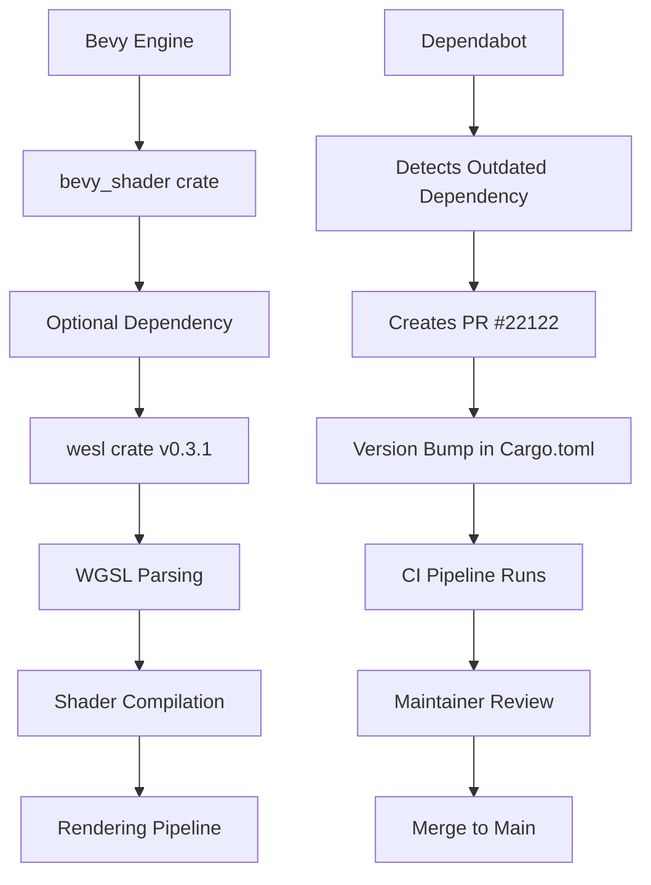

+++
title = "#22122 Update wesl requirement from 0.2.0 to 0.3.1"
date = "2025-12-17T00:00:00"
draft = false
template = "pull_request_page.html"
in_search_index = true

[taxonomies]
list_display = ["show"]

[extra]
current_language = "en"
available_languages = {"en" = { name = "English", url = "/pull_request/bevy/2025-12/pr-22122-en-20251217" }, "zh-cn" = { name = "中文", url = "/pull_request/bevy/2025-12/pr-22122-zh-cn-20251217" }}
labels = ["A-Rendering", "C-Dependencies"]
+++

# Update wesl requirement from 0.2.0 to 0.3.1

## Basic Information
- **Title**: Update wesl requirement from 0.2.0 to 0.3.1
- **PR Link**: https://github.com/bevyengine/bevy/pull/22122
- **Author**: app/dependabot
- **Status**: MERGED
- **Labels**: A-Rendering, C-Dependencies, S-Ready-For-Final-Review
- **Created**: 2025-12-15T06:33:11Z
- **Merged**: 2025-12-17T19:44:54Z
- **Merged By**: alice-i-cecile

## Description Translation
Updates the requirements on [wesl](https://github.com/wgsl-tooling-wg/wesl-rs) to permit the latest version.
<details>
<summary>Commits</summary>
<ul>
<li>See full diff in <a href="https://github.com/wgsl-tooling-wg/wesl-rs/commits">compare view</a></li>
</ul>
</details>
<br />


Dependabot will resolve any conflicts with this PR as long as you don't alter it yourself. You can also trigger a rebase manually by commenting `@dependabot rebase`.

[//]: # (dependabot-automerge-start)
[//]: # (dependabot-automerge-end)

---

<details>
<summary>Dependabot commands and options</summary>
<br />

You can trigger Dependabot actions by commenting on this PR:
- `@dependabot rebase` will rebase this PR
- `@dependabot recreate` will recreate this PR, overwriting any edits that have been made to it
- `@dependabot merge` will merge this PR after your CI passes on it
- `@dependabot squash and merge` will squash and merge this PR after your CI passes on it
- `@dependabot cancel merge` will cancel a previously requested merge and block automerging
- `@dependabot reopen` will reopen this PR if it is closed
- `@dependabot close` will close this PR and stop Dependabot recreating it. You can achieve the same result by closing it manually
- `@dependabot show <dependency name> ignore conditions` will show all of the ignore conditions of the specified dependency
- `@dependabot ignore this major version` will close this PR and stop Dependabot creating any more for this major version (unless you reopen the PR or upgrade to it yourself)
- `@dependabot ignore this minor version` will close this PR and stop Dependabot creating any more for this minor version (unless you reopen the PR or upgrade to it yourself)
- `@dependabot ignore this dependency` will close this PR and stop Dependabot creating any more for this dependency (unless you reopen the PR or upgrade to it yourself)


</details>

## The Story of This Pull Request

This pull request represents a routine but essential maintenance task in the Bevy game engine's dependency management. The change updates the version constraint for the `wesl` crate from 0.2.0 to 0.3.1 in the `bevy_shader` crate's manifest file. While seemingly simple, this update is part of a larger strategy to maintain a healthy, secure, and modern dependency graph.

The `wesl` crate is a WGSL (WebGPU Shading Language) parsing library developed by the WGSL Tooling Working Group. In Bevy, it's used as an optional dependency (`optional = true`) for the `bevy_shader` crate, which handles shader compilation and processing. This optional nature means that the crate isn't required for all Bevy builds but provides additional functionality when enabled.

The update from version 0.2.0 to 0.3.1 follows semantic versioning principles. Since it's a minor version bump (0.2.x to 0.3.x), we expect new features and potentially some backward-compatible improvements. The specific patch version 0.3.1 suggests there were bug fixes or minor improvements after the initial 0.3.0 release.

Automated dependency management systems like Dependabot, which created this PR, are crucial for large projects like Bevy. They help maintain security by ensuring vulnerabilities in dependencies are addressed, provide access to new features and performance improvements, and prevent the codebase from accumulating technical debt through outdated dependencies. The PR description includes standard Dependabot commands that allow maintainers to manage the update process efficiently - triggering rebases, merges, or ignoring specific versions as needed.

For the Bevy project, updating the `wesl` dependency is particularly relevant because it's a shader parsing tool. As WGSL evolves and new language features are added, keeping the parsing library current ensures that Bevy can support the latest shader capabilities. This is reflected in the PR's labels: `A-Rendering` (since it affects the rendering pipeline) and `C-Dependencies` (since it's a dependency update).

The PR follows a straightforward process: Dependabot detects the outdated dependency, creates a PR with the version bump, and the Bevy maintainers review and merge it after CI passes. The merging was done by alice-i-cecile, a core contributor, which suggests the change was reviewed and deemed safe. The two-day turnaround from creation to merge indicates a typical workflow for non-breaking dependency updates.

## Visual Representation



## Key Files Changed

Only one file was modified in this PR:

**File**: `crates/bevy_shader/Cargo.toml`

This is the manifest file for the `bevy_shader` crate, which defines its dependencies, metadata, and build configuration. The change updates the version constraint for the `wesl` dependency from 0.2.0 to 0.3.1.

```toml
# Before:
wesl = { version = "0.2.0", optional = true }

# After:
wesl = { version = "0.3.1", optional = true }
```

The change is minimal but significant:
1. **Version update**: Changes from 0.2.0 to 0.3.1
2. **Dependency remains optional**: The `optional = true` flag is preserved, meaning this dependency isn't required for all Bevy builds
3. **Semantic versioning**: The update follows semver, allowing access to new features and bug fixes in the 0.3.x series
4. **Compatibility**: The version constraint uses the caret operator (implied by `version = "0.3.1"`), which allows any version compatible with 0.3.1 (>=0.3.1, <0.4.0)

This change allows the `bevy_shader` crate to use the latest features and fixes from the `wesl` crate while maintaining the same optional dependency structure. Since it's a minor version update, it shouldn't introduce breaking changes that would affect Bevy's shader compilation pipeline.

## Further Reading

1. **Dependabot Documentation**: https://docs.github.com/en/code-security/dependabot
2. **Semantic Versioning (Semver)**: https://semver.org/
3. **WGSL Specification**: https://www.w3.org/TR/WGSL/
4. **wesl-rs GitHub Repository**: https://github.com/wgsl-tooling-wg/wesl-rs
5. **Cargo.toml Reference**: https://doc.rust-lang.org/cargo/reference/manifest.html
6. **Bevy's Shader System**: https://bevyengine.org/learn/book/next/features/shader/

# Full Code Diff
```diff
diff --git a/crates/bevy_shader/Cargo.toml b/crates/bevy_shader/Cargo.toml
index f7f0ef3ba75c0..3dec1d1eb6a5f 100644
--- a/crates/bevy_shader/Cargo.toml
+++ b/crates/bevy_shader/Cargo.toml
@@ -19,7 +19,7 @@ wgpu-types = { version = "27", default-features = false }
 naga = { version = "27", features = ["wgsl-in"] }
 serde = { version = "1", features = ["derive"] }
 thiserror = { version = "2", default-features = false }
-wesl = { version = "0.2.0", optional = true }
+wesl = { version = "0.3.1", optional = true }
 tracing = { version = "0.1", default-features = false, features = ["std"] }
 
```