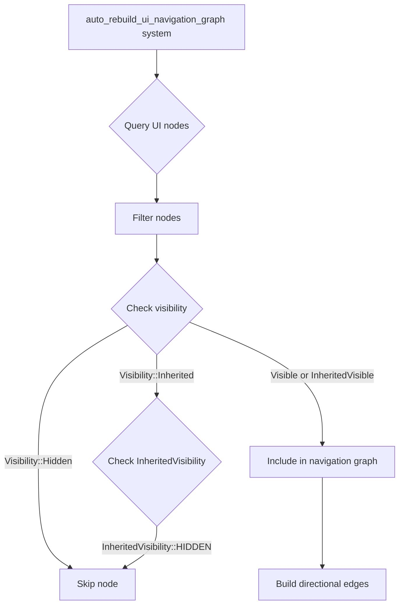

+++
title = "#22123 Fix: Ignores nodes that are hidden via their parents in directional nav"
date = "2025-12-15T00:00:00"
draft = false
template = "pull_request_page.html"
in_search_index = true

[taxonomies]
list_display = ["show"]

[extra]
current_language = "en"
available_languages = {"en" = { name = "English", url = "/pull_request/bevy/2025-12/pr-22123-en-20251215" }, "zh-cn" = { name = "中文", url = "/pull_request/bevy/2025-12/pr-22123-zh-cn-20251215" }}
labels = ["C-Bug", "A-UI", "D-Straightforward"]
+++

# Title

## Basic Information
- **Title**: Fix: Ignores nodes that are hidden via their parents in directional nav
- **PR Link**: https://github.com/bevyengine/bevy/pull/22123
- **Author**: kfc35
- **Status**: MERGED
- **Labels**: C-Bug, A-UI, S-Ready-For-Final-Review, D-Straightforward
- **Created**: 2025-12-15T06:51:35Z
- **Merged**: 2025-12-15T21:12:20Z
- **Merged By**: alice-i-cecile

## Description Translation
# Objective

- Fixes #21950

## Solution

- Updated the query as suggested in the issue to also check for `InheritedVisibility`. Entities that have `Visibility::INHERITED` and `InheritedVisibility::HIDDEN` should also be ignored for directional navigation

## Testing

- Did you test these changes? If so, how?
I did not test this change at all! And I wasn't sure how best to set up an automated test for this since there is not an existing one for that function, else I would have. However, the logic change is simple at least… So if a test is desired, just let me know and please provide me with a little direction :)

## The Story of This Pull Request

This pull request addresses a specific bug in Bevy's directional navigation system where UI nodes hidden through parent visibility inheritance were incorrectly being considered as navigable targets. The issue was reported in #21950 and represents a case where the navigation logic wasn't properly respecting the full visibility hierarchy.

The core problem stems from how Bevy's ECS system handles visibility. There are two main components involved: `Visibility` and `InheritedVisibility`. The `Visibility` component can have three states: `Visible`, `Hidden`, or `Inherited`. When a node has `Visibility::Inherited`, its actual visibility state is determined by the `InheritedVisibility` component, which is computed from the parent chain. This dual-component approach allows for efficient visibility propagation through the UI hierarchy.

The bug occurred in the `auto_rebuild_ui_navigation_graph` function within the directional navigation system. This function builds a graph of focusable UI elements for keyboard/gamepad navigation. The original implementation only checked for direct visibility (`Visibility::Hidden`) but didn't account for nodes that inherit their visibility from parents. This meant that if a parent UI element was hidden, its children would still appear in the navigation graph even though they weren't visually present.

The fix is straightforward but important for correct navigation behavior. The developer updated the system query to include `InheritedVisibility` alongside the existing `Visibility` component. Then, they modified the filtering logic to exclude nodes that are either directly hidden (`Visibility::Hidden`) or inherited hidden (`Visibility::Inherited` with `InheritedVisibility::HIDDEN`).

The implementation approach follows the pattern already established in Bevy's visibility system. The key insight is that when `Visibility::Inherited` is present, the actual visibility state must be checked in the `InheritedVisibility` component. This is a common pattern in Bevy's ECS architecture where computed components store the results of system calculations.

From a technical perspective, this fix ensures that directional navigation respects the complete visibility state of UI elements. Without this fix, users could navigate to invisible UI elements, causing confusion and breaking expected accessibility patterns. The change maintains the existing performance characteristics since it only adds one additional component to the query and performs a simple boolean check.

One interesting aspect of this PR is the author's note about testing. They acknowledge they didn't write automated tests due to the lack of existing test infrastructure for this function. This is a common challenge in large codebases where adding tests for untested areas requires understanding both the functionality and the testing patterns used elsewhere. The author correctly identifies that while the logic change is simple, proper testing would require guidance on the existing test patterns in the codebase.

## Visual Representation



## Key Files Changed

**File: crates/bevy_input_focus/src/directional_navigation.rs** (+20/-13)

This is the only file modified in the PR. The changes involve updating a system query and its filtering logic to properly handle inherited visibility.

**Key Changes:**

1. **Import addition** - Added `InheritedVisibility` to the imports from `bevy_camera::visibility`.

```rust
// Before:
use bevy_camera::visibility::Visibility;

// After:
use bevy_camera::visibility::{InheritedVisibility, Visibility};
```

2. **Query modification** - Updated the system query to include `InheritedVisibility` as an optional component.

```rust
// Before:
    all_nodes: Query<
        (
            Entity,
            &ComputedNode,
            &UiGlobalTransform,
            Option<&Visibility>,
        ),
        With<AutoDirectionalNavigation>,
    >,

// After:
    all_nodes: Query<
        (
            Entity,
            &ComputedNode,
            &UiGlobalTransform,
            Option<&Visibility>,
            Option<&InheritedVisibility>,
        ),
        With<AutoDirectionalNavigation>,
    >,
```

3. **Filter logic update** - Enhanced the filtering logic to check inherited visibility states.

```rust
// Before:
        .filter_map(|(entity, computed, transform, visibility)| {
            // Skip hidden or zero-size nodes
            if computed.is_empty() || matches!(visibility, Some(Visibility::Hidden)) {
                return None;
            }
            let (_scale, _rotation, translation) = transform.to_scale_angle_translation();
            Some(FocusableArea {
                entity,
                position: translation,
                size: computed.size(),
            })
        })

// After:
        .filter_map(
            |(entity, computed, transform, visibility, inherited_visibility)| {
                // Skip hidden or zero-size nodes
                if computed.is_empty()
                    || matches!(visibility, Some(Visibility::Hidden))
                    || (matches!(visibility, Some(Visibility::Inherited))
                        && matches!(inherited_visibility, Some(&InheritedVisibility::HIDDEN)))
                {
                    return None;
                }
                let (_scale, _rotation, translation) = transform.to_scale_angle_translation();
                Some(FocusableArea {
                    entity,
                    position: translation,
                    size: computed.size(),
                })
            },
        )
```

The fix ensures that nodes with `Visibility::Inherited` and `InheritedVisibility::HIDDEN` are excluded from the navigation graph, correctly handling the case where nodes are hidden through parent visibility.

## Further Reading

- [Bevy UI Visibility System Documentation](https://docs.rs/bevy_ui/latest/bevy_ui/struct.Visibility.html)
- [Bevy ECS Query System](https://bevy-cheatbook.github.io/programming/queries.html)
- [UI Navigation in Bevy](https://bevy-cheatbook.github.io/features/ui.html#focus-and-navigation)
- [Component Inheritance Patterns in ECS](https://github.com/bevyengine/bevy/discussions/3972)