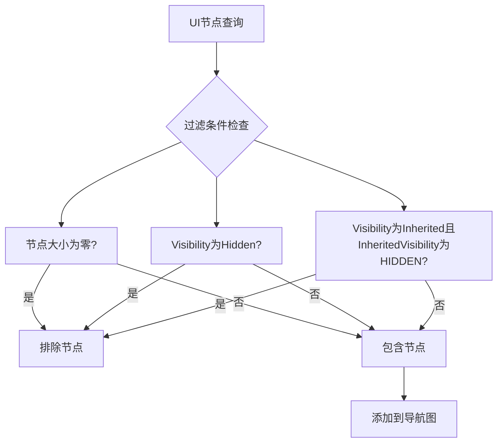

+++
title = "#22123 Fix: Ignores nodes that are hidden via their parents in directional nav"
date = "2025-12-15T00:00:00"
draft = false
template = "pull_request_page.html"
in_search_index = false

[extra]
current_language = "zh-cn"
available_languages = {"en" = { name = "English", url = "/pull_request/bevy/2025-12/pr-22123-en-20251215" }, "zh-cn" = { name = "中文", url = "/pull_request/bevy/2025-12/pr-22123-zh-cn-20251215" }}
+++

# 标题

## 基本信息
- **标题**: Fix: Ignores nodes that are hidden via their parents in directional nav
- **PR 链接**: https://github.com/bevyengine/bevy/pull/22123
- **作者**: kfc35
- **状态**: 已合并
- **标签**: C-Bug, A-UI, S-Ready-For-Final-Review, D-Straightforward
- **创建时间**: 2025-12-15T06:51:35Z
- **合并时间**: 2025-12-15T21:12:20Z
- **合并者**: alice-i-cecile

## 描述翻译
### 目标
- 修复 #21950

### 解决方案
- 根据 issue 中的建议更新查询，同时检查 `InheritedVisibility`。具有 `Visibility::INHERITED` 和 `InheritedVisibility::HIDDEN` 的实体在定向导航中也应被忽略。

### 测试
- 你是否测试了这些更改？如果是，是如何测试的？
我完全没有测试这个更改！而且我不确定如何最好地为这个函数设置自动化测试，因为目前没有针对该函数的现有测试，否则我会添加。不过，逻辑变更至少很简单……所以如果需要测试，请告诉我并提供一些指导 :)

## 这个 Pull Request 的故事

这个 PR 解决了一个 UI 定向导航中的缺陷。在 Bevy 引擎中，UI 节点可以具有不同的可见性状态，包括显式隐藏 (`Visibility::Hidden`) 或从父节点继承可见性 (`Visibility::Inherited`)。当进行定向导航（例如使用键盘方向键或手柄在 UI 元素间移动焦点）时，系统需要正确地排除不可见的节点，以避免用户焦点跳转到不可交互的元素上。

问题 #21950 报告了一个具体场景：当一个 UI 节点通过父节点被隐藏时（即它的 `Visibility` 是 `Inherited`，并且 `InheritedVisibility` 是 `HIDDEN`），它仍然被包含在定向导航的计算中。这导致用户焦点可能意外地跳到视觉上不可见的元素上，破坏了用户体验。

查看 `directional_navigation.rs` 文件中的原始代码，问题出现在 `auto_rebuild_ui_navigation_graph` 函数中。该函数通过查询收集所有符合条件的 UI 节点，但在过滤隐藏节点时只检查了 `Visibility::Hidden`，忽略了继承隐藏的情况。

```rust
// 变更前的代码片段
.filter_map(|(entity, computed, transform, visibility)| {
    // 跳过隐藏或零大小的节点
    if computed.is_empty() || matches!(visibility, Some(Visibility::Hidden)) {
        return None;
    }
    // ... 其他处理
})
```

这个实现存在一个逻辑漏洞：它只排除了显式标记为 `Hidden` 的节点，但没有处理那些因为父节点隐藏而继承隐藏状态的节点。在 Bevy 的可见性系统中，`InheritedVisibility` 组件反映了节点从父节点继承的最终计算可见性。

解决方案直接明了：在查询中添加对 `InheritedVisibility` 组件的访问，并在过滤条件中增加对继承隐藏情况的检查。变更后的查询现在需要同时获取 `Visibility` 和 `InheritedVisibility`，然后在过滤时考虑两种情况：

1. 节点显式隐藏 (`Visibility::Hidden`)
2. 节点继承隐藏 (`Visibility::Inherited` 且 `InheritedVisibility::HIDDEN`)

```rust
// 变更后的代码片段
.filter_map(
    |(entity, computed, transform, visibility, inherited_visibility)| {
        // 跳过隐藏或零大小的节点
        if computed.is_empty()
            || matches!(visibility, Some(Visibility::Hidden))
            || (matches!(visibility, Some(Visibility::Inherited))
                && matches!(inherited_visibility, Some(&InheritedVisibility::HIDDEN)))
        {
            return None;
        }
        // ... 其他处理
    },
)
```

从技术实现角度看，这个修复体现了 Bevy 可见性系统的正确使用方法。在 Bevy 中，可见性是通过两个组件共同工作的：
- `Visibility` 表示节点的本地可见性设置
- `InheritedVisibility` 表示考虑继承链后的最终计算可见性

这种分离允许实现高效的可见性传播，其中 `InheritedVisibility` 由系统计算并缓存，避免每帧重新计算整个层次结构。

这个 PR 的变更虽然很小（仅修改了一个函数），但修复了一个重要的用户体验问题。它确保了定向导航系统与 Bevy 的可见性系统正确集成，遵循"不可见的元素不应接收焦点"的基本 UI 原则。

值得注意的是，作者在 PR 描述中坦诚地表示没有进行测试，这反映了开源协作中的常见情况：简单的逻辑修复有时可能先提交，然后由维护者决定是否需要添加测试。对于这种核心 UI 功能，后续可能需要添加测试来确保不会出现回归。

## 视觉表示



## 关键文件更改

### `crates/bevy_input_focus/src/directional_navigation.rs` (+20/-13)

这个文件包含了定向导航系统的核心逻辑。主要更改在 `auto_rebuild_ui_navigation_graph` 函数中，该函数负责自动构建 UI 元素之间的导航关系。

**更改内容**：
1. 在查询中添加了 `InheritedVisibility` 组件
2. 扩展了过滤逻辑以正确处理继承的隐藏状态

**代码对比**：
```rust
// 变更前：
use bevy_camera::visibility::Visibility;

// 查询中只包含 Optional<&Visibility>
(
    Entity,
    &ComputedNode,
    &UiGlobalTransform,
    Option<&Visibility>,
)

// 过滤逻辑：
if computed.is_empty() || matches!(visibility, Some(Visibility::Hidden)) {
    return None;
}
```

```rust
// 变更后：
use bevy_camera::visibility::{InheritedVisibility, Visibility};

// 查询中添加了 Optional<&InheritedVisibility>
(
    Entity,
    &ComputedNode,
    &UiGlobalTransform,
    Option<&Visibility>,
    Option<&InheritedVisibility>,
)

// 过滤逻辑扩展：
if computed.is_empty()
    || matches!(visibility, Some(Visibility::Hidden))
    || (matches!(visibility, Some(Visibility::Inherited))
        && matches!(inherited_visibility, Some(&InheritedVisibility::HIDDEN)))
{
    return None;
}
```

## 进一步阅读

1. **Bevy 可见性系统文档**:
   - [Visibility 组件](https://docs.rs/bevy/latest/bevy/render/view/struct.Visibility.html)
   - [InheritedVisibility 组件](https://docs.rs/bevy/latest/bevy/render/view/struct.InheritedVisibility.html)
   - [可见性传播系统](https://github.com/bevyengine/bevy/blob/main/crates/bevy_render/src/view/visibility.rs)

2. **UI 可访问性与焦点管理**:
   - [WAI-ARIA 焦点管理最佳实践](https://www.w3.org/WAI/ARIA/apg/practices/keyboard-interface/)
   - [游戏中的 UI 导航设计模式](https://gameuipro.com/)

3. **Bevy UI 系统**:
   - [Bevy UI 官方示例](https://github.com/bevyengine/bevy/tree/main/examples/ui)
   - [Bevy 输入处理与焦点系统](https://github.com/bevyengine/bevy/tree/main/crates/bevy_input_focus)

# 完整代码差异
```diff
diff --git a/crates/bevy_input_focus/src/directional_navigation.rs b/crates/bevy_input_focus/src/directional_navigation.rs
index ed34e84bcc067..cfbcd21cad037 100644
--- a/crates/bevy_input_focus/src/directional_navigation.rs
+++ b/crates/bevy_input_focus/src/directional_navigation.rs
@@ -60,7 +60,7 @@
 
 use alloc::vec::Vec;
 use bevy_app::prelude::*;
-use bevy_camera::visibility::Visibility;
+use bevy_camera::visibility::{InheritedVisibility, Visibility};
 use bevy_ecs::{
     entity::{EntityHashMap, EntityHashSet},
     prelude::*,
@@ -749,6 +749,7 @@ fn auto_rebuild_ui_navigation_graph(
             &ComputedNode,
             &UiGlobalTransform,
             Option<&Visibility>,
+            Option<&InheritedVisibility>,
         ),
         With<AutoDirectionalNavigation>,
     >,
@@ -759,18 +760,24 @@ fn auto_rebuild_ui_navigation_graph(
 
     let nodes: Vec<FocusableArea> = all_nodes
         .iter()
-        .filter_map(|(entity, computed, transform, visibility)| {
-            // Skip hidden or zero-size nodes
-            if computed.is_empty() || matches!(visibility, Some(Visibility::Hidden)) {
-                return None;
-            }
-            let (_scale, _rotation, translation) = transform.to_scale_angle_translation();
-            Some(FocusableArea {
-                entity,
-                position: translation,
-                size: computed.size(),
-            })
-        })
+        .filter_map(
+            |(entity, computed, transform, visibility, inherited_visibility)| {
+                // Skip hidden or zero-size nodes
+                if computed.is_empty()
+                    || matches!(visibility, Some(Visibility::Hidden))
+                    || (matches!(visibility, Some(Visibility::Inherited))
+                        && matches!(inherited_visibility, Some(&InheritedVisibility::HIDDEN)))
+                {
+                    return None;
+                }
+                let (_scale, _rotation, translation) = transform.to_scale_angle_translation();
+                Some(FocusableArea {
+                    entity,
+                    position: translation,
+                    size: computed.size(),
+                })
+            },
+        )
         .collect();
 
     auto_generate_navigation_edges(&mut directional_nav_map, &nodes, &config);
```