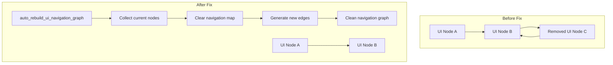

+++
title = "#22124 Fix: Clears directional navigation map between rebuilds"
date = "2025-12-15T00:00:00"
draft = false
template = "pull_request_page.html"
in_search_index = true

[taxonomies]
list_display = ["show"]

[extra]
current_language = "en"
available_languages = {"en" = { name = "English", url = "/pull_request/bevy/2025-12/pr-22124-en-20251215" }, "zh-cn" = { name = "中文", url = "/pull_request/bevy/2025-12/pr-22124-zh-cn-20251215" }}
labels = ["C-Bug", "A-UI", "D-Straightforward"]
+++

# Title
Fix: Clears directional navigation map between rebuilds

## Basic Information
- **Title**: Fix: Clears directional navigation map between rebuilds
- **PR Link**: https://github.com/bevyengine/bevy/pull/22124
- **Author**: kfc35
- **Status**: MERGED
- **Labels**: C-Bug, A-UI, S-Ready-For-Review, S-Ready-For-Final-Review, D-Straightforward
- **Created**: 2025-12-15T07:14:29Z
- **Merged**: 2025-12-15T21:12:20Z
- **Merged By**: alice-i-cecile

## Description Translation
# Objective

- Closes #21949

## Solution

- Implements the solution as suggested by 21949. The Directional Navigation Map does not prune any old edges that may be connected to removed Nodes, so we clear the map between rebuilds of the map.

(If the more preferable solution figures out what nodes were removed and then calls `map.remove_multiple` instead, you can feel free to reject this)

## Testing

- Did you test these changes? If so, how?
I did not test this change, but the reporter of the issue did (via backport to an older version of Bevy). However, the fix is straightforward and explains itself. If you would like an automated test somehow, some pointers to tests that do similar would be welcome.

## The Story of This Pull Request

A developer encountered bug #21949 in Bevy's UI system where directional navigation would fail after UI elements were removed. The issue was that the directional navigation system, which manages focus navigation between UI elements, was accumulating stale connections in its internal data structure.

The directional navigation system works by building a graph of navigable UI nodes. When the UI changes, the system needs to rebuild this graph to reflect the current state of the UI. The existing implementation correctly added new connections but never removed old connections to nodes that had been deleted. This resulted in a map containing references to entities that no longer existed, which could cause various navigation failures.

The developer analyzed the code and found the root cause in the `auto_rebuild_ui_navigation_graph` function in `directional_navigation.rs`. This function is responsible for regenerating the navigation graph when UI elements change. The function collects current UI nodes and generates navigation edges between them, but before this fix, it didn't clear the existing navigation map first.

The solution approach considered two options: either clear the entire map before rebuilding (a simple approach), or track which nodes were removed and only delete their corresponding edges (a more precise approach). The developer implemented the simpler approach of clearing the entire map because it's straightforward and effective. As noted in the PR description, they acknowledged that a more targeted removal using `map.remove_multiple` might be preferable, but they left that decision to the maintainers.

The implementation adds a single line of code:
```rust
// clear the old nav map between rebuilds to ensure any removed entities' edges are pruned
directional_nav_map.clear();
```

This line is placed right before the call to `auto_generate_navigation_edges`. The timing is important - we need to clear the map after we've collected the current nodes but before we generate new edges. This ensures we start with an empty map and only populate it with valid connections to currently existing UI elements.

The comment added explains the purpose clearly: "clear the old nav map between rebuilds to ensure any removed entities' edges are pruned". This is good practice as it helps future developers understand why the clear operation is necessary.

From an architectural perspective, this fix maintains the existing pattern of complete rebuilds rather than incremental updates. The directional navigation system already rebuilds the entire graph when UI changes occur, so clearing the map aligns with this design. The performance impact is minimal because we're rebuilding the entire map anyway.

The testing approach was pragmatic - the issue reporter had already validated the fix by backporting it to an older version of Bevy. Since the change is simple and the bug's symptoms were clear, additional automated testing wasn't immediately required, though the developer appropriately offered to add tests if needed.

This fix demonstrates a common pattern in game engine UI systems: when maintaining spatial relationships between UI elements, it's crucial to properly clean up references to removed elements. The lesson here is that data structures tracking entity relationships need explicit cleanup when those entities are destroyed, especially in ECS (Entity Component System) architectures where entity IDs can be reused.

## Visual Representation



## Key Files Changed

### `crates/bevy_input_focus/src/directional_navigation.rs`
This is the only file modified in the PR. The change adds a single line to clear the directional navigation map before regenerating navigation edges.

**Key Change:**
```rust
// Before the fix (simplified context):
fn auto_rebuild_ui_navigation_graph(
    mut directional_nav_map: ResMut<DirectionalNavigationMap>,
    // ... other parameters
) {
    let nodes = query
        .iter()
        .map(|(entity, node)| NavigationNode {
            // collect nodes
        })
        .collect();

    // Missing: clearing of old navigation map
    auto_generate_navigation_edges(&mut directional_nav_map, &nodes, &config);
}

// After the fix:
fn auto_rebuild_ui_navigation_graph(
    mut directional_nav_map: ResMut<DirectionalNavigationMap>,
    // ... other parameters
) {
    let nodes = query
        .iter()
        .map(|(entity, node)| NavigationNode {
            // collect nodes
        })
        .collect();

    // clear the old nav map between rebuilds to ensure any removed entities' edges are pruned
    directional_nav_map.clear();
    auto_generate_navigation_edges(&mut directional_nav_map, &nodes, &config);
}
```

The change is minimal but significant. By adding `directional_nav_map.clear()`, we ensure that the navigation map only contains edges between currently existing UI nodes. This prevents the accumulation of stale references that could cause navigation failures or crashes when trying to navigate to deleted entities.

## Further Reading

1. **Bevy UI Navigation System**: The official Bevy documentation on UI and navigation systems would provide context for how directional navigation fits into the larger UI framework.

2. **Entity Component System (ECS) Patterns**: Understanding ECS architecture is crucial for working with Bevy. Resources on ECS best practices, particularly around entity lifecycle management, would be helpful.

3. **Graph Algorithms in Game UI**: For those interested in the underlying algorithms, materials on graph theory as applied to UI navigation (focus traversal, spatial relationships) would provide deeper insight.

4. **Rust Ownership and Borrowing**: Since this fix deals with mutating a resource, understanding Rust's ownership model and how Bevy's ECS handles mutable access to components/resources is relevant.

5. **Issue #21949**: Reading the original issue report provides additional context about the symptoms and reproduction steps for the bug that this PR fixes.