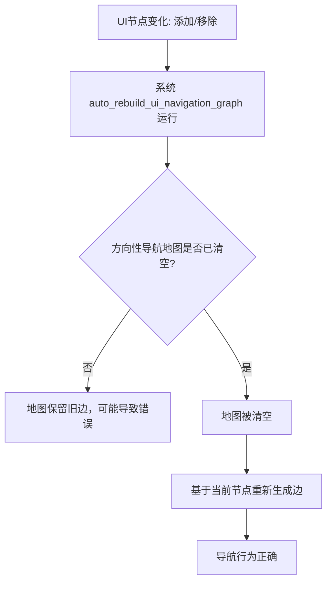

+++
title = "#22124"
date = "2025-12-15T00:00:00"
draft = false
template = "pull_request_page.html"
in_search_index = false

[extra]
current_language = "zh-cn"
available_languages = {"en" = { name = "English", url = "/pull_request/bevy/2025-12/pr-22124-en-20251215" }, "zh-cn" = { name = "中文", url = "/pull_request/bevy/2025-12/pr-22124-zh-cn-20251215" }}
+++

# Title
Fix: Clears directional navigation map between rebuilds

## Basic Information
- **标题（Title）**: Fix: Clears directional navigation map between rebuilds
- **PR链接（PR Link）**: https://github.com/bevyengine/bevy/pull/22124
- **作者（Author）**: kfc35
- **状态（Status）**: 已合并（MERGED）
- **标签（Labels）**: C-Bug, A-UI, S-Ready-For-Final-Review, D-Straightforward
- **创建时间（Created）**: 2025-12-15T07:14:29Z
- **合并时间（Merged）**: 2025-12-15T21:12:20Z
- **合并者（Merged By）**: alice-i-cecile

## Description Translation
**目标（Objective）**
- 关闭 #21949

**解决方案（Solution）**
- 按照 #21949 中的建议实现了解决方案。方向性导航地图（Directional Navigation Map）不会清除可能连接到已移除节点（Nodes）的任何旧边（edges），因此我们在重建地图之间清除了该地图。

（如果更优的解决方案是找出哪些节点被移除，然后调用 `map.remove_multiple`，您可以随时拒绝此PR）

**测试（Testing）**
- 您是否测试了这些更改？如果是，如何测试的？
我没有测试此更改，但问题报告者测试了（通过向后移植到较旧版本的Bevy）。然而，这个修复很直接，并且本身就能说明问题。如果您希望以某种方式进行自动化测试，欢迎提供一些类似测试的指引。

## The Story of This Pull Request

这个PR解决了一个在Bevy UI导航系统中存在的bug。具体问题是，当UI节点被动态添加或移除时，方向性导航地图（Directional Navigation Map）会保留旧的边，这些边指向已经不存在的节点，导致导航行为异常。

### The Problem and Context
在Bevy中，UI元素之间的键盘导航（例如使用方向键或Tab键）是通过一个方向性导航地图来管理的。这个地图存储了节点之间的连接关系，指示按下某个方向键时焦点应该如何移动。该地图由系统`auto_rebuild_ui_navigation_graph`定期重建，以反映UI节点的当前状态。

然而，在重建过程中，地图并没有被完全清空。这意味着，如果一个节点在两次重建之间被移除了，那么地图中可能仍然保留着指向该被移除节点的边。当用户尝试导航时，系统可能会尝试将焦点移动到一个不存在的节点，从而导致错误或意外行为。

问题 #21949 报告了这种行为，并提供了一个最小可复现示例。该问题在UI节点被动态移除时触发。

### The Solution Approach
修复方案非常直接：在每次重建导航地图之前，先清空现有的地图。这样就能确保地图中不会包含任何指向已移除节点的旧边。这种方法简单有效，因为它不需要跟踪哪些节点被移除了，而是直接重置地图并基于当前所有存在的节点重新生成边。

另一种更精细的解决方案是只移除与被删除节点相关的边，而不是清空整个地图。这可以通过在重建时计算被移除的节点集合并调用`map.remove_multiple`来实现。然而，考虑到UI节点变化频率通常不高，且重建地图的成本相对较低，清空整个地图的方法在实现上更简单，不易出错，并且性能影响可以接受。因此，PR作者选择了这种简单直接的解决方案。

### The Implementation
实现只需在`auto_rebuild_ui_navigation_graph`函数中添加一行代码：`directional_nav_map.clear();`。这个函数负责自动重建UI导航图。添加的位置是在收集当前所有节点之后，但在调用`auto_generate_navigation_edges`生成新边之前。

```rust
// 在重建之间清空旧的导航地图，以确保任何被移除实体的边都被清除
directional_nav_map.clear();
auto_generate_navigation_edges(&mut directional_nav_map, &nodes, &config);
```

这行代码调用了`DirectionalNavigationMap`的`clear`方法，该方法会移除地图中的所有条目。然后，`auto_generate_navigation_edges`会根据当前存在的节点重新填充地图。

### Technical Insights
这个修复涉及到的核心概念是“方向性导航地图”（Directional Navigation Map）。在Bevy中，这是一个存储了节点之间方向性连接的映射。每个节点可以有上、下、左、右四个方向的邻居。地图的键是源节点，值是一个映射，将方向（`Direction`）映射到目标节点。

当UI节点被移除时，与其相关的所有边都应该从地图中移除。否则，地图中就会包含“悬空引用”。清空整个地图是一种确保一致性的简单方法。

从性能角度看，清空地图的复杂度是O(n)，其中n是地图中的条目数。而生成新边的复杂度取决于当前节点的数量及其布局。由于UI节点数量通常不会很大，这种开销是可以接受的。如果未来需要优化，可以考虑增量更新，但当前的解决方案已经足够。

### The Impact
这个修复直接解决了UI导航中因节点移除而导致的bug。用户在使用方向键或Tab键导航动态变化的UI时，将不再遇到焦点跳转到不存在节点的问题。这提高了UI导航的可靠性和用户体验。

从代码维护的角度看，这个修复非常简单，易于理解，并且降低了地图状态不一致的风险。它遵循了“保持简单”的原则，用最少的代码解决了问题。

一个值得注意的技术点是，这个修复假设`auto_rebuild_ui_navigation_graph`系统会足够频繁地运行，以确保地图及时更新。如果UI节点在两次重建之间被移除和添加，那么在这个短暂窗口内地图可能仍包含旧边。但在实践中，这个窗口非常小，通常不会导致问题。

## Visual Representation



## Key Files Changed

### `crates/bevy_input_focus/src/directional_navigation.rs` (+2/-0)

这是本次PR中唯一修改的文件。更改位于`auto_rebuild_ui_navigation_graph`函数中，该函数负责自动重建UI导航图。

**修改内容：**
在函数中，首先收集当前所有的节点（`nodes`），然后添加了一行代码来清空方向性导航地图，最后调用`auto_generate_navigation_edges`基于当前节点生成新的边。

**代码片段：**
```rust
// 修改前（原代码）:
let nodes: Vec<(Entity, &Node, &GlobalTransform, Option<&CalculatedClip>)> = query
    .iter()
    .filter_map(|(entity, node, global_transform, clip)| {
        // 过滤逻辑...
    })
    .collect();

auto_generate_navigation_edges(&mut directional_nav_map, &nodes, &config);

// 修改后:
let nodes: Vec<(Entity, &Node, &GlobalTransform, Option<&CalculatedClip>)> = query
    .iter()
    .filter_map(|(entity, node, global_transform, clip)| {
        // 过滤逻辑...
    })
    .collect();

// clear the old nav map between rebuilds to ensure any removed entities' edges are pruned
directional_nav_map.clear();
auto_generate_navigation_edges(&mut directional_nav_map, &nodes, &config);
```

**为什么这个修改很重要？**
这行添加的`clear()`调用确保了在生成新边之前，旧的地图被完全清空。这样，任何指向已移除节点的边都会被删除，从而避免了悬空引用。这是解决报告问题的直接方法。

## Further Reading

1. **Bevy UI导航系统文档**: 了解Bevy中UI导航的基本概念和API。
   - [Bevy UI Book](https://bevy-cheatbook.github.io/)
   - [Bevy Input Focus 模块源码](https://github.com/bevyengine/bevy/tree/main/crates/bevy_input_focus)

2. **方向性导航地图（DirectionalNavigationMap）**: 理解该数据结构的实现和使用。
   - 查看 `crates/bevy_input_focus/src/directional_navigation.rs` 中的 `DirectionalNavigationMap` 定义。

3. **ECS（Entity Component System）模式**: Bevy使用ECS架构，理解实体、组件和系统如何交互对于理解UI导航更新机制很重要。
   - [Bevy ECS 介绍](https://bevyengine.org/learn/book/getting-started/ecs/)

4. **增量更新 vs 全量重建**: 在软件工程中，当状态变化时，是增量更新还是全量重建是一个常见的权衡。这个PR选择了全量重建，因为它更简单，但了解增量更新的模式也是有益的。
   - 相关设计模式：观察者模式（Observer）、事件溯源（Event Sourcing）。

# Full Code Diff
diff --git a/crates/bevy_input_focus/src/directional_navigation.rs b/crates/bevy_input_focus/src/directional_navigation.rs
index ed34e84bcc067..b4ce6ff319e5b 100644
--- a/crates/bevy_input_focus/src/directional_navigation.rs
+++ b/crates/bevy_input_focus/src/directional_navigation.rs
@@ -773,6 +773,8 @@ fn auto_rebuild_ui_navigation_graph(
         })
         .collect();
 
+    // clear the old nav map between rebuilds to ensure any removed entities' edges are pruned
+    directional_nav_map.clear();
     auto_generate_navigation_edges(&mut directional_nav_map, &nodes, &config);
 }
 