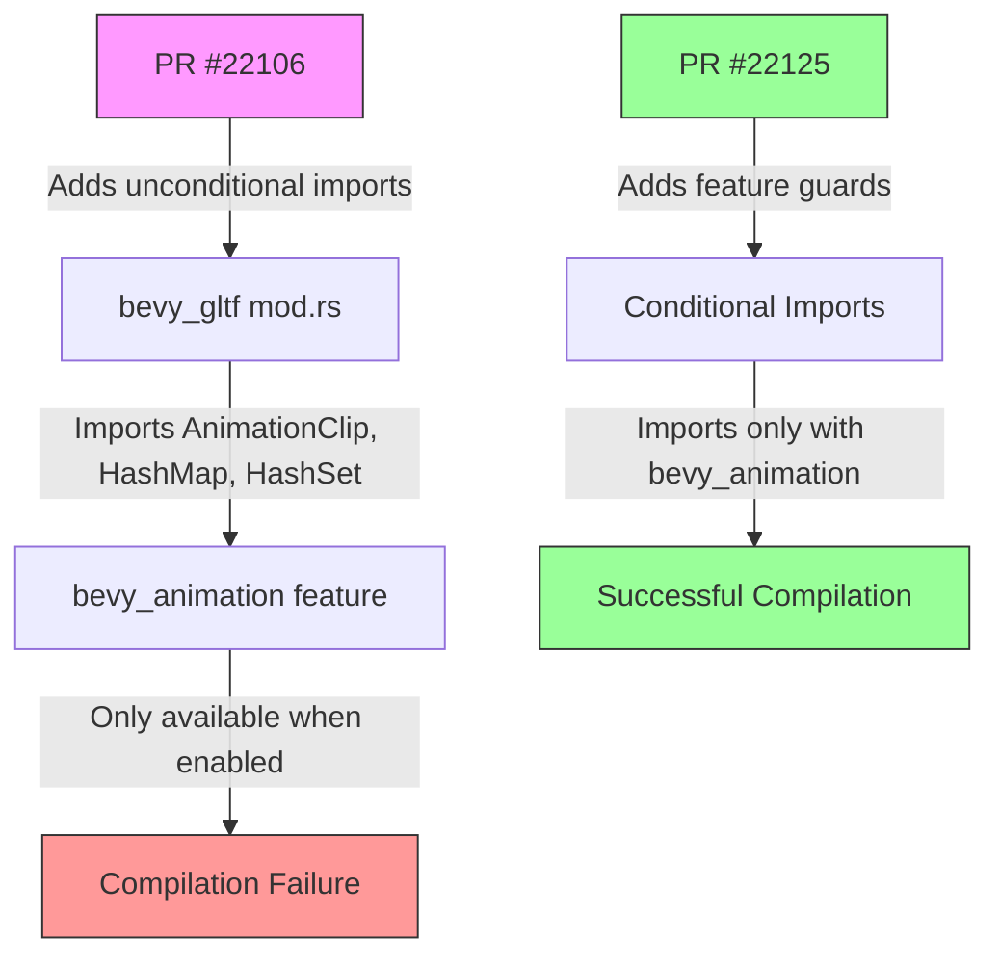

+++
title = "#22125 Fix compilation errors and warnings when running bevy_gltf with no features."
date = "2025-12-15T00:00:00"
draft = false
template = "pull_request_page.html"
in_search_index = true

[taxonomies]
list_display = ["show"]

[extra]
current_language = "en"
available_languages = {"en" = { name = "English", url = "/pull_request/bevy/2025-12/pr-22125-en-20251215" }, "zh-cn" = { name = "中文", url = "/pull_request/bevy/2025-12/pr-22125-zh-cn-20251215" }}
labels = ["C-Bug", "D-Trivial", "A-glTF"]
+++

# Title

## Basic Information
- **Title**: Fix compilation errors and warnings when running bevy_gltf with no features.
- **PR Link**: https://github.com/bevyengine/bevy/pull/22125
- **Author**: andriyDev
- **Status**: MERGED
- **Labels**: C-Bug, D-Trivial, S-Needs-Review, A-glTF
- **Created**: 2025-12-15T07:20:25Z
- **Merged**: 2025-12-15T09:01:42Z
- **Merged By**: mockersf

## Description Translation

# Objective

- #22106 accidentally added imports for AnimationClip, HashMap, and HashSet - but these are only available/used if the bevy_animation feature is enabled. So running `cargo t -p bevy_gltf` fails to compile and gives warnings!

## Solution

- Guard these `use` statements on the bevy_animation feature.

## Testing

- Ran `cargo t -p bevy_gltf`.
- Ran `cargo t -p bevy_gltf --all-features`.

## The Story of This Pull Request

This pull request addresses a straightforward but important compilation issue in the Bevy glTF loader. The problem originated from PR #22106, which introduced unconditional imports for types that are only available when the `bevy_animation` feature is enabled. Specifically, it added imports for `AnimationClip`, `HashMap`, and `HashSet` without proper feature gating.

The issue manifested when developers ran tests for the `bevy_gltf` crate without the animation feature enabled. Running `cargo t -p bevy_gltf` would fail to compile and produce warnings because the compiler couldn't find these types in the current feature configuration. This is a classic conditional compilation problem in Rust projects with optional features - importing types that don't exist in the current feature set breaks compilation.

The solution approach was clean and minimal: wrap the problematic imports with `#[cfg(feature = "bevy_animation")]` attribute. This Rust conditional compilation directive ensures the imports are only included when the specified feature is enabled. The implementation moved the three imports into a single conditional block, which is more maintainable than scattering individual `#[cfg]` attributes.

From a technical perspective, this fix demonstrates proper feature management in Rust crates. Bevy uses a modular feature system where different components (like animation, rendering, UI) can be enabled or disabled. When a module imports types from another module that's behind a feature flag, those imports must be similarly guarded. The error occurred because PR #22106 added the imports but didn't consider that `bevy_animation` might not be available.

The impact of this fix is immediate: it restores the ability to compile and test `bevy_gltf` with minimal feature sets. This is important for several reasons. First, it maintains compatibility with workflows that don't require animation functionality. Second, it ensures CI/CD pipelines that test different feature combinations continue to work. Third, it prevents downstream users from encountering unexpected compilation errors when they use `bevy_gltf` without animation features.

The fix also shows good Rust practice by grouping related conditional imports together using the `use { ... }` syntax with the `#[cfg]` attribute applied to the entire block. This is cleaner than applying the attribute to each import individually and makes the dependency relationships clearer.

## Visual Representation



## Key Files Changed

### `crates/bevy_gltf/src/loader/extensions/mod.rs` (+6/-2)

This file contains the module declarations and imports for glTF loader extensions. The changes fix conditional compilation by properly guarding imports behind the `bevy_animation` feature flag.

**Before the change:**
```rust
use alloc::sync::Arc;
use async_lock::RwLock;

use bevy_animation::AnimationClip;
use bevy_asset::{Handle, LoadContext};
use bevy_ecs::{
    entity::Entity,
    prelude::Component,
    world::{EntityWorldMut, World},
};
use bevy_pbr::StandardMaterial;
use bevy_platform::collections::{HashMap, HashSet};
use gltf::Node;
```

**After the change:**
```rust
use alloc::sync::Arc;
use async_lock::RwLock;

use bevy_asset::{Handle, LoadContext};
use bevy_ecs::{
    entity::Entity,
    prelude::Component,
    world::{EntityWorldMut, World},
};
use bevy_pbr::StandardMaterial;
use gltf::Node;

#[cfg(feature = "bevy_animation")]
use {
    bevy_animation::AnimationClip,
    bevy_platform::collections::{HashMap, HashSet},
};
```

The changes:
1. Removed the unconditional imports of `bevy_animation::AnimationClip` and `bevy_platform::collections::{HashMap, HashSet}`
2. Added a conditional import block that only includes these imports when the `bevy_animation` feature is enabled
3. Used Rust's grouped import syntax within the conditional block for cleaner code

These changes ensure that when `bevy_gltf` is compiled without the `bevy_animation` feature, the compiler won't try to resolve imports for types that don't exist in that configuration. The rest of the code that uses these types is presumably already guarded by the same feature flag, making this a complete fix.

## Further Reading

1. **Rust Conditional Compilation**: The Rust Reference chapter on conditional compilation explains `#[cfg]` attributes and feature-based compilation: https://doc.rust-lang.org/reference/conditional-compilation.html
2. **Cargo Features**: The Cargo Book section on features explains how to define and use features in Rust projects: https://doc.rust-lang.org/cargo/reference/features.html
3. **Bevy's Feature System**: Bevy's architecture uses features extensively to allow users to include only the components they need. The Bevy Book covers this in the "Features" section.
4. **Previous PR #22106**: Understanding the changes that introduced this bug provides context for why feature guards are necessary when adding new dependencies between Bevy modules.

# Full Code Diff
```
diff --git a/crates/bevy_gltf/src/loader/extensions/mod.rs b/crates/bevy_gltf/src/loader/extensions/mod.rs
index 133420881a9cf..d024f39175c94 100644
--- a/crates/bevy_gltf/src/loader/extensions/mod.rs
+++ b/crates/bevy_gltf/src/loader/extensions/mod.rs
@@ -7,7 +7,6 @@ mod khr_materials_specular;
 use alloc::sync::Arc;
 use async_lock::RwLock;
 
-use bevy_animation::AnimationClip;
 use bevy_asset::{Handle, LoadContext};
 use bevy_ecs::{
     entity::Entity,
@@ -15,9 +14,14 @@ use bevy_ecs::{
     world::{EntityWorldMut, World},
 };
 use bevy_pbr::StandardMaterial;
-use bevy_platform::collections::{HashMap, HashSet};
 use gltf::Node;
 
+#[cfg(feature = "bevy_animation")]
+use {
+    bevy_animation::AnimationClip,
+    bevy_platform::collections::{HashMap, HashSet},
+};
+
 use crate::GltfMesh;
 
 pub(crate) use self::{
```