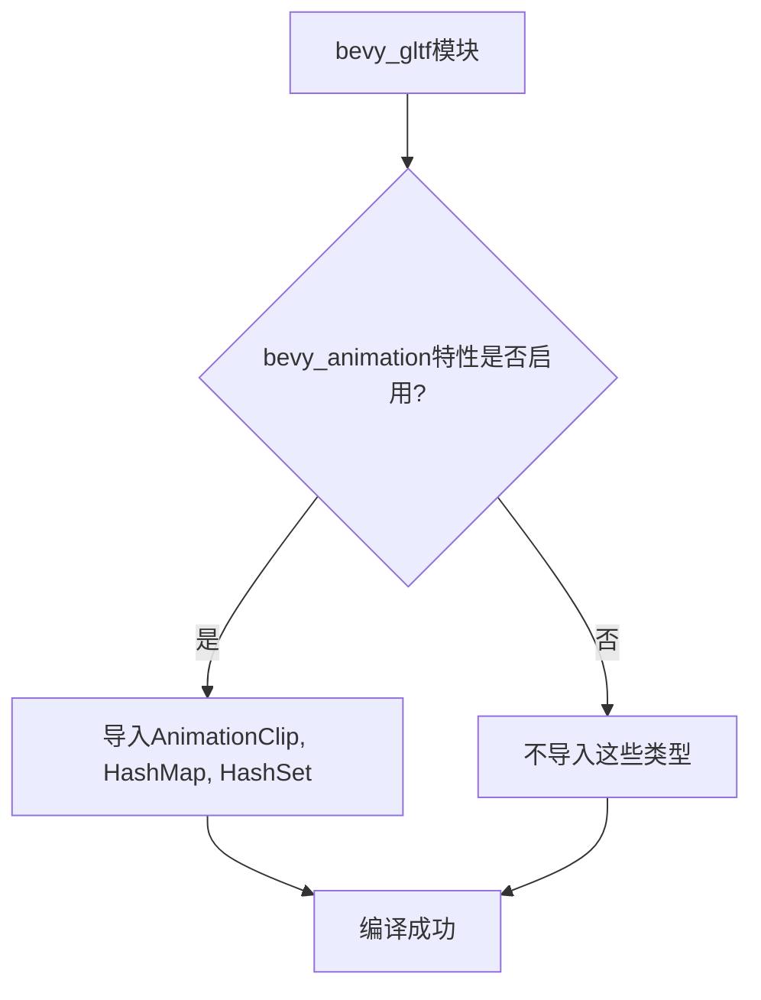

+++
title = "#22125 Fix compilation errors and warnings when running bevy_gltf with no features."
date = "2025-12-15T00:00:00"
draft = false
template = "pull_request_page.html"
in_search_index = false

[extra]
current_language = "zh-cn"
available_languages = {"en" = { name = "English", url = "/pull_request/bevy/2025-12/pr-22125-en-20251215" }, "zh-cn" = { name = "中文", url = "/pull_request/bevy/2025-12/pr-22125-zh-cn-20251215" }}
+++

# Title
Fix compilation errors and warnings when running bevy_gltf with no features.

## Basic Information
- **Title**: Fix compilation errors and warnings when running bevy_gltf with no features.
- **PR Link**: https://github.com/bevyengine/bevy/pull/22125
- **作者**: andriyDev
- **状态**: 已合并
- **标签**: C-Bug, D-Trivial, S-Needs-Review, A-glTF
- **创建时间**: 2025-12-15T07:20:25Z
- **合并时间**: 2025-12-15T09:01:42Z
- **合并者**: mockersf

## 描述翻译
### 目标
- PR #22106 意外地添加了对 `AnimationClip`、`HashMap` 和 `HashSet` 的导入 - 但这些只有在 `bevy_animation` 特性启用时才可用/被使用。因此运行 `cargo t -p bevy_gltf` 时编译失败并产生警告！

### 解决方案
- 将这些 `use` 语句通过 `bevy_animation` 特性进行条件编译保护。

### 测试
- 运行了 `cargo t -p bevy_gltf`。
- 运行了 `cargo t -p bevy_gltf --all-features`。

## 这个拉取请求的故事

这个PR解决了一个由特性标志管理不当导致的编译错误问题。Bevy引擎使用特性标志（feature flags）来模块化其功能，允许用户只启用他们需要的组件，从而减少编译时间和二进制大小。当`bevy_gltf`模块在没有启用`bevy_animation`特性时，PR #22106引入的代码更改导致了编译失败。

问题出现在`crates/bevy_gltf/src/loader/extensions/mod.rs`文件中。之前的PR #22106添加了几个导入语句：`bevy_animation::AnimationClip`以及来自`bevy_platform::collections`的`HashMap`和`HashSet`。然而，这些类型只在`bevy_animation`特性启用时才被使用。当用户运行`cargo t -p bevy_gltf`（即不启用任何特性）时，编译器无法找到这些类型定义，导致编译错误和警告。

开发者采取的解决方案是使用Rust的条件编译属性`#[cfg(feature = "bevy_animation")]`来保护这些导入。这种方法是Rust生态系统中处理特性相关依赖的标准做法。通过将导入语句包裹在条件编译块中，这些导入只会在`bevy_animation`特性启用时被包含在编译过程中。

技术实现上，开发者使用了Rust的模块导入分组语法。他们将两个原本独立的导入语句合并到一个`use`分组中，并在这个分组前添加了`#[cfg(feature = "bevy_animation")]`属性。这种做法的优点是保持代码整洁，同时确保只有在需要时才导入相关依赖。

值得注意的是，`HashMap`和`HashSet`虽然来自`bevy_platform::collections`模块而非`bevy_animation`模块，但它们只在动画相关的代码路径中使用。因此，将它们与`AnimationClip`一起条件导入是合理的，这反映了Bevy的架构设计：某些模块可能依赖其他模块的类型，而这些依赖需要通过特性标志来管理。

这个修复虽然简单，但体现了几个重要的工程实践：首先，特性标志的正确使用对于维护模块化代码库至关重要；其次，即使小的更改也需要考虑所有可能的配置组合；最后，持续集成测试应该覆盖不同的特性组合，以避免这类回归问题。

从工程角度看，这个PR展示了条件编译在管理可选依赖中的实际应用。在大型Rust项目中，特性标志管理是一个常见挑战，正确处理它们可以确保代码在不同配置下都能正确编译。这种模式也体现了Rust编译器的严格性：它会检查所有导入是否有效，即使相关代码路径由于条件编译而未被使用。

## 视觉表示



## 关键文件变更

### `crates/bevy_gltf/src/loader/extensions/mod.rs` (+6/-2)

这个文件是`bevy_gltf`模块中加载器扩展的主要模块文件。更改涉及条件导入几个只有在`bevy_animation`特性启用时才需要的类型。

**修改前:**
```rust
use alloc::sync::Arc;
use async_lock::RwLock;

use bevy_animation::AnimationClip;
use bevy_asset::{Handle, LoadContext};
use bevy_ecs::{
    entity::Entity,
    prelude::Component,
    world::{EntityWorldMut, World},
};
use bevy_pbr::StandardMaterial;
use bevy_platform::collections::{HashMap, HashSet};
use gltf::Node;
```

**修改后:**
```rust
use alloc::sync::Arc;
use async_lock::RwLock;

use bevy_asset::{Handle, LoadContext};
use bevy_ecs::{
    entity::Entity,
    prelude::Component,
    world::{EntityWorldMut, World},
};
use bevy_pbr::StandardMaterial;
use gltf::Node;

#[cfg(feature = "bevy_animation")]
use {
    bevy_animation::AnimationClip,
    bevy_platform::collections::{HashMap, HashSet},
};
```

**变更说明:**
1. 移除了对`bevy_animation::AnimationClip`的无条件导入
2. 移除了对`bevy_platform::collections::{HashMap, HashSet}`的无条件导入  
3. 添加了条件编译块，只有当`bevy_animation`特性启用时才导入这些类型
4. 使用了Rust的导入分组语法，将两个相关的导入组合在一起

这些更改确保了当`bevy_gltf`在不启用`bevy_animation`特性时也能正常编译，同时保持了启用该特性时的原有功能。

## 扩展阅读

对于想深入了解相关概念的读者，建议参考以下资源：

1. **Rust条件编译官方文档**: [Conditional compilation - The Rust Reference](https://doc.rust-lang.org/reference/conditional-compilation.html) - 了解Rust中`#[cfg]`属性的各种用法。

2. **Bevy特性标志指南**: [Bevy's Cargo Features](https://bevyengine.org/learn/quick-start/features/) - Bevy官方文档中关于特性标志的说明。

3. **Cargo特性文档**: [The Cargo Book - Features](https://doc.rust-lang.org/cargo/reference/features.html) - Cargo特性系统的完整说明。

4. **Rust模块系统**: [The Rust Programming Language - Modules](https://doc.rust-lang.org/book/ch07-02-defining-modules-to-control-scope-and-privacy.html) - 理解Rust的模块和导入系统。

5. **Bevy动画系统**: [Bevy Animation](https://bevyengine.org/examples/animation/) - Bevy动画系统的示例和文档。

# Full Code Diff
diff --git a/crates/bevy_gltf/src/loader/extensions/mod.rs b/crates/bevy_gltf/src/loader/extensions/mod.rs
index 133420881a9cf..d024f39175c94 100644
--- a/crates/bevy_gltf/src/loader/extensions/mod.rs
+++ b/crates/bevy_gltf/src/loader/extensions/mod.rs
@@ -7,7 +7,6 @@ mod khr_materials_specular;
 use alloc::sync::Arc;
 use async_lock::RwLock;
 
-use bevy_animation::AnimationClip;
 use bevy_asset::{Handle, LoadContext};
 use bevy_ecs::{
     entity::Entity,
@@ -15,9 +14,14 @@ use bevy_ecs::{
     world::{EntityWorldMut, World},
 };
 use bevy_pbr::StandardMaterial;
-use bevy_platform::collections::{HashMap, HashSet};
 use gltf::Node;
 
+#[cfg(feature = "bevy_animation")]
+use {
+    bevy_animation::AnimationClip,
+    bevy_platform::collections::{HashMap, HashSet},
+};
+
 use crate::GltfMesh;
 
 pub(crate) use self::{