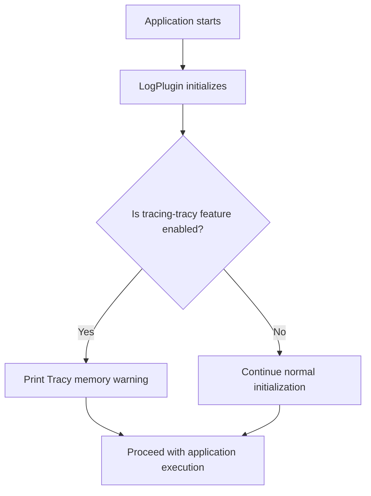

+++
title = "#22129 Add warning about tracy being enabled"
date = "2025-12-16T00:00:00"
draft = false
template = "pull_request_page.html"
in_search_index = true

[taxonomies]
list_display = ["show"]

[extra]
current_language = "en"
available_languages = {"en" = { name = "English", url = "/pull_request/bevy/2025-12/pr-22129-en-20251216" }, "zh-cn" = { name = "中文", url = "/pull_request/bevy/2025-12/pr-22129-zh-cn-20251216" }}
labels = ["C-Usability", "A-Diagnostics", "D-Straightforward"]
+++

# Title

## Basic Information
- **Title**: Add warning about tracy being enabled
- **PR Link**: https://github.com/bevyengine/bevy/pull/22129
- **Author**: laundmo
- **Status**: MERGED
- **Labels**: C-Usability, S-Ready-For-Final-Review, A-Diagnostics, D-Straightforward
- **Created**: 2025-12-15T15:34:45Z
- **Merged**: 2025-12-16T03:55:05Z
- **Merged By**: alice-i-cecile

## Description Translation
The original description is in English, so it is included exactly as-is:

# Objective

- Fixes: #10831 

## Solution

- Print a warning about tracy memory usage

## Testing

Did this from my phone, so obviously untested, but its also very simple. Will test later if i don't forget.

## The Story of This Pull Request

This pull request addresses a usability issue where developers might not realize that enabling Tracy profiling in Bevy applications can lead to unexpected memory consumption. The problem was documented in issue #10831, which reported that when the `tracing-tracy` feature is enabled but no Tracy client is connected, memory usage continuously grows without any indication to the developer.

The core issue is a common pitfall with profiling tools: Tracy, a real-time profiling library, buffers profiling data in memory when no client is connected to collect it. Without a visible warning, developers might enable Tracy for profiling purposes, forget to connect a Tracy client, and then wonder why their application's memory usage keeps increasing during extended runs.

The solution implemented here is straightforward and pragmatic. Instead of attempting to modify Tracy's behavior or implement complex memory monitoring, the PR adds a simple warning message that alerts developers when Tracy is active. This follows the principle of fail-fast and clear communication - letting developers know about potential side effects immediately rather than letting them discover the issue through debugging.

The implementation modifies the `LogPlugin` in Bevy's logging system. Specifically, it adds a warning log statement that triggers when the `tracing-tracy` feature is enabled. The warning is placed within the `Plugin::build` method of `LogPlugin`, which is executed when the plugin is initialized. This placement ensures the warning appears early in the application lifecycle, giving developers immediate feedback.

From a technical perspective, the implementation uses Rust's conditional compilation with `#[cfg(feature = "tracing-tracy")]` to ensure the warning only appears when the Tracy feature is actually enabled. This prevents unnecessary warnings in builds without Tracy support. The warning message clearly states both the condition ("Tracing with Tracy is active") and the consequence ("memory consumption will grow until a client is connected"), providing developers with complete information.

The PR demonstrates good practice in diagnostic messaging. The warning is logged at the appropriate level (warn), uses clear and actionable language, and appears at the right time in the application lifecycle. It also respects existing logging configurations since it's integrated into Bevy's established logging infrastructure.

The impact of this change is significant for developer experience. While the code change is minimal, it prevents potentially confusing debugging sessions where developers might suspect memory leaks in their own code when the actual issue is Tracy's buffering behavior. This aligns with Bevy's focus on developer ergonomics and clear error/warning messages.

## Visual Representation



## Key Files Changed

### `crates/bevy_log/src/lib.rs` (+3/-0)

This file contains the LogPlugin implementation that handles Bevy's logging setup. The change adds a warning message when the Tracy profiling feature is enabled.

**Key Modification:**
```rust
// File: crates/bevy_log/src/lib.rs
// Before (simplified context):
impl Plugin for LogPlugin {
    fn build(&self, app: &mut App) {
        let subscriber_already_set =
            tracing::subscriber::set_global_default(finished_subscriber).is_err();

        match (logger_already_set, subscriber_already_set) {
            // ... existing error handling
        }
    }
}

// After:
impl Plugin for LogPlugin {
    fn build(&self, app: &mut App) {
        let subscriber_already_set =
            tracing::subscriber::set_global_default(finished_subscriber).is_err();

        #[cfg(feature = "tracing-tracy")]
        warn!("Tracing with Tracy is active, memory consumption will grow until a client is connected");

        match (logger_already_set, subscriber_already_set) {
            // ... existing error handling
        }
    }
}
```

The change adds three lines:
1. A conditional compilation attribute `#[cfg(feature = "tracing-tracy")]` that ensures the code only compiles when the Tracy feature is enabled
2. A warning log statement using the `warn!` macro
3. The warning message clearly explains both the state and the consequence

This change directly addresses the issue by providing immediate feedback to developers when they enable Tracy profiling, preventing confusion about memory growth.

## Further Reading

1. **Tracy Profiler Documentation**: [https://github.com/wolfpld/tracy](https://github.com/wolfpld/tracy) - Official Tracy profiler documentation for understanding its features and behavior
2. **Rust Conditional Compilation**: [https://doc.rust-lang.org/reference/conditional-compilation.html](https://doc.rust-lang.org/reference/conditional-compilation.html) - Rust reference on `#[cfg]` attributes and feature-based compilation
3. **Bevy Logging System**: [https://github.com/bevyengine/bevy/tree/main/crates/bevy_log](https://github.com/bevyengine/bevy/tree/main/crates/bevy_log) - Source code for Bevy's logging infrastructure
4. **Issue #10831**: [https://github.com/bevyengine/bevy/issues/10831](https://github.com/bevyengine/bevy/issues/10831) - The original issue that reported the problem with Tracy memory usage
5. **Diagnostic Best Practices**: Patterns for effective error and warning messages in software systems

# Full Code Diff
```diff
diff --git a/crates/bevy_log/src/lib.rs b/crates/bevy_log/src/lib.rs
index 0abe1941c5793..72163f2516075 100644
--- a/crates/bevy_log/src/lib.rs
+++ b/crates/bevy_log/src/lib.rs
@@ -407,6 +407,9 @@ impl Plugin for LogPlugin {
         let subscriber_already_set =
             tracing::subscriber::set_global_default(finished_subscriber).is_err();
 
+        #[cfg(feature = "tracing-tracy")]
+        warn!("Tracing with Tracy is active, memory consumption will grow until a client is connected");
+
         match (logger_already_set, subscriber_already_set) {
             (true, true) => error!(
                 "Could not set global logger and tracing subscriber as they are already set. Consider disabling LogPlugin."
```