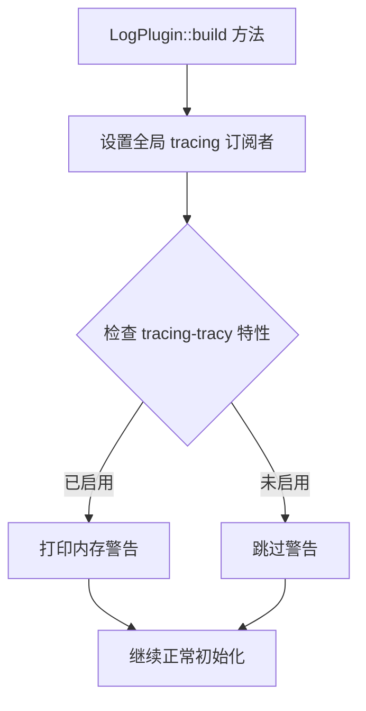

+++
title = "#22129 Add warning about tracy being enabled"
date = "2025-12-16T00:00:00"
draft = false
template = "pull_request_page.html"
in_search_index = false

[extra]
current_language = "zh-cn"
available_languages = {"en" = { name = "English", url = "/pull_request/bevy/2025-12/pr-22129-en-20251216" }, "zh-cn" = { name = "中文", url = "/pull_request/bevy/2025-12/pr-22129-zh-cn-20251216" }}
+++

# 添加 Tracy 启用警告

## 基本信息
- **标题**: Add warning about tracy being enabled
- **PR 链接**: https://github.com/bevyengine/bevy/pull/22129
- **作者**: laundmo
- **状态**: 已合并
- **标签**: C-Usability, S-Ready-For-Final-Review, A-Diagnostics, D-Straightforward
- **创建时间**: 2025-12-15T15:34:45Z
- **合并时间**: 2025-12-16T03:55:05Z
- **合并者**: alice-i-cecile

## 描述翻译

### 目标
- 修复: #10831 

### 解决方案
- 打印关于 tracy 内存使用的警告

### 测试
用手机提交的，所以显然没测试过，但改动也很简单。如果没忘记的话，稍后会测试。

## 这个 Pull Request 的技术分析

这个 PR 解决了一个关于 Tracy 性能分析工具的已知问题。Tracy 是一个实时性能分析工具，可以用于分析 Bevy 应用程序的性能。问题 #10831 报告了一个用户可能没有意识到的行为：当启用 Tracy 但未连接客户端时，Tracy 会持续缓存性能数据，导致内存使用量不断增长，直到连接客户端或应用程序内存耗尽。

问题本质是用户体验问题。对于不熟悉 Tracy 工作原理的开发者来说，他们可能启用了 `tracing-tracy` 特性，但没有运行 Tracy 客户端来连接和读取数据。在这种情况下，应用程序会持续消耗内存来存储性能数据，而用户可能不知道这是正常行为。

解决方案直接而实用：在启用 `tracing-tracy` 特性时添加一个警告日志。这个警告会在应用程序启动时显示，提醒用户 Tracy 正在运行且内存使用会增长，直到客户端连接。

从实现角度看，这个改动非常简洁。在 `LogPlugin` 的 `build` 方法中，在设置了全局 tracing 订阅者后，添加了一个条件编译块。这个条件编译检查 `tracing-tracy` 特性是否启用，如果启用则打印警告信息。

```rust
#[cfg(feature = "tracing-tracy")]
warn!("Tracing with Tracy is active, memory consumption will grow until a client is connected");
```

这里有几个技术细节值得注意：
1. **条件编译的使用**：通过 `#[cfg(feature = "tracing-tracy")]` 确保只有启用该特性时才编译和运行这段代码。这是 Rust 条件编译的标准做法，避免了不必要的运行时检查。
2. **日志级别选择**：使用 `warn!` 宏而不是 `info!` 或 `error!` 是恰当的。这是一个需要用户注意但不影响程序正常运行的警告。
3. **位置选择**：警告放在 `tracing::subscriber::set_global_default` 调用之后是合理的，因为这是 Tracy tracing 订阅者设置完成的地方。

这个改动体现了良好的开发者体验设计原则：当框架有潜在令人困惑的行为时，应该主动告知用户。这种主动的警告可以帮助开发者快速诊断问题，而不是让他们花费时间调试看似异常的"内存泄漏"。

从架构角度看，这个改动属于诊断和改进用户体验的范畴，不会影响任何核心功能或性能（除了添加了一行日志输出）。这是一个典型的质量改进（Quality-of-Life improvement）变更。

## 可视化表示



## 关键文件更改

### `crates/bevy_log/src/lib.rs` (+3/-0)

1. **更改说明和原因**：
   - 添加了条件编译的警告日志，当启用 `tracing-tracy` 特性时，通知用户内存使用会增长直到连接 Tracy 客户端
   - 解决用户可能不知道 Tracy 在没有客户端连接时持续消耗内存的问题

2. **代码片段**：

```rust
// 修改前：
impl Plugin for LogPlugin {
    fn build(&self, app: &mut App) {
        // ... 之前的代码 ...
        
        let subscriber_already_set =
            tracing::subscriber::set_global_default(finished_subscriber).is_err();

        match (logger_already_set, subscriber_already_set) {
            (true, true) => error!(
                "Could not set global logger and tracing subscriber as they are already set. Consider disabling LogPlugin."
            ),
            // ... 其他匹配分支 ...
        }
    }
}

// 修改后：
impl Plugin for LogPlugin {
    fn build(&self, app: &mut App) {
        // ... 之前的代码 ...
        
        let subscriber_already_set =
            tracing::subscriber::set_global_default(finished_subscriber).is_err();

        #[cfg(feature = "tracing-tracy")]
        warn!("Tracing with Tracy is active, memory consumption will grow until a client is connected");

        match (logger_already_set, subscriber_already_set) {
            (true, true) => error!(
                "Could not set global logger and tracing subscriber as they are already set. Consider disabling LogPlugin."
            ),
            // ... 其他匹配分支 ...
        }
    }
}
```

3. **与 PR 目的的关系**：
   - 这个简单的三行添加直接解决了问题 #10831，为用户提供了关于 Tracy 内存使用的明确警告
   - 警告放在适当的位置，确保只在相关特性启用时显示，不影响其他使用场景

## 延伸阅读

1. **Tracy 性能分析工具**：
   - [Tracy GitHub 仓库](https://github.com/wolfpld/tracy) - 官方仓库和文档
   - [Bevy 中的性能分析](https://bevyengine.org/learn/book/getting-started/performance/) - Bevy 文档中的性能分析指南

2. **Rust 条件编译**：
   - [Rust 参考手册中的条件编译](https://doc.rust-lang.org/reference/conditional-compilation.html) - 官方语法和用法说明
   - [Cargo 特性指南](https://doc.rust-lang.org/cargo/reference/features.html) - 如何在 Cargo 中定义和使用特性

3. **Bevy 日志系统**：
   - [Bevy Log Crate 文档](https://docs.rs/bevy_log/latest/bevy_log/) - 详细的 API 文档
   - [Bevy 中的诊断和日志记录](https://bevyengine.org/learn/book/getting-started/diagnostics/) - 如何使用 Bevy 的诊断系统