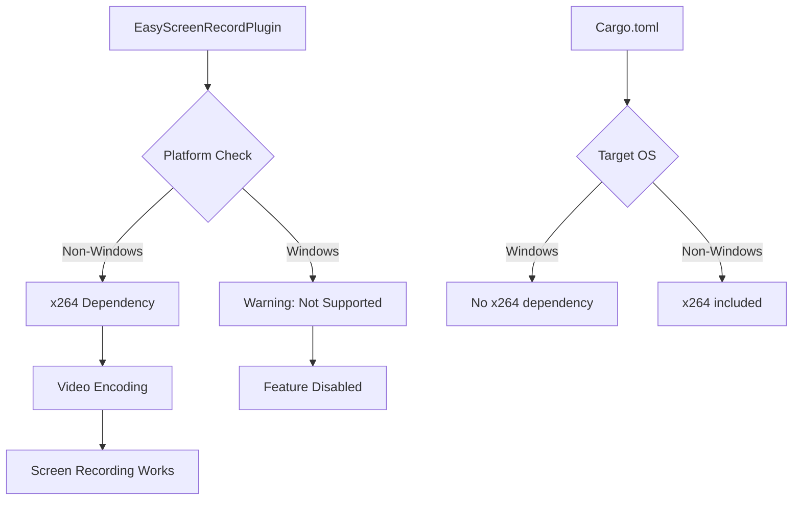

+++
title = "#22130 disable screenrecording on windows"
date = "2025-12-15T00:00:00"
draft = false
template = "pull_request_page.html"
in_search_index = true

[taxonomies]
list_display = ["show"]

[extra]
current_language = "en"
available_languages = {"en" = { name = "English", url = "/pull_request/bevy/2025-12/pr-22130-en-20251215" }, "zh-cn" = { name = "中文", url = "/pull_request/bevy/2025-12/pr-22130-zh-cn-20251215" }}
labels = ["O-Windows", "A-Dev-Tools"]
+++

# Title
disable screenrecording on windows

## Basic Information
- **Title**: disable screenrecording on windows
- **PR Link**: https://github.com/bevyengine/bevy/pull/22130
- **Author**: mockersf
- **Status**: MERGED
- **Labels**: O-Windows, A-Dev-Tools, S-Needs-Review
- **Created**: 2025-12-15T15:46:23Z
- **Merged**: 2025-12-15T21:12:20Z
- **Merged By**: alice-i-cecile

## Description Translation
# Objective

- Screen Recording is not ready to be exposed, and very hard to build on windows

## Solution

- Disable it for now on windows

## The Story of This Pull Request

This PR addresses a build issue with the screen recording feature on Windows by conditionally disabling it while maintaining functionality on other platforms. The core problem was that the `x264` crate, used for video encoding in the screen recording functionality, presents significant build challenges on Windows. Rather than attempting to fix these complex dependency issues immediately, the maintainers opted for a pragmatic solution: disable screen recording on Windows entirely while keeping the feature available on Linux and macOS.

The implementation demonstrates careful use of Rust's conditional compilation system. The changes are surgical - they modify the build configuration to exclude the problematic dependency on Windows while preserving the existing code structure. In `Cargo.toml`, the `x264` dependency is moved to a target-specific section that only applies to non-Windows platforms. This prevents Windows users from encountering build errors related to `x264` compilation.

In the main code file, the approach is more sophisticated. Instead of simply removing the feature on Windows, the code restructures the screen recording implementation into a conditional block that only compiles on non-Windows systems. For Windows builds with the `screenrecording` feature enabled, the plugin still compiles but only logs a warning message and provides stub implementations for the `Preset` and `Tune` enums that would normally come from the `x264` crate. This maintains API compatibility while preventing runtime errors.

The conditional compilation strategy uses `#[cfg(all(not(target_os = "windows"), feature = "screenrecording"))]` to guard the actual recording implementation, while providing placeholder types on Windows with `#[cfg(all(target_os = "windows", feature = "screenrecording"))]`. This ensures that code that depends on these types can still compile, even though the functionality is disabled.

The PR also includes a documentation update in the release notes, adding a clear note that screen recording doesn't work on Windows. This transparency helps users understand the platform limitations without needing to discover them through trial and error.

The solution is temporary but practical - it unblocks Windows users from building Bevy with development tools while the team works on a more permanent solution for cross-platform screen recording support. The implementation shows good engineering judgment by choosing a minimal, maintainable fix over attempting to solve the complex `x264` Windows build issues immediately.

## Visual Representation



## Key Files Changed

### `crates/bevy_dev_tools/Cargo.toml`
**What changed**: The `x264` dependency was moved to a target-specific section that only applies to non-Windows platforms. The `screenrecording` feature definition was also updated to use the new `dep:` syntax.

**Why**: This prevents Windows builds from attempting to compile the problematic `x264` crate while maintaining the feature for other platforms.

```toml
# Before:
[features]
screenrecording = ["x264"]

[dependencies]
x264 = { version = "0.5.0", optional = true }

# After:
[features]
screenrecording = ["dep:x264"]

[target.'cfg(not(target_os = "windows"))'.dependencies]
x264 = { version = "0.5.0", optional = true }
```

### `crates/bevy_dev_tools/src/easy_screenshot.rs`
**What changed**: The screen recording implementation was wrapped in conditional compilation blocks that only enable it on non-Windows platforms. Placeholder types were added for Windows builds to maintain API compatibility.

**Why**: This allows the plugin to compile on Windows while providing a clear warning that the feature isn't supported, rather than failing to build entirely.

```rust
// Key change: Conditional compilation for non-Windows only
#[cfg(all(not(target_os = "windows"), feature = "screenrecording"))]
pub use x264::{Preset, Tune};

// Placeholder types for Windows builds
#[cfg(all(target_os = "windows", feature = "screenrecording"))]
pub enum Preset {
    /// Placeholder
    Ultrafast,
    // ... other variants
}

// Plugin build method with platform-specific logic
fn build(&self, app: &mut App) {
    #[cfg(target_os = "windows")]
    {
        tracing::warn!("Screen recording is not currently supported on Windows: see https://github.com/bevyengine/bevy/issues/22132");
    }
    #[cfg(not(target_os = "windows"))]
    {
        // Actual screen recording implementation
        // ... (rest of the code)
    }
}
```

### `release-content/release-notes/easy_marketing_material.md`
**What changed**: Added a note clarifying that screen recording doesn't work on Windows.

**Why**: User transparency - developers should know about platform limitations before attempting to use the feature.

```markdown
It is now possible to record a movie from Bevy, with the new `EasyScreenRecordPlugin`. This plugins add a toggle key, space bar by default, that will toggle screen recording. Recording can also be started and stopped programmatically with the `RecordScreen` messages.

Screen recording is not working for now on Windows.
```

## Further Reading

- [Rust Conditional Compilation](https://doc.rust-lang.org/reference/conditional-compilation.html) - Documentation on Rust's `#[cfg]` attribute for platform-specific code
- [Cargo Target-specific Dependencies](https://doc.rust-lang.org/cargo/reference/specifying-dependencies.html#platform-specific-dependencies) - How to specify dependencies for specific platforms in Cargo.toml
- [x264 Rust Bindings](https://crates.io/crates/x264) - The problematic crate that prompted these changes
- [Bevy Screen Recording Issue #22132](https://github.com/bevyengine/bevy/issues/22132) - The issue tracking screen recording problems on Windows