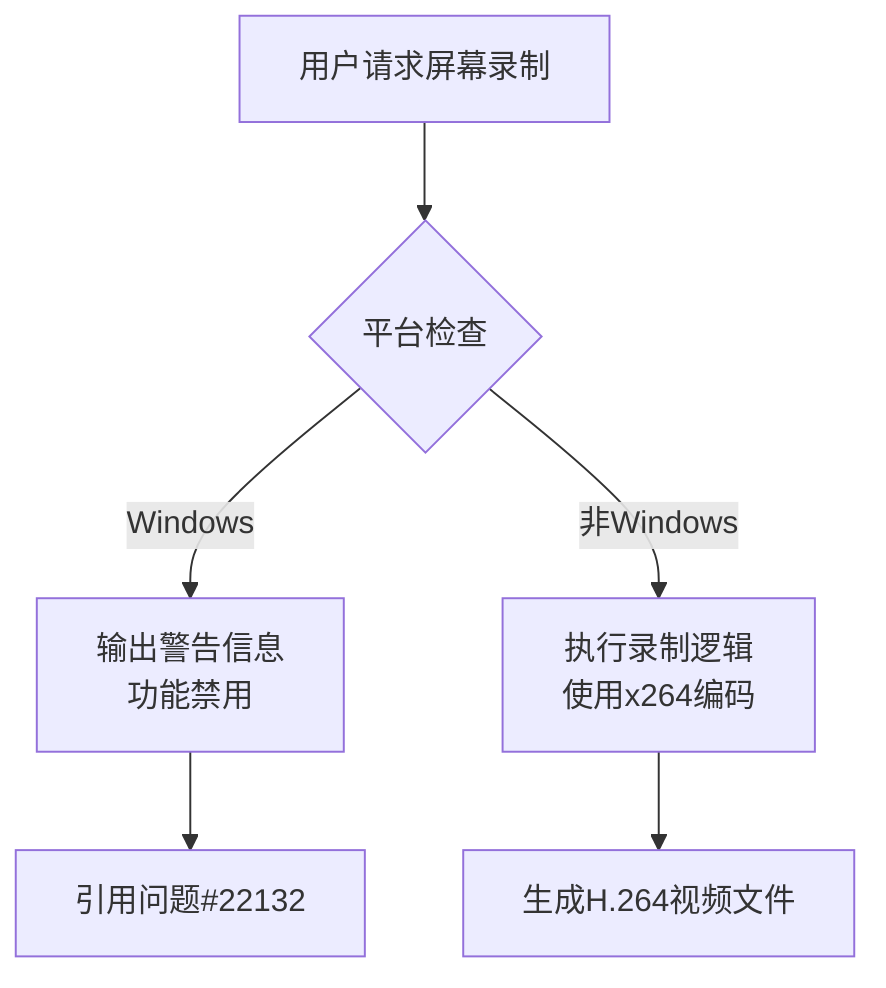

+++
title = "#22130 disable screenrecording on windows"
date = "2025-12-15T00:00:00"
draft = false
template = "pull_request_page.html"
in_search_index = false

[extra]
current_language = "zh-cn"
available_languages = {"en" = { name = "English", url = "/pull_request/bevy/2025-12/pr-22130-en-20251215" }, "zh-cn" = { name = "中文", url = "/pull_request/bevy/2025-12/pr-22130-zh-cn-20251215" }}
+++

# Title

## 基本信息
- **标题**: disable screenrecording on windows
- **PR链接**: https://github.com/bevyengine/bevy/pull/22130
- **作者**: mockersf
- **状态**: 已合并
- **标签**: O-Windows, A-Dev-Tools, S-Needs-Review
- **创建时间**: 2025-12-15T15:46:23Z
- **合并时间**: 2025-12-15T21:12:20Z
- **合并者**: alice-i-cecile

## 描述翻译

# Objective

- 屏幕录制功能尚未准备好公开，且在 Windows 上构建非常困难

## Solution

- 目前在 Windows 上禁用该功能

## 这个Pull Request的故事

这个PR处理的是一个实际的构建问题：Windows平台上的屏幕录制功能存在技术障碍，导致功能不完整且构建困难。开发团队决定采取一个务实的解决方案——暂时在Windows上禁用该功能，而不是让用户面临构建失败或使用有问题的功能。

问题的核心在于`x264`依赖在Windows平台上的构建复杂性。`x264`是一个用C语言编写的H.264视频编码库，在跨平台Rust项目中集成时，特别是在Windows上，经常会出现链接和构建问题。Bevy的屏幕录制功能依赖这个库，但团队发现当前状态下在Windows上维护这个功能代价太高。

解决方案采用了条件编译（conditional compilation）策略。修改集中在两个关键位置：`Cargo.toml`的依赖声明和主要实现文件`easy_screenshot.rs`中的平台特定代码。

首先在`Cargo.toml`中，团队将`x264`依赖改为仅对非Windows目标启用：
```toml
[target.'cfg(not(target_os = "windows"))'.dependencies]
x264 = { version = "0.5.0", optional = true }
```
这种配置方式使用了Cargo的目标特定依赖特性，确保在Windows构建时完全排除`x264`依赖，从而避免相关的构建错误。

更复杂的变化在`easy_screenshot.rs`文件中。这里需要处理一个挑战：屏幕录制功能的公共API（特别是`Preset`和`Tune`枚举）在`x264` crate中被定义，但Windows构建中不再包含这个crate。为了解决这个问题，团队为Windows平台提供了这些枚举的占位符版本：
```rust
#[cfg(all(target_os = "windows", feature = "screenrecording"))]
pub enum Preset {
    /// Placeholder
    Ultrafast,
    // ... 其他变体
}
```
这些占位符枚举保持了公共API的稳定性，同时避免了编译错误。这是一个典型的模式：在条件禁用功能时保持接口不变，确保现有代码的兼容性。

实际的功能逻辑被包装在平台特定的条件块中。对于Windows平台，`EasyScreenRecordPlugin`的`build`方法现在只输出警告信息：
```rust
#[cfg(target_os = "windows")]
{
    tracing::warn!("Screen recording is not currently supported on Windows: see https://github.com/bevyengine/bevy/issues/22132");
}
```
对于非Windows平台，完整的录制逻辑保持不变，但被隔离在`#[cfg(not(target_os = "windows"))]`块内。这种隔离确保了Windows构建完全跳过所有与`x264`相关的代码路径。

这种实现方式体现了几个重要的软件工程原则：
1. **渐进式降级**：功能在部分平台不可用时，系统在其他平台继续正常工作
2. **构建稳定性**：通过条件依赖避免平台特定的构建失败
3. **API稳定性**：保持公共接口不变，避免破坏性变更
4. **用户友好**：通过清晰的警告信息告知用户功能状态

从技术角度看，这个解决方案展示了Rust条件编译系统的强大能力。`#[cfg(...)]`属性允许在编译时根据目标平台、特性标志等条件包含或排除代码。这里使用了组合条件`#[cfg(all(not(target_os = "windows"), feature = "screenrecording"))]`来精确控制代码的包含条件。

团队还添加了`#[cfg_attr]`属性来处理平台特定的编译警告：
```rust
#[cfg_attr(
    target_os = "windows",
    expect(unused_variables, reason = "not working on windows")
)]
```
这告诉编译器在Windows平台上可以预期会有未使用的变量，并提供了理由说明。

这些变化对代码库的影响是局部的。屏幕截图功能（与屏幕录制不同）继续在所有平台上工作。只有屏幕录制功能在Windows上被禁用，同时保持了在其他平台上的完整功能。

从工程实践的角度看，这个PR展示了一种处理跨平台依赖问题的成熟模式：当某个平台的功能维护成本过高时，暂时禁用该功能并提供清晰的替代路径（这里是问题跟踪链接），比维持一个破碎的功能更好。

## 可视化表示



## 关键文件变更

### `crates/bevy_dev_tools/Cargo.toml`
**变化描述**：修改了`x264`依赖的声明方式，使其仅在非Windows平台上启用。

**关键修改**：
```toml
# 之前：
screenrecording = ["x264"]
x264 = { version = "0.5.0", optional = true }

# 之后：
screenrecording = ["dep:x264"]
[target.'cfg(not(target_os = "windows"))'.dependencies]
x264 = { version = "0.5.0", optional = true }
```

**相关说明**：`dep:x264`语法是Cargo中显式声明特性依赖的新方式。目标特定的依赖声明确保Windows构建完全不包含`x264`crate。

### `crates/bevy_dev_tools/src/easy_screenshot.rs`
**变化描述**：重构了屏幕录制功能的实现，在Windows上提供占位符实现并输出警告，在非Windows上保持原有功能。

**关键修改**：
```rust
// 添加了Windows平台的占位符枚举
#[cfg(all(target_os = "windows", feature = "screenrecording"))]
pub enum Preset {
    /// Placeholder
    Ultrafast,
    // ... 其他变体
}

// 修改了插件构建方法，添加平台条件
fn build(&self, app: &mut App) {
    #[cfg(target_os = "windows")]
    {
        tracing::warn!("Screen recording is not currently supported on Windows: see https://github.com/bevyengine/bevy/issues/22132");
    }
    #[cfg(not(target_os = "windows"))]
    {
        // 原有的完整录制逻辑
    }
}
```

**相关说明**：这些变化确保在Windows上编译时不会出现`x264`相关的类型错误，同时为用户提供清晰的功能状态信息。

### `release-content/release-notes/easy_marketing_material.md`
**变化描述**：在发布说明中添加了Windows平台限制的说明。

**关键修改**：
```markdown
It is now possible to record a movie from Bevy, with the new `EasyScreenRecordPlugin`. This plugins add a toggle key, space bar by default, that will toggle screen recording. Recording can also be started and stopped programmatically with the `RecordScreen` messages.

Screen recording is not working for now on Windows.
```

**相关说明**：及时更新文档，管理用户预期，避免用户在不同平台上遇到不一致的行为。

## 延伸阅读

1. [Cargo目标特定依赖文档](https://doc.rust-lang.org/cargo/reference/specifying-dependencies.html#platform-specific-dependencies)
2. [Rust条件编译（#[cfg]）指南](https://doc.rust-lang.org/reference/conditional-compilation.html)
3. [x264-rs crate文档](https://docs.rs/x264/) - 用于Rust的x264绑定
4. [Bevy问题#22132](https://github.com/bevyengine/bevy/issues/22132) - 屏幕录制在Windows上的跟踪问题
5. [条件编译最佳实践](https://rust-lang.github.io/api-guidelines/flexibility.html#conditionally-compile-optional-functionality-c-conditional) - Rust API指南中的相关建议