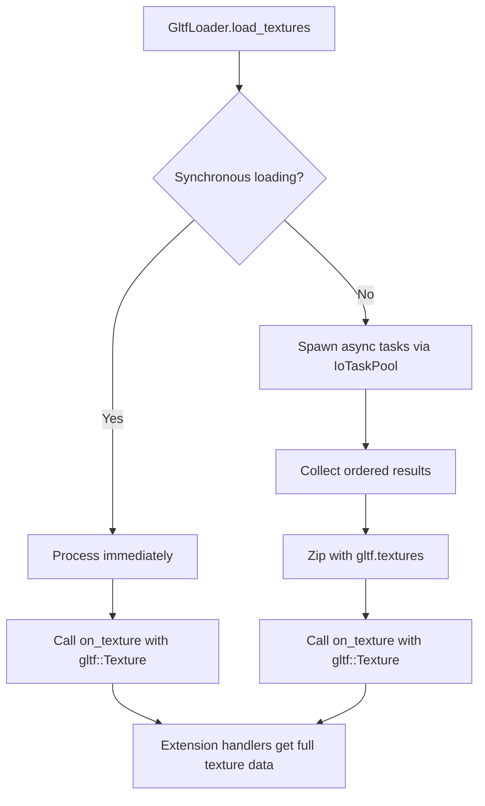

+++
title = "#22131 GltfExtensionHandler::on_texture: pass Texture references"
date = "2025-12-15T00:00:00"
draft = false
template = "pull_request_page.html"
in_search_index = true

[taxonomies]
list_display = ["show"]

[extra]
current_language = "en"
available_languages = {"en" = { name = "English", url = "/pull_request/bevy/2025-12/pr-22131-en-20251215" }, "zh-cn" = { name = "中文", url = "/pull_request/bevy/2025-12/pr-22131-zh-cn-20251215" }}
labels = ["D-Trivial", "A-Assets", "A-glTF"]
+++

# GltfExtensionHandler::on_texture: pass Texture references

## Basic Information
- **Title**: GltfExtensionHandler::on_texture: pass Texture references
- **PR Link**: https://github.com/bevyengine/bevy/pull/22131
- **Author**: ChristopherBiscardi
- **Status**: MERGED
- **Labels**: D-Trivial, A-Assets, S-Ready-For-Final-Review, A-glTF
- **Created**: 2025-12-15T16:53:39Z
- **Merged**: 2025-12-15T21:12:20Z
- **Merged By**: alice-i-cecile

## Description Translation
**Objective**

The extension hooks for `on_texture` currently pass the extension data and not the glTF object.

**Solution**

`IoTaskPool::scope` preserves ordering if the futures are only spawned from the root scope, so we can use that to zip with the texture references for hooks.

## The Story of This Pull Request

This pull request addresses an inconsistency in Bevy's glTF loading extension system. The `GltfExtensionHandler` trait provides hooks for different stages of glTF asset loading, but one of these hooks - `on_texture` - had a different signature than the others. While other hooks receive the actual glTF object reference (like `gltf::Node`, `gltf::Mesh`, etc.), the `on_texture` hook only received the parsed JSON extension data, not the `gltf::Texture` object itself.

The root cause of this inconsistency was a lifetime issue in the asynchronous loading path. When textures are loaded asynchronously, the glTF data (including `gltf::Texture` references) and the loading tasks need to coexist properly. The original implementation avoided this issue by extracting and cloning just the extension data before spawning async tasks, then passing that cloned data to the extension handlers.

The solution leverages a specific property of `IoTaskPool::scope`: it preserves the order of results when futures are only spawned from the root scope. This allows the implementation to:

1. Spawn async texture loading tasks
2. Collect the results while maintaining their original order
3. Pair each result with its corresponding `gltf::Texture` reference from the original glTF data using `zip(gltf.textures())`
4. Pass the complete `gltf::Texture` object to extension handlers instead of just the extension data

This change makes the `on_texture` hook consistent with other hooks in the `GltfExtensionHandler` trait. Now extension handlers can access the full texture metadata, not just extension-specific data. For example, they can inspect the texture's source image, sampler settings, or any other properties defined in the glTF specification.

The implementation is careful to maintain the same behavior in both synchronous and asynchronous loading paths. In the synchronous path (when images are already loaded), the change is straightforward - just pass the `gltf::Texture` reference directly. In the asynchronous path, the zipping approach ensures that texture references remain valid and correctly associated with their loaded image data.

This fix is particularly important for extensions that need to process texture metadata beyond just extension data. Without access to the full `gltf::Texture` object, extension handlers were limited in what they could inspect or modify about textures during loading.

## Visual Representation



## Key Files Changed

### `crates/bevy_gltf/src/loader/extensions/mod.rs` (+1/-8)

This file contains the `GltfExtensionHandler` trait definition. The change modifies the `on_texture` method signature to accept a `gltf::Texture` reference instead of raw extension data.

```rust
// File: crates/bevy_gltf/src/loader/extensions/mod.rs
// Before:
fn on_texture(
    &mut self,
    extension_data: Option<&serde_json::Map<String, serde_json::Value>>,
    texture: Handle<bevy_image::Image>,
) {
}

// After:
fn on_texture(&mut self, gltf_texture: &gltf::Texture, texture: Handle<bevy_image::Image>) {}
```

The key changes:
- Removed the `extension_data` parameter (which was optional JSON data)
- Added `gltf_texture: &gltf::Texture` parameter
- Removed the comment explaining why the glTF object wasn't passed due to "internal constraints"
- The method now provides the full texture object, giving extension handlers access to all texture metadata

### `crates/bevy_gltf/src/loader/mod.rs` (+7/-15)

This file contains the main glTF loading logic. The changes ensure both synchronous and asynchronous loading paths pass the `gltf::Texture` object to extension handlers.

**Synchronous path changes:**
```rust
// Before:
for extension in extensions.iter_mut() {
    extension.on_texture(
        texture.extensions(),
        texture_handles.last().unwrap().clone(),
    );
}

// After:
for extension in extensions.iter_mut() {
    extension.on_texture(&texture, texture_handles.last().unwrap().clone());
}
```

**Asynchronous path changes (key logic):**
```rust
// Before the PR, extension data was captured and passed separately:
let extension_data = gltf_texture.extensions().map(ToOwned::to_owned);
scope.spawn(async move {
    let result = load_image(...).await;
    (extension_data, result)
});

// Results were processed with extension data:
.for_each(|(extension_data, result)| match result {
    // ...
    for extension in extensions.iter_mut() {
        extension.on_texture(
            extension_data.as_ref(),
            texture_handles.last().unwrap().clone(),
        );
    }
});

// After the PR, tasks only return the load result:
scope.spawn(async move {
    load_image(...).await  // No extension data captured
});

// Results are zipped with original glTF textures:
.zip(gltf.textures())
.for_each(|(result, texture)| match result {
    // ...
    for extension in extensions.iter_mut() {
        extension.on_texture(&texture, texture_handles.last().unwrap().clone());
    }
});
```

The critical insight is that `IoTaskPool::scope` preserves task completion order when tasks are spawned from the root scope. This allows the code to:
1. Spawn tasks in the order of `gltf.textures()`
2. Collect results in the same order
3. Use `zip(gltf.textures())` to pair each result with its corresponding original texture
4. Pass the complete `gltf::Texture` object to extension handlers

## Further Reading

- [glTF 2.0 Specification - Textures](https://github.com/KhronosGroup/glTF/tree/main/specification/2.0#textures)
- [Bevy Asset System Documentation](https://docs.rs/bevy/latest/bevy/asset/index.html)
- [Rust Async Programming](https://rust-lang.github.io/async-book/)
- [IoTaskPool in Bevy](https://docs.rs/bevy/latest/bevy/tasks/struct.IoTaskPool.html)
- [glTF Extension Mechanism](https://github.com/KhronosGroup/glTF/tree/main/extensions)

# Full Code Diff
<details>
<summary>Click to expand full diff</summary>

```diff
diff --git a/crates/bevy_gltf/src/loader/extensions/mod.rs b/crates/bevy_gltf/src/loader/extensions/mod.rs
index d024f39175c94..370b767f723b1 100644
--- a/crates/bevy_gltf/src/loader/extensions/mod.rs
+++ b/crates/bevy_gltf/src/loader/extensions/mod.rs
@@ -99,18 +99,11 @@ pub trait GltfExtensionHandler: Send + Sync {
     }
 
     /// Called when an individual texture is processed
-    /// Unlike other hooks, this hook does not receive its glTF
-    /// object due to internal constraints.
     #[expect(
         unused,
         reason = "default trait implementations do not use the arguments because they are no-ops"
     )]
-    fn on_texture(
-        &mut self,
-        extension_data: Option<&serde_json::Map<String, serde_json::Value>>,
-        texture: Handle<bevy_image::Image>,
-    ) {
-    }
+    fn on_texture(&mut self, gltf_texture: &gltf::Texture, texture: Handle<bevy_image::Image>) {}
 
     /// Called when an individual material is processed
     #[expect(
diff --git a/crates/bevy_gltf/src/loader/mod.rs b/crates/bevy_gltf/src/loader/mod.rs
index 68e5eb41dc69d..d18324a3ba9b0 100644
--- a/crates/bevy_gltf/src/loader/mod.rs
+++ b/crates/bevy_gltf/src/loader/mod.rs
@@ -644,10 +644,7 @@ impl GltfLoader {
                 image.process_loaded_texture(load_context, &mut texture_handles);
                 // let extensions handle texture data
                 for extension in extensions.iter_mut() {
-                    extension.on_texture(
-                        texture.extensions(),
-                        texture_handles.last().unwrap().clone(),
-                    );
+                    extension.on_texture(&texture, texture_handles.last().unwrap().clone());
                 }
             }
         } else {
@@ -658,9 +655,8 @@ impl GltfLoader {
                         let asset_path = load_context.path().clone();
                         let linear_textures = &linear_textures;
                         let buffer_data = &buffer_data;
-                        let extension_data = gltf_texture.extensions().map(ToOwned::to_owned);
                         scope.spawn(async move {
-                            let result = load_image(
+                            load_image(
                                 gltf_texture,
                                 buffer_data,
                                 linear_textures,
@@ -669,23 +665,19 @@ impl GltfLoader {
                                 default_sampler,
                                 settings,
                             )
-                            .await;
-                            (extension_data, result)
+                            .await
                         });
                     });
                 })
                 .into_iter()
-                .for_each(|(extension_data, result)| match result {
+                // order is preserved if the futures are only spawned from the root scope
+                .zip(gltf.textures())
+                .for_each(|(result, texture)| match result {
                     Ok(image) => {
                         image.process_loaded_texture(load_context, &mut texture_handles);
                         // let extensions handle texture data
-                        // We do this differently here because of the IoTaskPool vs
-                        // gltf::Texture lifetimes
                         for extension in extensions.iter_mut() {
-                            extension.on_texture(
-                                extension_data.as_ref(),
-                                texture_handles.last().unwrap().clone(),
-                            );
+                            extension.on_texture(&texture, texture_handles.last().unwrap().clone());
                         }
                     }
                     Err(err) => {
```
</details>