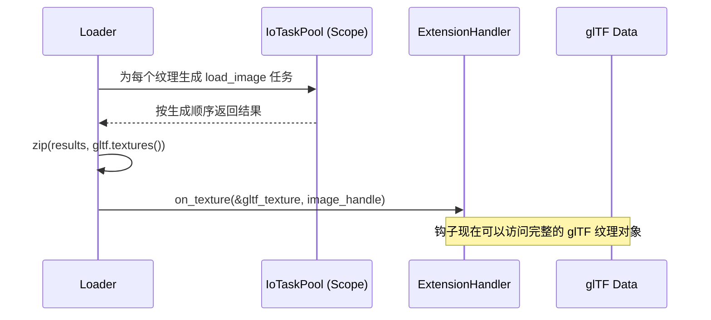

+++
title = "#22131 GltfExtensionHandler::on_texture: pass Texture references"
date = "2025-12-15T00:00:00"
draft = false
template = "pull_request_page.html"
in_search_index = false

[extra]
current_language = "zh-cn"
available_languages = {"en" = { name = "English", url = "/pull_request/bevy/2025-12/pr-22131-en-20251215" }, "zh-cn" = { name = "中文", url = "/pull_request/bevy/2025-12/pr-22131-zh-cn-20251215" }}
+++

# Title

## 基本信息
- **标题**: GltfExtensionHandler::on_texture: pass Texture references
- **PR链接**: https://github.com/bevyengine/bevy/pull/22131
- **作者**: ChristopherBiscardi
- **状态**: 已合并
- **标签**: D-Trivial, A-Assets, S-Ready-For-Final-Review, A-glTF
- **创建时间**: 2025-12-15T16:53:39Z
- **合并时间**: 2025-12-15T21:12:20Z
- **合并者**: alice-i-cecile

## 描述翻译
扩展钩子 `on_texture` 目前只传递扩展数据，而不传递 glTF 对象。

`IoTaskPool::scope` 在任务仅从根作用域生成时会保持顺序，因此我们可以用它来与纹理引用进行 zip 操作，以供钩子使用。

## 此 Pull Request 的故事

这个 Pull Request 的核心是修复 Bevy 引擎 glTF 加载器扩展系统中的一个设计局限。问题出在 `GltfExtensionHandler` 接口的 `on_texture` 方法上。

在 glTF 加载流程中，系统允许通过扩展（extensions）在加载的不同阶段（如处理材质、纹理、节点时）注入自定义逻辑。然而，在处理纹理（texture）时，`on_texture` 钩子函数收到的参数是不完整的。它只能获取到纹理的扩展元数据（`extension_data`）和一个指向已加载图像资源（`Handle<Image>`）的句柄，却拿不到描述这个纹理的原始 glTF 对象（`gltf::Texture`）。这使得扩展开发者无法访问纹理对象本身的其他属性，比如名称（`name`）或采样器（`sampler`）引用，从而限制了扩展的功能。

问题的根源在于加载器的实现细节。glTF 文件的纹理是并行加载的，以提升性能。在修改前的代码中，加载图像（`load_image`）的任务被提交到 `IoTaskPool` 异步执行。为了在任务完成后调用扩展钩子，代码需要捕获并传递纹理的扩展数据。但由于并行任务与主加载流程的生命周期管理，原始的 `gltf::Texture` 对象无法被安全地跨线程或跨异步边界传递到钩子中，因此只传递了可克隆的扩展数据。

开发者发现了一个关键特性：`IoTaskPool::scope` 函数能够保证所有在根作用域中生成的异步任务的执行顺序与它们被生成（spawn）的顺序一致。利用这一特性，问题就可以被解决。

解决方案很巧妙。首先，将原来返回 `(extension_data, result)` 的任务，改为只返回图像加载的 `result`。然后，在主线程中，当这些按顺序完成的任务结果被收集后，使用 `.zip(gltf.textures())` 将每个结果与 glTF 文件中对应顺序的原始 `gltf::Texture` 引用配对起来。因为任务的完成顺序与生成顺序（即纹理在文件中的顺序）一致，所以这个 zip 操作能正确地将每个加载好的图像句柄映射回它对应的原始 glTF 纹理对象。

最终，`on_texture` 钩子的函数签名得以简化并增强。它不再接收一个可选的 `extension_data`（因为可以从 `gltf_texture` 中获取），而是直接接收一个 `&gltf::Texture` 引用和图像句柄。这为扩展开发者提供了完整的信息。

这个改动虽然代码行数不多（净减少15行），但解决了 API 设计上的一个痛点。它移除了之前代码中因实现约束而留下的注释（如“Unlike other hooks...”），使接口变得更加一致和强大。这是一个很好的例子，展示了如何利用系统的并发原语（如 `IoTaskPool::scope` 的顺序保证）来简化 API 并解决生命周期带来的设计难题。

## 可视化表示



## 关键文件更改

1.  `crates/bevy_gltf/src/loader/extensions/mod.rs`
    *   **修改原因**：更新 `GltfExtensionHandler` trait 中 `on_texture` 方法的签名，使其能够接收完整的 glTF 纹理对象。
    *   **关键修改**：
        ```rust
        // 之前:
        fn on_texture(
            &mut self,
            extension_data: Option<&serde_json::Map<String, serde_json::Value>>,
            texture: Handle<bevy_image::Image>,
        ) {
        }

        // 之后:
        fn on_texture(&mut self, gltf_texture: &gltf::Texture, texture: Handle<bevy_image::Image>) {}
        ```
    *   **与 PR 的关系**：这是此次修复的 API 变更点。新的接口为扩展提供了更多数据，并移除了关于内部约束的注释。

2.  `crates/bevy_gltf/src/loader/mod.rs`
    *   **修改原因**：调整纹理加载和扩展调用的逻辑，以适配新的 `on_texture` 接口，并利用 `IoTaskPool::scope` 的顺序保证来传递 `gltf::Texture` 引用。
    *   **关键修改**：
        ```rust
        // 在同步加载路径中（修改前）：
        extension.on_texture(
            texture.extensions(),
            texture_handles.last().unwrap().clone(),
        );

        // 在同步加载路径中（修改后）：
        extension.on_texture(&texture, texture_handles.last().unwrap().clone());

        // 在异步加载路径中（修改前）：
        scope.spawn(async move {
            // ... load_image ...
            (extension_data, result) // 返回元组
        });
        // ...
        .for_each(|(extension_data, result)| match result {
            // ...
            extension.on_texture(extension_data.as_ref(), ...);
        });

        // 在异步加载路径中（修改后）：
        scope.spawn(async move {
            // ... load_image ...
            result // 只返回结果
        });
        // ...
        .zip(gltf.textures()) // 将结果与纹理引用配对
        .for_each(|(result, texture)| match result { // 参数变为 (result, texture)
            // ...
            extension.on_texture(&texture, ...); // 传递纹理引用
        });
        ```
    *   **与 PR 的关系**：这是解决方案的核心实现。通过改变任务返回值并使用 `zip`，巧妙地绕开了生命周期问题，将 `gltf::Texture` 引用安全地传递给了扩展钩子。

## 延伸阅读

*   [Bevy 官方文档 - Asynchronous Tasks](https://docs.rs/bevy/latest/bevy/tasks/index.html)：了解 `IoTaskPool` 和 `TaskPool` 的使用。
*   [glTF 2.0 规范 - Textures](https://registry.khronos.org/glTF/specs/2.0/glTF-2.0.html#textures)：理解 `gltf::Texture` 对象所包含的数据。
*   [Rust `std::iter::Iterator::zip` 方法文档](https://doc.rust-lang.org/std/iter/trait.Iterator.html#method.zip)：了解 `zip` 操作符的工作原理。