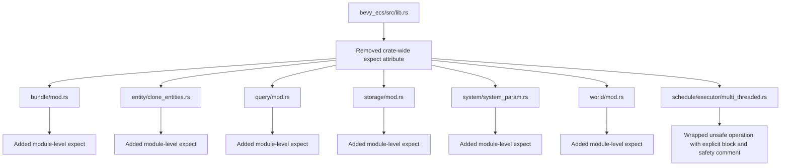

+++
title = "#22134 Move allow unsafe_op_in_unsafe_fn to module level in bevy_ecs"
date = "2025-12-19T00:00:00"
draft = false
template = "pull_request_page.html"
in_search_index = true

[taxonomies]
list_display = ["show"]

[extra]
current_language = "en"
available_languages = {"en" = { name = "English", url = "/pull_request/bevy/2025-12/pr-22134-en-20251219" }, "zh-cn" = { name = "中文", url = "/pull_request/bevy/2025-12/pr-22134-zh-cn-20251219" }}
labels = ["A-ECS", "C-Code-Quality", "X-Contentious", "D-Straightforward"]
+++

# Title
Move allow unsafe_op_in_unsafe_fn to module level in bevy_ecs

## Basic Information
- **Title**: Move allow unsafe_op_in_unsafe_fn to module level in bevy_ecs
- **PR Link**: https://github.com/bevyengine/bevy/pull/22134
- **Author**: hymm
- **Status**: MERGED
- **Labels**: A-ECS, C-Code-Quality, S-Ready-For-Final-Review, X-Contentious, D-Straightforward
- **Created**: 2025-12-15T20:17:02Z
- **Merged**: 2025-12-19T01:56:14Z
- **Merged By**: alice-i-cecile

## Description Translation
# Objective

- narrow the scope of the expect unsafe_op_in_unsafe_fn, so we can progressively remove them.

## Testing

- cargo check showed no warnings

## The Story of This Pull Request

This PR addresses a specific code quality issue in the Bevy ECS (Entity Component System) codebase related to unsafe code practices. The core problem was that the `#![expect(unsafe_op_in_unsafe_fn)]` attribute was applied at the crate root level in `bevy_ecs/src/lib.rs`, which had the effect of suppressing lint warnings for unsafe operations in unsafe functions across the entire crate. This broad suppression made it difficult to identify and progressively fix individual instances of unsafe code that lacked proper safety documentation.

The Rust compiler's `unsafe_op_in_unsafe_fn` lint requires that unsafe operations inside unsafe functions must be explicitly wrapped in unsafe blocks with accompanying safety comments. This is a critical safety feature that ensures developers consciously acknowledge and document the unsafe invariants they're relying on. By suppressing this lint at the crate level, the codebase was missing out on this safety enforcement mechanism.

The solution approach was straightforward but methodical: move the `expect` attribute from the crate root down to specific module files that currently contain unsafe code. This narrows the scope of the suppression to only those modules where unsafe operations are actually present, making it easier to incrementally address each unsafe block. The PR author identified seven key modules that contain unsafe code and added the `expect` attribute to each one individually.

The implementation involved two main changes. First, the crate-level attribute was removed from `lib.rs`:
```rust
// Before in lib.rs:
#![expect(
    unsafe_op_in_unsafe_fn,
    reason = "See #11590. To be removed once all applicable unsafe code has an unsafe block with a safety comment."
)]
```

Second, the same attribute was added to each module file that contains unsafe operations:
```rust
// Added to multiple module files:
#![expect(
    unsafe_op_in_unsafe_fn,
    reason = "See #11590. To be removed once all applicable unsafe code has an unsafe block with a safety comment."
)]
```

One interesting technical insight from this PR is the approach to incremental safety improvement. By moving from crate-wide suppression to module-specific suppression, the team can now tackle unsafe code cleanup module by module. Each module can have its `expect` attribute removed once all unsafe operations within that module have been properly annotated with safety comments.

An additional change was made in `multi_threaded.rs` where an unsafe operation was explicitly wrapped in an unsafe block with a detailed safety comment. This demonstrates the pattern that should be followed when eventually removing the `expect` attributes from modules:

```rust
// In multi_threaded.rs:
#[expect(
    clippy::undocumented_unsafe_blocks,
    reason = "This actually could result in UB if a system tries to mutate
    `HotPatchChanges`. We allow this as the resource only exists with the `hotpatching` feature.
    and `hotpatching` should never be enabled in release."
)]
let hotpatch_tick = unsafe {
    context
        .environment
        .world_cell
        .get_resource_ref::<HotPatchChanges>()
}
.map(|r| r.last_changed())
.unwrap_or_default();
```

The impact of these changes is primarily about improving code safety and maintainability. While there are no functional changes or performance improvements, this refactoring sets the stage for more systematic auditing and documentation of unsafe code. It follows the principle of making unsafe operations as explicit and well-documented as possible, which is crucial for a game engine like Bevy where correctness and safety are paramount.

The changes also demonstrate good software engineering practices around technical debt management. By referencing issue #11590 in the reason comment, the PR connects this work to a larger initiative to address unsafe code throughout the codebase. This creates traceability and ensures that future contributors understand the context behind these suppressions.

## Visual Representation



## Key Files Changed

**crates/bevy_ecs/src/lib.rs** (+0/-5)
This file had the crate-wide `expect` attribute removed. This change enables the `unsafe_op_in_unsafe_fn` lint for the entire crate, forcing explicit unsafe blocks for unsafe operations.
```rust
// Before:
#![expect(
    unsafe_op_in_unsafe_fn,
    reason = "See #11590. To be removed once all applicable unsafe code has an unsafe block with a safety comment."
)]
// After: (attribute removed entirely)
```

**crates/bevy_ecs/src/bundle/mod.rs** (+5/-0)
Added module-level `expect` attribute to suppress the lint only for this module, which contains unsafe code that needs to be progressively addressed.
```rust
// Added at top of file:
#![expect(
    unsafe_op_in_unsafe_fn,
    reason = "See #11590. To be removed once all applicable unsafe code has an unsafe block with a safety comment."
)]
```

**crates/bevy_ecs/src/entity/clone_entities.rs** (+5/-0)
Similar to bundle module, this file deals with entity cloning operations that involve unsafe memory operations.
```rust
// Added at top of file:
#![expect(
    unsafe_op_in_unsafe_fn,
    reason = "See #11590. To be removed once all applicable unsafe code has an unsafe block with a safety comment."
)]
```

**crates/bevy_ecs/src/query/mod.rs** (+5/-0)
The query system has extensive unsafe code for fast component access and filtering.
```rust
// Added at top of file:
#![expect(
    unsafe_op_in_unsafe_fn,
    reason = "See #11590. To be removed once all applicable unsafe code has an unsafe block with a safety comment."
)]
```

**crates/bevy_ecs/src/storage/mod.rs** (+5/-0)
Storage systems involve low-level memory management and pointer operations that require unsafe code.
```rust
// Added at top of file:
#![expect(
    unsafe_op_in_unsafe_fn,
    reason = "See #11590. To be removed once all applicable unsafe code has an unsafe block with a safety comment."
)]
```

**crates/bevy_ecs/src/schedule/executor/multi_threaded.rs** (+15/-6)
This file shows the pattern for properly handling unsafe operations once the `expect` attribute is removed. An unsafe block was explicitly added with a safety comment explaining the invariants.
```rust
// Before:
let hotpatch_tick = context
    .environment
    .world_cell
    .get_resource_ref::<HotPatchChanges>()
    .map(|r| r.last_changed())
    .unwrap_or_default();

// After:
let hotpatch_tick = unsafe {
    context
        .environment
        .world_cell
        .get_resource_ref::<HotPatchChanges>()
}
.map(|r| r.last_changed())
.unwrap_or_default();
```

**crates/bevy_ecs/src/system/combinator.rs** (+0/-2)
Removed a `#![deny(unsafe_op_in_unsafe_fn)]` attribute from inside a function since the module-level approach provides better scoping.
```rust
// Before inside function:
#![deny(unsafe_op_in_unsafe_fn)]
// After: removed entirely
```

**crates/bevy_ecs/src/system/system_param.rs** (+5/-0) and **crates/bevy_ecs/src/world/mod.rs** (+5/-0)
Both modules received the same module-level `expect` attribute since they contain unsafe system parameter and world manipulation code.

## Further Reading

1. [Rust Reference: Unsafe Operations](https://doc.rust-lang.org/reference/unsafety.html) - Official documentation on unsafe Rust
2. [Rustonomicon](https://doc.rust-lang.org/nomicon/) - The Dark Arts of Unsafe Rust Programming
3. [Bevy ECS Architecture](https://bevyengine.org/learn/quick-start/ecs/) - Overview of Bevy's Entity Component System
4. [Issue #11590](https://github.com/bevyengine/bevy/issues/11590) - The tracking issue for unsafe code cleanup in Bevy
5. [Rust Clippy Lint: unsafe_op_in_unsafe_fn](https://rust-lang.github.io/rust-clippy/master/#unsafe_op_in_unsafe_fn) - Documentation for the lint being addressed

# Full Code Diff
<details>
<summary>View full diff</summary>

```diff
diff --git a/crates/bevy_ecs/src/bundle/mod.rs b/crates/bevy_ecs/src/bundle/mod.rs
index b6a81ebd27328..f7cd9996b2853 100644
--- a/crates/bevy_ecs/src/bundle/mod.rs
+++ b/crates/bevy_ecs/src/bundle/mod.rs
@@ -1,3 +1,8 @@
+#![expect(
+    unsafe_op_in_unsafe_fn,
+    reason = "See #11590. To be removed once all applicable unsafe code has an unsafe block with a safety comment."
+)]
+
 //! Types for handling [`Bundle`]s.
 //!
 //! This module contains the [`Bundle`] trait and some other helper types.
diff --git a/crates/bevy_ecs/src/entity/clone_entities.rs b/crates/bevy_ecs/src/entity/clone_entities.rs
index 0f7105e0eb0ce..824775fb7b4b0 100644
--- a/crates/bevy_ecs/src/entity/clone_entities.rs
+++ b/crates/bevy_ecs/src/entity/clone_entities.rs
@@ -1,3 +1,8 @@
+#![expect(
+    unsafe_op_in_unsafe_fn,
+    reason = "See #11590. To be removed once all applicable unsafe code has an unsafe block with a safety comment."
+)]
+
 use crate::{
     archetype::Archetype,
     bundle::{Bundle, BundleRemover, InsertMode},
diff --git a/crates/bevy_ecs/src/lib.rs b/crates/bevy_ecs/src/lib.rs
index 4c8763ad66f64..4c336a562bb51 100644
--- a/crates/bevy_ecs/src/lib.rs
+++ b/crates/bevy_ecs/src/lib.rs
@@ -1,7 +1,3 @@
-#![expect(
-    unsafe_op_in_unsafe_fn,
-    reason = "See #11590. To be removed once all applicable unsafe code has an unsafe block with a safety comment."
-)]
 #![doc = include_str!("../README.md")]
 #![cfg_attr(
     any(docsrs, docsrs_dep),
diff --git a/crates/bevy_ecs/src/query/mod.rs b/crates/bevy_ecs/src/query/mod.rs
index b5c1b3d7d18a5..065eadd24db88 100644
--- a/crates/bevy_ecs/src/query/mod.rs
+++ b/crates/bevy_ecs/src/query/mod.rs
@@ -1,3 +1,8 @@
+#![expect(
+    unsafe_op_in_unsafe_fn,
+    reason = "See #11590. To be removed once all applicable unsafe code has an unsafe block with a safety comment."
+)]
+
 //! Contains APIs for retrieving component data from the world.
 
 mod access;
diff --git a/crates/bevy_ecs/src/schedule/executor/multi_threaded.rs b/crates/bevy_ecs/src/schedule/executor/multi_threaded.rs
index 497b937c31f51..33bc8d0b80079 100644
--- a/crates/bevy_ecs/src/schedule/executor/multi_threaded.rs
+++ b/crates/bevy_ecs/src/schedule/executor/multi_threaded.rs
@@ -448,12 +448,21 @@ impl ExecutorState {
         }
 
         #[cfg(feature = "hotpatching")]
-        let hotpatch_tick = context
-            .environment
-            .world_cell
-            .get_resource_ref::<HotPatchChanges>()
-            .map(|r| r.last_changed())
-            .unwrap_or_default();
+        #[expect(
+            clippy::undocumented_unsafe_blocks,
+            reason = "This actually could result in UB if a system tries to mutate
+            `HotPatchChanges`. We allow this as the resource only exists with the `hotpatching` feature.
+            and `hotpatching` should never be enabled in release."
+        )]
+        #[cfg(feature = "hotpatching")]
+        let hotpatch_tick = unsafe {
+            context
+                .environment
+                .world_cell
+                .get_resource_ref::<HotPatchChanges>()
+        }
+        .map(|r| r.last_changed())
+        .unwrap_or_default();
 
         // can't borrow since loop mutably borrows `self`
         let mut ready_systems = core::mem::take(&mut self.ready_systems_copy);
diff --git a/crates/bevy_ecs/src/storage/mod.rs b/crates/bevy_ecs/src/storage/mod.rs
index 0584ae15c6738..084cca6bc8396 100644
--- a/crates/bevy_ecs/src/storage/mod.rs
+++ b/crates/bevy_ecs/src/storage/mod.rs
@@ -1,3 +1,8 @@
+#![expect(
+    unsafe_op_in_unsafe_fn,
+    reason = "See #11590. To be removed once all applicable unsafe code has an unsafe block with a safety comment."
+)]
+
 //! Storage layouts for ECS data.
 //!
 //! This module implements the low-level collections that store data in a [`World`]. These all offer minimal and often
diff --git a/crates/bevy_ecs/src/system/combinator.rs b/crates/bevy_ecs/src/system/combinator.rs
index 0ef463fc45e0d..ad10d2ddd8cf6 100644
--- a/crates/bevy_ecs/src/system/combinator.rs
+++ b/crates/bevy_ecs/src/system/combinator.rs
@@ -167,8 +167,6 @@ where
             input: SystemIn<S>,
             world: &mut PrivateUnsafeWorldCell,
         ) -> Result<S::Out, RunSystemError> {
-            #![deny(unsafe_op_in_unsafe_fn)]
-
             // SAFETY: see comment on `Func::combine` call
             match (|| unsafe {
                 system.validate_param_unsafe(world.0)?;
diff --git a/crates/bevy_ecs/src/system/system_param.rs b/crates/bevy_ecs/src/system/system_param.rs
index 16af1523376e4..2a0498ffdcfdc 100644
--- a/crates/bevy_ecs/src/system/system_param.rs
+++ b/crates/bevy_ecs/src/system/system_param.rs
@@ -1,3 +1,8 @@
+#![expect(
+    unsafe_op_in_unsafe_fn,
+    reason = "See #11590. To be removed once all applicable unsafe code has an unsafe block with a safety comment."
+)]
+
 pub use crate::change_detection::{NonSend, NonSendMut, Res, ResMut};
 use crate::{
     archetype::Archetypes,
diff --git a/crates/bevy_ecs/src/world/mod.rs b/crates/bevy_ecs/src/world/mod.rs
index a4f49c7460a35..3f39865f8f34d 100644
--- a/crates/bevy_ecs/src/world/mod.rs
+++ b/crates/bevy_ecs/src/world/mod.rs
@@ -1,3 +1,8 @@
+#![expect(
+    unsafe_op_in_unsafe_fn,
+    reason = "See #11590. To be removed once all applicable unsafe code has an unsafe block with a safety comment."
+)]
+
 //! Defines the [`World`] and APIs for accessing it directly.
 
 pub(crate) mod command_queue;
```

</details>