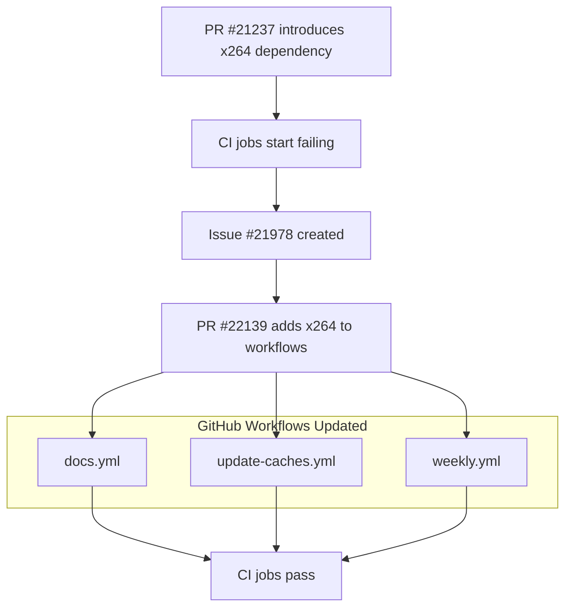

+++
title = "#22139 install x264 linux dependency in CI jobs that need it"
date = "2025-12-16T00:00:00"
draft = false
template = "pull_request_page.html"
in_search_index = true

[taxonomies]
list_display = ["show"]

[extra]
current_language = "en"
available_languages = {"en" = { name = "English", url = "/pull_request/bevy/2025-12/pr-22139-en-20251216" }, "zh-cn" = { name = "中文", url = "/pull_request/bevy/2025-12/pr-22139-zh-cn-20251216" }}
labels = ["D-Trivial", "A-Build-System"]
+++

# Title

## Basic Information
- **Title**: install x264 linux dependency in CI jobs that need it
- **PR Link**: https://github.com/bevyengine/bevy/pull/22139
- **Author**: mockersf
- **Status**: MERGED
- **Labels**: D-Trivial, A-Build-System, S-Ready-For-Final-Review
- **Created**: 2025-12-15T22:22:02Z
- **Merged**: 2025-12-16T01:19:47Z
- **Merged By**: mockersf

## Description Translation
# Objective

- Some CI jobs on a schedule / on main started failing after #21237
- Fixes part of https://github.com/bevyengine/bevy/issues/21978

## Solution

- Install the linux dependencies needed

## The Story of This Pull Request

This PR addresses a straightforward but important CI infrastructure issue that surfaced after another change was merged. The problem began when PR #21237 introduced new functionality or tests that required the x264 video codec library as a system dependency on Linux CI runners. Without this library installed, several scheduled CI jobs began failing consistently, which is documented in issue #21978.

The developer identified the root cause quickly: the GitHub Actions workflows that were failing didn't have the x264 library available in their execution environment. The solution approach was pragmatic and minimal - add the missing dependency declaration to the existing dependency installation step in each affected workflow file. This follows the established pattern in the codebase where system dependencies are declared through the `actions-rust-lang/setup-rust-toolchain` action's configuration.

The implementation is clean and focused, modifying only three workflow files with identical one-line additions. Each modification adds `x264: true` to the `with` parameters of the setup-rust-toolchain step, ensuring the x264 development libraries are installed via the system package manager before the workflow proceeds to build and test the code. This is the same mechanism already used for other dependencies like Wayland and xkb.

From a technical perspective, this fix demonstrates several good practices in CI/CD maintenance. First, it shows the importance of tracking transitive dependencies - when PR #21237 added code that depends on x264, the CI configuration needed to be updated accordingly. Second, it illustrates how to properly handle system dependencies in a cross-platform project where only certain platforms (Linux in this case) require specific libraries. The use of GitHub Actions' conditional dependency installation through the setup-rust-toolchain action provides a clean abstraction for this.

The impact is immediate and significant: it restores the reliability of scheduled CI jobs and main branch builds, preventing false negatives in the project's automated testing. This is particularly important for a game engine like Bevy where multimedia codecs are essential for various features. The fix also helps maintain developer confidence in the CI system by ensuring that failures indicate actual problems with the code rather than missing infrastructure dependencies.

## Visual Representation



## Key Files Changed

### `.github/workflows/docs.yml`
**Change**: Added x264 dependency to the documentation build workflow.
**Purpose**: Ensures documentation builds that may include multimedia examples have the required codec library.
```yaml
# File: .github/workflows/docs.yml
# Before (lines 44-47):
      with:
        wayland: true
        xkb: true

# After (lines 44-48):
      with:
        wayland: true
        xkb: true
        x264: true
```

### `.github/workflows/update-caches.yml`
**Change**: Added x264 dependency to the cache update workflow.
**Purpose**: Ensures cache building for dependencies includes x264, preventing cache misses.
```yaml
# File: .github/workflows/update-caches.yml
# Before (lines 113-116):
        with:
          wayland: true
          xkb: true

# After (lines 113-117):
        with:
          wayland: true
          xkb: true
          x264: true
```

### `.github/workflows/weekly.yml`
**Change**: Added x264 dependency to the weekly scheduled workflow.
**Purpose**: Ensures weekly maintenance tasks and tests have the required library.
```yaml
# File: .github/workflows/weekly.yml
# Before (lines 65-68):
        with:
          wayland: true
          xkb: true

# After (lines 65-69):
        with:
          wayland: true
          xkb: true
          x264: true
```

## Further Reading

1. GitHub Actions documentation on workflow syntax: https://docs.github.com/en/actions/using-workflows/workflow-syntax-for-github-actions
2. `actions-rust-lang/setup-rust-toolchain` action documentation for available options: https://github.com/actions-rust-lang/setup-rust-toolchain
3. x264 video codec library documentation: https://www.videolan.org/developers/x264.html
4. Bevy's CI troubleshooting guide (for understanding common CI issues): https://github.com/bevyengine/bevy/blob/main/docs/ci_troubleshooting.md

# Full Code Diff
diff --git a/.github/workflows/docs.yml b/.github/workflows/docs.yml
index 79391d9e674c1..a4e319d710933 100644
--- a/.github/workflows/docs.yml
+++ b/.github/workflows/docs.yml
@@ -46,6 +46,7 @@ jobs:
         with:
           wayland: true
           xkb: true
+          x264: true
 
       #  This does the following:
       #   - Replaces the docs icon with one that clearly denotes it's not the released package on crates.io
diff --git a/.github/workflows/update-caches.yml b/.github/workflows/update-caches.yml
index 0a1d137271b96..eac53e64eff58 100644
--- a/.github/workflows/update-caches.yml
+++ b/.github/workflows/update-caches.yml
@@ -115,6 +115,7 @@ jobs:
         with:
           wayland: true
           xkb: true
+          x264: true
 
       # Fetch the cache using the complete key - to avoid rebuilding the cache if nothing changed
       - uses: actions/cache/restore@v4
diff --git a/.github/workflows/weekly.yml b/.github/workflows/weekly.yml
index f8c38dd9d5986..87b0b8193d70e 100644
--- a/.github/workflows/weekly.yml
+++ b/.github/workflows/weekly.yml
@@ -67,6 +67,7 @@ jobs:
         with:
           wayland: true
           xkb: true
+          x264: true
       - name: Run lints
         # See tools/ci/src/main.rs for the commands this runs
         run: cargo run -p ci -- lints