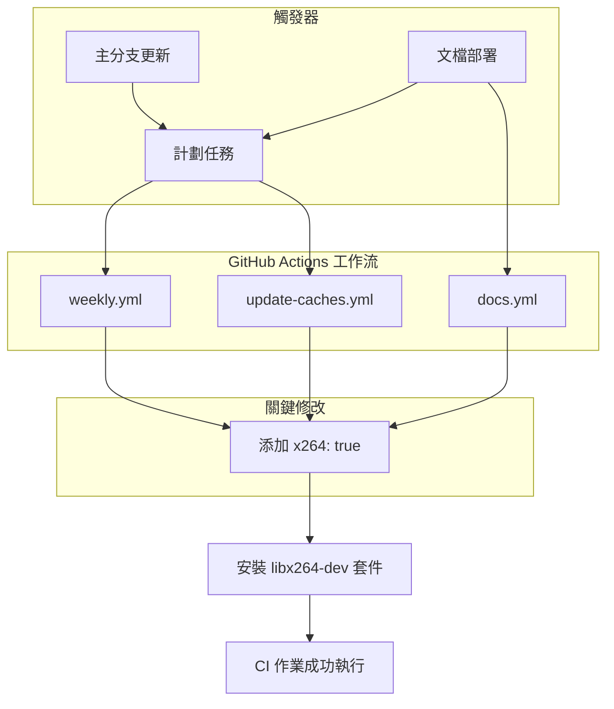

+++
title = "#22139"
date = "2025-12-16T00:00:00"
draft = false
template = "pull_request_page.html"
in_search_index = false

[extra]
current_language = "zh-cn"
available_languages = {"en" = { name = "English", url = "/pull_request/bevy/2025-12/pr-22139-en-20251216" }, "zh-cn" = { name = "中文", url = "/pull_request/bevy/2025-12/pr-22139-zh-cn-20251216" }}
+++

# Title

## 基本資訊
- **標題**: install x264 linux dependency in CI jobs that need it
- **PR 連結**: https://github.com/bevyengine/bevy/pull/22139
- **作者**: mockersf
- **狀態**: MERGED
- **標籤**: D-Trivial, A-Build-System, S-Ready-For-Final-Review
- **創建時間**: 2025-12-15T22:22:02Z
- **合併時間**: 2025-12-16T01:19:47Z
- **合併者**: mockersf

## 描述翻譯
**目的**
- 在 #21237 合併後，部分按計劃或在主分支上運行的 CI 作業開始失敗。
- 修復了 https://github.com/bevyengine/bevy/issues/21978 的一部分問題。

**解決方案**
- 安裝所需的 Linux 依賴項。

## 這個 Pull Request 的故事

這個 PR 的故事始於一個典型的軟體開發場景：一個看似不相關的變更（PR #21237）合併後，無意中破壞了持續整合（CI）流程。具體來說，幾個安排在特定時間或主分支更新後運行的 CI 作業開始失敗。問題的根源在於，這些作業所運行的環境缺少了一個必要的系統依賴庫：x264。

x264 是一個廣泛使用的 H.264/AVC 視頻編碼器函式庫。在 Bevy 這個遊戲引擎的上下文中，它很可能被用於某些多媒體處理或測試功能。PR #21237 引入了一個需要這個依賴項的功能或測試，但沒有同步更新所有相關的 CI 配置檔案。這導致了依賴項缺失，進而引發了構建或執行時錯誤。

作者 `mockersf` 在收到問題報告（issue #21978）後，迅速定位了問題。解決方案非常直接：在那些需要 x264 的 CI 作業中，明確地安裝它。這體現了 DevOps 中一個常見的原則——確保構建環境的可重現性和一致性。如果某個依賴是項目編譯或運行所必需的，那麼 CI 腳本就必須負責將其準備好。

在技術實現上，這個 PR 修改了三個 GitHub Actions 工作流文件：`docs.yml`、`update-caches.yml` 和 `weekly.yml`。這些工作流負責不同任務：文檔構建、更新緩存和每週例行檢查。它們都使用了一個名為 `actions-rust-lang/setup-rust-toolchain` 的 Action 來配置 Rust 工具鏈。這個 Action 提供了一個 `with` 參數選項，可以用來安裝額外的系統套件。修改就是在這個配置塊中，為每個文件添加了 `x264: true` 這一行。

```yaml
# 修改片段示例
with:
  wayland: true
  xkb: true
  x264: true # 新增的行
```

這行配置指示底層的 CI 系統（運行在 Ubuntu 環境上）安裝 `libx264-dev` 套件。這是一個非常高效的修復方式，因為它利用了現有的、專為 Rust 項目優化的 CI 工具鏈配置，而不是通過額外的 `apt-get install` 步驟來安裝，後者可能增加腳本的複雜度和執行時間。

這個 PR 的影響是立竿見影的。合併後，那些之前失敗的計劃任務和主分支構建應該能恢復正常。它強化了對 CI 配置進行全面性審查的重要性：當代碼庫新增一個系統級依賴時，需要檢查所有可能受影響的自動化流程腳本，而不僅僅是本地開發環境或主要的推送/拉取請求（PR）構建。

從工程角度來看，這是一次小而重要的維護性修復。它確保了開發流程的自動化部分與代碼庫的實際需求保持同步，維護了 CI 的可靠性，這是團隊高效協作和快速交付的基石。

## 視覺化表示



## 主要檔案變更

以下是此 PR 中修改的關鍵檔案：

1.  **`.github/workflows/docs.yml`**
    *   **描述**：此工作流用於構建和部署項目文檔。修改確保在構建文檔的環境中也安裝了 `x264` 依賴項。
    *   **修改處**：
        ```yaml
        # 檔案: .github/workflows/docs.yml
        # 修改前（第45-48行）:
        #       with:
        #         wayland: true
        #         xkb: true
        #
        # 修改後（第45-49行）:
            with:
              wayland: true
              xkb: true
              x264: true
        ```

2.  **`.github/workflows/update-caches.yml`**
    *   **描述**：此工作流用於定期更新 CI 使用的依賴項緩存，以加速後續構建。修改確保在準備緩存環境時包含 `x264`。
    *   **修改處**：
        ```yaml
        # 檔案: .github/workflows/update-caches.yml
        # 修改前（第114-117行）:
        #       with:
        #         wayland: true
        #         xkb: true
        #
        # 修改後（第114-118行）:
            with:
              wayland: true
              xkb: true
              x264: true
        ```

3.  **`.github/workflows/weekly.yml`**
    *   **描述**：此工作流用於執行每週一次的例行檢查，如運行 lints。修改確保在這些檢查中也能訪問 `x264` 依賴。
    *   **修改處**：
        ```yaml
        # 檔案: .github/workflows/weekly.yml
        # 修改前（第66-69行）:
        #       with:
        #         wayland: true
        #         xkb: true
        #
        # 修改後（第66-70行）:
            with:
              wayland: true
              xkb: true
              x264: true
        ```

**關聯性**：所有這三個修改都遵循相同的模式，在現有的 `actions-rust-lang/setup-rust-toolchain` 步驟中添加 `x264: true` 配置。這統一了所有相關 CI 環境的依賴狀態，從根本上解決了因 PR #21237 引入新依賴而導致的構建失敗問題。

## 延伸閱讀

*   **GitHub Actions 文件**：深入了解工作流語法、`with` 參數以及緩存機制。
    *   [工作流語法](https://docs.github.com/en/actions/using-workflows/workflow-syntax-for-github-actions)
    *   [actions/cache](https://github.com/actions/cache)
*   **`setup-rust-toolchain` Action**：了解此 Action 提供的所有配置選項，以優化 Rust 項目的 CI 設置。
    *   [GitHub 倉庫](https://github.com/actions-rust-lang/setup-rust-toolchain)
*   **Bevy 引擎的 CI/CD**：查看 Bevy 倉庫中的其他工作流文件，了解一個大型開源遊戲引擎如何管理其複雜的構建、測試和發布流程。
*   **x264 編碼器**：了解這個開源視頻編碼庫的技術細節和應用場景。
    *   [官方網站](https://www.videolan.org/developers/x264.html)

# Full Code Diff
diff --git a/.github/workflows/docs.yml b/.github/workflows/docs.yml
index 79391d9e674c1..a4e319d710933 100644
--- a/.github/workflows/docs.yml
+++ b/.github/workflows/docs.yml
@@ -46,6 +46,7 @@ jobs:
         with:
           wayland: true
           xkb: true
+          x264: true
 
       #  This does the following:
       #   - Replaces the docs icon with one that clearly denotes it's not the released package on crates.io
diff --git a/.github/workflows/update-caches.yml b/.github/workflows/update-caches.yml
index 0a1d137271b96..eac53e64eff58 100644
--- a/.github/workflows/update-caches.yml
+++ b/.github/workflows/update-caches.yml
@@ -115,6 +115,7 @@ jobs:
         with:
           wayland: true
           xkb: true
+          x264: true
 
       # Fetch the cache using the complete key - to avoid rebuilding the cache if nothing changed
       - uses: actions/cache/restore@v4
diff --git a/.github/workflows/weekly.yml b/.github/workflows/weekly.yml
index f8c38dd9d5986..87b0b8193d70e 100644
--- a/.github/workflows/weekly.yml
+++ b/.github/workflows/weekly.yml
@@ -67,6 +67,7 @@ jobs:
         with:
           wayland: true
           xkb: true
+          x264: true
       - name: Run lints
         # See tools/ci/src/main.rs for the commands this runs
         run: cargo run -p ci -- lints