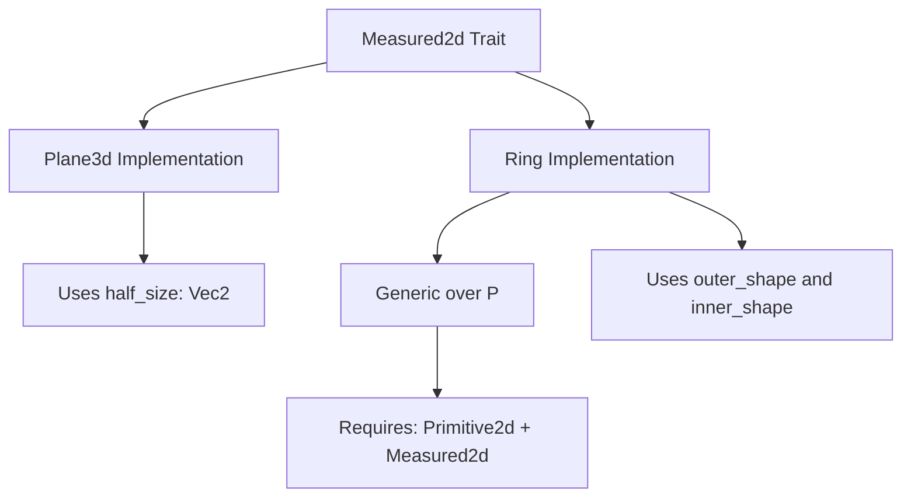

+++
title = "#22141 More missing `Measured2d` impls"
date = "2025-12-16T00:00:00"
draft = false
template = "pull_request_page.html"
in_search_index = true

[taxonomies]
list_display = ["show"]

[extra]
current_language = "en"
available_languages = {"en" = { name = "English", url = "/pull_request/bevy/2025-12/pr-22141-en-20251216" }, "zh-cn" = { name = "中文", url = "/pull_request/bevy/2025-12/pr-22141-zh-cn-20251216" }}
labels = ["C-Feature", "A-Math", "D-Straightforward"]
+++

# Title
More missing `Measured2d` impls

## Basic Information
- **Title**: More missing `Measured2d` impls
- **PR Link**: https://github.com/bevyengine/bevy/pull/22141
- **Author**: lynn-lumen
- **Status**: MERGED
- **Labels**: C-Feature, S-Ready-For-Final-Review, A-Math, D-Straightforward
- **Created**: 2025-12-15T22:33:01Z
- **Merged**: 2025-12-16T05:18:47Z
- **Merged By**: alice-i-cecile

## Description Translation
**Objective**
- Implement `Measured2d` for the remaining primitives where an implementation makes sense.

**Solution**
- Implemented `Measured2d` for `Plane3d`. This might seem weird, but we have done the same for `Triangle3d` before.
- Implemented `Measured2d` for `Ring<P: Measured2d>`. The implementation holds given the invariants of the primitive.

## The Story of This Pull Request

This PR addresses a straightforward gap in Bevy's geometry API by adding missing implementations of the `Measured2d` trait for two geometric primitives: `Plane3d` and `Ring<P>`. The `Measured2d` trait provides methods for calculating area and perimeter, which are fundamental operations for 2D geometry computations.

The author, lynn-lumen, recognized that while many 2D primitives already had `Measured2d` implementations, two specific cases were missing. The implementation follows established patterns in the codebase and maintains consistency with existing conventions.

For `Plane3d`, the implementation calculates area as `half_size.element_product() * 4.0` and perimeter as `half_size.element_sum() * 4.0`. Although `Plane3d` exists in 3D space, it has well-defined 2D measurements when considered as a rectangular surface. The PR description acknowledges that this might seem unconventional but notes the precedent set by `Triangle3d`, which already has a `Measured2d` implementation despite being a 3D primitive.

For `Ring<P>`, the implementation is generic over any primitive `P` that implements both `Primitive2d` and `Measured2d`. The area of a ring is calculated as the outer shape's area minus the inner shape's area, and the perimeter is the sum of both shapes' perimeters. This follows mathematical intuition where a ring can be thought of as the region between two concentric shapes.

The changes are minimal but important for API completeness. Both implementations use the `#[inline]` attribute, which is consistent with other `Measured2d` implementations in the codebase and suggests these are expected to be lightweight, frequently called operations where inlining could provide performance benefits.

The PR was reviewed and merged quickly, indicating the changes were uncontroversial and aligned with existing patterns. The labels "D-Straightforward" and "S-Ready-For-Final-Review" reflect the simplicity and correctness of the implementation.

## Visual Representation



## Key Files Changed

### `crates/bevy_math/src/primitives/dim2.rs` (+12/-0)
**Purpose**: Add `Measured2d` implementation for `Ring<P>` where `P` is a primitive that already implements `Measured2d`.

**Key Code Changes**:
```rust
impl<P: Primitive2d + Measured2d> Measured2d for Ring<P> {
    #[inline]
    fn area(&self) -> f32 {
        self.outer_shape.area() - self.inner_shape.area()
    }

    #[inline]
    fn perimeter(&self) -> f32 {
        self.outer_shape.perimeter() + self.inner_shape.perimeter()
    }
}
```

**Analysis**: This implementation follows mathematical principles where a ring's area is the difference between outer and inner areas, and its perimeter is the sum of both perimeters. The generic constraint ensures type safety by only allowing rings composed of measurable primitives.

### `crates/bevy_math/src/primitives/dim3.rs` (+11/-0)
**Purpose**: Add `Measured2d` implementation for `Plane3d`.

**Key Code Changes**:
```rust
impl Measured2d for Plane3d {
    #[inline]
    fn area(&self) -> f32 {
        self.half_size.element_product() * 4.0
    }

    #[inline]
    fn perimeter(&self) -> f32 {
        self.half_size.element_sum() * 4.0
    }
}
```

**Analysis**: The `Plane3d` struct represents a rectangle in 3D space with `half_size` representing half the dimensions. The area calculation multiplies the product of half dimensions by 4 (since area = (2×half_x) × (2×half_y) = 4×half_x×half_y). The perimeter calculation similarly scales the sum of half dimensions by 4 (perimeter = 2×(2×half_x + 2×half_y) = 4×(half_x + half_y)).

## Further Reading

1. **Bevy's Geometry Primitives**: For understanding the broader context of Bevy's geometric types and their relationships
2. **The `Measured2d` Trait Documentation**: To see other implementations and understand the trait's contract
3. **Mathematical Geometry Formulas**: For background on area and perimeter calculations for various shapes
4. **Rust Traits and Generics**: For understanding how the generic implementation for `Ring<P>` works
5. **Bevy's Inline Attribute Usage**: To understand performance considerations around inlining small, frequently called methods