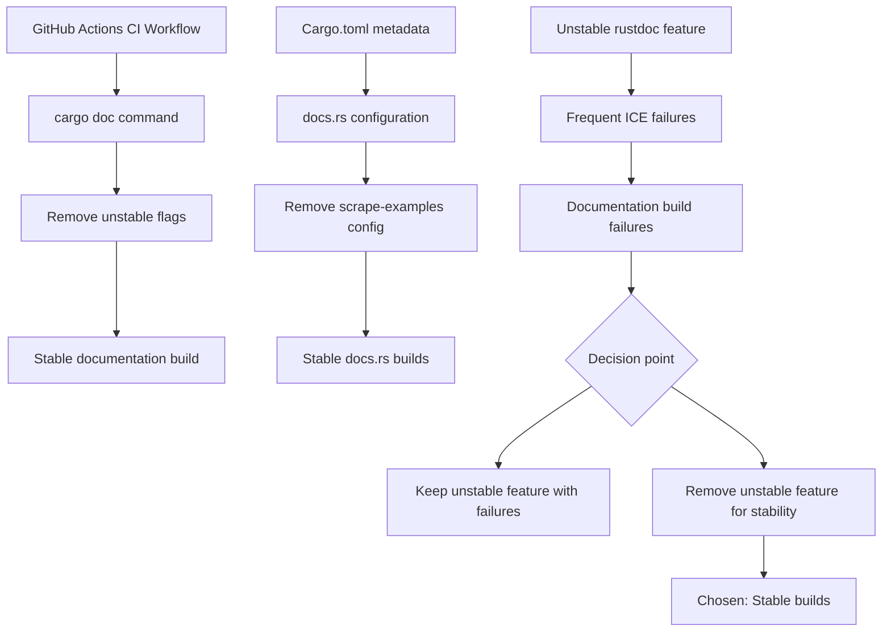

+++
title = "#22142 disable scraping examples in doc"
date = "2025-12-16T00:00:00"
draft = false
template = "pull_request_page.html"
in_search_index = true

[taxonomies]
list_display = ["show"]

[extra]
current_language = "en"
available_languages = {"en" = { name = "English", url = "/pull_request/bevy/2025-12/pr-22142-en-20251216" }, "zh-cn" = { name = "中文", url = "/pull_request/bevy/2025-12/pr-22142-zh-cn-20251216" }}
labels = ["C-Bug", "C-Docs", "D-Trivial", "A-Build-System"]
+++

# Title

## Basic Information
- **Title**: disable scraping examples in doc
- **PR Link**: https://github.com/bevyengine/bevy/pull/22142
- **Author**: mockersf
- **Status**: MERGED
- **Labels**: C-Bug, C-Docs, D-Trivial, A-Build-System, S-Ready-For-Final-Review
- **Created**: 2025-12-15T22:38:38Z
- **Merged**: 2025-12-16T05:20:40Z
- **Merged By**: alice-i-cecile

## Description Translation
# Objective

- rustdoc example scraping is too unstable, and often ICE 
- Fixes https://github.com/bevyengine/bevy/issues/21978

## Solution

- Stop using it

## The Story of This Pull Request

The PR addresses a CI reliability issue in the Bevy game engine's documentation build process. The problem centered on rustdoc's experimental example scraping feature, which automatically finds and includes code examples from the repository's `examples/` directory in the generated API documentation. While this feature provides value by showing practical usage of APIs, it was causing frequent build failures in CI due to its unstable nature.

Specifically, the issue (#21978) reported that the documentation build was encountering Internal Compiler Errors (ICEs) - catastrophic failures in the Rust compiler itself - when using the `-Zrustdoc-scrape-examples` flag. These ICEs are particularly problematic because they represent bugs in the compiler rather than errors in the Bevy codebase, making them difficult to diagnose or work around. The feature requires the `-Zunstable-options` flag because it's not yet stable Rust, meaning it's only available on nightly toolchains and subject to frequent breaking changes.

The solution approach was straightforward and pragmatic: completely disable the example scraping feature by removing the unstable flags from both the CI workflow and the Cargo.toml configuration. This decision reflects a common engineering trade-off between additional functionality and build stability. When a feature causes consistent, unpredictable failures that block development workflows, the most practical solution is often to temporarily disable it until the underlying technology stabilizes.

From an implementation perspective, the changes were minimal but targeted. The CI workflow for building documentation (`.github/workflows/docs.yml`) was modified to remove the `-Zunstable-options` and `-Zrustdoc-scrape-examples` flags from the cargo doc command. Similarly, the `Cargo.toml` file was updated to remove the corresponding `cargo-args` configuration that passed these flags to the documentation build process for docs.rs.

The technical insight here is about managing dependencies on unstable compiler features in production codebases. While nightly Rust features can provide valuable capabilities, they come with significant maintenance costs and reliability risks. The Bevy team's decision to remove these flags demonstrates good practice in CI/CD pipeline management: prioritizing reliable, predictable builds over experimental features that introduce instability.

The impact of this change is immediate build stability for documentation generation. Developers no longer face random ICE failures when documentation builds run, which improves the overall developer experience and reduces noise in the CI system. The trade-off is that API documentation will no longer automatically include examples from the `examples/` directory, potentially making it slightly harder for users to find usage examples. However, this loss is mitigated by Bevy's existing comprehensive example system and the fact that users can still manually browse the examples directory.

An important technical consideration is that this fix doesn't address the root cause of the ICEs in rustdoc itself, but rather works around them by disabling the problematic feature. This is a valid approach when the feature is non-essential and the failures are outside the project's control. The Rust team can continue to stabilize the scraping feature independently, and Bevy can re-enable it once it becomes more reliable.

## Visual Representation



## Key Files Changed

### 1. `.github/workflows/docs.yml`

**What changed**: Removed the unstable Rust flags from the cargo doc command in the CI workflow for building documentation.

**Code snippet**:
```yaml
# Before:
        run: |
          cargo doc \
            -Zunstable-options \
            -Zrustdoc-scrape-examples \
            --all-features \
            --workspace \
            --no-deps \
            --document-private-items

# After:
        run: |
          cargo doc \
            --all-features \
            --workspace \
            --no-deps \
            --document-private-items
```

**Why it matters**: This change prevents the CI system from using the unstable rustdoc feature that was causing Internal Compiler Errors, making documentation builds reliable and predictable.

### 2. `Cargo.toml`

**What changed**: Removed the `cargo-args` configuration that enabled example scraping for docs.rs builds.

**Code snippet**:
```toml
# Before:
rustdoc-args = [
  "-Zunstable-options",
  "--cfg=docsrs",
  "--generate-link-to-definition",
  "--html-after-content",
  "docs-rs/trait-tags.html",
]
all-features = true
cargo-args = ["-Zunstable-options", "-Zrustdoc-scrape-examples"]

# After:
rustdoc-args = [
  "-Zunstable-options",
  "--cfg=docsrs",
  "--generate-link-to-definition",
  "--html-after-content",
  "docs-rs/trait-tags.html",
]
all-features = true
```

**Why it matters**: This ensures that documentation builds on docs.rs (the official Rust documentation hosting service) also avoid the unstable feature, providing consistent behavior between local builds, CI builds, and published documentation.

## Further Reading

1. **Rustdoc Scrape Examples RFC**: The original proposal for this feature provides insight into its intended design and use cases: https://github.com/rust-lang/rfcs/pull/3123

2. **Rust Unstable Features Guide**: Understanding how unstable features work in Rust and the risks associated with using them: https://doc.rust-lang.org/unstable-book/

3. **Bevy Examples System**: Learn about Bevy's comprehensive example system that provides practical usage demonstrations: https://github.com/bevyengine/bevy/tree/main/examples

4. **Rust ICE (Internal Compiler Error)**: Information about what ICEs are and how to report them: https://doc.rust-lang.org/nightly/rustc/ice.html

5. **GitHub Actions for Rust**: Best practices for setting up reliable CI/CD for Rust projects: https://github.com/actions-rs/meta

# Full Code Diff
```diff
diff --git a/.github/workflows/docs.yml b/.github/workflows/docs.yml
index 79391d9e674c1..c059134276829 100644
--- a/.github/workflows/docs.yml
+++ b/.github/workflows/docs.yml
@@ -62,8 +62,6 @@ jobs:
           RUSTDOCFLAGS: -Zunstable-options --cfg=docsrs --generate-link-to-definition --html-after-content docs-rs/trait-tags.html
         run: |
           cargo doc \
-            -Zunstable-options \
-            -Zrustdoc-scrape-examples \
             --all-features \
             --workspace \
             --no-deps \
diff --git a/Cargo.toml b/Cargo.toml
index 61d0d5a580a80..c249d71a0f267 100644
--- a/Cargo.toml
+++ b/Cargo.toml
@@ -4691,7 +4691,6 @@ rustdoc-args = [
   "docs-rs/trait-tags.html",
 ]
 all-features = true
-cargo-args = ["-Zunstable-options", "-Zrustdoc-scrape-examples"]
 
 [[example]]
 name = "monitor_info"
```