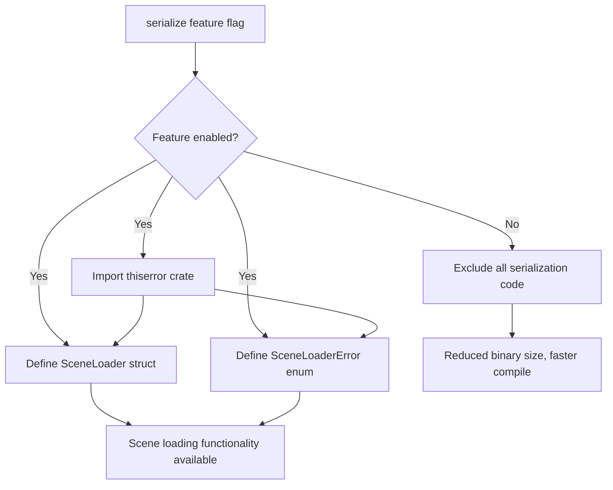

+++
title = "#22143 gate SceneLoaderError behind same feature as scene loader"
date = "2025-12-16T00:00:00"
draft = false
template = "pull_request_page.html"
in_search_index = true

[taxonomies]
list_display = ["show"]

[extra]
current_language = "en"
available_languages = {"en" = { name = "English", url = "/pull_request/bevy/2025-12/pr-22143-en-20251216" }, "zh-cn" = { name = "中文", url = "/pull_request/bevy/2025-12/pr-22143-zh-cn-20251216" }}
labels = ["C-Bug", "A-Scenes"]
+++

# Title

## Basic Information
- **Title**: gate SceneLoaderError behind same feature as scene loader
- **PR Link**: https://github.com/bevyengine/bevy/pull/22143
- **Author**: mockersf
- **Status**: MERGED
- **Labels**: C-Bug, S-Ready-For-Final-Review, A-Scenes
- **Created**: 2025-12-15T23:04:32Z
- **Merged**: 2025-12-15T23:51:10Z
- **Merged By**: alice-i-cecile

## Description
**Objective**

- Fixes #22138 
- Asset loader is gated by a feature, but the asset loader error type isn't

**Solution**

- Gate the asset loader error type behind the same feature as the asset loader

## The Story of This Pull Request

This PR addresses a compilation issue in the Bevy game engine related to conditional compilation of features. The problem was straightforward: the `SceneLoader` struct and its implementation were correctly gated behind a feature flag, but the associated error type `SceneLoaderError` wasn't, causing build failures when the feature was disabled.

The `SceneLoader` is part of Bevy's scene system, which handles loading and deserializing scene files. This functionality depends on serialization capabilities, so it's conditionally compiled using the `serialize` feature flag. When developers disable this feature to reduce binary size or compilation time, they expect all serialization-related code to be excluded.

However, the error type `SceneLoaderError` remained in the compiled code even when the `serialize` feature was disabled. This created a dependency issue because `SceneLoaderError` uses the `thiserror` crate for error derivation, which is only imported when the `serialize` feature is enabled. Without the feature, the compiler couldn't find the `Error` derive macro, causing the build to fail.

The fix was simple but important for maintaining clean conditional compilation boundaries. The developer moved the `thiserror` import inside the feature guard and added the same `#[cfg(feature = "serialize")]` attribute to the `SceneLoaderError` enum definition. This ensures that both the loader and its error type are consistently included or excluded based on the feature flag.

This kind of issue is common in Rust projects using feature flags, where types and their dependencies must be carefully coordinated to ensure the code compiles correctly in all feature combinations. The solution demonstrates good practice in feature gating by ensuring that all related code—including error types, imports, and dependencies—is consistently controlled by the same condition.

## Visual Representation



## Key Files Changed

**crates/bevy_scene/src/scene_loader.rs** (+2/-1)

This file contains the scene loader implementation and its associated error type. The changes ensure both are consistently gated behind the same feature flag.

**Before:**
```rust
use bevy_ecs::{
    world::{FromWorld, World},
};
use bevy_reflect::TypeRegistryArc;
use thiserror::Error;

#[cfg(feature = "serialize")]
use {
    crate::{serde::SceneDeserializer, DynamicScene},
    bevy_asset::{io::Reader, AssetLoader, LoadContext},
    serde::de::DeserializeSeed,
};

// ... other code ...

/// Possible errors that can be produced by [`SceneLoader`]
#[non_exhaustive]
#[derive(Debug, Error)]
pub enum SceneLoaderError {
```

**After:**
```rust
use bevy_ecs::{
    world::{FromWorld, World},
};
use bevy_reflect::TypeRegistryArc;

#[cfg(feature = "serialize")]
use {
    crate::{serde::SceneDeserializer, DynamicScene},
    bevy_asset::{io::Reader, AssetLoader, LoadContext},
    serde::de::DeserializeSeed,
    thiserror::Error,
};

// ... other code ...

/// Possible errors that can be produced by [`SceneLoader`]
#[cfg(feature = "serialize")]
#[non_exhaustive]
#[derive(Debug, Error)]
pub enum SceneLoaderError {
```

The key changes are:
1. Moving the `thiserror::Error` import inside the `#[cfg(feature = "serialize")]` block
2. Adding `#[cfg(feature = "serialize")]` to the `SceneLoaderError` enum definition

These changes ensure that when the `serialize` feature is disabled, neither the `SceneLoaderError` type nor its dependency on `thiserror` are included in the compilation, fixing the build error.

## Further Reading

1. [The Cargo Book: Features](https://doc.rust-lang.org/cargo/reference/features.html) - Official documentation on Rust's feature system
2. [Conditional Compilation in Rust](https://doc.rust-lang.org/reference/conditional-compilation.html) - Rust reference on `#[cfg]` attributes
3. [thiserror crate documentation](https://docs.rs/thiserror/latest/thiserror/) - Error handling library used in Bevy
4. [Bevy Engine: Features](https://bevyengine.org/learn/book/next/programming/features/) - Bevy's documentation on feature flags