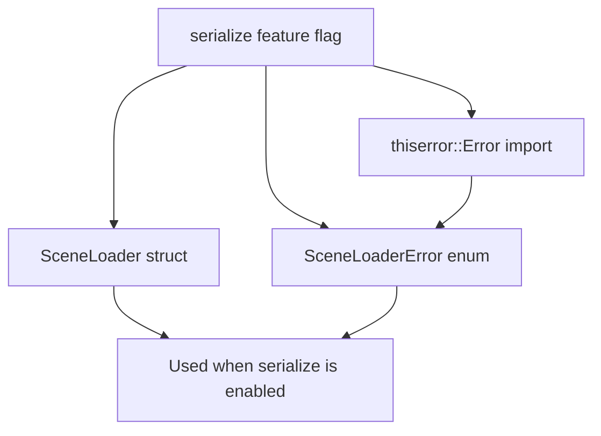

+++
title = "#22143 gate SceneLoaderError behind same feature as scene loader"
date = "2025-12-16T00:00:00"
draft = false
template = "pull_request_page.html"
in_search_index = false

[extra]
current_language = "zh-cn"
available_languages = {"en" = { name = "English", url = "/pull_request/bevy/2025-12/pr-22143-en-20251216" }, "zh-cn" = { name = "中文", url = "/pull_request/bevy/2025-12/pr-22143-zh-cn-20251216" }}
labels = ["C-Bug", "A-Scenes"]
+++

# gate SceneLoaderError behind same feature as scene loader

## Basic Information
- **Title**: gate SceneLoaderError behind same feature as scene loader
- **PR Link**: https://github.com/bevyengine/bevy/pull/22143
- **Author**: mockersf
- **Status**: MERGED
- **Labels**: C-Bug, S-Ready-For-Final-Review, A-Scenes
- **Created**: 2025-12-15T23:04:32Z
- **Merged**: 2025-12-15T23:51:10Z
- **Merged By**: alice-i-cecile

## Description Translation
### 目标
- 修复 #22138
- 资产加载器被功能特性（feature）控制，但资产加载器的错误类型却没有

### 解决方案
- 将资产加载器的错误类型置于与资产加载器相同的功能特性后面

## The Story of This Pull Request

这个问题是一个典型的条件编译错误。在Rust项目中，当某些功能被设计为可选时，相关的代码需要通过`#[cfg(feature = "feature_name")]`属性来控制编译。在Bevy的`scene_loader`模块中，场景加载器（`SceneLoader`）和它的相关实现被放在了`serialize`特性后面，但错误枚举`SceneLoaderError`却遗漏了这个条件编译属性。

这个疏忽导致了问题#22138：当用户在编译时没有启用`serialize`特性时，他们仍然会看到`SceneLoaderError`类型，尽管这个错误类型实际上只在与场景加载相关的功能被使用时才需要。这种不一致性可能导致编译错误或混淆，因为错误类型引用了可能不存在的依赖项（例如`thiserror` crate中的`Error`派生宏）。

问题的核心在于一致性。在Rust的条件编译系统中，如果一个类型只在特定特性启用时才有意义，那么它应该与该特性下的其他代码一起被条件编译。这不仅减少了不必要的编译代码，还避免了用户在不启用相应特性时遇到未预期的类型定义。

解决方案直接且清晰：将`SceneLoaderError`枚举的整个定义移到`#[cfg(feature = "serialize")]`属性后面。具体实现中，还需要注意`thiserror::Error`的导入也需要被移动，因为`SceneLoaderError`依赖于这个派生宏，而该宏只在`serialize`特性启用时才需要。

查看代码更改，可以看到两个关键改动：
1. 将`thiserror::Error`的导入从文件顶部移到`#[cfg(feature = "serialize")]`块内，因为只有在该特性启用时才需要这个依赖。
2. 在`SceneLoaderError`枚举定义前添加`#[cfg(feature = "serialize")]`属性。

这种修复模式在Rust生态系统中很常见：确保类型、函数和它们的依赖项在相同的条件编译块内，以保持一致性。这种谨慎的条件编译管理对于维护清晰的API边界和避免编译时错误至关重要。

从工程角度看，这个PR展示了如何正确管理特性门控（feature gating）的代码组织。当模块的某些部分被条件编译时，必须仔细检查所有相关类型、函数和导入，确保它们都在正确的编译条件下。遗漏任何一个部分都可能导致编译失败或意外的公共API暴露。

这个修复虽然代码改动很小，但对维护代码库的健康很重要。它确保了当用户禁用`serialize`特性时，不会遇到与场景加载相关的类型，从而保持了模块的清晰边界和可预测性。

## Visual Representation



## Key Files Changed

### `crates/bevy_scene/src/scene_loader.rs` (+2/-1)

这个文件包含了场景加载器的实现。主要的修改是确保`SceneLoaderError`枚举和它的依赖项只在`serialize`特性启用时被编译。

**修改细节：**

1. 将`thiserror::Error`导入移到特性条件块内，因为只有启用了`serialize`特性时才需要这个依赖。
2. 为`SceneLoaderError`枚举添加`#[cfg(feature = "serialize")]`属性，使其与`SceneLoader`保持一致。

**代码片段：**

```rust
// Before (at the top of the file):
use thiserror::Error;

#[cfg(feature = "serialize")]
use {
    crate::{serde::SceneDeserializer, DynamicScene},
    bevy_asset::{io::Reader, AssetLoader, LoadContext},
    serde::de::DeserializeSeed,
};

// After:
// thiserror::Error import moved inside the feature gate

#[cfg(feature = "serialize")]
use {
    crate::{serde::SceneDeserializer, DynamicScene},
    bevy_asset::{io::Reader, AssetLoader, LoadContext},
    serde::de::DeserializeSeed,
    thiserror::Error,  // Moved here
};

// Before (without feature gate):
/// Possible errors that can be produced by [`SceneLoader`]
#[non_exhaustive]
#[derive(Debug, Error)]
pub enum SceneLoaderError {
    // ... variants
}

// After (with feature gate):
/// Possible errors that can be produced by [`SceneLoader`]
#[cfg(feature = "serialize")]  // Added this attribute
#[non_exhaustive]
#[derive(Debug, Error)]
pub enum SceneLoaderError {
    // ... variants
}
```

## Further Reading

1. [Rust Conditional Compilation](https://doc.rust-lang.org/reference/conditional-compilation.html) - Rust官方文档中关于条件编译的详细说明
2. [Cargo Features](https://doc.rust-lang.org/cargo/reference/features.html) - Cargo特性系统的完整指南
3. [thiserror crate](https://docs.rs/thiserror/) - 用于在Rust中定义错误类型的流行库
4. [Bevy Scene System](https://bevyengine.org/learn/book/getting-started/scenes/) - Bevy引擎场景系统的官方文档

## Full Code Diff
```diff
diff --git a/crates/bevy_scene/src/scene_loader.rs b/crates/bevy_scene/src/scene_loader.rs
index 16b6015023a85..a3329c7e65e75 100644
--- a/crates/bevy_scene/src/scene_loader.rs
+++ b/crates/bevy_scene/src/scene_loader.rs
@@ -3,13 +3,13 @@ use bevy_ecs::{
     world::{FromWorld, World},
 };
 use bevy_reflect::TypeRegistryArc;
-use thiserror::Error;
 
 #[cfg(feature = "serialize")]
 use {
     crate::{serde::SceneDeserializer, DynamicScene},
     bevy_asset::{io::Reader, AssetLoader, LoadContext},
     serde::de::DeserializeSeed,
+    thiserror::Error,
 };
 
 /// Asset loader for a Bevy dynamic scene (`.scn` / `.scn.ron`).
@@ -34,6 +34,7 @@ impl FromWorld for SceneLoader {
 }
 
 /// Possible errors that can be produced by [`SceneLoader`]
+#[cfg(feature = "serialize")]
 #[non_exhaustive]
 #[derive(Debug, Error)]
 pub enum SceneLoaderError {
```