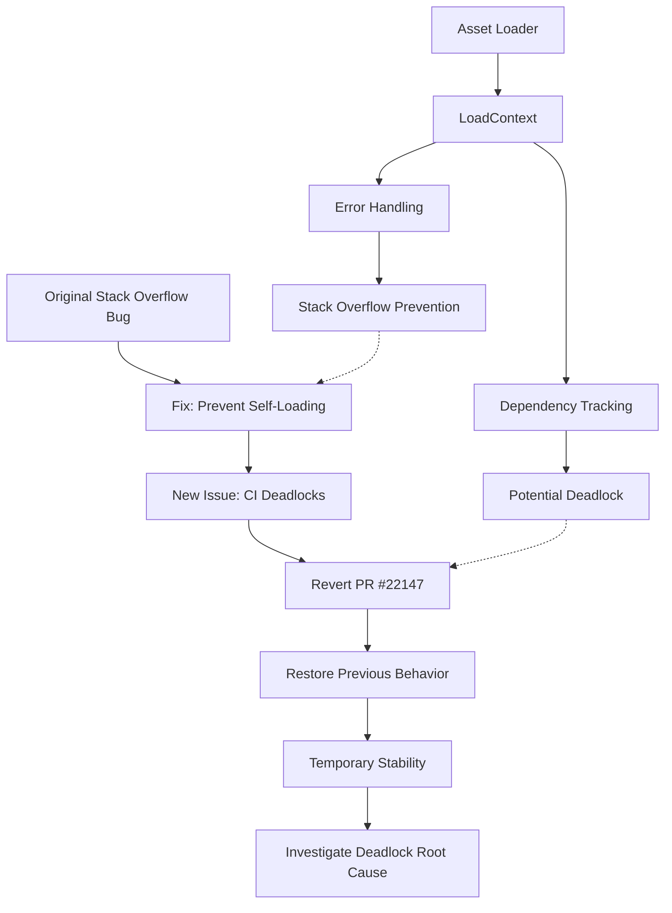

+++
title = "#22147 Revert \"bug: Fix stackoverflow on asset reload. (#21619)\""
date = "2025-12-16T00:00:00"
draft = false
template = "pull_request_page.html"
in_search_index = true

[taxonomies]
list_display = ["show"]

[extra]
current_language = "en"
available_languages = {"en" = { name = "English", url = "/pull_request/bevy/2025-12/pr-22147-en-20251216" }, "zh-cn" = { name = "中文", url = "/pull_request/bevy/2025-12/pr-22147-zh-cn-20251216" }}
labels = ["D-Trivial", "A-Assets", "C-Testing"]
+++

# Title
## Revert "bug: Fix stackoverflow on asset reload. (#21619)"

## Basic Information
- **Title**: Revert "bug: Fix stackoverflow on asset reload. (#21619)"
- **PR Link**: https://github.com/bevyengine/bevy/pull/22147
- **Author**: andriyDev
- **Status**: MERGED
- **Labels**: D-Trivial, A-Assets, C-Testing, S-Needs-Review
- **Created**: 2025-12-16T03:20:02Z
- **Merged**: 2025-12-16T04:17:22Z
- **Merged By**: alice-i-cecile

## Description Translation
This reverts commit ac7ee143d6c615b4dfce693562b1a5300b9c371d.

# Objective

- Our CI has been much more flaky with this PR.

## Solution

- Temporarily revert this PR while we investigate the flakes.

## Testing

- Running the asset tests on repeat fairly quickly results in a deadlock with this PR. Without it is **much much** less likely.

## The Story of This Pull Request

This pull request represents a pragmatic engineering decision: when a fix introduces new stability issues, sometimes the most practical approach is to temporarily roll back the changes while investigating the root cause. The PR reverts commit ac7ee143d6c615b4dfce693562b1a5300b9c371d, which was a previous fix for a stack overflow issue during asset reloads.

The original problem (#21619) was that certain asset loading patterns could cause infinite recursion or stack overflow. The fix attempted to prevent assets from loading themselves recursively, particularly in "immediate" loading contexts. It added checks throughout the asset loading pipeline to detect when an asset was attempting to load its own path and either return an error or skip dependency tracking in those cases.

However, the implementation introduced a new issue: deadlocks in the Continuous Integration (CI) tests. When running the asset tests repeatedly, the system would frequently deadlock. This suggests that the self-reference detection logic interfered with the normal dependency tracking or event handling mechanisms in a way that could cause threads to wait indefinitely for conditions that would never be satisfied.

From an engineering perspective, this is a classic trade-off: the fix for one edge case (recursive self-loading) created a more common issue (test deadlocks). The revert decision prioritizes system stability and test reliability over addressing the original stack overflow edge case. This is a reasonable approach when:
1. The original issue affects a less common code path
2. The fix introduces new, more frequent failures
3. The team needs stable CI to continue development

The changes being reverted were spread across multiple components of the asset system:

1. **Error Handling**: The `LoadDirectError` enum removed its `RequestedSelfPath` variant, which was used to return specific errors when assets tried to load themselves.

2. **Dependency Tracking**: Code that conditionally added dependencies (skipping self-dependencies) was reverted to always add dependencies, even for self-references.

3. **Cycle Detection**: An assertion in the asset server that prevented assets from being listed as their own dependents was removed.

4. **Testing Infrastructure**: Multiple test cases specifically designed to verify the self-loading behavior were removed.

The key insight here is that the prevention mechanism for stack overflows was likely too restrictive or implemented in a way that created race conditions or deadlock scenarios. By reverting to the previous behavior, the system allows self-references but accepts the risk of potential stack overflows in edge cases. This gives the team time to investigate the deadlock issue more thoroughly and design a more robust solution that addresses both problems.

## Visual Representation



## Key Files Changed

### `crates/bevy_asset/src/lib.rs`
**Change**: Removed 385 lines of test code that validated the self-loading prevention behavior.

**Context**: These tests were specifically written to verify that:
1. Immediate loading of self-paths returns an error
2. Deferred loading of self-paths works correctly
3. Various edge cases around typed vs untyped self-loading

**Code snippet (removed test)**:
```rust
#[test]
fn error_on_immediate_load_of_self_path() {
    // Test implementation that verified immediate self-loading
    // would return a RequestedSelfPath error
    // ...
}
```

**Impact**: Without these tests, the behavior of self-loading assets is no longer explicitly validated, but the test suite becomes less prone to deadlocks.

### `crates/bevy_asset/src/loader.rs`
**Change**: Removed the `RequestedSelfPath` error variant and the check that prevented self-loading in `load_direct`.

**Before**:
```rust
pub enum LoadDirectError {
    #[error("The asset at path `{0:?}` requested to immediately load itself recursively, but this is not supported")]
    RequestedSelfPath(AssetPath<'static>),
}

impl<'a> LoadContext<'a> {
    fn load_direct(
        &mut self,
        path: &AssetPath<'_>,
        loader: &dyn ErasedAssetLoader,
        reader: &mut dyn Reader,
    ) -> Result<ErasedLoadedAsset, LoadDirectError> {
        if self.asset_path == path {
            return Err(LoadDirectError::RequestedSelfPath(
                self.asset_path.clone_owned(),
            ));
        }
        // ... rest of implementation
    }
}
```

**After**:
```rust
pub enum LoadDirectError {
    // RequestedSelfPath variant removed
}

impl<'a> LoadContext<'a> {
    fn load_direct(
        &mut self,
        path: &AssetPath<'_>,
        loader: &dyn ErasedAssetLoader,
        reader: &mut dyn Reader,
    ) -> Result<ErasedLoadedAsset, LoadDirectError> {
        // No self-path check
        // ... rest of implementation
    }
}
```

**Impact**: Assets can now attempt to load themselves immediately, which could potentially cause stack overflows but eliminates a source of deadlocks.

### `crates/bevy_asset/src/loader_builders.rs`
**Change**: Removed conditional dependency tracking and self-path checks in loader builders.

**Before (deferred loader)**:
```rust
let is_self_path = *self.load_context.path() == path;
let handle = // ... load asset
if !is_self_path {
    let index = (&handle).try_into().unwrap();
    self.load_context.dependencies.insert(index);
} else {
    debug!(
        "Asset from path `{:?}` loaded its self path",
        self.load_context.path()
    );
}
```

**After**:
```rust
let handle = // ... load asset
let index = (&handle).try_into().unwrap();
self.load_context.dependencies.insert(index);
```

**Impact**: All loads now add dependencies, including self-references, which changes how the dependency graph is constructed.

### `crates/bevy_asset/src/server/mod.rs`
**Change**: Removed an assertion that prevented assets from being their own dependents.

**Before**:
```rust
if let Some(dependents) = infos.loader_dependents.get(asset_path) {
    for dependent in dependents {
        assert_ne!(
            asset_path, dependent,
            "The asset path `{}` contains itself as a dependent.",
            &asset_path
        );
        // If the above assertion fails, the following code would
        // cause a stackoverflow.
        paths_to_reload.insert(dependent.to_owned());
        queue_ancestors(dependent, infos, paths_to_reload);
    }
}
```

**After**:
```rust
if let Some(dependents) = infos.loader_dependents.get(asset_path) {
    for dependent in dependents {
        paths_to_reload.insert(dependent.to_owned());
        queue_ancestors(dependent, infos, paths_to_reload);
    }
}
```

**Impact**: The system no longer detects or prevents dependency cycles at this level, which could lead to infinite recursion during asset reloads but eliminates a potential source of deadlocks.

## Further Reading

1. **Original PR #21619**: The fix that introduced the self-loading prevention logic
2. **Bevy Asset System Documentation**: Understanding the asset loading pipeline and dependency tracking
3. **Deadlock Detection in Concurrent Systems**: Resources on identifying and preventing deadlocks in multi-threaded applications
4. **Graph Cycle Detection Algorithms**: Techniques for detecting cycles in dependency graphs without causing deadlocks

The team will need to investigate the deadlock issue more thoroughly before attempting another fix for the stack overflow problem. Potential approaches could include more sophisticated cycle detection, timeout mechanisms, or redesigning how asset dependencies are tracked and reloaded.