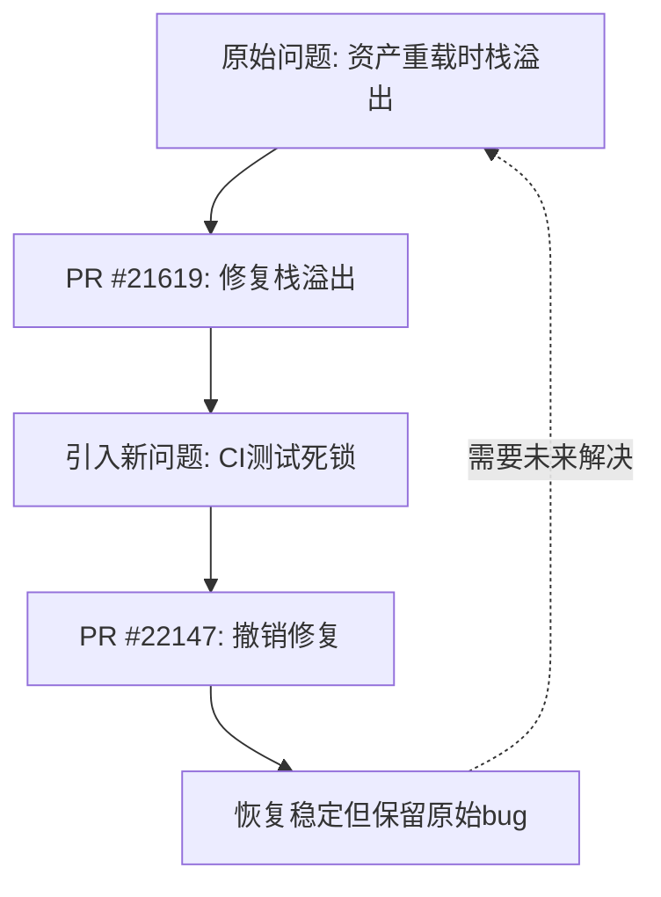

+++
title = "#22147 Revert \"bug: Fix stackoverflow on asset reload. (#21619)\""
date = "2025-12-16T00:00:00"
draft = false
template = "pull_request_page.html"
in_search_index = false

[extra]
current_language = "zh-cn"
available_languages = {"en" = { name = "English", url = "/pull_request/bevy/2025-12/pr-22147-en-20251216" }, "zh-cn" = { name = "中文", url = "/pull_request/bevy/2025-12/pr-22147-zh-cn-20251216" }}
+++

# Title

## 基本信息
- **标题**: Revert "bug: Fix stackoverflow on asset reload. (#21619)"
- **PR链接**: https://github.com/bevyengine/bevy/pull/22147
- **作者**: andriyDev
- **状态**: 已合并
- **标签**: D-简单, A-资产系统, C-测试, S-需要审查
- **创建时间**: 2025-12-16T03:20:02Z
- **合并时间**: 2025-12-16T04:17:22Z
- **合并者**: alice-i-cecile

## 描述翻译
撤销提交 ac7ee143d6c615b4dfce693562b1a5300b9c371d。

# 目标

- 我们的CI（持续集成）在这个PR之后变得非常不稳定。

## 解决方案

- 暂时撤销这个PR，同时我们调查这些不稳定的测试。

## 测试

- 重复运行资产测试，使用这个PR时很快就会导致死锁。不使用它的话，出现死锁的可能性**大大降低**。

## 这个PR的故事

### 问题的出现

PR #22147是一个撤销操作，它撤销了之前的一个修复栈溢出问题的PR。这是一个典型的技术债务管理案例：一个旨在解决特定bug的修复引入了一个更严重的问题——CI测试的不稳定性。

最初的PR #21619修复了一个在资产重载（asset reload）时可能导致栈溢出的bug。这个修复的核心思路是防止资产在加载过程中直接加载自身路径，这原本是一个合理的防护措施。然而，这个修复在复杂场景下暴露了隐藏的问题，导致了测试中的死锁。

### 临时的解决方案

当CI测试开始频繁失败时，开发团队面临一个选择：要么花时间深入调查死锁的根本原因，要么先撤销有问题的修复以恢复CI的稳定性。他们选择了后者，这是一种务实的工程决策。

撤销操作涉及四个文件，主要包含两个方面的工作：
1. 移除对"自加载"（资产尝试加载自己）的检查和错误处理
2. 删除相关的测试代码

### 技术实现细节

在`loader.rs`中，我们移除了`LoadDirectError::RequestedSelfPath`错误变体，这个错误原本用于表示资产尝试立即加载自身的情况。同时，移除了在`load_direct_with_meta_loader_and_reader`方法中对自加载路径的检查：

```rust
// 修改前：
if self.asset_path == path {
    return Err(LoadDirectError::RequestedSelfPath(
        self.asset_path.clone_owned(),
    ));
}

// 修改后：
// 移除了上述检查
```

在`loader_builders.rs`中，有几个关键变化。首先是在延迟加载（deferred loading）方法中，不再检查是否在加载自身路径：

```rust
// 修改前：
let is_self_path = *self.load_context.path() == path;
// ... 其他代码
if !is_self_path {
    let index = (&handle).try_into().unwrap();
    self.load_context.dependencies.insert(index);
} else {
    debug!(
        "Asset from path `{:?}` loaded its self path",
        self.load_context.path()
    );
}

// 修改后：
let index = (&handle).try_into().unwrap();
self.load_context.dependencies.insert(index);
```

对于立即加载（immediate loading），也移除了自加载路径的检查：

```rust
// 修改前：
if self.load_context.path() == path {
    return Err(LoadDirectError::RequestedSelfPath(path.clone()));
}

// 修改后：
// 移除了上述检查
```

在`server/mod.rs`中，移除了一个重要的断言，这个断言原本防止资产成为自己的依赖项：

```rust
// 修改前：
assert_ne!(
    asset_path, dependent,
    "The asset path `{}` contains itself as a dependent.",
    &asset_path
);
// If the above assertion fails, the following code would
// cause a stackoverflow.

// 修改后：
// 移除了断言
```

### 测试代码的移除

最显著的更改是在`lib.rs`中，移除了385行测试代码。这些测试原本用于验证资产加载系统的各种边界情况，包括：
- 立即加载自身路径时的错误处理
- 未知类型情况下立即加载自身路径的错误处理
- 延迟加载自身路径的正常工作
- 读取自身路径字节的正常工作
- 未知类型延迟加载自身路径的正常工作

这些测试的移除表明，撤销操作不仅影响了运行时行为，也改变了系统的预期行为规格。

### 技术洞察与权衡

这个案例展示了软件工程中常见的权衡：一个解决特定问题的修复可能引入更隐蔽、更严重的问题。在这里，修复栈溢出的代码在理论上看起来是正确的，但在实际并发执行时暴露了死锁问题。

资产加载系统是一个复杂的异步系统，涉及多个线程之间的协调。当添加额外的检查和依赖关系跟踪时，可能无意中改变了执行顺序或资源锁的获取顺序，从而导致死锁。

撤销操作的优点是：
1. 立即恢复CI的稳定性，使其他开发工作可以继续
2. 为深入调查根本原因提供时间，而不是在压力下进行匆忙的修复

缺点是：
1. 原有的栈溢出问题可能再次出现
2. 移除了有价值的测试覆盖

### 对系统的影响

撤销这个修复后，资产系统回到了之前的状态：允许资产在加载过程中加载自身路径。这简化了系统的逻辑，但也重新引入了潜在的风险。测试表明，这种状态在大多数情况下是稳定的，只是在某些极端条件下才可能出现栈溢出。

从工程角度看，这个决策遵循了"先恢复，后修复"的原则。当面临不确定的根本原因和紧迫的稳定性问题时，回退到已知稳定的状态通常是正确的选择。

## 可视化表示



## 关键文件更改

### 1. `crates/bevy_asset/src/lib.rs`
这个文件移除了大量的测试代码，主要涉及资产加载自身路径的各种场景。

**关键更改：**
```rust
// 移除了以下测试：
- error_on_immediate_load_of_self_path
- error_on_unknown_type_immediate_load_of_self_path  
- no_error_on_deferred_load_of_self_path
- no_error_on_read_bytes_of_self_path
- no_error_on_unknown_type_deferred_load_of_self_path
```

**影响：** 移除了对资产加载系统边界情况的测试覆盖，这些测试原本验证系统在自加载场景下的正确行为。

### 2. `crates/bevy_asset/src/loader.rs`
这个文件移除了对自加载路径的检查和错误处理。

**关键更改：**
```rust
// 在LoadDirectError枚举中：
// 修改前：
#[error("The asset at path `{0:?}` requested to immediately load itself recursively, but this is not supported")]
RequestedSelfPath(AssetPath<'static>),

// 修改后：
// 移除了RequestedSelfPath变体
```

```rust
// 在load_direct_with_meta_loader_and_reader方法中：
// 修改前：
if self.asset_path == path {
    return Err(LoadDirectError::RequestedSelfPath(
        self.asset_path.clone_owned(),
    ));
}

// 修改后：
// 移除了上述检查
```

**影响：** 资产加载系统不再阻止立即加载自身路径，这可能在某些情况下导致无限递归。

### 3. `crates/bevy_asset/src/loader_builders.rs`
这个文件移除了在多种加载场景下的自加载检查。

**关键更改：**
```rust
// 在NestedLoader的立即加载方法中：
// 修改前：
if self.load_context.path() == path {
    return Err(LoadDirectError::RequestedSelfPath(path.clone()));
}

// 修改后：
// 移除了上述检查
```

**影响：** 资产现在可以尝试立即加载自己，系统将不再返回明确的错误，而是可能陷入未定义行为。

### 4. `crates/bevy_asset/src/server/mod.rs`
这个文件移除了一个重要的断言，该断言防止资产成为自己的依赖项。

**关键更改：**
```rust
// 修改前：
assert_ne!(
    asset_path, dependent,
    "The asset path `{}` contains itself as a dependent.",
    &asset_path
);
// 注释：如果上述断言失败，后续代码将导致栈溢出

// 修改后：
// 移除了断言
```

**影响：** 资产依赖关系图中现在可能包含循环依赖，这可能导致栈溢出或其他未定义行为。

## 进一步阅读

1. **原始PR #21619**: https://github.com/bevyengine/bevy/pull/21619
2. **资产系统文档**: https://bevyengine.org/learn/books/assets/
3. **并发系统中的死锁检测与避免**: 了解如何在异步系统中识别和避免死锁条件
4. **回滚策略**: 在持续集成/持续部署（CI/CD）流水线中实施有效的回滚策略
5. **Rust中的递归与栈溢出**: 理解Rust中递归调用的限制和避免栈溢出的最佳实践

这个案例强调了在复杂的异步系统中进行修改时需要谨慎，以及拥有可靠的CI系统和回滚机制的重要性。