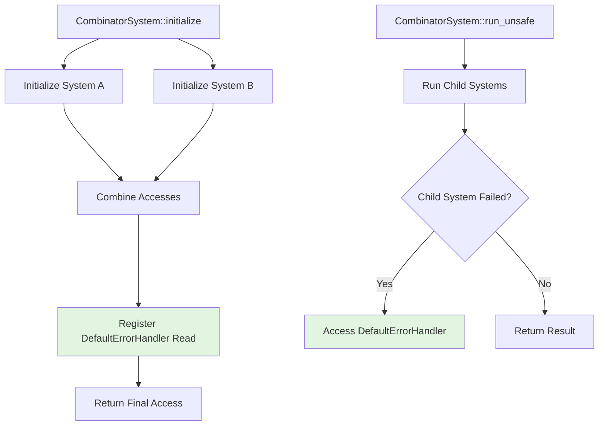

+++
title = "#22148 register read on DefaultErrorHandler in CombinatorSystem"
date = "2025-12-17T00:00:00"
draft = false
template = "pull_request_page.html"
in_search_index = true

[taxonomies]
list_display = ["show"]

[extra]
current_language = "en"
available_languages = {"en" = { name = "English", url = "/pull_request/bevy/2025-12/pr-22148-en-20251217" }, "zh-cn" = { name = "中文", url = "/pull_request/bevy/2025-12/pr-22148-zh-cn-20251217" }}
labels = ["C-Bug", "A-ECS", "P-Unsound"]
+++

# Title

## Basic Information

- **Title**: register read on DefaultErrorHandler in CombinatorSystem
- **PR Link**: https://github.com/bevyengine/bevy/pull/22148
- **Author**: janis-bhm
- **Status**: MERGED
- **Labels**: C-Bug, A-ECS, S-Ready-For-Final-Review, P-Unsound
- **Created**: 2025-12-16T06:40:25Z
- **Merged**: 2025-12-17T02:32:30Z
- **Merged By**: cart

## Description Translation

# Objective
Fixes #22133

## Solution
`CombinatorSystem` now registers a read on the `DefaultErrorHandler` resource in `System::initialize` as @hymm suggested. I've also decided to deny `unsafe_op_in_unsafe_fn` in that method, which I think would have helped me find this beforehand.

## Testing
I've written a test that checks that `CombinatorSystems` can still access the resource mutably, checks that a combinatory system does conflict with a system which mutably accesses the resource, and runs such a schedule to possibly allow miri to catch the error that this PR fixes (this last point doesn't seem to be the true, but afaik that could be due to it not actually being run in parallel even when it's legal for the executor to do so?).

## The Story of This Pull Request

This PR addresses an unsoundness bug in Bevy's ECS system combinators. The issue stemmed from a subtle oversight in how `CombinatorSystem` manages its resource accesses during system execution.

### The Problem and Context

When a `CombinatorSystem` runs its child systems, it needs to handle potential errors from those systems. Specifically, if a child system returns a `RunSystemError::Failed`, the combinator uses the `DefaultErrorHandler` resource to process the error. However, the system wasn't declaring that it reads this resource during its initialization phase.

In Bevy's ECS architecture, systems must declare all their resource accesses during the `initialize` method. This allows the scheduler to determine which systems can run in parallel without conflicts. When a system fails to declare a resource access but still uses it during execution, this creates a potential data race condition. Other systems that mutate the same resource could be scheduled to run concurrently, leading to undefined behavior.

The bug was particularly insidious because it only manifested when:
1. A `CombinatorSystem` had a child system that failed
2. Another system concurrently mutated the `DefaultErrorHandler` resource
3. The scheduler incorrectly allowed both to run in parallel

### The Solution Approach

The fix, suggested by @hymm, was straightforward in concept but required careful implementation: add a read access registration for the `DefaultErrorHandler` resource in the `CombinatorSystem::initialize` method.

However, implementing this correctly required attention to several details:

1. The access needs to be added after combining the accesses of both child systems
2. The safety documentation needed updating to reflect the new access
3. The unsafe code blocks needed to be properly annotated to prevent similar issues in the future

The developer also made an important defensive change by adding `#![deny(unsafe_op_in_unsafe_fn)]` to the `run_unsafe` method. This Rust lint requires explicit `unsafe` blocks within already-unsafe functions, making it clearer which operations are actually unsafe and need justification.

### The Implementation

The core fix happens in the `initialize` method of `CombinatorSystem`. After initializing both child systems and combining their accesses, the method now explicitly registers a read access for the `DefaultErrorHandler`:

```rust
// We might need to read the default error handler after the component
// systems have run to report failures.
let error_resource = world.register_resource::<crate::error::DefaultErrorHandler>();
a_access.add_unfiltered_resource_read(error_resource);
```

This ensures that the scheduler knows about this access and won't schedule conflicting systems to run concurrently.

The safety documentation in the `combine` function was updated to explain why this access doesn't create conflicts:

```rust
// The closure's access to the DefaultErrorHandler does not
// conflict with any potential access to the DefaultErrorHandler by
// the systems since the closures are not run in parallel.
```

In the `run_unsafe` method, the developer added the `unsafe_op_in_unsafe_fn` denial and updated the error handling code to explicitly mark the unsafe operation:

```rust
Err(RunSystemError::Failed(err)) => {
    // SAFETY: We registered access to DefaultErrorHandler in `initialize`.
    (unsafe { world.0.default_error_handler() })(
        err,
        ErrorContext::System {
            name: system.name(),
        },
    )
}
```

The test suite was expanded with a new test `combinator_with_error_handler_access` that verifies:
1. A `CombinatorSystem` can still access the error handler resource mutably (through one of its child systems)
2. The combinator system doesn't conflict with itself
3. The combinator system correctly conflicts with another system that mutably accesses the same resource

### Technical Insights

This PR highlights several important aspects of Bevy's ECS design:

1. **Access Declarations are Critical**: Bevy's safety relies on systems declaring all their accesses upfront. This allows the scheduler to prevent data races at compile time rather than runtime.

2. **Combinator Systems Have Complex Lifecycles**: `CombinatorSystem` needs to handle both the execution of its child systems and any error handling that occurs after they run. This requires careful access management across different phases of execution.

3. **Error Handling as a Resource**: Using the `DefaultErrorHandler` as a resource allows for flexible error handling strategies, but it also means error handling must follow the same access rules as any other system logic.

4. **Unsafe Code Discipline**: The addition of `#![deny(unsafe_op_in_unsafe_fn)]` is a best practice that makes unsafe code more maintainable. It forces developers to explicitly mark which operations within an unsafe function are actually unsafe, making safety reasoning easier.

### The Impact

This fix eliminates a potential data race condition in Bevy's ECS system. While the bug might have been difficult to trigger in practice (requiring specific timing of system failures and concurrent access), it represented a real unsoundness that could lead to undefined behavior.

The changes also improve code quality by:
1. Making the resource access pattern explicit and documented
2. Adding stricter unsafe code guidelines
3. Providing comprehensive tests to prevent regression

The test added in this PR is particularly valuable because it verifies both the positive case (systems can access resources they need) and the negative case (conflicting systems are properly detected).

## Visual Representation



## Key Files Changed

- `crates/bevy_ecs/src/system/combinator.rs` (+55/-5)

### Changes in combinator.rs

The main changes focus on ensuring proper resource access registration and improving unsafe code practices:

1. **Fixed missing resource access registration in `initialize` method**:
   ```rust
   // Before:
   fn initialize(&mut self, world: &mut World) -> SystemArchetypeAccess {
       let mut a_access = self.a.initialize(world);
       let b_access = self.b.initialize(world);
       a_access.extend(b_access);
       a_access
   }
   
   // After:
   fn initialize(&mut self, world: &mut World) -> SystemArchetypeAccess {
       let mut a_access = self.a.initialize(world);
       let b_access = self.b.initialize(world);
       a_access.extend(b_access);
   
       // We might need to read the default error handler after the component
       // systems have run to report failures.
       let error_resource = world.register_resource::<crate::error::DefaultErrorHandler>();
       a_access.add_unfiltered_resource_read(error_resource);
       a_access
   }
   ```

2. **Improved unsafe code practices in `run_unsafe`**:
   ```rust
   // Added at the beginning of the closure:
   #![deny(unsafe_op_in_unsafe_fn)]
   
   // Updated error handling with explicit unsafe block:
   Err(RunSystemError::Failed(err)) => {
       // SAFETY: We registered access to DefaultErrorHandler in `initialize`.
       (unsafe { world.0.default_error_handler() })(
           err,
           ErrorContext::System {
               name: system.name(),
           },
       )
   }
   ```

3. **Added comprehensive test coverage**:
   ```rust
   #[test]
   fn combinator_with_error_handler_access() {
       // Tests that CombinatorSystem properly handles DefaultErrorHandler access
       // and correctly conflicts with systems that mutate the same resource
   }
   ```

## Further Reading

- [Bevy ECS System Safety Documentation](https://bevyengine.org/learn/book/next/programming/ecs/systems/#system-safety)
- [Rust's Unsafe Code Guidelines](https://rust-lang.github.io/unsafe-code-guidelines/)
- [The `unsafe_op_in_unsafe_fn` lint](https://doc.rust-lang.org/rustc/lints/listing/allowed-by-default.html#unsafe-op-in-unsafe-fn)
- [Bevy's Error Handling Patterns](https://bevyengine.org/learn/book/next/programming/errors/)
- [System Combinators in Bevy ECS](https://bevyengine.org/learn/book/next/programming/ecs/system-combinators/)