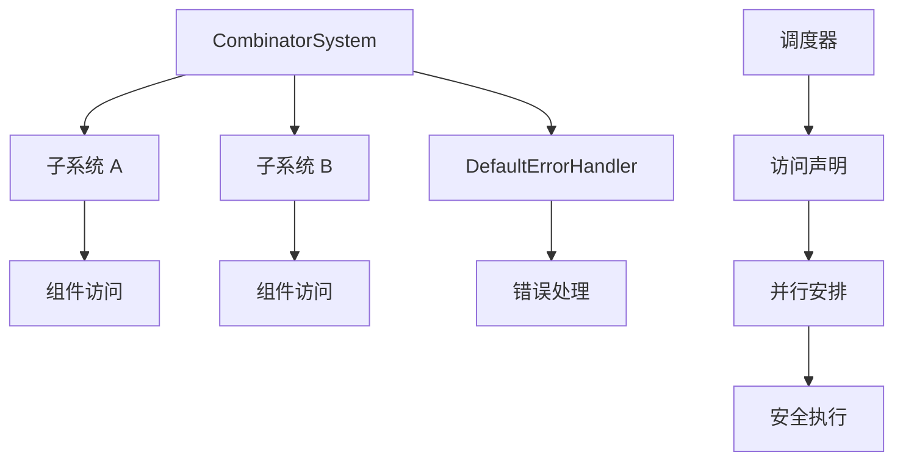

+++
title = "#22148 在 CombinatorSystem 中注册对 DefaultErrorHandler 的读取"
date = "2025-12-17T00:00:00"
draft = false
template = "pull_request_page.html"
in_search_index = false

[extra]
current_language = "zh-cn"
available_languages = {"en" = { name = "English", url = "/pull_request/bevy/2025-12/pr-22148-en-20251217" }, "zh-cn" = { name = "中文", url = "/pull_request/bevy/2025-12/pr-22148-zh-cn-20251217" }}
+++

# Title
register read on DefaultErrorHandler in CombinatorSystem

## Basic Information
- **标题**: 在 CombinatorSystem 中注册对 DefaultErrorHandler 的读取
- **PR 链接**: https://github.com/bevyengine/bevy/pull/22148  
- **作者**: janis-bhm
- **状态**: 已合并
- **标签**: C-Bug, A-ECS, S-Ready-For-Final-Review, P-Unsound
- **创建时间**: 2025-12-16T06:40:25Z
- **合并时间**: 2025-12-17T02:32:30Z
- **合并者**: cart

## 描述翻译

# 目标
修复 #22133

## 解决方案
`CombinatorSystem` 现在在 `System::initialize` 中注册对 `DefaultErrorHandler` 资源的读取，正如 @hymm 所建议的。我还决定在该方法中禁用 `unsafe_op_in_unsafe_fn`，我认为这可以帮助我提前发现这个问题。

## 测试
我编写了一个测试，检查 `CombinatorSystems` 是否仍能可变地访问资源，检查组合系统是否与可变访问资源的系统冲突，并运行这样的调度以允许 miri 捕捉此 PR 修复的错误（最后一点似乎并不成立，但据我所知，这可能是因为即使在执行器可以并行运行的情况下，它实际上也没有并行运行？）。

## 此 Pull Request 的分析

这个 PR 修复了 Bevy ECS 系统中一个关于资源访问权限声明不完整的漏洞。问题出现在 `CombinatorSystem` 中，当系统执行失败时，它会调用 `DefaultErrorHandler` 来处理错误，但该系统并没有在初始化时声明对这个资源的读取权限。

### 问题与背景

Bevy 的 ECS 调度器使用访问控制（access control）来确定哪些系统可以并行运行。系统需要在 `initialize` 方法中声明它们将访问哪些组件和资源，这样调度器才能安全地安排并行执行。`CombinatorSystem` 是一个组合两个系统的特殊系统类型，它在处理错误时需要访问 `DefaultErrorHandler` 资源。

问题的根本原因是：`CombinatorSystem` 的 `run_unsafe` 方法会调用 `world.0.default_error_handler()` 来处理系统执行错误，但该系统的 `initialize` 方法没有注册对这个资源的读取权限。这导致了未声明的资源访问（undeclared resource access），在调度器尝试并行执行系统时可能引起数据竞争。

### 解决方案

PR 采用了直接的方法：在 `CombinatorSystem::initialize` 方法中添加对 `DefaultErrorHandler` 资源的读取注册。具体实现如下：

```rust
// 我们可能需要在组件系统运行后读取默认错误处理器来报告失败。
let error_resource = world.register_resource::<crate::error::DefaultErrorHandler>();
a_access.add_unfiltered_resource_read(error_resource);
```

这个修改确保了 `CombinatorSystem` 正确声明了它对 `DefaultErrorHandler` 的读取访问，使得调度器能够正确处理依赖关系。

### 实施细节

1. **访问注册**：在 `initialize` 方法中，首先获取两个子系统的访问信息，然后为 `DefaultErrorHandler` 资源添加无过滤条件的读取访问。

2. **安全性注释**：在 `run_unsafe` 方法中添加了 `#![deny(unsafe_op_in_unsafe_fn)]` 属性，强制在 unsafe 函数内部明确标记 unsafe 操作。这有助于开发者更清楚地识别哪些操作需要特别注意安全性。

3. **安全保证**：更新了 `run` 方法的安全注释，明确指出调用者需要保证没有其他系统会与组合系统或 `DefaultErrorHandler` 资源产生冲突。

4. **测试验证**：添加了完整的测试用例，验证组合系统能够正确声明对错误处理器的访问，并确保调度器能够检测到潜在的冲突。

### 技术洞察

这个修复展示了 Bevy ECS 中资源访问声明的重要性。在系统组合模式中，每个系统必须完整声明其所有依赖，包括那些仅在错误处理路径中使用的资源。不完整的声明可能导致调度器做出不安全的并行执行决策。

`CombinatorSystem` 的设计需要特别注意，因为它封装了两个子系统，并且可能需要在子系统运行后执行额外的逻辑（如错误处理）。这种设计模式在系统组合中很常见，但需要确保所有访问路径都被正确声明。

### 影响

这个修复解决了一个潜在的数据竞争问题，确保了 Bevy ECS 调度器的正确性。具体影响包括：

1. **正确性**：消除了未声明的资源访问，确保调度器能够正确安排系统执行顺序。
2. **安全性**：通过添加 `unsafe_op_in_unsafe_fn` 限制，提高了代码的安全意识。
3. **可维护性**：清晰的测试用例为未来的修改提供了验证基准。

这个修复虽然代码量不大，但对系统的正确性至关重要。它提醒开发者在设计组合系统时需要仔细考虑所有可能的执行路径和资源访问。

## 可视化表示



## 关键文件变更

### `crates/bevy_ecs/src/system/combinator.rs` (+55/-5)

这个文件包含了 `CombinatorSystem` 的实现，是本次修复的核心。

**主要变更：**

1. **在 `initialize` 方法中添加资源访问注册**
```rust
// 之前：
fn initialize(&mut self, world: &mut World) -> SystemAccess {
    let mut a_access = self.a.initialize(world);
    let b_access = self.b.initialize(world);
    a_access.extend(b_access);
    a_access
}

// 之后：
fn initialize(&mut self, world: &mut World) -> SystemAccess {
    let mut a_access = self.a.initialize(world);
    let b_access = self.b.initialize(world);
    a_access.extend(b_access);

    // We might need to read the default error handler after the component
    // systems have run to report failures.
    let error_resource = world.register_resource::<crate::error::DefaultErrorHandler>();
    a_access.add_unfiltered_resource_read(error_resource);
    a_access
}
```

2. **在 `run_unsafe` 方法中添加安全属性**
```rust
fn run_unsafe(
    &mut self,
    input: SystemIn<S>,
    world: &mut PrivateUnsafeWorldCell,
) -> Result<S::Out, RunSystemError> {
    #![deny(unsafe_op_in_unsafe_fn)]  // 新增属性
    
    // ... 原有代码
}
```

3. **更新错误处理中的安全注释**
```rust
// 之前：
Err(RunSystemError::Failed(err)) => {
    // let the world's default error handler handle the error if `Failed(_)`
    (world.0.default_error_handler())(
        err,
        ErrorContext::System {
            name: system.name(),
        },
    )
}

// 之后：
Err(RunSystemError::Failed(err)) => {
    // let the world's default error handler handle the error if `Failed(_)`
    // SAFETY: We registered access to DefaultErrorHandler in `initialize`.
    (unsafe { world.0.default_error_handler() })(
        err,
        ErrorContext::System {
            name: system.name(),
        },
    )
}
```

4. **添加测试验证**
```rust
#[test]
fn combinator_with_error_handler_access() {
    // 测试组合系统是否正确声明对错误处理器的访问
    // 验证系统不会与自身冲突
    // 验证系统会与其他可变访问相同资源的系统冲突
}
```

这些变更确保了 `CombinatorSystem` 正确声明其对 `DefaultErrorHandler` 资源的访问，解决了潜在的未声明资源访问问题。

## 扩展阅读

1. **Bevy ECS 调度器文档**：了解 Bevy 如何安排系统执行和检测冲突
2. **Rust 安全编程指南**：深入理解 `unsafe` 代码的安全模式
3. **系统组合模式**：学习如何构建可组合的系统架构
4. **数据竞争检测**：了解现代编译器如何帮助检测并发问题

## 完整代码差异

```diff
diff --git a/crates/bevy_ecs/src/system/combinator.rs b/crates/bevy_ecs/src/system/combinator.rs
index e51c49d82e771..0ef463fc45e0d 100644
--- a/crates/bevy_ecs/src/system/combinator.rs
+++ b/crates/bevy_ecs/src/system/combinator.rs
@@ -167,14 +167,17 @@ where
             input: SystemIn<S>,
             world: &mut PrivateUnsafeWorldCell,
         ) -> Result<S::Out, RunSystemError> {
+            #![deny(unsafe_op_in_unsafe_fn)]
+
             // SAFETY: see comment on `Func::combine` call
             match (|| unsafe {
                 system.validate_param_unsafe(world.0)?;
                 system.run_unsafe(input, world.0)
             })() {
+                // let the world's default error handler handle the error if `Failed(_)`
                 Err(RunSystemError::Failed(err)) => {
-                    // let the world's default error handler handle the error if `Failed(_)`
-                    (world.0.default_error_handler())(
+                    // SAFETY: We registered access to DefaultErrorHandler in `initialize`.
+                    (unsafe { world.0.default_error_handler() })(
                         err,
                         ErrorContext::System {
                             name: system.name(),
@@ -198,12 +201,15 @@ where
             input,
             &mut PrivateUnsafeWorldCell(world),
             // SAFETY: The world accesses for both underlying systems have been registered,
-            // so the caller will guarantee that no other systems will conflict with `a` or `b`.
+            // so the caller will guarantee that no other systems will conflict with (`a` or `b`) and the `DefaultErrorHandler` resource.
             // If either system has `is_exclusive()`, then the combined system also has `is_exclusive`.
             // Since we require a `combine` to pass in a mutable reference to `world` and that's a private type
             // passed to a function as an unbound non-'static generic argument, they can never be called in parallel
             // or re-entrantly because that would require forging another instance of `PrivateUnsafeWorldCell`.
             // This means that the world accesses in the two closures will not conflict with each other.
+            // The closure's access to the DefaultErrorHandler does not
+            // conflict with any potential access to the DefaultErrorHandler by
+            // the systems since the closures are not run in parallel.
             |input, world| unsafe { run_system(&mut self.a, input, world) },
             // SAFETY: See the comment above.
             |input, world| unsafe { run_system(&mut self.b, input, world) },
@@ -244,6 +250,11 @@ where
         let mut a_access = self.a.initialize(world);
         let b_access = self.b.initialize(world);
         a_access.extend(b_access);
+
+        // We might need to read the default error handler after the component
+        // systems have run to report failures.
+        let error_resource = world.register_resource::<crate::error::DefaultErrorHandler>();
+        a_access.add_unfiltered_resource_read(error_resource);
         a_access
     }
 
@@ -481,11 +492,50 @@ where
 
 #[cfg(test)]
 mod tests {
+    use crate::error::DefaultErrorHandler;
+    use crate::prelude::*;
+    use bevy_utils::prelude::DebugName;
+
+    use crate::{
+        schedule::OrMarker,
+        system::{assert_system_does_not_conflict, CombinatorSystem},
+    };
 
     #[test]
-    fn exclusive_system_piping_is_possible() {
-        use crate::prelude::*;
+    fn combinator_with_error_handler_access() {
+        fn my_system(_: ResMut<DefaultErrorHandler>) {}
+        fn a() -> bool {
+            true
+        }
+        fn b(_: ResMut<DefaultErrorHandler>) -> bool {
+            true
+        }
+        fn asdf(_: In<bool>) {}
+
+        let mut world = World::new();
+        world.insert_resource(DefaultErrorHandler::default());
+
+        let system = CombinatorSystem::<OrMarker, _, _>::new(
+            IntoSystem::into_system(a),
+            IntoSystem::into_system(b),
+            DebugName::borrowed("a OR b"),
+        );
 
+        // `system` should not conflict with itself by mutably accessing the error handler resource.
+        assert_system_does_not_conflict(system.clone());
+
+        let mut schedule = Schedule::default();
+        schedule.add_systems((my_system, system.pipe(asdf)));
+        schedule.initialize(&mut world).unwrap();
+
+        // `my_system` should conflict with the combinator system because the combinator reads the error handler resource.
+        assert!(!schedule.graph().conflicting_systems().is_empty());
+
+        schedule.run(&mut world);
+    }
+
+    #[test]
+    fn exclusive_system_piping_is_possible() {
         fn my_exclusive_system(_world: &mut World) -> u32 {
             1
         }
```