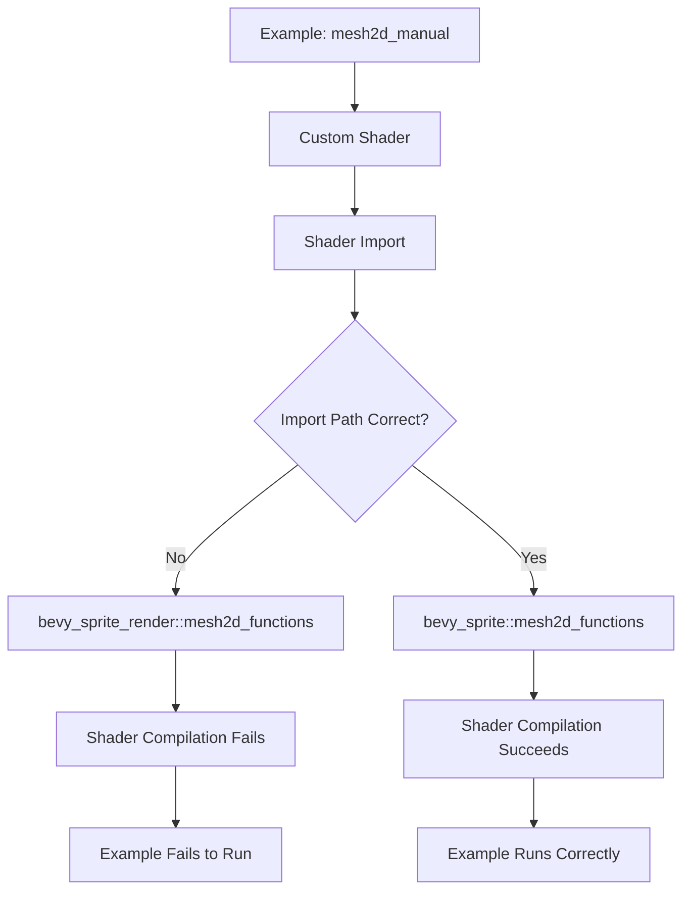

+++
title = "#22150 Fix shader import in manual 2d mesh example"
date = "2025-12-17T00:00:00"
draft = false
template = "pull_request_page.html"
in_search_index = true

[taxonomies]
list_display = ["show"]

[extra]
current_language = "en"
available_languages = {"en" = { name = "English", url = "/pull_request/bevy/2025-12/pr-22150-en-20251217" }, "zh-cn" = { name = "中文", url = "/pull_request/bevy/2025-12/pr-22150-zh-cn-20251217" }}
labels = ["D-Trivial", "A-Rendering", "C-Examples"]
+++

# Title: Fix shader import in manual 2d mesh example

## Basic Information
- **Title**: Fix shader import in manual 2d mesh example
- **PR Link**: https://github.com/bevyengine/bevy/pull/22150
- **Author**: NiklasEi
- **Status**: MERGED
- **Labels**: D-Trivial, A-Rendering, C-Examples, S-Ready-For-Final-Review
- **Created**: 2025-12-16T10:55:43Z
- **Merged**: 2025-12-17T19:29:38Z
- **Merged By**: alice-i-cecile

## Description Translation
# Objective

- Fixes #22126

## Solution

- Use the correct import in the example shader

## Testing

- Tested on Linux with `cargo run --example mesh2d_manual`

## The Story of This Pull Request

The issue was a broken shader import in the 2D manual mesh example. When users ran `cargo run --example mesh2d_manual`, the shader compilation would fail because the import path for mesh2d functions was incorrect. The shader was trying to import from `bevy_sprite_render::mesh2d_functions`, but the correct module path is `bevy_sprite::mesh2d_functions`.

This is a straightforward fix for a documentation example. The `mesh2d_manual` example demonstrates how to create custom 2D meshes with custom shaders in Bevy, and it's important that these examples compile and run correctly for users trying to learn the system. The example includes a custom shader defined as a string literal in the Rust code, which imports standard Bevy shader functions.

The incorrect import path suggests that there may have been a recent refactoring or module reorganization in the Bevy codebase, or that the example was written against an older version of the API. The `bevy_sprite_render` module doesn't exist in the current codebase, while `bevy_sprite` is the correct crate containing the mesh2d shader functions.

The fix is minimal but important for documentation and user experience. Examples serve as both learning resources and test cases for the engine's functionality, so when they break, it creates confusion for users trying to understand how to use the engine's features.

The author tested the fix on Linux using the standard `cargo run --example mesh2d_manual` command, which would verify that the example compiles and runs without shader compilation errors. This is sufficient testing for a change of this nature since it's a direct replacement of a single string value.

## Visual Representation



## Key Files Changed

**`examples/2d/mesh2d_manual.rs` (+1/-1)**

This file contains an example demonstrating how to create custom 2D meshes with custom shaders in Bevy. The change fixes a shader compilation error by correcting an import path.

**Code Change:**
```rust
// File: examples/2d/mesh2d_manual.rs
// Before (line 244):
#import bevy_sprite_render::mesh2d_functions

// After (line 244):
#import bevy_sprite::mesh2d_functions
```

The change is in a shader string constant defined in the Rust code. The shader is embedded as a raw string literal and uses Bevy's shader import system. The corrected import path points to the `bevy_sprite` crate, which contains the `mesh2d_functions` module that provides the necessary shader functions for 2D mesh rendering.

## Further Reading

1. [Bevy Shader Imports Documentation](https://bevyengine.org/learn/quick-start/graphics/shaders/) - Official documentation on Bevy's shader system and import mechanism
2. [Bevy Examples Directory](https://github.com/bevyengine/bevy/tree/main/examples) - Other examples demonstrating various Bevy features
3. [Issue #22126](https://github.com/bevyengine/bevy/issues/22126) - The original issue reporting the broken example
4. [Bevy Sprite Module Documentation](https://docs.rs/bevy_sprite/latest/bevy_sprite/) - API documentation for the bevy_sprite crate

# Full Code Diff
diff --git a/examples/2d/mesh2d_manual.rs b/examples/2d/mesh2d_manual.rs
index 79913288767a8..8eb5c051c3deb 100644
--- a/examples/2d/mesh2d_manual.rs
+++ b/examples/2d/mesh2d_manual.rs
@@ -241,7 +241,7 @@ type DrawColoredMesh2d = (
 // using `include_str!()`, or loaded like any other asset with `asset_server.load()`.
 const COLORED_MESH2D_SHADER: &str = r"
 // Import the standard 2d mesh uniforms and set their bind groups
-#import bevy_sprite_render::mesh2d_functions
+#import bevy_sprite::mesh2d_functions
 
 // The structure of the vertex buffer is as specified in `specialize()`
 struct Vertex {