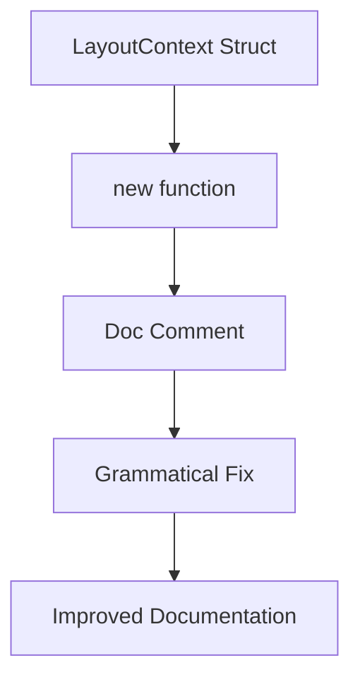

+++
title = "#22151 `LayoutContext` doc comment fix"
date = "2025-12-16T00:00:00"
draft = false
template = "pull_request_page.html"
in_search_index = true

[taxonomies]
list_display = ["show"]

[extra]
current_language = "en"
available_languages = {"en" = { name = "English", url = "/pull_request/bevy/2025-12/pr-22151-en-20251216" }, "zh-cn" = { name = "中文", url = "/pull_request/bevy/2025-12/pr-22151-zh-cn-20251216" }}
labels = ["C-Docs", "D-Trivial", "A-UI"]
+++

# Title

## Basic Information
- **Title**: `LayoutContext` doc comment fix
- **PR Link**: https://github.com/bevyengine/bevy/pull/22151
- **Author**: ickshonpe
- **Status**: MERGED
- **Labels**: C-Docs, D-Trivial, A-UI, S-Ready-For-Final-Review
- **Created**: 2025-12-16T11:26:37Z
- **Merged**: 2025-12-16T20:39:19Z
- **Merged By**: alice-i-cecile

## Description Translation
# Objective

"create a new", not "create new a".

## The Story of This Pull Request

This PR addresses a small but noticeable grammatical error in the Bevy UI module's documentation. The issue was in a doc comment for the `LayoutContext::new` function, which had the phrase "create new a" instead of the correct grammatical form "create a new". While this type of error doesn't affect the code's functionality, it does impact the readability and professionalism of the documentation.

In any software project, but particularly in a widely-used engine like Bevy, documentation quality matters. Developers reading the API documentation rely on clear, correct explanations to understand how to use the framework. Grammatical errors can create confusion or undermine confidence in the codebase's quality. For new contributors, seeing well-maintained documentation sets a standard for attention to detail throughout the project.

The fix is straightforward: a one-line change to the doc comment. The developer corrected the word order and also fixed the capitalization of the first word ("Create" instead of "create"), bringing it in line with standard Rust documentation conventions where doc comments typically start with a capital letter when they're complete sentences.

This change demonstrates the value of careful code review, even for small documentation fixes. The error was in a const function's doc comment in the UI layout module, which might not be the most frequently visited part of the codebase, but maintaining consistency across all documentation helps create a cohesive developer experience.

The technical implementation shows how Bevy's UI system handles layout calculations. The `LayoutContext` struct stores a scale factor and physical size, which are essential for converting between logical and physical pixels in responsive UI layouts. While the fix doesn't change any functional code, it ensures that developers reading the documentation for this context object receive clear, grammatically correct information about its purpose.

## Visual Representation



## Key Files Changed

- `crates/bevy_ui/src/layout/mod.rs` (+1/-1)

This file contains the layout system implementation for Bevy's UI framework. The only change is in the doc comment for the `LayoutContext::new` constructor function.

```rust
// File: crates/bevy_ui/src/layout/mod.rs
// Before:
/// create new a [`LayoutContext`] from the window's physical size and scale factor

// After:
/// Create a new [`LayoutContext`] from the window's physical size and scale factor
```

The change fixes the grammatical error in the documentation string and follows Rust convention by capitalizing the first word of the doc comment. The function itself remains unchanged, as this is purely a documentation improvement.

## Further Reading

- [Rust Documentation Guidelines](https://doc.rust-lang.org/rustdoc/how-to-write-documentation.html) - Official Rust documentation on writing effective doc comments
- [Bevy UI Documentation](https://bevyengine.org/learn/quick-start/ui/) - Bevy's official UI tutorial and documentation
- [Rust API Guidelines - Documentation](https://rust-lang.github.io/api-guidelines/documentation.html) - Comprehensive guidelines for Rust documentation

# Full Code Diff

```diff
diff --git a/crates/bevy_ui/src/layout/mod.rs b/crates/bevy_ui/src/layout/mod.rs
index 68b8c69dbd9e9..a3982ea2d5a4b 100644
--- a/crates/bevy_ui/src/layout/mod.rs
+++ b/crates/bevy_ui/src/layout/mod.rs
@@ -37,7 +37,7 @@ impl LayoutContext {
         scale_factor: 1.0,
         physical_size: Vec2::ZERO,
     };
-    /// create new a [`LayoutContext`] from the window's physical size and scale factor
+    /// Create a new [`LayoutContext`] from the window's physical size and scale factor
     #[inline]
     const fn new(scale_factor: f32, physical_size: Vec2) -> Self {
         Self {
```