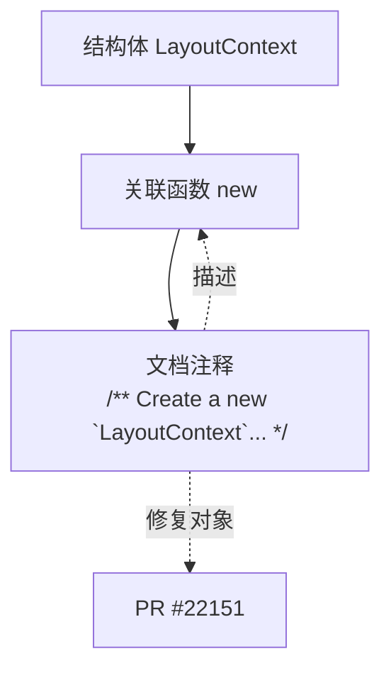

+++
title = "#22151 `LayoutContext` doc comment fix"
date = "2025-12-16T00:00:00"
draft = false
template = "pull_request_page.html"
in_search_index = false

[extra]
current_language = "zh-cn"
available_languages = {"en" = { name = "English", url = "/pull_request/bevy/2025-12/pr-22151-en-20251216" }, "zh-cn" = { name = "中文", url = "/pull_request/bevy/2025-12/pr-22151-zh-cn-20251216" }}
+++

# Title
`LayoutContext` doc comment fix

## Basic Information
- **Title**: `LayoutContext` doc comment fix
- **PR Link**: https://github.com/bevyengine/bevy/pull/22151
- **作者**: ickshonpe
- **状态**: 已合并
- **标签**: C-Docs, D-Trivial, A-UI, S-Ready-For-Final-Review
- **创建时间**: 2025-12-16T11:26:37Z
- **合并时间**: 2025-12-16T20:39:19Z
- **合并者**: alice-i-cecile

## 描述翻译
### 目标
修复文档注释中的语法错误，将 "create new a" 修正为 "create a new"。

## 本次 Pull Request 的故事

这个 PR 讲述了项目维护中一个微小但重要的方面：代码文档的准确性和专业性。Pull Request #22151 的目标非常具体，即修复 `LayoutContext::new` 关联函数文档注释中的一个语法错误。

`LayoutContext` 是 Bevy UI 系统布局模块中的一个核心结构体（struct），它封装了进行 UI 布局计算时所需的上下文信息，例如窗口的物理尺寸和缩放因子。关联函数 `new` 是其构造函数。在本次 PR 修改之前，其文档注释中写道 "create new a [`LayoutContext`]"，这是一个明显的语序错误。正确的英文表达应为 "Create a new [`LayoutContext`]"。

从工程角度看，这类修复虽然代码变更量极小（仅修改一个单词的顺序），但意义不容忽视。首先，准确的文档有助于提升代码的可读性（readability）和可维护性（maintainability）。当开发者，尤其是新贡献者或初次接触该代码库的人，在阅读文档时，语法正确、表达清晰的注释能减少理解上的歧义和认知负担。其次，这体现了项目对代码质量（code quality）细节的重视。文档作为代码的接口说明，其精确性与代码逻辑的正确性同样重要。一个包含明显语法错误的文档可能会让用户对代码库的整体严谨性产生怀疑。

从解决方案来看，这不需要复杂的算法或架构设计，只需要对自然语言的细心校对。作者 `ickshonpe` 识别了这个问题并提交了修正。该变更被迅速合并，这表明社区维护者认可这类文档修复的价值。

这个 PR 也展示了开源协作中的一个常见模式：即使是最资深的开发者也可能在编写注释时犯下简单的笔误。通过代码审查（code review）和社区贡献，这些细微的问题能够被发现和修复，从而持续提升整个项目的质量。标签 `D-Trivial` 和 `C-Docs` 准确地将此 PR 归类为文档类的琐碎修改，便于维护者进行优先级管理和分类。

最终，这个变更被合并到主线，`LayoutContext::new` 函数的文档注释变得语法正确、表达清晰。它确保所有未来阅读此文档的开发者都能获得准确、专业的指引，这是维持一个健康、易于上手的开源项目所必需的无数个小步骤之一。

## 可视化关系图
由于本次修改仅涉及单个文件的文档字符串，其结构关系简单。下图展示了修改的上下文：`LayoutContext` 结构体与其关联函数 `new` 以及被修复的文档字符串（doc comment）之间的关系。



## 关键文件变更
本次 PR 只修改了一个文件。

- `crates/bevy_ui/src/layout/mod.rs` (+1/-1)
    1. **变更描述与原因**：修复了 `LayoutContext::new` 函数文档注释中的语法错误，将词序错误的 "create new a" 修正为正确的 "create a new"。
    2. **代码片段**：
    ```rust
    // 文件: crates/bevy_ui/src/layout/mod.rs
    
    // 修改前:
    /// create new a [`LayoutContext`] from the window's physical size and scale factor
    
    // 修改后:
    /// Create a new [`LayoutContext`] from the window's physical size and scale factor
    ```
    3. **与 PR 目标的关联**：此更改直接实现了 PR 的唯一目标，即修正文档注释中的语法错误，提升了 API 文档的准确性和专业性。

## 扩展阅读
对于希望深入了解相关概念的读者，可以参考以下资源：
1.  **Rust 官方文档指南**：[The Rust RFC Book - API Documentation Conventions](https://rust-lang.github.io/rfcs/1574-more-api-documentation-conventions.html) - 了解 Rust 生态中 API 文档的最佳实践和约定。
2.  **Bevy 官方文档**：[Bevy - UI](https://bevyengine.org/learn/quick-start/ui/) - 学习 Bevy 游戏引擎中 UI 系统的工作原理，其中 `LayoutContext` 是布局计算的关键部分。
3.  **《代码整洁之道》** (Clean Code: A Handbook of Agile Software Craftsmanship) by Robert C. Martin - 书中关于“有意义的命名”和“注释”的章节，强调了编写清晰代码和文档的重要性。

# Full Code Diff
```
diff --git a/crates/bevy_ui/src/layout/mod.rs b/crates/bevy_ui/src/layout/mod.rs
index 68b8c69dbd9e9..a3982ea2d5a4b 100644
--- a/crates/bevy_ui/src/layout/mod.rs
+++ b/crates/bevy_ui/src/layout/mod.rs
@@ -37,7 +37,7 @@ impl LayoutContext {
         scale_factor: 1.0,
         physical_size: Vec2::ZERO,
     };
-    /// create new a [`LayoutContext`] from the window's physical size and scale factor
+    /// Create a new [`LayoutContext`] from the window's physical size and scale factor
     #[inline]
     const fn new(scale_factor: f32, physical_size: Vec2) -> Self {
         Self {
```