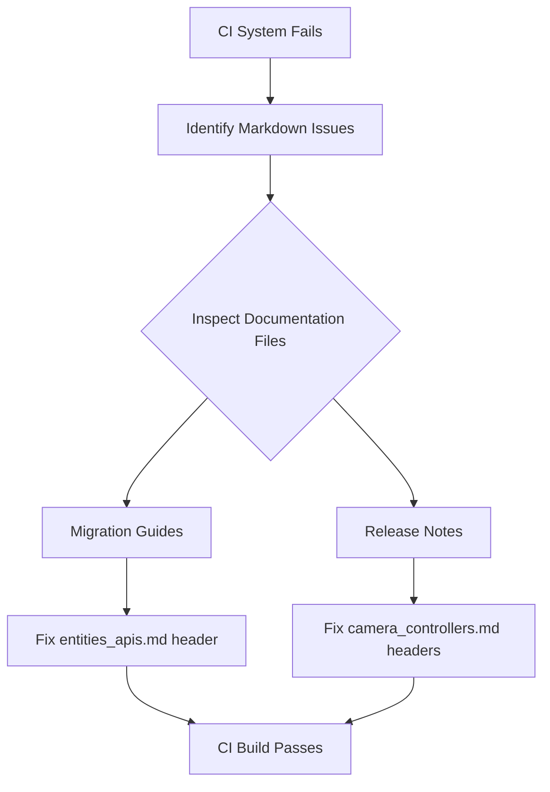

+++
title = "#22153 fix migration guides and release note headers"
date = "2025-12-16T00:00:00"
draft = false
template = "pull_request_page.html"
in_search_index = true

[taxonomies]
list_display = ["show"]

[extra]
current_language = "en"
available_languages = {"en" = { name = "English", url = "/pull_request/bevy/2025-12/pr-22153-en-20251216" }, "zh-cn" = { name = "中文", url = "/pull_request/bevy/2025-12/pr-22153-zh-cn-20251216" }}
+++

# fix migration guides and release note headers

## Basic Information
- **Title**: fix migration guides and release note headers
- **PR Link**: https://github.com/bevyengine/bevy/pull/22153
- **Author**: atlv24
- **Status**: MERGED
- **Labels**: S-Needs-Review
- **Created**: 2025-12-16T17:13:05Z
- **Merged**: 2025-12-16T18:10:18Z
- **Merged By**: alice-i-cecile

## Description Translation
The PR description is already in English:

# Objective

fix ci failing due to incorrect markdown

## The Story of This Pull Request

This PR addresses a straightforward but important CI failure caused by incorrect Markdown syntax in documentation files. The problem was identified when the continuous integration system flagged Markdown formatting errors that broke the automated documentation build process.

The core issue was incorrect header level usage in two documentation files. In Markdown, headers follow a hierarchical structure where `#` indicates a top-level header (h1), `##` indicates a second-level header (h2), `###` indicates a third-level header (h3), and so on. The documentation build system expects consistent header hierarchy, and deviations from expected structure can cause parsing failures.

Specifically, the problem occurred in:
1. **Migration guide documentation** - The `Entities` rework section was incorrectly marked as a third-level header (`###`) when it should have been a second-level header (`##`)
2. **Release notes documentation** - Three sections in the camera controllers documentation (`FreeCamera`, `PanCamera`, and "Using `bevy_camera_controller` in your own projects") were incorrectly marked as third-level headers when they should have been second-level headers

These inconsistencies likely occurred during documentation updates where header levels weren't properly aligned with the document's overall structure. While such formatting issues might seem minor, they're critical for automated documentation generation systems that parse Markdown structure to generate navigation, table of contents, and properly formatted output.

The solution approach was direct and minimal - correcting the header levels to match the expected document hierarchy. No complex logic or architectural changes were needed, just fixing the syntax to ensure the CI system could successfully parse and build the documentation.

The implementation involved simple text replacements in two files. Each change followed the same pattern: replacing `###` with `##` at the beginning of header lines. These changes restore the proper hierarchical structure expected by the documentation system.

From an engineering perspective, this PR demonstrates the importance of paying attention to documentation formatting in a project with automated CI/CD pipelines. Even small syntax errors can break builds and prevent deployment of documentation updates. The fix also shows how version control systems like Git make it easy to track and correct documentation formatting issues as part of the code review process.

## Visual Representation



## Key Files Changed

### `release-content/migration-guides/entities_apis.md`

**Change**: Fixed header level for the "`Entities` rework" section from `###` to `##`

**Reason**: This section should be a second-level header to maintain proper document hierarchy and prevent CI failures

**Code Snippet**:
```markdown
# Before:
### `Entities` rework

# After:
## `Entities` rework
```

### `release-content/release-notes/camera_controllers.md`

**Change**: Fixed header levels for three sections from `###` to `##`

**Reason**: These sections should be second-level headers to match the document structure and prevent CI failures

**Code Snippet**:
```markdown
# Before (three instances):
### `FreeCamera`
### `PanCamera`
### Using `bevy_camera_controller` in your own projects

# After (three instances):
## `FreeCamera`
## `PanCamera`
## Using `bevy_camera_controller` in your own projects
```

## Further Reading

1. [Markdown Guide - Basic Syntax](https://www.markdownguide.org/basic-syntax/)
2. [GitHub Flavored Markdown Spec](https://github.github.com/gfm/)
3. [Bevy Engine Documentation Guidelines](https://github.com/bevyengine/bevy/blob/main/docs/DOCUMENTATION_GUIDELINES.md)
4. [CommonMark Spec - ATX Headings](https://spec.commonmark.org/0.30/#atx-headings)

## Full Code Diff

```
diff --git a/release-content/migration-guides/entities_apis.md b/release-content/migration-guides/entities_apis.md
index 40d67d342f00a..ebc475c69c465 100644
--- a/release-content/migration-guides/entities_apis.md
+++ b/release-content/migration-guides/entities_apis.md
@@ -11,7 +11,7 @@ For a full explanation of the new entity paradigm, errors and terms, see the new
 If you want more background for the justification of these changes or more information about where these new terms come from, see pr #19451.
 This opens up a lot of room for performance improvement but also caused a lot of breaking changes:
 
-### `Entities` rework
+## `Entities` rework
 
 A lot has changed here.
 First, `alloc`, `free`, `reserve`, `reserve_entity`, `reserve_entities`, `flush`, `flush_as_invalid`, `EntityDoesNotExistError`, `total_count`, `used_count`, and `total_prospective_count` have all been removed 😱.
diff --git a/release-content/release-notes/camera_controllers.md b/release-content/release-notes/camera_controllers.md
index 599ac905bf9dc..87d544b39c965 100644
--- a/release-content/release-notes/camera_controllers.md
+++ b/release-content/release-notes/camera_controllers.md
@@ -20,7 +20,7 @@ To that end, we've created `bevy_camera_controller`: giving us a place to store,
 that we need for easy development, and yes, an eventual Editor.
 We're kicking it off with a couple of camera controllers, detailed below.
 
-### `FreeCamera`
+## `FreeCamera`
 
 The first camera controller that we've introduced is a "free camera", designed for quickly moving around a scene,
 completely ignoring both physics and geometry.
@@ -34,7 +34,7 @@ To configure the settings (speed, behavior, keybindings) or enable / disable the
 We've done our best to select good defaults, but the details of your scene (especially the scale!) will make a big
 difference to what feels right.
 
-### `PanCamera`
+## `PanCamera`
 
 The `PanCamera` controller is a simple and effective tool designed for 2D games or any project where you need
 to pan the camera and zoom in/out with ease. It allows you to move the camera using the WASD keys and zoom
@@ -47,7 +47,7 @@ To configure the camera's zoom levels, speed, or keybindings, simply modify the
 settings should work well for most use cases, but you can adjust them based on your specific needs, especially
 for large-scale or high-resolution 2D scenes.
 
-### Using `bevy_camera_controller` in your own projects
+## Using `bevy_camera_controller` in your own projects
 
 The provided camera controllers are designed to be functional, pleasant debug and dev tools:
 add the correct plugin and camera component and you're good to go!
```