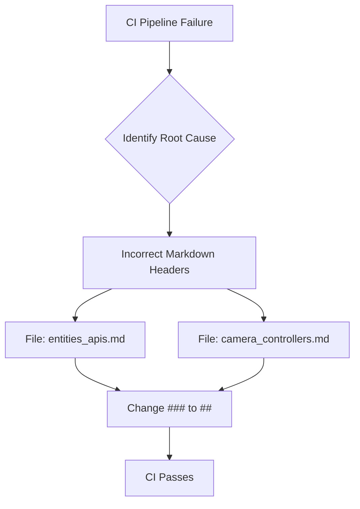

+++
title = "#22153 fix migration guides and release note headers"
date = "2025-12-16T00:00:00"
draft = false
template = "pull_request_page.html"
in_search_index = false

[extra]
current_language = "zh-cn"
available_languages = {"en" = { name = "English", url = "/pull_request/bevy/2025-12/pr-22153-en-20251216" }, "zh-cn" = { name = "中文", url = "/pull_request/bevy/2025-12/pr-22153-zh-cn-20251216" }}
+++

# Title
fix migration guides and release note headers

## Basic Information
- **Title**: fix migration guides and release note headers
- **PR Link**: https://github.com/bevyengine/bevy/pull/22153
- **Author**: atlv24
- **Status**: MERGED
- **Labels**: S-Needs-Review
- **Created**: 2025-12-16T17:13:05Z
- **Merged**: 2025-12-16T18:10:18Z
- **Merged By**: alice-i-cecile

## Description Translation
**目标**

修复由于不正确的markdown导致的CI失败。

## The Story of This Pull Request

这是一个关于文档构建流水线（pipeline）中一个微小但关键问题的修复。故事始于持续集成（CI）系统的一次失败，其根本原因是文档中的markdown标题格式不正确。

在软件项目中，尤其是像Bevy这样的大型开源项目，维护一套清晰、结构一致的文档至关重要。这些文档不仅供开发者阅读，也常常通过自动化工具进行检查和构建。在本例中，项目使用了某种CI流程来验证或构建文档，而该流程对markdown的标题层级（heading levels）有特定的规范或要求。

问题出现在两个文档文件中：`entities_apis.md`（迁移指南）和`camera_controllers.md`（发布说明）。这两个文件中的部分章节使用了三级标题（`###`），但这与文档的整体结构或CI检查的期望不符。通常，一个文档文件应该有一个顶层的一级标题（`#`），然后子章节使用二级标题（`##`），依此类推，以保持清晰的层次结构。如果层级使用不当，可能会导致文档生成的目录（Table of Contents）混乱，或者在严格的linting检查中失败。

开发者`atlv24`发现了这个导致CI失败的问题。解决方法是直接的：将这两个文件中误用的三级标题（`###`）统一提升为二级标题（`##`）。这是一个非常具体的语法修复，不涉及任何代码逻辑或功能变更。然而，它对于维持项目的健康状态——确保所有提交都能通过自动化检查——是必要的。

从工程实践的角度看，这个PR体现了几个要点：
1. **自动化检查的重要性**：CI系统能够捕捉到容易被人类忽略的格式不一致问题，从而保证仓库质量。
2. **细节的重要性**：即使是文档中的一个小符号，也可能中断整个构建流程。
3. **快速响应与修复**：从PR创建到合并，整个过程不到一小时，说明团队对维护构建稳定性的重视。

修改本身很简单，但背后的理念是：一个健康的代码库需要对其所有组成部分，包括文档，保持同样的严谨性。

## Visual Representation

由于本次修改仅涉及两个独立的文档文件，且修改内容相同，其关系可以简单表示如下：



## Key Files Changed

本次PR修改了两个markdown文档文件，修复了标题级别不匹配的问题。

1. **文件**: `release-content/migration-guides/entities_apis.md`
   - **修改描述**: 将“`Entities` rework”章节的标题从三级（`###`）改为二级（`##`），以符合文档的整体结构。
   - **代码片段**:
```markdown
# 修改前:
### `Entities` rework

# 修改后:
## `Entities` rework
```

2. **文件**: `release-content/release-notes/camera_controllers.md`
   - **修改描述**: 将三个章节（`FreeCamera`、`PanCamera`、`Using bevy_camera_controller in your own projects`）的标题从三级（`###`）统一改为二级（`##`）。
   - **代码片段** (以第一个为例):
```markdown
# 修改前:
### `FreeCamera`

# 修改后:
## `FreeCamera`
```
   - 其他两个章节的修改方式完全相同。

**与PR目标的关联**: 这些修改直接解决了PR描述中提到的“fix ci failing due to incorrect markdown”问题。通过统一标题级别，确保了文档的markdown语法符合项目的规范，从而使CI检查能够通过。

## Further Reading

- [Markdown Guide: Basic Syntax](https://www.markdownguide.org/basic-syntax/#headings) - 了解Markdown标题的基本语法和最佳实践。
- [Continuous Integration Concepts](https://docs.github.com/en/actions/automating-builds-and-tests/about-continuous-integration) - GitHub官方关于持续集成的概念介绍，有助于理解CI失败和修复的意义。
- [Bevy Engine Documentation](https://github.com/bevyengine/bevy/tree/main/docs) - 查看Bevy项目的其他文档，了解其文档风格和结构。