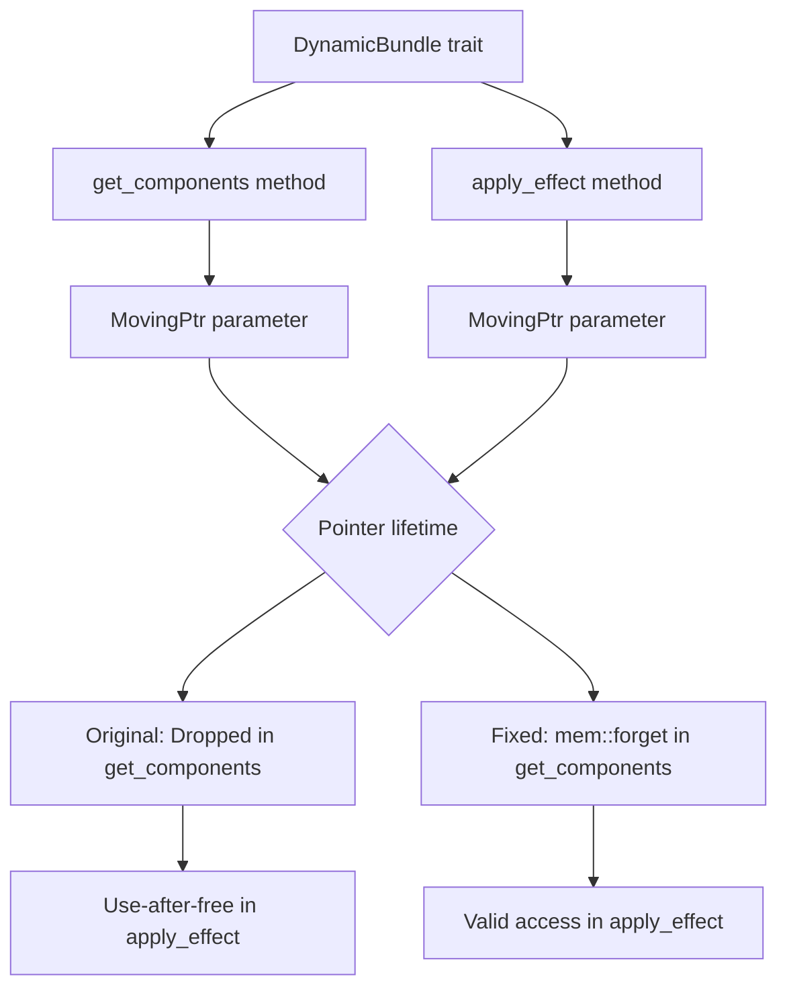

+++
title = "#22158 fix use-after-free in `AddObserver`"
date = "2025-12-17T00:00:00"
draft = false
template = "pull_request_page.html"
in_search_index = true

[taxonomies]
list_display = ["show"]

[extra]
current_language = "en"
available_languages = {"en" = { name = "English", url = "/pull_request/bevy/2025-12/pr-22158-en-20251217" }, "zh-cn" = { name = "中文", url = "/pull_request/bevy/2025-12/pr-22158-zh-cn-20251217" }}
labels = ["C-Bug", "A-ECS", "P-Unsound"]
+++

# Title

## Basic Information
- **Title**: fix use-after-free in `AddObserver`
- **PR Link**: https://github.com/bevyengine/bevy/pull/22158
- **Author**: grind086
- **Status**: MERGED
- **Labels**: C-Bug, A-ECS, P-Unsound, S-Needs-Review
- **Created**: 2025-12-17T01:03:24Z
- **Merged**: 2025-12-17T07:56:37Z
- **Merged By**: cart

## Description Translation

**Objective**

Fixes #22152

**Solution**

From the safety notes on `DynamicBundle::apply_effect`:

> If any part of `ptr` is to be accessed in this function, it must *not* be dropped at any point in `get_components`.

The `MovingPtr` [here](https://github.com/bevyengine/bevy/blob/8e4711cc40a883a1995dad06cc2b7e6f336b2f35/crates/bevy_ui_widgets/src/observe.rs#L51) is dropped when it goes out of scope, so the `assume_init` [here](https://github.com/bevyengine/bevy/blob/8e4711cc40a883a1995dad06cc2b7e6f336b2f35/crates/bevy_ui_widgets/src/observe.rs#L63) is invalid. This is fixed by `mem::forget`-ing the pointer in `get_components`, which will leave the allocation intact for `apply_effect`.

**Testing**

Using the example from the issue, the logs are correct after this patch.

# The Story of This Pull Request

This PR addresses a critical use-after-free bug in the `AddObserver` implementation within Bevy's UI widgets system. The issue was discovered and reported in #22152, where incorrect behavior occurred due to unsafe code violating the safety contract of the `DynamicBundle` trait.

The problem existed in the `observe.rs` file, specifically in the implementation of `DynamicBundle` for `AddObserver`. The `DynamicBundle` trait is part of Bevy's ECS system and provides an interface for efficiently adding components to entities. It has two key unsafe methods that must work together correctly: `get_components` and `apply_effect`.

The original code had a fundamental violation of the safety requirements documented in `DynamicBundle::apply_effect`. The documentation explicitly states that if any part of the pointer is accessed in `apply_effect`, it must not be dropped in `get_components`. However, the implementation was dropping the `MovingPtr` in `get_components` when it went out of scope, then trying to access it in `apply_effect` via `assume_init()`. This created a use-after-free situation where memory that had been freed was subsequently accessed.

The fix is straightforward but requires careful attention to the safety contract. The developer added `mem::forget(ptr)` in `get_components` to prevent the pointer from being dropped. This ensures the allocation remains valid when `apply_effect` is called. The pointer is then properly initialized and read in `apply_effect`.

This bug is particularly significant because it's marked as "P-Unsound" - meaning it could lead to undefined behavior and memory safety issues. In Rust, use-after-free bugs are serious memory safety violations that the language is designed to prevent. When they occur in safe Rust code, it typically indicates a bug in unsafe code that violated its safety invariants.

The implementation changes are minimal but crucial. The developer had to understand the interaction between `get_components` and `apply_effect`, recognize that the pointer was being dropped prematurely, and apply the correct solution using `mem::forget`. This is a good example of why unsafe code requires careful review and thorough understanding of the safety contracts involved.

The fix demonstrates proper handling of unsafe Rust patterns: when you need to transfer ownership of a pointer across unsafe function boundaries without dropping it, `mem::forget` is the appropriate tool. However, it's important to note that this means the memory must be properly cleaned up elsewhere - in this case, the pointer is consumed in `apply_effect`.

Testing confirmed the fix resolves the issue, as the example from the original bug report now produces correct logs. This is a critical fix for anyone using the observer system in Bevy's UI widgets, ensuring memory safety and correct behavior.

## Visual Representation



## Key Files Changed

**File: `crates/bevy_ui_widgets/src/observe.rs` (+8/-5)**

This file contains the unsafe implementation of `DynamicBundle` for `AddObserver`. The changes fix a use-after-free bug by ensuring the `MovingPtr` is not dropped prematurely.

**Key changes:**

1. Added `mem` to the imports for using `mem::forget`
2. Modified `get_components` to take the pointer parameter (previously ignored) and call `mem::forget` on it
3. Updated safety comments to explain the lifetime requirements
4. Changed the type annotation in `apply_effect` to use the imported `mem` module

```rust
// Before:
use core::marker::PhantomData;

unsafe fn get_components(
    _ptr: bevy_ecs::ptr::MovingPtr<'_, Self>,
    _func: &mut impl FnMut(bevy_ecs::component::StorageType, bevy_ecs::ptr::OwningPtr<'_>),
) {
    // SAFETY: Empty function body
}

unsafe fn apply_effect(
    ptr: bevy_ecs::ptr::MovingPtr<'_, core::mem::MaybeUninit<Self>>,
    entity: &mut bevy_ecs::world::EntityWorldMut,
) {
    // SAFETY: `get_components` does nothing, value was not moved.
    let add_observer = unsafe { ptr.assume_init() };
    let add_observer = add_observer.read();
    entity.observe(add_observer.observer);
}
```

```rust
// After:
use core::{marker::PhantomData, mem};

unsafe fn get_components(
    ptr: bevy_ecs::ptr::MovingPtr<'_, Self>,
    _func: &mut impl FnMut(bevy_ecs::component::StorageType, bevy_ecs::ptr::OwningPtr<'_>),
) {
    // SAFETY: We must not drop the pointer here, or it will be uninitialized in `apply_effect`
    // below.
    mem::forget(ptr);
}

unsafe fn apply_effect(
    ptr: bevy_ecs::ptr::MovingPtr<'_, mem::MaybeUninit<Self>>,
    entity: &mut bevy_ecs::world::EntityWorldMut,
) {
    // SAFETY: The pointer was not dropped in `get_components`, so the allocation is still
    // initialized.
    let add_observer = unsafe { ptr.assume_init() };
    let add_observer = add_observer.read();
    entity.observe(add_observer.observer);
}
```

## Further Reading

1. **Rustonomicon - Working with Unsafe**: https://doc.rust-lang.org/nomicon/working-with-unsafe.html
2. **Rust Reference - Unsafe Operations**: https://doc.rust-lang.org/reference/unsafety.html
3. **Bevy ECS Documentation**: https://bevyengine.org/learn/ecs/
4. **Rust `mem::forget` documentation**: https://doc.rust-lang.org/std/mem/fn.forget.html
5. **Understanding Use-After-Free Bugs**: https://owasp.org/www-community/vulnerabilities/Using_freed_memory