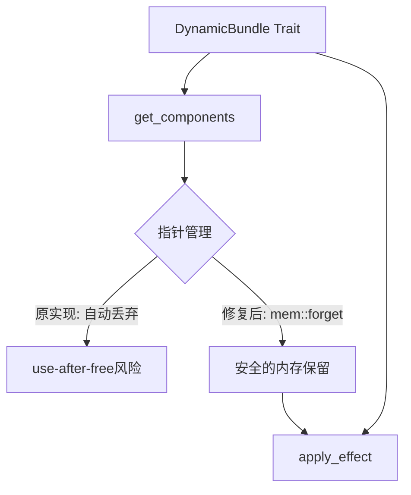

+++
title = "#22158 fix use-after-free in `AddObserver`"
date = "2025-12-17T00:00:00"
draft = false
template = "pull_request_page.html"
in_search_index = false

[extra]
current_language = "zh-cn"
available_languages = {"en" = { name = "English", url = "/pull_request/bevy/2025-12/pr-22158-en-20251217" }, "zh-cn" = { name = "中文", url = "/pull_request/bevy/2025-12/pr-22158-zh-cn-20251217" }}
labels = ["C-Bug", "A-ECS", "P-Unsound"]
+++

# Title

## Basic Information
- **Title**: fix use-after-free in `AddObserver`
- **PR Link**: https://github.com/bevyengine/bevy/pull/22158
- **Author**: grind086
- **Status**: MERGED
- **Labels**: C-Bug, A-ECS, P-Unsound, S-Needs-Review
- **Created**: 2025-12-17T01:03:24Z
- **Merged**: 2025-12-17T07:56:37Z
- **Merged By**: cart

## Description Translation
目标

修复 #22152

解决方案

根据 `DynamicBundle::apply_effect` 的安全说明：

> 如果要在本函数中访问 `ptr` 的任何部分，则 *不得* 在 `get_components` 中的任何点将其丢弃。

这里的 `MovingPtr` 在离开作用域时被丢弃，因此这里的 `assume_init` 是无效的。通过在 `get_components` 中使用 `mem::forget` 来修复此问题，这将为 `apply_effect` 保留分配。

测试

使用问题中的示例，打补丁后日志显示正确

## The Story of This Pull Request

这个PR源于一个具体的内存安全问题：在Bevy引擎的观察者系统中发现了一个潜在的use-after-free漏洞。问题的核心围绕 `DynamicBundle` trait 的实现，该trait用于在ECS（Entity Component System）中动态处理组件捆绑包（bundles）。

在Bevy中，`AddObserver` 是一个用于向实体添加观察者系统的特殊捆绑包类型。它实现了 `DynamicBundle` trait，该trait定义了 `get_components` 和 `apply_effect` 两个方法。根据 `DynamicBundle::apply_effect` 的安全注释要求：如果要在 `apply_effect` 中访问指针的任何部分，那么在 `get_components` 中绝不能丢弃该指针。

原实现中的问题在于 `get_components` 函数的实现违反了这一安全约束。在原始代码中，`MovingPtr` 参数在函数体中被忽略（使用 `_ptr` 占位符），当这个指针离开函数作用域时会自动调用 `drop` 方法，导致底层内存被释放。然而，`apply_effect` 方法随后尝试通过 `assume_init` 访问同一指针，这就构成了use-after-free。

解决方案直接且精确：修改 `get_components` 的实现，使用 `mem::forget` 来防止指针被自动丢弃。`mem::forget` 函数接收一个值并将其从内存中泄漏，防止其析构函数运行。这对于需要在不同函数调用间保持内存存活的场景是必要的安全措施。

具体实现上，代码做了以下关键修改：
1. 将 `get_components` 函数的参数从 `_ptr` 改为 `ptr`，明确表示我们确实需要处理这个指针
2. 在函数体内调用 `mem::forget(ptr)`，确保指针不会被过早释放
3. 更新安全注释，明确说明为什么需要避免在此处丢弃指针
4. 统一使用导入的 `mem` 模块而不是完整的 `core::mem` 路径

这种修复模式在需要手动管理内存生命周期的情况下是标准的Rust实践。它确保了 `MovingPtr` 的析构逻辑不会在 `apply_effect` 需要访问其内存之前运行，从而保持了内存的有效性直到 `apply_effect` 完成其工作。

从架构角度看，这个修复维护了 `DynamicBundle` trait 定义的生命周期约定。`get_components` 和 `apply_effect` 必须协同工作，前者准备数据，后者应用数据，期间需要保持内存有效。这种模式在ECS系统中很常见，其中组件数据需要在多个处理阶段保持存活。

值得注意的是，虽然使用 `mem::forget` 看起来像是内存泄漏，但在这种特定上下文中，这是实现所需内存安全保证的正确方式。指针最终会在 `apply_effect` 完成后被正确清理，因为整个所有权链条仍然完整。

从工程角度看，这个修复展示了几个重要原则：
1. 安全注释的存在是有原因的，必须严格遵守
2. 在unsafe代码中，生命周期的管理需要格外小心
3. 即使看起来简单的函数（如原来的空函数体 `get_components`）也可能隐藏重要的内存安全问题

这个漏洞被标记为"P-Unsound"（不健全），意味着它可能导致未定义行为。在游戏引擎这种对可靠性要求极高的系统中，这类问题的及时修复至关重要。

## Visual Representation



## Key Files Changed

### `crates/bevy_ui_widgets/src/observe.rs` (+8/-5)

这个文件包含了 `AddObserver` 类型的 `DynamicBundle` trait 实现。修复的主要变化集中在两个方法上：`get_components` 和 `apply_effect`。

**关键修改：**

1. **导入变更** - 添加了 `mem` 模块的显式导入：
```rust
// 修改前:
use core::marker::PhantomData;

// 修改后:
use core::{marker::PhantomData, mem};
```

2. **get_components 方法** - 核心的安全修复：
```rust
// 修改前:
#[inline]
unsafe fn get_components(
    _ptr: bevy_ecs::ptr::MovingPtr<'_, Self>,
    _func: &mut impl FnMut(bevy_ecs::component::StorageType, bevy_ecs::ptr::OwningPtr<'_>),
) {
    // SAFETY: Empty function body
}

// 修改后:
#[inline]
unsafe fn get_components(
    ptr: bevy_ecs::ptr::MovingPtr<'_, Self>,
    _func: &mut impl FnMut(bevy_ecs::component::StorageType, bevy_ecs::ptr::OwningPtr<'_>),
) {
    // SAFETY: We must not drop the pointer here, or it will be uninitialized in `apply_effect`
    // below.
    mem::forget(ptr);
}
```

3. **apply_effect 方法** - 更新类型别名以使用导入的 `mem` 模块：
```rust
// 修改前:
unsafe fn apply_effect(
    ptr: bevy_ecs::ptr::MovingPtr<'_, core::mem::MaybeUninit<Self>>,
    entity: &mut bevy_ecs::world::EntityWorldMut,
) {

// 修改后:
unsafe fn apply_effect(
    ptr: bevy_ecs::ptr::MovingPtr<'_, mem::MaybeUninit<Self>>,
    entity: &mut bevy_ecs::world::EntityWorldMut,
) {
```

这些修改确保了 `MovingPtr` 在 `get_components` 中不会被意外丢弃，从而避免了 `apply_effect` 中的 use-after-free 风险。

## Further Reading

1. **Rust 内存安全与 unsafe 代码**：
   - [Rustonomicon - Working with Unsafe](https://doc.rust-lang.org/nomicon/working-with-unsafe.html)
   - [Rust Reference - Unsafe Operations](https://doc.rust-lang.org/reference/unsafety.html)

2. **mem::forget 的使用场景**：
   - [std::mem::forget documentation](https://doc.rust-lang.org/std/mem/fn.forget.html)
   - [When to use mem::forget in Rust](https://www.reddit.com/r/rust/comments/3q2vqh/when_to_use_memforget/)

3. **Bevy ECS 架构**：
   - [Bevy ECS Guide](https://bevy-cheatbook.github.io/programming/ecs-intro.html)
   - [DynamicBundle trait documentation](https://docs.rs/bevy_ecs/latest/bevy_ecs/bundle/trait.DynamicBundle.html)

4. **Use-After-Free 漏洞模式**：
   - [OWASP - Use After Free](https://owasp.org/www-community/vulnerabilities/Use_after_free)
   - [CWE-416: Use After Free](https://cwe.mitre.org/data/definitions/416.html)