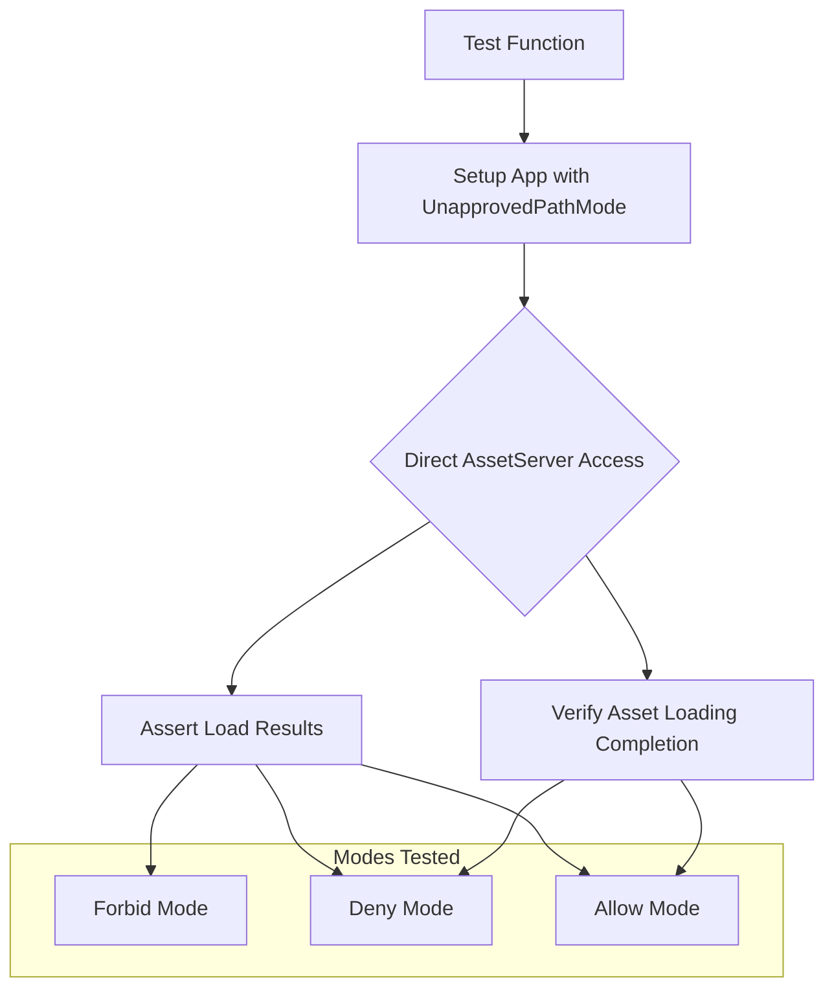

+++
title = "#22160 Avoid panicking in unapproved path tests."
date = "2025-12-17T00:00:00"
draft = false
template = "pull_request_page.html"
in_search_index = true

[taxonomies]
list_display = ["show"]

[extra]
current_language = "en"
available_languages = {"en" = { name = "English", url = "/pull_request/bevy/2025-12/pr-22160-en-20251217" }, "zh-cn" = { name = "中文", url = "/pull_request/bevy/2025-12/pr-22160-zh-cn-20251217" }}
labels = ["D-Trivial", "A-Assets", "C-Testing"]
+++

# Title

## Basic Information
- **Title**: Avoid panicking in unapproved path tests.
- **PR Link**: https://github.com/bevyengine/bevy/pull/22160
- **Author**: andriyDev
- **Status**: MERGED
- **Labels**: D-Trivial, A-Assets, S-Ready-For-Final-Review, C-Testing
- **Created**: 2025-12-17T06:50:52Z
- **Merged**: 2025-12-17T19:21:23Z
- **Merged By**: alice-i-cecile

## Description Translation

# Objective

- Simplify some tests.

## Solution

- Instead of adding systems to an app that conditionally panic, we just access the `AssetServer` directly in the test and do the loads there.
- I also added asserts that the assets do actually load eventually.

## Testing

- Ran the tests and it works!

## The Story of This Pull Request

This pull request refactors test code in the Bevy asset system to improve clarity and reliability. The changes focus on tests for unapproved path handling - a security feature in Bevy that controls whether assets can be loaded from paths outside approved directories.

The original tests used a pattern where systems were added to the app that would panic if certain conditions weren't met. Specifically, the tests checked whether assets could be loaded from unapproved paths under different security modes (`Forbid`, `Deny`, and `Allow`). These tests used `#[should_panic]` annotations and conditional panics within systems to verify the expected behavior.

The problem with this approach is that it makes tests more complex than necessary. Tests that rely on panics can be brittle and harder to debug because they don't provide clear assertion failures. When a panic-based test fails, you get a panic message rather than a descriptive assertion about what went wrong.

The solution implemented here simplifies the test structure by directly accessing the `AssetServer` resource and making assertions on the results. Instead of setting up systems that run in the app's update schedule, the tests now directly call `load()` or `load_override()` on the asset server and check the returned handles. This approach is more direct and easier to understand.

Here's an example of how the tests changed. Previously, for testing the `Deny` mode, the test looked like this:

```rust
#[test]
#[should_panic]
fn unapproved_path_deny_should_panic() {
    let mut app = unapproved_path_setup(UnapprovedPathMode::Deny);

    fn uses_assets(_asset: ResMut<Assets<CoolText>>) {}
    app.add_systems(Update, (uses_assets, load_a_asset));

    app.world_mut().run_schedule(Update);
}
```

Now, it's much simpler and more explicit:

```rust
#[test]
fn unapproved_path_deny_does_not_load() {
    let app = unapproved_path_setup(UnapprovedPathMode::Deny);

    let asset_server = app.world().resource::<AssetServer>().clone();
    assert_eq!(
        asset_server.load::<CoolText>("../a.cool.ron"),
        Handle::default()
    );
}
```

The new version directly asserts that loading an unapproved path in `Deny` mode returns a default handle, which indicates the load was rejected. This is clearer than the previous approach where you had to infer that a panic meant the load was rejected.

Another important improvement is the addition of assertions that assets actually load when they're expected to. The tests for `Deny` mode with override and `Allow` mode now include checks that the assets eventually load using `run_app_until()`:

```rust
// Make sure this asset actually loads.
run_app_until(&mut app, |_| asset_server.is_loaded(&handle).then_some(()));
```

This ensures the tests verify not just that a non-default handle is returned, but that the asset loading process completes successfully.

The refactoring also fixed a bug in the test setup. The original `unapproved_path_setup` function initialized the `CoolText` asset but didn't register the `CoolTextLoader`. The new version adds this registration:

```rust
app.init_asset::<CoolText>()
    .register_asset_loader(CoolTextLoader);
```

This is necessary for the asset loading to work properly in tests.

From an engineering perspective, this change demonstrates good testing practices: tests should be simple, direct, and focused on specific behaviors. Avoiding indirection through systems and panics makes tests more maintainable and their failure messages more informative. The use of direct resource access and clear assertions improves test readability and debuggability.

The change also shows how Bevy's ECS architecture enables clean separation between test setup and test logic. By extracting the `AssetServer` from the app's world, tests can interact with it directly without needing to set up complex system schedules.

## Visual Representation



## Key Files Changed

### `crates/bevy_asset/src/lib.rs` (+28/-37)

This file contains the test module for the asset system. The changes refactor tests related to unapproved path handling to be simpler and more direct.

**Key modifications:**

1. **Removed helper systems**: The `load_a_asset` and `load_a_asset_override` helper systems were removed since tests now directly access the `AssetServer`.

```rust
// Before (removed):
fn load_a_asset(assets: Res<AssetServer>) {
    let a = assets.load::<CoolText>("../a.cool.ron");
    if a == Handle::default() {
        panic!()
    }
}

fn load_a_asset_override(assets: Res<AssetServer>) {
    let a = assets.load_override::<CoolText>("../a.cool.ron");
    if a == Handle::default() {
        panic!()
    }
}
```

2. **Simplified test functions**: Tests now directly access the `AssetServer` resource and make assertions instead of relying on panics.

```rust
// Before:
#[test]
#[should_panic]
fn unapproved_path_forbid_should_panic() {
    let mut app = unapproved_path_setup(UnapprovedPathMode::Forbid);
    fn uses_assets(_asset: ResMut<Assets<CoolText>>) {}
    app.add_systems(Update, (uses_assets, load_a_asset_override));
    app.world_mut().run_schedule(Update);
}

// After:
#[test]
fn unapproved_path_forbid_does_not_load_even_with_override() {
    let app = unapproved_path_setup(UnapprovedPathMode::Forbid);
    let asset_server = app.world().resource::<AssetServer>().clone();
    assert_eq!(
        asset_server.load_override::<CoolText>("../a.cool.ron"),
        Handle::default()
    );
}
```

3. **Added asset loading verification**: Tests that expect assets to load now verify the loading completes.

```rust
// Added to tests that should successfully load assets:
// Make sure this asset actually loads.
run_app_until(&mut app, |_| asset_server.is_loaded(&handle).then_some(()));
```

4. **Fixed test setup**: Added missing asset loader registration.

```rust
// Before:
app.init_asset::<CoolText>();

// After:
app.init_asset::<CoolText>()
    .register_asset_loader(CoolTextLoader);
```

These changes relate to the overall purpose of the PR by making tests simpler, more direct, and more reliable. The removal of panic-based testing in favor of direct assertions improves test clarity and maintainability.

## Further Reading

- [Bevy Asset System Documentation](https://docs.rs/bevy_asset/latest/bevy_asset/) - Official documentation for Bevy's asset system
- [Rust Testing Guide](https://doc.rust-lang.org/book/ch11-01-writing-tests.html) - Best practices for writing tests in Rust
- [Property-based Testing](https://proptest-rs.github.io/proptest/intro.html) - An alternative testing approach that can complement unit tests
- [Bevy ECS Testing Patterns](https://bevy-cheatbook.github.io/testing/test-app.html) - Common patterns for testing Bevy ECS systems