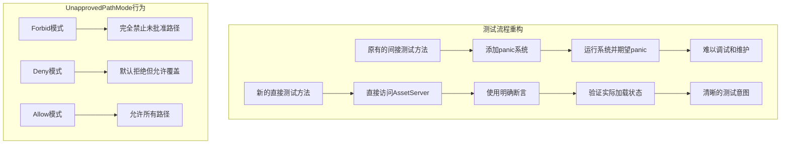

+++
title = "#22160 Avoid panicking in unapproved path tests."
date = "2025-12-17T00:00:00"
draft = false
template = "pull_request_page.html"
in_search_index = false

[extra]
current_language = "zh-cn"
available_languages = {"en" = { name = "English", url = "/pull_request/bevy/2025-12/pr-22160-en-20251217" }, "zh-cn" = { name = "中文", url = "/pull_request/bevy/2025-12/pr-22160-zh-cn-20251217" }}
+++

# 避免在未批准路径测试中 panic 的 PR 分析

## 基本信息
- **标题**: Avoid panicking in unapproved path tests.
- **PR 链接**: https://github.com/bevyengine/bevy/pull/22160
- **作者**: andriyDev
- **状态**: 已合并
- **标签**: D-Trivial, A-Assets, S-Ready-For-Final-Review, C-Testing
- **创建时间**: 2025-12-17T06:50:52Z
- **合并时间**: 2025-12-17T19:21:23Z
- **合并者**: alice-i-cecile

## 描述翻译
### 目标
- 简化一些测试。

### 解决方案
- 不再向 app 添加有条件 panic 的系统，而是直接在测试中访问 `AssetServer` 并在那里执行加载操作。
- 我还添加了断言，确保资产最终确实会被加载。

### 测试
- 运行了测试，一切正常！

## 此 PR 的技术故事

这个 PR 展示了如何通过重构测试方法来改进测试代码的可读性和可靠性。核心问题在于原有的测试设计过于复杂，使用了间接的 panic 检测机制，而新的实现直接测试了预期的行为。

### 问题背景与上下文

在 Bevy 的资产系统中，有一个称为 "unapproved path"（未批准路径）的安全特性。这个特性通过 `UnapprovedPathMode` 枚举来控制对潜在不安全文件路径的处理方式：
- `Forbid`：完全禁止使用未批准的路径
- `Deny`：默认拒绝，但允许显式覆盖
- `Allow`：允许所有路径

原有的测试实现存在几个问题：
1. **测试逻辑间接**：通过向 app 添加会 panic 的系统，然后依赖 `#[should_panic]` 属性来验证行为
2. **测试意图不清晰**：代码中混合了系统设置、调度执行和错误检测，阅读者需要理解多个层次才能明白测试目的
3. **测试验证不完整**：对于应该成功加载的情况，没有验证资产是否真的加载完成

### 解决方案的技术实现

开发者采用了直接测试的方法，替换了原有的间接 panic 检测。核心思路是直接从 app 的 world 中获取 `AssetServer` 资源，然后调用其方法来测试不同模式下的行为。

#### 主要改进点

1. **移除辅助系统函数**：删除了 `load_a_asset` 和 `load_a_asset_override` 这两个会在特定条件下 panic 的系统函数
2. **直接访问 AssetServer**：在每个测试中通过 `app.world().resource::<AssetServer>().clone()` 获取 AssetServer 实例
3. **使用断言代替 panic 检测**：用 `assert_eq!` 和 `assert_ne!` 明确表达期望的行为
4. **添加加载完成验证**：对于应该成功加载的测试，添加了 `run_app_until` 调用来确保资产真正加载完成

### 技术细节分析

原有的测试设计依赖于在系统函数中 panic，然后通过 `#[should_panic]` 属性捕获这个 panic。这种方法的问题是：
- 测试失败时难以诊断具体原因
- 测试意图被隐藏在执行流程中
- 无法在同一个测试中验证多个条件

新的实现更加直接和明确。例如，`unapproved_path_forbid_does_not_load_even_with_override` 测试现在清晰地表达了：在 Forbid 模式下，即使是 `load_override` 也应该返回默认句柄。

另一个重要的改进是添加了资产加载完成的验证。在 `unapproved_path_deny_loads_with_override` 和 `unapproved_path_allow_loads` 测试中，使用 `run_app_until` 确保资产实际加载完成，这比仅验证返回非默认句柄更加严格。

### 代码架构影响

这个改动展示了测试代码的一个重要原则：测试应该尽可能直接表达其意图。通过将测试逻辑从系统函数中提取出来，直接放入测试函数体，代码变得：
- **更易读**：测试的预期行为一目了然
- **更易维护**：修改测试逻辑时不需要修改系统函数定义
- **更可靠**：明确的断言提供了更好的错误信息

这个 PR 也体现了 Bevy 测试模式的一个转变：从 "行为验证"（通过 panic 检测）转向 "状态验证"（直接检查返回值）。这种转变使得测试更加精确，减少了假阳性的可能性。

### 潜在的技术考量

虽然这个改动主要是关于测试代码，但它也反映了对 AssetServer API 行为的深入理解。开发者清楚地知道：
1. 在 Forbid 模式下，`load_override` 应该返回默认句柄
2. 在 Deny 模式下，`load` 返回默认句柄，但 `load_override` 可以成功
3. 在 Allow 模式下，`load` 应该成功

这种理解被编码为明确的断言，使测试成为 API 契约的活文档。

## 可视化表示



## 关键文件更改

### `crates/bevy_asset/src/lib.rs` (+28/-37)

这个文件包含了资产系统的核心实现和测试。PR 主要修改了测试模块中的四个测试函数，使其更加直接和明确。

#### 主要变化

1. **移除辅助系统函数**：
```rust
// 移除前的代码：
fn load_a_asset(assets: Res<AssetServer>) {
    let a = assets.load::<CoolText>("../a.cool.ron");
    if a == Handle::default() {
        panic!()
    }
}

fn load_a_asset_override(assets: Res<AssetServer>) {
    let a = assets.load_override::<CoolText>("../a.cool.ron");
    if a == Handle::default() {
        panic!()
    }
}
```

2. **改进的测试函数**：
```rust
// 改进后的测试示例：
#[test]
fn unapproved_path_forbid_does_not_load_even_with_override() {
    let app = unapproved_path_setup(UnapprovedPathMode::Forbid);

    let asset_server = app.world().resource::<AssetServer>().clone();
    assert_eq!(
        asset_server.load_override::<CoolText>("../a.cool.ron"),
        Handle::default()
    );
}
```

#### 测试重命名与重构

原有的测试名称如 `unapproved_path_forbid_should_panic` 暗示了实现细节（应该 panic），而新的名称如 `unapproved_path_forbid_does_not_load_even_with_override` 描述了实际行为（即使使用覆盖也不加载）。这是测试命名的最佳实践：描述行为而非实现。

## 进一步阅读

对于想要了解更多相关概念的读者，可以参考：

1. **Bevy Asset System 文档**：了解资产加载、路径批准和安全限制的详细机制
2. **Rust 测试最佳实践**：学习如何编写清晰、可维护的测试代码
3. **测试重构模式**：了解从间接测试到直接测试的转换策略
4. **Property-based Testing**：探索基于属性的测试如何补充传统的示例测试

## 完整代码差异

```diff
diff --git a/crates/bevy_asset/src/lib.rs b/crates/bevy_asset/src/lib.rs
index 37f7513e4ebaa..366b26799fe25 100644
--- a/crates/bevy_asset/src/lib.rs
+++ b/crates/bevy_asset/src/lib.rs
@@ -2063,65 +2063,56 @@ mod tests {
                 ..Default::default()
             },
         ));
-        app.init_asset::<CoolText>();
+        app.init_asset::<CoolText>()
+            .register_asset_loader(CoolTextLoader);
 
         app
     }
 
-    fn load_a_asset(assets: Res<AssetServer>) {
-        let a = assets.load::<CoolText>("../a.cool.ron");
-        if a == Handle::default() {
-            panic!()
-        }
-    }
-
-    fn load_a_asset_override(assets: Res<AssetServer>) {
-        let a = assets.load_override::<CoolText>("../a.cool.ron");
-        if a == Handle::default() {
-            panic!()
-        }
-    }
-
     #[test]
-    #[should_panic]
-    fn unapproved_path_forbid_should_panic() {
-        let mut app = unapproved_path_setup(UnapprovedPathMode::Forbid);
-
-        fn uses_assets(_asset: ResMut<Assets<CoolText>>) {}
-        app.add_systems(Update, (uses_assets, load_a_asset_override));
+    fn unapproved_path_forbid_does_not_load_even_with_override() {
+        let app = unapproved_path_setup(UnapprovedPathMode::Forbid);
 
-        app.world_mut().run_schedule(Update);
+        let asset_server = app.world().resource::<AssetServer>().clone();
+        assert_eq!(
+            asset_server.load_override::<CoolText>("../a.cool.ron"),
+            Handle::default()
+        );
     }
 
     #[test]
-    #[should_panic]
-    fn unapproved_path_deny_should_panic() {
-        let mut app = unapproved_path_setup(UnapprovedPathMode::Deny);
-
-        fn uses_assets(_asset: ResMut<Assets<CoolText>>) {}
-        app.add_systems(Update, (uses_assets, load_a_asset));
+    fn unapproved_path_deny_does_not_load() {
+        let app = unapproved_path_setup(UnapprovedPathMode::Deny);
 
-        app.world_mut().run_schedule(Update);
+        let asset_server = app.world().resource::<AssetServer>().clone();
+        assert_eq!(
+            asset_server.load::<CoolText>("../a.cool.ron"),
+            Handle::default()
+        );
     }
 
     #[test]
-    fn unapproved_path_deny_should_finish() {
+    fn unapproved_path_deny_loads_with_override() {
         let mut app = unapproved_path_setup(UnapprovedPathMode::Deny);
 
-        fn uses_assets(_asset: ResMut<Assets<CoolText>>) {}
-        app.add_systems(Update, (uses_assets, load_a_asset_override));
+        let asset_server = app.world().resource::<AssetServer>().clone();
+        let handle = asset_server.load_override::<CoolText>("../a.cool.ron");
+        assert_ne!(handle, Handle::default());
 
-        app.world_mut().run_schedule(Update);
+        // Make sure this asset actually loads.
+        run_app_until(&mut app, |_| asset_server.is_loaded(&handle).then_some(()));
     }
 
     #[test]
-    fn unapproved_path_allow_should_finish() {
+    fn unapproved_path_allow_loads() {
         let mut app = unapproved_path_setup(UnapprovedPathMode::Allow);
 
-        fn uses_assets(_asset: ResMut<Assets<CoolText>>) {}
-        app.add_systems(Update, (uses_assets, load_a_asset));
+        let asset_server = app.world().resource::<AssetServer>().clone();
+        let handle = asset_server.load::<CoolText>("../a.cool.ron");
+        assert_ne!(handle, Handle::default());
 
-        app.world_mut().run_schedule(Update);
+        // Make sure this asset actually loads.
+        run_app_until(&mut app, |_| asset_server.is_loaded(&handle).then_some(()));
     }
 
     #[test]
```