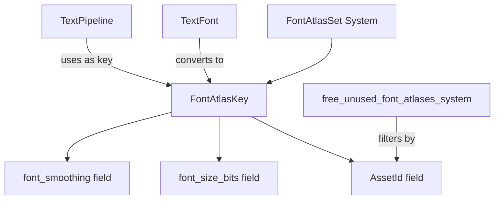

+++
title = "#22161 Name the fields of `FontAtlasKey`"
date = "2025-12-17T00:00:00"
draft = false
template = "pull_request_page.html"
in_search_index = true

[taxonomies]
list_display = ["show"]

[extra]
current_language = "en"
available_languages = {"en" = { name = "English", url = "/pull_request/bevy/2025-12/pr-22161-en-20251217" }, "zh-cn" = { name = "中文", url = "/pull_request/bevy/2025-12/pr-22161-zh-cn-20251217" }}
labels = ["A-UI", "C-Code-Quality", "D-Straightforward"]
+++

# Title

## Basic Information
- **Title**: Name the fields of `FontAtlasKey`
- **PR Link**: https://github.com/bevyengine/bevy/pull/22161
- **Author**: ickshonpe
- **Status**: MERGED
- **Labels**: A-UI, C-Code-Quality, S-Ready-For-Final-Review, D-Straightforward
- **Created**: 2025-12-17T11:50:51Z
- **Merged**: 2025-12-17T19:16:58Z
- **Merged By**: alice-i-cecile

## Description
**Objective**

Name the fields of the `FontAtlasKey` struct.

**Solution**

Named the fields and added doc comments.

## The Story of This Pull Request

This pull request addresses a straightforward code quality issue in Bevy's text rendering system. The `FontAtlasKey` struct was previously defined as a tuple struct with unnamed fields, making the code less readable and maintainable. Tuple structs are appropriate when the fields have obvious meanings from context, but in this case, the three fields represent distinct concepts that benefit from explicit naming.

The `FontAtlasKey` serves as a hash key for caching font atlases - texture regions containing pre-rendered glyphs. Each atlas is specific to a particular font, font size, and font smoothing (antialiasing) setting. The struct needs to implement `Hash`, `PartialEq`, and `Eq` traits to function as a dictionary key in Bevy's font atlas management system.

Before this change, accessing the fields required tuple indexing (`key.0`, `key.1`, `key.2`), which is error-prone because it relies on positional knowledge. For example, in the original code, `key.0` referred to the `AssetId<Font>`, but this wasn't immediately obvious without looking at the struct definition or usage patterns.

The implementation approach was systematic: convert the tuple struct to a regular struct with named fields, update all field accesses throughout the codebase, and add documentation comments to clarify each field's purpose. This required changes in three files that used the struct.

One important technical consideration was maintaining the exact same memory layout and behavior. The struct still contains the same three fields in the same order: an `AssetId<Font>` for the font asset identifier, a `u32` representing the font size (via `f32::to_bits()` to allow floating-point sizes to be used as hash keys), and a `FontSmoothing` enum value for the antialiasing method. The conversion from tuple struct to named struct doesn't change the struct's ABI or serialization behavior since Rust structs are laid out in memory in declaration order by default.

The impact of this change is purely on code quality and maintainability. Developers reading or modifying the text rendering code now have clear, self-documenting field names instead of positional indices. The added documentation comments provide additional context about why `font_size_bits` stores the result of `f32::to_bits()` rather than the font size directly. This makes the code more approachable for new contributors and reduces the cognitive load when debugging or extending the font system.

## Visual Representation



## Key Files Changed

**1. `crates/bevy_text/src/font_atlas_set.rs` (+14/-7)**
This is the primary file containing the `FontAtlasKey` struct definition and related systems. The struct was converted from a tuple struct to a regular struct with named, documented fields.

```rust
// File: crates/bevy_text/src/font_atlas_set.rs
// Before:
#[derive(Debug, Hash, PartialEq, Eq, Clone, Copy)]
pub struct FontAtlasKey(pub AssetId<Font>, pub u32, pub FontSmoothing);

// After:
#[derive(Debug, Hash, PartialEq, Eq, Clone, Copy)]
pub struct FontAtlasKey {
    /// Font asset id
    pub id: AssetId<Font>,
    /// Font size via `f32::to_bits`
    pub font_size_bits: u32,
    /// Antialiasing method
    pub font_smoothing: FontSmoothing,
}
```

The `From<&TextFont>` implementation was updated to use the named field constructor syntax:

```rust
// Before:
impl From<&TextFont> for FontAtlasKey {
    fn from(font: &TextFont) -> Self {
        FontAtlasKey(
            font.font.id(),
            font.font_size.to_bits(),
            font.font_smoothing,
        )
    }
}

// After:
impl From<&TextFont> for FontAtlasKey {
    fn from(font: &TextFont) -> Self {
        Self {
            id: font.font.id(),
            font_size_bits: font.font_size.to_bits(),
            font_smoothing: font.font_smoothing,
        }
    }
}
```

The `free_unused_font_atlases_system` function was updated to use the named field:

```rust
// Before:
font_atlas_sets.retain(|key, _| key.0 != *id);

// After:
font_atlas_sets.retain(|key, _| key.id != *id);
```

**2. `crates/bevy_text/src/pipeline.rs` (+4/-4)**
This file contains the text rendering pipeline that uses `FontAtlasKey` as a dictionary key when looking up or creating font atlases. The code was updated to construct the key using named fields.

```rust
// File: crates/bevy_text/src/pipeline.rs
// Before:
let font_atlases = font_atlas_set
    .entry(FontAtlasKey(
        font_id,
        physical_glyph.cache_key.font_size_bits,
        font_smoothing,
    ))
    .or_default();

// After:
let font_atlases = font_atlas_set
    .entry(FontAtlasKey {
        id: font_id,
        font_size_bits: physical_glyph.cache_key.font_size_bits,
        font_smoothing,
    })
    .or_default();
```

**3. `examples/stress_tests/many_text2d.rs` (+1/-1)**
This example file contains debugging code that counts font atlases. It was updated to use the named field instead of tuple indexing.

```rust
// File: examples/stress_tests/many_text2d.rs
// Before:
.filter(|(key, _)| key.0 == font_id)

// After:
.filter(|(key, _)| key.id == font_id)
```

## Further Reading

1. **Rust Structs Documentation**: The Rust Book's section on structs explains the difference between tuple structs and structs with named fields: https://doc.rust-lang.org/book/ch05-01-defining-structs.html
2. **Bevy Text Rendering**: The Bevy engine's text rendering system documentation provides context for how font atlases work: https://bevyengine.org/learn/books/bevy-cheatbook/features/text.html
3. **Asset System**: Understanding Bevy's asset system and `AssetId` is helpful for working with font assets: https://bevyengine.org/learn/books/bevy-cheatbook/features/assets.html
4. **Code Quality Best Practices**: This PR exemplifies several Rust code quality practices including self-documenting code and avoiding "magic numbers" (or in this case, "magic indices").

# Full Code Diff
```
diff --git a/crates/bevy_text/src/font_atlas_set.rs b/crates/bevy_text/src/font_atlas_set.rs
index 76d7bfaa460b2..f189b40733fd6 100644
--- a/crates/bevy_text/src/font_atlas_set.rs
+++ b/crates/bevy_text/src/font_atlas_set.rs
@@ -8,15 +8,22 @@ use bevy_platform::collections::HashMap;
 ///
 /// Allows an `f32` font size to be used as a key in a `HashMap`, by its binary representation.
 #[derive(Debug, Hash, PartialEq, Eq, Clone, Copy)]
-pub struct FontAtlasKey(pub AssetId<Font>, pub u32, pub FontSmoothing);
+pub struct FontAtlasKey {
+    /// Font asset id
+    pub id: AssetId<Font>,
+    /// Font size via `f32::to_bits`
+    pub font_size_bits: u32,
+    /// Antialiasing method
+    pub font_smoothing: FontSmoothing,
+}
 
 impl From<&TextFont> for FontAtlasKey {
     fn from(font: &TextFont) -> Self {
-        FontAtlasKey(
-            font.font.id(),
-            font.font_size.to_bits(),
-            font.font_smoothing,
-        )
+        Self {
+            id: font.font.id(),
+            font_size_bits: font.font_size.to_bits(),
+            font_smoothing: font.font_smoothing,
+        }
     }
 }
 
@@ -39,7 +46,7 @@ pub fn free_unused_font_atlases_system(
 ) {
     for event in font_events.read() {
         if let AssetEvent::Removed { id } = event {
-            font_atlas_sets.retain(|key, _| key.0 != *id);
+            font_atlas_sets.retain(|key, _| key.id != *id);
         }
     }
 }
diff --git a/crates/bevy_text/src/pipeline.rs b/crates/bevy_text/src/pipeline.rs
index 720436f678367..665c8bd1e14b6 100644
--- a/crates/bevy_text/src/pipeline.rs
+++ b/crates/bevy_text/src/pipeline.rs
@@ -412,11 +412,11 @@ impl TextPipeline {
                     let physical_glyph = layout_glyph.physical((0., 0.), 1.);
 
                     let font_atlases = font_atlas_set
-                        .entry(FontAtlasKey(
-                            font_id,
-                            physical_glyph.cache_key.font_size_bits,
+                        .entry(FontAtlasKey {
+                            id: font_id,
+                            font_size_bits: physical_glyph.cache_key.font_size_bits,
                             font_smoothing,
-                        ))
+                        })
                         .or_default();
 
                     let atlas_info = get_glyph_atlas_info(font_atlases, physical_glyph.cache_key)
diff --git a/examples/stress_tests/many_text2d.rs b/examples/stress_tests/many_text2d.rs
index d3646c8d2c45d..83c091738053a 100644
--- a/examples/stress_tests/many_text2d.rs
+++ b/examples/stress_tests/many_text2d.rs
@@ -181,7 +181,7 @@ fn print_counts(
     let font_id = font.0.id();
     let num_atlases = font_atlas_set
         .iter()
-        .filter(|(key, _)| key.0 == font_id)
+        .filter(|(key, _)| key.id == font_id)
         .map(|(_, atlases)| atlases.len())
         .sum::<usize>();
 
```